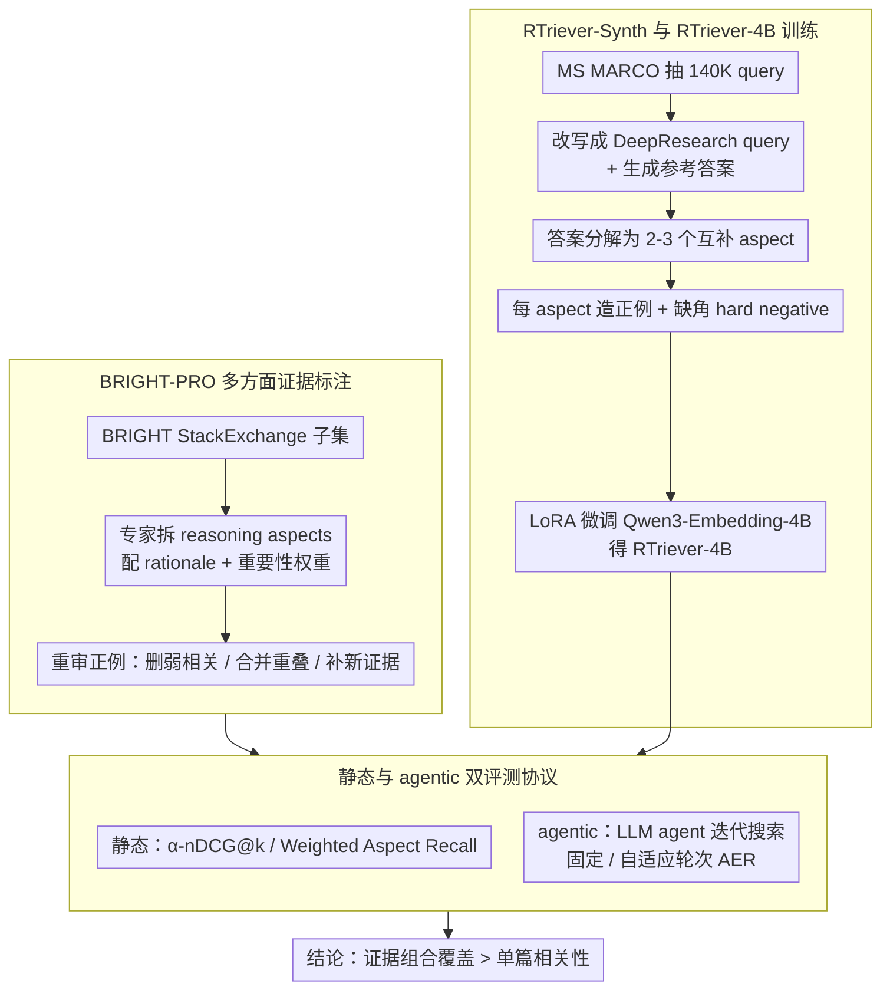

# Rethinking Reasoning-Intensive Retrieval: Evaluating and Advancing Retrievers in Agentic Search Systems

**会议**: ACL2026  
**arXiv**: [2605.04018](https://arxiv.org/abs/2605.04018)  
**代码**: 无公开代码  
**领域**: LLM Agent / 信息检索 / Agentic Search  
**关键词**: reasoning-intensive retrieval、agentic search、BRIGHT-PRO、RTriever、证据覆盖

## 一句话总结
本文提出 BRIGHT-PRO，用多方面证据标注和 agentic search 协议重新评测 reasoning-intensive retriever，并用 RTriever-Synth 训练 RTriever-4B，证明检索器应优化“证据组合覆盖”而非单篇相关性。

## 研究背景与动机
**领域现状**：传统信息检索系统主要优化关键词匹配、语义相似或单段相关性，适合事实型、单跳问题。随着 Deep Research 和 agentic search 系统兴起，LLM agent 会反复规划、搜索、阅读和综合信息，检索器变成 agent 推理链里的关键工具。

**现有痛点**：复杂查询通常需要多个互补证据共同支撑答案，而现有 benchmark 如 BRIGHT 的 gold passages 较窄，往往来自一两个网页，并且主要在静态 ranked list 上评估检索器。训练侧的 synthetic retrieval corpus 也常是一 query 一 positive，容易让模型学会“找一个相关段落”，而不是覆盖完整 reasoning aspects。

**核心矛盾**：agentic search 中，检索器的价值不等于单次检索的最高相关性，而在于能否用更少轮次给 agent 提供覆盖充分、互补且可引用的证据组合。静态单段指标可能无法预测 agent 最终答案质量和搜索效率。

**本文目标**：作者一方面扩展 BRIGHT，构建带有 multi-aspect evidence 的 BRIGHT-PRO benchmark；另一方面设计静态和 agentic 两套评测协议；最后构造 RTriever-Synth，用 aspect-decomposed positives 和 hard negatives 微调专门面向 reasoning-intensive evidence selection 的 RTriever-4B。

**切入角度**：论文把 retrieval 从“passage relevance”提升到“evidence portfolio construction”。这和 agentic search 的使用方式高度一致，因为 agent 不只需要一个答案片段，而需要覆盖问题的不同子方面。

**核心 idea**：用人工标注的 reasoning aspects 作为评测单位，用 aspect-aware synthetic data 作为训练信号，让 retriever 学会检索互补证据，并在静态与 agent-in-the-loop 两个层面检验效果。

## 方法详解

### 整体框架
本文有两条主线。评测主线是 BRIGHT-PRO：从 BRIGHT 的 StackExchange subset 出发，专家为每个查询标注 reasoning aspects、重要性权重和对应正例文档，再用静态 α-nDCG / A-Recall 以及 agentic search 协议评估检索器。训练主线是 RTriever-Synth：从 MS MARCO seed query 生成 DeepResearch-style analytical queries，生成参考答案并分解为互补 reasoning aspects，再为每个 aspect 合成 positive passage 和 positive-conditioned hard negative，最后用这些数据 LoRA 微调 Qwen3-Embedding-4B 得到 RTriever-4B。两条主线最终汇到同一套静态 + agentic 双评测协议上，由它把「证据组合覆盖」对最终答案的价值显式量化出来。

### 关键设计

**1. BRIGHT-PRO 多方面证据标注：把评测单位从「一篇相关段落」换成「覆盖了几个推理角度」**

复杂问题的答案常由多个子问题拼成，一个 retriever 哪怕只覆盖了某个高权重 aspect，在传统 Recall 上也未必难看，可这样会让 agent 综合出来的答案缺掉关键前提。BRIGHT-PRO 因此选了 BRIGHT 的 StackExchange subset（更接近开放域自然语言推理），让领域专家把每个 query 拆成若干 reasoning aspects，每个 aspect 配 1-2 句 rationale 描述、再用 1-5 Likert score 打重要性并归一化成权重；同时重新审核原 BRIGHT 的 positives，去掉弱相关段落、合并重叠片段，并用 web search、Perplexity 或 ChatGPT Web Search 补进新证据。这样标注后，benchmark 衡量的就不再是「找到一个表面相关段落」，而是「有没有把这道题需要的几个角度都覆盖到」。

**2. 静态与 agentic 双评测协议：既隔离检索质量，又测它在真实 agent loop 里的系统价值**

部署里用户真正关心的不是 α-nDCG 高低，而是 agent 能不能更快、更可靠地把答案做出来，单段静态指标可能和这个目标错位。所以论文配了两套协议。静态侧用 α-nDCG@k，设 novelty penalty $\alpha=0.5$ 去惩罚「反复覆盖同一个 aspect」，并报告 Weighted Aspect Recall、NDCG、Recall。agentic 侧把 retriever 接进同一个 LLM agent，让它迭代发 search query、读 top-5 passages、生成带引用的答案；固定轮次协议强制 agent 跑 1/2/3 轮，自适应协议让 agent 自己决定何时停，并用

$$AER = OQ \times e^{-\gamma(R-1)}$$

同时奖励答案质量 $OQ$ 和「少跑几轮」$R$。两套协议放在一起，就能把「静态排名」和「系统表现」之间的错位显式暴露出来。

**3. RTriever-Synth 与 RTriever-4B 训练：让 retriever 从训练数据起就学「互补证据选择」而非「找一个相关段落」**

普通 contrastive retriever 学的是把某一个 relevant passage 排高，这恰恰是 agentic search 不想要的。RTriever-Synth 从 100 万 MS MARCO queries 里抽 140K，先把短 query 改写成带 persona 和背景的 DeepResearch-style query，再生成完整参考答案、把答案分解成 2-3 个互不重叠的 reasoning aspects；每个 aspect 生成一个 positive passage blueprint 并实例化为正例。关键在负例：它不是随机负例，而是在看过 positives 的标题和摘要后，刻意造出「词面和 query 很像、却偏偏缺了某个关键 aspect」的 hard negative。训练数据内部因此天然带着「互补」与「缺角」关系，逼模型去学覆盖而不是相关。

### 损失函数 / 训练策略
RTriever-4B 基于 Qwen3-Embedding-4B，用 LoRA 微调所有 linear projection layers，rank 16、scaling factor 32，原 embedding 参数冻结。每步采样一个 query、一个正例、一个 hard negative，并用 batch 内其他文档当 in-batch negatives，优化 query-document contrastive InfoNCE，温度 $\tau=0.02$，训练 5 epochs，peak learning rate $1\times10^{-5}$、5% linear warm-up。

## 实验关键数据

### 主实验
BRIGHT-PRO 覆盖 7 个 expert domains，共 739 queries、526,319 documents，平均每个 query 有 7.13 个正例文档和 3.74 个 reasoning aspects。

| 子集 | Queries | Documents | 平均正例数 | 平均 aspect 数 | 平均 query 词数 |
|------|---------|-----------|------------|----------------|-----------------|
| Biology | 103 | 59,513 | 7.81 | 3.94 | 92.6 |
| Earth Science | 115 | 123,575 | 7.44 | 3.83 | 82.2 |
| Economics | 99 | 52,240 | 7.81 | 3.71 | 123.5 |
| Psychology | 100 | 54,741 | 7.07 | 3.84 | 116.2 |
| Robotics | 101 | 63,920 | 6.17 | 3.71 | 218.8 |
| Stack Overflow | 115 | 109,188 | 4.60 | 3.32 | 172.0 |
| Sustainable Living | 106 | 63,142 | 9.25 | 3.86 | 116.9 |
| Overall | 739 | 526,319 | 7.13 | 3.74 | 131.4 |

静态检索评测中，reasoning-trained retrievers 与一般 embedding 模型拉开明显差距，RTriever-4B 从 Qwen3-Embedding-4B 微调后进入上中游。

| 模型 | BRIGHT NDCG@10 | BRIGHT-PRO α-nDCG@25 Overall | 定位 |
|------|----------------|------------------------------|------|
| BGE-Reasoner-8B | 33.8 | 68.0 | 最强 reasoning retriever |
| DIVER-4B-1020 | 30.6 | 63.7 | 强 reasoning retriever |
| DIVER-4B | 28.9 | 59.9 | 强 reasoning retriever |
| RTriever-4B | 27.7 | 55.3 | 本文模型，优于多数通用 embedding |
| INF-Retriever-Pro | 26.3 | 53.8 | reasoning retriever |
| Qwen3-8B | 23.7 | 49.5 | 通用 embedding base |
| OpenAI-Embed-3L | 17.9 | 45.8 | 通用 embedding |
| BM25 | 14.5 | 40.3 | 静态评测最弱之一 |

### 消融实验
固定轮次 agentic evaluation 使用 GPT-5-mini agent，每轮检索 top-5，报告累计 α-nDCG、reasoning completeness 和 overall quality。静态强弱并不完全等价于 agent 表现。

| 模型 | Round-3 α-nDCG@15 | Round-3 Completeness | Round-3 Overall | 现象 |
|------|-------------------|----------------------|-----------------|------|
| BGE-Reasoner-8B | 63.04 | 4.42 | 4.31 | 检索与答案质量双领先 |
| DIVER-4B | 53.08 | 4.38 | 4.29 | agentic 中优于 DIVER-4B-1020 |
| RTriever-4B | 50.79 | 4.37 | 4.25 | 答案质量进入前三 |
| GTE-7B | 52.68 | 4.33 | 4.23 | 静态一般但 agentic 表现强 |
| DIVER-4B-1020 | 51.56 | 4.33 | 4.16 | 静态强但 agent fit 较弱 |
| BM25 | 51.48 | 4.25 | 4.12 | agent follow-up query 缓解词汇错配 |

自适应轮次协议进一步展示了效率差异。

| 模型 / Agent | 平均轮次 | Completeness | Overall | AER | 解读 |
|--------------|----------|--------------|---------|-----|------|
| BGE-Reasoner + GPT-5-mini | 5.10 | 4.63 | 4.43 | 3.65 | 高质量且停止早 |
| RTriever-4B + GPT-5-mini | 6.01 | 4.53 | 4.43 | 3.51 | 质量接近 BGE，但轮次更多 |
| BM25 + GPT-5-mini | 5.73 | 4.50 | 4.42 | 3.53 | 在 agentic setting 意外强 |
| GTE-7B + GPT-5-mini | 6.67 | 4.62 | 4.51 | 3.44 | 最终质量高但代价大 |
| RTriever-4B + Qwen3.5 | 4.89 | 4.26 | 4.06 | 3.38 | 在第二个 agent 下仍稳居前列 |

### 关键发现
- BRIGHT-PRO 的 aspect-aware 指标能把 reasoning retrievers 与 general-purpose embedders 明显区分开，而 BRIGHT 的单一 NDCG@10 难以充分暴露这种差异。
- RTriever-4B 虽然不是最强模型，但用 140K aspect-decomposed synthetic bundles 微调后，显著超过更大的通用 embedding 模型，说明训练目标比参数规模更关键。
- 静态检索排名不能完全预测 agentic answer quality。DIVER-4B-1020 静态更强，但在 agentic loop 中不如 DIVER-4B；BM25 静态弱，却因 LLM follow-up query 的关键词化而变得竞争力很强。
- AER 揭示了“最终答得好但搜太久”的失败模式。GTE-7B overall quality 高，但平均轮次 6.67 拉低 AER。

## 亮点与洞察
- BRIGHT-PRO 把 retrieval 评测单位从 document 扩展到 reasoning aspect，这是 reasoning-intensive IR 很关键的一步。它能区分“同一角度重复找很多证据”和“覆盖多个必要角度”。
- agentic evaluation 设计很有现实意义。检索器在 agent loop 中会被 LLM 反复查询，查询会变得更具体，因此 BM25 这类 lexical method 的价值会被重新激活。
- RTriever-Synth 的 hard negative 不是简单语义相似负例，而是“缺失关键 aspect 的近邻负例”。这种负例更符合复杂问答中的检索失败方式。
- 论文提醒 agent 系统优化不能只堆更强 LLM。一个覆盖充分、与 agent query style 匹配的 retriever，可能直接减少搜索轮次和推理幻觉。

## 局限与展望
- BRIGHT-PRO 只基于 BRIGHT 的 StackExchange subset，虽然有 7 个领域，但还没有覆盖新闻、法律、医学全文、企业知识库等真实 Deep Research 场景。
- 739 queries 和 175-query agentic sample 的人工成本很高但规模仍有限，细分领域上的统计稳定性有待扩大。
- agentic evaluation 使用 LLM-as-Judge 评估答案 completeness 和 overall quality，仍可能受到 judge 偏差影响。
- RTriever-Synth 当前训练只采样 one positive / one negative triplet，没有充分利用每个 query 的多正例集合；后续可研究 multi-positive contrastive、aspect-aware sampling 和 curriculum negatives。

## 相关工作与启发
- **vs BRIGHT**: BRIGHT 首次聚焦 reasoning-intensive retrieval，但 gold evidence 较窄，评测主要是静态；BRIGHT-PRO 增加 aspect labels、weights 和 agentic protocols。
- **vs DIVER / ReasonIR**: 这些方法训练 reasoning-aware retriever，但训练信号多围绕单 passage relevance；RTriever-Synth 更强调互补 positives 和 aspect coverage。
- **vs DeepResearch benchmarks**: 很多 DeepResearch benchmark 评估最终答案，难以隔离 retriever 贡献；本文把 retriever 作为唯一变量接入同一 agent，能更清楚分析组件影响。
- **启发**: 做 agentic RAG 时，retriever evaluation 应同时报告 coverage、round cost、answer quality 和 retriever-agent compatibility。

## 评分
- 新颖性: ⭐⭐⭐⭐⭐ 将多方面证据覆盖和 agentic retriever-in-the-loop 结合得很完整。
- 实验充分度: ⭐⭐⭐⭐☆ 静态、固定轮次、自适应轮次和定性分析都充分，但 benchmark 规模仍受人工标注限制。
- 写作质量: ⭐⭐⭐⭐☆ 结构完整，图表和 pipeline 清晰，部分实验表较密集。
- 价值: ⭐⭐⭐⭐⭐ 对 Deep Research、agentic RAG 和 reasoning retriever 训练都有很强参考价值。

<!-- RELATED:START -->

## 相关论文

- [\[ICLR 2026\] MC-Search: Evaluating and Enhancing Multimodal Agentic Search with Structured Long Reasoning Chains](../../ICLR2026/llm_agent/mc-search_evaluating_and_enhancing_multimodal_agentic_search_with_structured_lon.md)
- [\[ACL 2026\] BAPO: Boundary-Aware Policy Optimization for Reliable Agentic Search](bapo_boundary-aware_policy_optimization_for_reliable_agentic_search.md)
- [\[ICML 2026\] Process Reward Agents for Steering Knowledge-Intensive Reasoning](../../ICML2026/llm_agent/process_reward_agents_for_steering_knowledge-intensive_reasoning.md)
- [\[ICLR 2026\] LiveNewsBench: Evaluating LLM Web Search Capabilities with Freshly Curated News](../../ICLR2026/llm_agent/livenewsbench_evaluating_llm_web_search_capabilities_with_freshly_curated_news.md)
- [\[ACL 2026\] ToolOmni: Enabling Open-World Tool Use via Agentic Learning with Proactive Retrieval and Grounded Execution](toolomni_enabling_open-world_tool_use_via_agentic_learning_with_proactive_retrie.md)

<!-- RELATED:END -->
