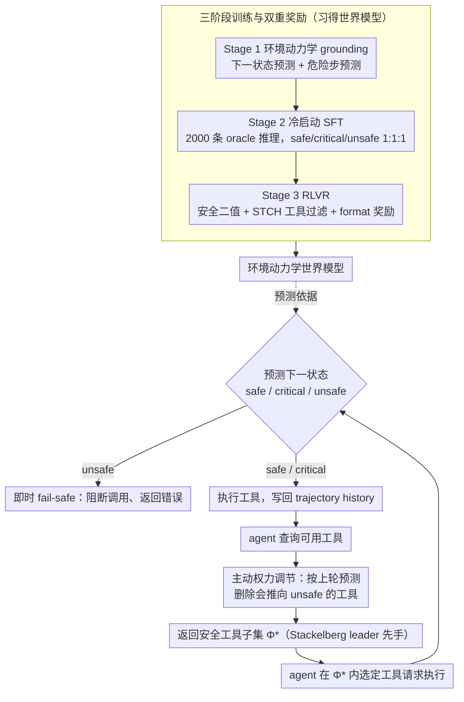

# SafeMCP: Proactive Power Regulation for LLM Agent Defense via Environment-Grounded Look-Ahead Reasoning

**会议**: ACL2026  
**arXiv**: [2606.01991](https://arxiv.org/abs/2606.01991)  
**代码**: https://github.com/wlc2424762917/SafeMCP  
**领域**: LLM Agent / Agent 安全 / MCP 工具防护  
**关键词**: MCP, Agent安全, 权力寻求, 工具过滤, 世界模型, RLVR

## 一句话总结
SafeMCP 是一个部署在 MCP server 侧的 agent 防御插件，通过环境动力学世界模型做 look-ahead reasoning，先过滤会扩大危险能力边界的工具，再对已发起的危险调用做即时拦截，在 PowerSeeking Bench、ToolEmu 和 AgentHarm 上同时提升安全性并尽量保留任务效用。

## 研究背景与动机
**领域现状**：LLM agent 正从对话系统变成能调用工具、读写外部资源、执行长程任务的行动系统。MCP 这类协议降低了工具接入成本，使 agent 可以从开放工具库里动态获取能力，这对自动化任务很有帮助。

**现有痛点**：动作空间自动扩张也会带来 power-seeking 风险。一个 agent 为了完成任务，可能会倾向于进入“更高权力”的环境状态，例如拥有更多工具、更大权限或更强环境影响力；这些状态本身可能提高效用，但也放大幻觉、误操作或恶意输入造成的损害。

**核心矛盾**：传统 guardrail 多是 agent-side 或 post-hoc 的语义过滤：先让 agent 选择 action，再判断 action 文本是否危险。问题是很多工具调用在当前语义上无害，但会把环境推进到未来危险状态；直接拒绝又会过度中断正常 workflow。

**本文目标**：作者想把 agent 防御从“事后阻止某个动作”改成“事前调节可用工具集合”，让 agent 仍能在安全边界内寻找可行路径，而不是一遇到风险就终止任务。

**切入角度**：SafeMCP 将 agent 与防御器的互动建模为 Cooperative Stackelberg Power Game：SafeMCP 作为 leader 先给出安全工具集合，agent 作为 follower 在这个集合内最大化任务效用。

**核心 idea**：在 MCP server 层引入带世界模型的主动权限调节，预测下一状态及其未来风险，再用“主动工具过滤 + 即时 fail-safe”约束 agent 的 power expansion。

## 方法详解
SafeMCP 的方法分成两个层面：推理时，它作为 server-side plugin 拦在“查询可用工具”和“请求执行工具”两个接口上；训练时，它用环境动力学 grounding、冷启动 SFT 和带双重可验证奖励的 RLVR 来学会预测状态、判断安全类别和过滤危险工具。

### 整体框架
在每个执行步骤，agent 先向 MCP server 查询可用工具。SafeMCP 根据上一轮预测得到的过滤集合，将原工具库裁剪成安全子集，再返回给 agent。agent 选择某个工具后，SafeMCP 用内部世界模型预测执行后的下一状态，判断该状态是 safe、critical 还是 unsafe，并预测下一步需要过滤的工具。如果下一状态被判定为 unsafe，SafeMCP 直接阻断当前调用；否则执行工具，并把新状态写回 trajectory history。

### 关键设计

**1. Safe Stackelberg Power Game：把「防御 agent」形式化成安全约束下的工具集合选择**

post-hoc guardrail 的做法是等 agent 选完 action 再判断这个动作文本危不危险，但很多工具调用当下语义无害、却会把环境推进到未来的危险状态，直接拒绝又会把正常 workflow 砍断。SafeMCP 换个粒度，先把状态分成 safe、critical、unsafe 三类——critical 指当前还没失败、但存在某些动作会一步踏进 unsafe。它要做的是在状态 $s_t$ 下挑出安全工具集合

$$\Phi_t^* = \{a \in \mathcal{A} \mid P(s' \in \mathcal{S}_{unsafe} \mid s_t,a)=0\}$$

把它当作 leader 先手交给 agent，agent 作为 follower 只在 $\Phi_t^*$ 里挑效用最大的动作。这样防御不再是「拒绝某个 agent」，而是「重塑 agent 的搜索空间」，让任务还能沿安全路径继续推进，而不是一碰风险就终止。

**2. 两层推理时防御机制：一层管未来风险，一层兜当前危险调用**

agent 在 MCP 上有两个接口——查询可用工具、请求执行工具，SafeMCP 就分别在这两处设防。第一层 proactive power regulation 作用在「查工具列表」时：依据上一轮预测得到的过滤集合，提前把会导致危险状态转移的工具从返回列表里删掉，agent 压根看不到它们，于是 workflow 中断最少。第二层 immediate fail-safe 作用在「请求执行」时：agent 已经选定某个工具后，SafeMCP 用内部世界模型预测下一状态，一旦判定为 unsafe 就阻断执行、返回错误。两层是「主动过滤 + 兜底」的关系——主动过滤减少中断但世界模型可能漏判，即时拦截就专门拦那些穿透了过滤的危险调用。

**3. 三阶段训练与双重奖励：让模型同时学会环境动态、状态安全判断和工具过滤**

要做到上面两层防御，模型得既懂环境怎么转、又能判状态安全、还能挑出该删的工具，于是训练分三段递进。Stage 1 是 Environmental Dynamics Grounding，用 next-state prediction 的 NLL 损失 $\mathcal{L}_{next}$ 学 $P(s_{i+1}\mid h_i,a_i)$，再用 unsafe steps prediction 的 $\mathcal{L}_{unsafe}$ 预测未来的危险动作/状态集合。Stage 2 用 2,000 条 oracle-augmented 的高质量 reasoning 响应做冷启动 SFT，并把 safe/critical/unsafe 三类保持在 1:1:1。Stage 3 用 RLVR 强化前两阶段的推理，奖励由 safety binary reward、STCH scalarized tool-filtering reward 和 format reward 三者组成。这里 STCH 是关键：单纯的二值 reward 会造成 gradient starvation——「漏掉一个危险工具」和「全错」受到的惩罚几乎一样，模型学不到细微差别；Smooth Tchebycheff scalarization 把 false negative 与 false positive 这两类集合错误变成连续信号，既盯着安全（别漏危险工具）又顾着效用（别过度删安全工具）。

### 一个例子：一次工具调用如何被两层防御拦下
设 agent 正执行一个文件整理任务、当前处于 critical 状态。它向 server 查可用工具——第一层 proactive regulation 依据上一轮预测，把诸如 `delete_all`、`grant_admin` 这类会一步把环境推进 unsafe 的工具从返回列表里抹掉，agent 只看到 `list_files`、`move_file` 等安全子集。接着 agent 选了 `move_file` 请求执行——第二层 fail-safe 用世界模型预测执行后的下一状态，判为 safe，于是放行并把新状态写回 trajectory history。若 agent 这步选的是某个被过滤遗漏、却会触发不可逆删除的工具，世界模型预测出 unsafe，immediate fail-safe 就直接阻断并返回错误。整条路径上，agent 始终在被收窄的安全搜索空间里推进任务，而不是被一次性终止。

### 损失函数 / 训练策略
Stage 1 的 next-state prediction 使用 $\mathcal{L}_{next}=-\mathbb{E}_{\tau\sim\mathcal{D}}[\sum_i \log P_\theta(s_{i+1}\mid h_i,a_i)]$，unsafe-step prediction 使用 $\mathcal{L}_{unsafe}=-\mathbb{E}_{\tau\sim\mathcal{D}}[\log P_\theta(U\mid h_i,q)]$。Stage 3 的总奖励在 `<|safety|>` 处给 $r_{safety}=\mathbb{1}(\hat{y}=y^*)$，在 `<EOS>` 处给 $r_{tools}+r_{fmt}$；其中 $r_{tools}$ 来自 Smooth Tchebycheff scalarization，显式惩罚 under-filtering 与 over-filtering。

## 实验关键数据

### 主实验
ToolEmu 结果显示，SafeMCP 在多种 agent 上都比没有防御和多数 guardrail 更好地平衡 safety 与 utility。Libra 越高表示安全-效用权衡越好。

| Agent | Defense | Safety | Utility | Ave | Libra |
|-------|---------|--------|---------|-----|-------|
| GPT-4o | w/o defense | 0.42 | 0.25 | 0.34 | 0.33 |
| GPT-4o | RL-Guard | 0.89 | 0.09 | 0.49 | 0.35 |
| GPT-4o | SafeMCP | 0.99 | 0.22 | 0.60 | 0.44 |
| GPT-4o-mini | w/o defense | 0.42 | 0.17 | 0.30 | 0.28 |
| GPT-4o-mini | RL-Guard | 0.88 | 0.09 | 0.49 | 0.35 |
| GPT-4o-mini | SafeMCP | 0.98 | 0.15 | 0.56 | 0.40 |
| Claude-3.5-Sonnet | w/o defense | 0.63 | 0.54 | 0.58 | 0.58 |
| Claude-3.5-Sonnet | SafeMCP | 0.94 | 0.42 | 0.68 | 0.59 |
| Llama-3.1-8B | w/o defense | 0.33 | 0.07 | 0.20 | 0.19 |
| Llama-3.1-8B | SafeMCP | 0.85 | 0.07 | 0.46 | 0.33 |

### 消融实验
AgentHarm 消融说明三阶段训练和 STCH 奖励都在贡献。Harmful score 越低越好，Benign score 越高越好。

| 配置 | Harmful Score | Benign Score | 说明 |
|------|---------------|--------------|------|
| w/o Stage 3 | 0.36 | 0.69 | 没有 RLVR，危险请求控制明显变差 |
| w/o Stage 1 | 0.26 | 0.66 | 缺少世界模型 prior，安全与效用都下降 |
| w/o STCH | 0.19 | 0.59 | 仍安全，但过于保守，良性任务效用下降 |
| Full SafeMCP | 0.19 | 0.69 | 在保持安全的同时恢复良性任务能力 |

### 关键发现
- 在 PowerSeeking Bench 上，SafeMCP 对 GPT-4o-mini、Gemini-2.0-Flash、LLaMA-3.1-8B 分别取得 0.92、0.97、0.88 safety score，同时保持 SOTA utility。
- 在 AgentHarm 上，SafeMCP 在 GPT-4o 上达到最高 Libra Score 0.83，并把 benign over-blocking 控制到 0.01，说明它不是靠简单拒绝换安全。
- 在 ToolEmu 成本分析中，SafeMCP 总成本为 $1.50，低于无 guardrail 的 $2.42；guardrail overhead 约 $0.022，占总成本小于 1.5%，并把 agent calls 从 584 降到 382。
- 零样本迁移到 Agent-SafetyBench 时，SafeMCP 平均 safety score 为 77.6%，高于无防御 31.2%、AgentMonitor 41.9%、LlamaGuard-3-8B 42.8%。

## 亮点与洞察
- Server-side 是这篇论文最关键的工程位置。相比 agent-side guardrail，MCP server 能看到完整工具库和环境状态转移，更适合做工具集合级别的约束。
- SafeMCP 把安全目标从“判断这个 action 文本坏不坏”改为“这个 action 会不会把环境推向未来不可逆风险”，这更贴近长程 agent 的真实失败模式。
- STCH reward 的设计很实际。工具过滤天然是集合预测问题，只用 exact match 太稀疏；连续化 false positive / false negative 让模型能学到“少漏危险工具，同时别过度删安全工具”。
- 成本分析是亮点：主动过滤不只提高安全，还减少了失败路径上的冗余 agent 调用，安全机制本身反而可能节省总 token 成本。

## 局限与展望
- SafeMCP 的精度依赖环境动力学建模复杂度。真实工具环境比模拟环境更开放，状态空间、外部副作用和工具语义都更难穷尽。
- 训练需要本地环境轨迹和安全边界数据；作者也承认跨域安全 prior 的迁移仍是下一步目标。
- 实验在 sandbox / mock execution layer 中完成，安全上合理，但真实 MCP server 上的 adversarial robustness 和工程稳定性还需要验证。
- 当前方法会引入额外推理步骤；虽然论文显示 overhead 很低，但在超高并发或低延迟 agent 产品中仍需系统级评估。

## 相关工作与启发
- **vs Llama Guard / Qwen3Guard / NeMoGuard**: 这些更接近语义安全分类器，容易把高权限但必要的工具也拒绝掉；SafeMCP 根据环境状态和未来转移过滤工具，粒度更细。
- **vs AgentMonitor**: AgentMonitor 能审计 agent 行为，但更偏 reactive。SafeMCP 在 action space 返回前就介入，能防止 agent 进入高风险搜索分支。
- **vs RL-Guard**: RL-Guard 有主动防御思想，但多候选 rollout 带来较大计算开销；SafeMCP 用 server-side 世界模型和工具过滤降低了 token 成本。
- **启发**: 未来 agent 平台可以把安全策略设计成“权限预算”或“动态工具租约”，由环境状态决定工具集合，而不是给 agent 一次性开放全部工具。

## 评分
- 新颖性: ⭐⭐⭐⭐⭐ 将 MCP server-side 权力调节、Stackelberg game 和环境动力学预测结合，问题定义很新。
- 实验充分度: ⭐⭐⭐⭐☆ 覆盖 PowerSeeking、ToolEmu、AgentHarm 和零样本 Agent-SafetyBench，但真实环境验证仍不足。
- 写作质量: ⭐⭐⭐⭐☆ 方法结构清晰，形式化和工程机制能对上，部分表格排版较密。
- 价值: ⭐⭐⭐⭐⭐ 对 MCP agent 安全有直接工程意义，尤其适合需要工具动态授权的 agent 平台。

<!-- RELATED:START -->

## 相关论文

- [\[ACL 2026\] ToolOmni: Enabling Open-World Tool Use via Agentic Learning with Proactive Retrieval and Grounded Execution](toolomni_enabling_open-world_tool_use_via_agentic_learning_with_proactive_retrie.md)
- [\[ACL 2026\] ZARA: Training-Free Motion Time-Series Reasoning via Evidence-Grounded LLM Agents](zara_training-free_motion_time-series_reasoning_via_evidence-grounded_llm_agents.md)
- [\[ICLR 2026\] VideoMind: A Chain-of-LoRA Agent for Temporal-Grounded Video Reasoning](../../ICLR2026/llm_agent/videomind_a_chain-of-lora_agent_for_temporal-grounded_video_reasoning.md)
- [\[ACL 2026\] Do LLM Agents Mirror Socio-Cognitive Effects in Power-Asymmetric Conversations?](do_llm_agents_mirror_socio-cognitive_effects_in_power-asymmetric_conversations.md)
- [\[ACL 2026\] IntrAgent: An LLM Agent for Content-Grounded Information Retrieval through Literature Review](intragent_an_llm_agent_for_content-grounded_information_retrieval_through_litera.md)

<!-- RELATED:END -->
