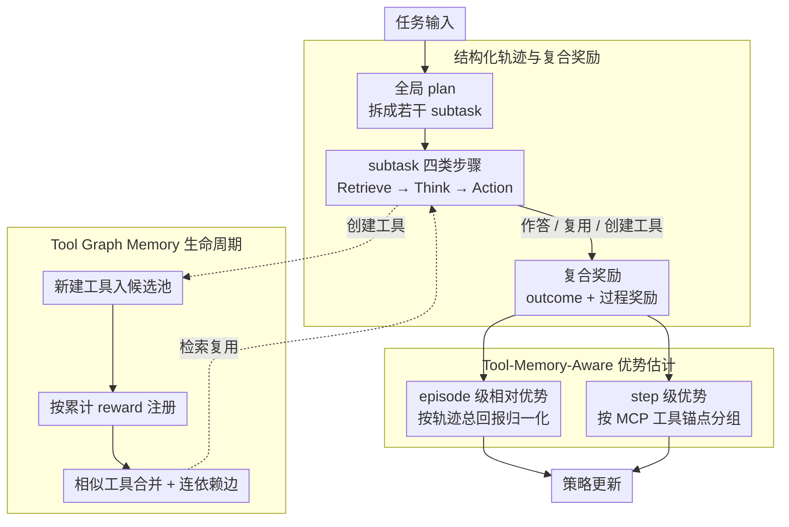

# SEARL: Joint Optimization of Policy and Tool Graph Memory for Self-Evolving Agents

**会议**: ACL2026  
**arXiv**: [2604.07791](https://arxiv.org/abs/2604.07791)  
**代码**: https://github.com/circles-post/SEARL  
**领域**: LLM Agent / 强化学习  
**关键词**: 自进化智能体、工具图记忆、RLVR、信用分配、MCP工具

## 一句话总结
SEARL 将 agent 的策略参数和外部 Tool Graph Memory 联合优化，用工具锚定的 step-level advantage 与过程奖励解决长轨迹信用分配，使小模型在多跳问答和复杂数学任务中能持续创建、复用和整合工具。

## 研究背景与动机
**领域现状**：RLVR 已经在单轮数学推理中证明有效，agentic learning 则进一步要求模型从多步交互轨迹中学习，能够生成工具、调用工具并积累经验。

**现有痛点**：很多工具型 agent 使用静态工具列表，适应新任务能力有限；一些自生成工具方法会把工具存进非结构化仓库，导致复用和组合困难；经验记忆方法保存历史轨迹，却缺乏显式依赖关系。对于小模型来说，一次生成“万能大工具”也容易失败。

**核心矛盾**：长轨迹 agent 训练需要细粒度 credit assignment，但开放环境中的状态空间巨大且连续，很少出现完全相同状态，传统按 state grouping 的 step-level advantage 难以工作。同时，简单过程奖励又容易被 reward hacking。

**本文目标**：作者希望让 agent 在 RL 训练过程中同时优化 policy 和 tool-based memory，使工具不仅被创建，还能以图结构保存依赖、被检索、被合并、被跨任务复用，并为 step-level 学习提供稳定锚点。

**切入角度**：论文把工具视作比原始环境状态更稳定的抽象。不同任务虽然文本状态不同，但如果都调用同一个工具或同一类工具，它们可能共享相似子问题结构，因此可以按 tool anchor 聚合 step-level advantage。

**核心 idea**：用 Tool Graph Memory 把工具和执行依赖变成外部结构化状态，再用 memory-anchored advantage 给工具创建、复用和执行分配细粒度信用，实现策略与记忆的共同自进化。

## 方法详解

### 整体框架
SEARL 把自进化拆成相互促进的两条线：策略模型通过 RL 学会规划、检索、思考与行动，外部 Tool Graph Memory 则在轨迹中持续增长、合并、连边，既为后续任务提供可复用工具，也为优势估计提供稳定的分组锚点。给定一个任务，agent 先生成全局 plan 把任务拆成若干 subtask，每个 subtask 内部展开为 Planning、Retrieve、Think、Action 四类 XML 风格步骤：Retrieve 从 Tool Graph Memory 选取相关 MCP 工具，Action 既可直接作答，也可调用已有工具或创建新工具。训练端用 outcome reward 判定最终答案正确性，叠加规划、工具创建、工具执行、格式等过程奖励，并以 episode 级相对优势与 tool-anchored step 级优势共同更新策略，使工具知识从分散候选逐步沉淀成结构化记忆图。

### 关键设计
**1. 结构化轨迹与复合奖励：把开放式行为拆成可奖励的步骤**

如果只用最终答案奖励，多步工具调用里到底哪个动作有用几乎无从判断，信号过于稀疏。SEARL 让每个任务先产出 high-level plan，再在 subtask 中显式标注 Retrieve、Think、Action，使轨迹变得可解析、可审计。奖励由稀疏的 outcome reward 与密集的 behavioral reward 组成：最终答案正确时取 $r_s=1$，局部再叠加 planning reward、tool creation reward、tool execution reward 和 format reward。这样训练信号能精确落到规划、工具创建、工具执行这些关键行为上，而不是被整条轨迹的成败一笔带过。

**2. Tool-Memory-Aware Advantage Estimation：用工具锚点替代状态分组**

开放语言环境的状态空间巨大且连续，几乎不会出现两条完全相同的 state，传统按 state grouping 的 step-level advantage 因此难以工作。SEARL 保留 episode-level advantage（在同一任务的多条 rollout 上按总回报归一化），但 step-level advantage 不按原始 state 分组，而是按 MCP tool anchor 分组：所有与同一工具、或合并后等价工具相关的动作被放入同一 group，用 return-to-go 计算相对优势。其根据在于工具是一种比文本状态更稳定的子任务抽象，按工具分组能跨轨迹比较「这个工具相关动作是否真正带来收益」，从而压住由上下文差异引入的噪声。

**3. Tool Graph Memory 生命周期：让工具记忆持续增长并连边**

非结构化的工具仓库会随训练膨胀、重复且难以复用。SEARL 把 plan 生成的 subtask dependency graph 投影到工具空间形成任务子图：成功创建的 MCP 工具进入候选池，每轮训练根据累计 reward 选择高价值工具注册；新工具与已有工具按 name/description embedding 的 cosine similarity 合并，边则记录 subtask 的执行先后依赖，合并时边会重定向到统一节点。由此图结构不仅保存工具本身，还保存「哪些工具通常先后出现」这类组合知识，为后续的规划与检索提供可复用的操作经验。

### 损失函数 / 训练策略
训练目标是在带 Tool Graph Memory 的策略下最大化期望奖励，并用 KL 约束相对 reference policy 的偏移：$\max_{\pi_\theta}\mathbb{E}[r_\phi(x,y)]-\beta D_{KL}[\pi_\theta(y\mid x;\mathcal{T}_G)\|\pi_{ref}(y\mid x;\mathcal{T}_G)]$。优势估计分两级：episode-level advantage 用轨迹总回报归一化，step-level advantage 用同一 tool anchor 下的 return-to-go 归一化。实验使用 Tool-star 的 10,000 条 RL 训练样本，agent 配备 Python interpreter 和本地 Wikipedia search server，评价指标为 pass@1 accuracy，judge 为 Qwen3-32B。

## 实验关键数据

### 主实验
SEARL 在数学推理和多跳 QA 上与多种 RL baseline 对比。它在 AIME24、HotpotQA、2Wiki、Bamboogle 上达到或并列最优，平均排名最低。

| 方法 | GSM8K | MATH500 | AIME24 | HotpotQA | 2wiki | Musique | Bamboogle | Avg Rank |
|------|-------|---------|--------|----------|-------|---------|-----------|----------|
| TIR Prompt | 0.2259 | 0.0540 | 0.0000 | 0.2300 | 0.1250 | 0.0350 | 0.1200 | 5.29 |
| GRPO | 0.8870 | 0.7360 | 0.1333 | 0.2150 | 0.3450 | 0.0900 | 0.1600 | 2.43 |
| DAPO | 0.8059 | 0.5520 | 0.1333 | 0.3350 | 0.3500 | 0.0650 | 0.2480 | 3.00 |
| REINFORCE++ | 0.8658 | 0.6800 | 0.1000 | 0.1100 | 0.2600 | 0.0000 | 0.0080 | 4.57 |
| ARPO | 0.8241 | 0.6480 | 0.3333 | 0.1400 | 0.2200 | 0.0650 | 0.1760 | 3.57 |
| SEARL | 0.8620 | 0.6820 | 0.3333 | 0.3350 | 0.3600 | 0.0900 | 0.3040 | 1.43 |

### 消融实验
论文用训练曲线和组件消融分析机制。虽然主要消融以图呈现，没有完整数值表，但作者明确报告 Step-level Grouping 的移除导致大多数数据集上最大退化，Step Rewards 也明显影响表现。

| 配置 | 关键指标 / 现象 | 说明 |
|------|-----------------|------|
| Full SEARL | Avg Rank 1.43 | 策略与工具图记忆联合优化 |
| w/o Step-level Grouping | AIME24、Bamboogle 等退化最大 | 工具锚定分组是 credit assignment 核心 |
| w/o Step Rewards | 多数任务明显下降 | 仅靠最终奖励不足以训练工具行为 |
| w/o Single Vanishing | 影响较小但稳定性变差 | 避免单元素 group 产生无意义优势估计 |
| GRPO baseline | 训练 reward 低于 SEARL，entropy 更低 | SEARL 反馈更密、更能保持探索 |

### 关键发现
- 多跳 QA 是 SEARL 的强项。HotpotQA 上达到 0.3350，与 DAPO 并列；2Wiki 达 0.3600，为最高；Bamboogle 达 0.3040，明显高于所有 baseline。
- 数学任务呈现 trade-off。GSM8K 和 MATH500 上 GRPO 最高，SEARL 略低，说明简单题中工具生成可能引入过程噪声；但 AIME24 上 SEARL 与 ARPO 同为 0.3333，表明复杂题更受益于工具分解。
- 训练动态显示 SEARL 的 reward 持续高于 GRPO，且 entropy 更高，说明工具锚定优势和过程奖励能维持探索，而不是过早收敛到固定工具调用模式。
- 工具图会从早期小而分散的子图，逐步演化为多分支、跨任务连接的功能簇，说明 memory consolidation 不是装饰，而是在积累可复用技能。

## 亮点与洞察
- 最有启发的是“工具是状态抽象”。传统 RL 在开放语言环境里很难找相同 state，但工具调用天然聚合了相似子问题，这为长轨迹 credit assignment 提供了实际抓手。
- Tool Graph Memory 同时服务三件事：检索工具、记录依赖、合并经验。相比单纯存轨迹或存工具列表，图结构更接近 agent 的“操作知识库”。
- 作者没有让模型生成一次性大工具，而是鼓励为具体 subtask 生成模块化工具。这对小模型尤其重要，因为小模型更难一次性写出复杂 monolithic solver。
- 结果中 GSM8K/MATH500 的轻微劣势也很诚实地揭示了工具型 agent 的成本：简单题不一定需要工具，自动工具化可能反而拖慢或扰动推理。

## 局限与展望
- 作者承认 SEARL 在 GSM8K 和 MATH500 上仍落后于 GRPO 等方法，说明生成和检索工具对简单问题存在 overhead。
- 工具集在训练中形成后，可能限制模型对新上下文的适应，例如直接搜索场景或高度专业领域。工具图的泛化边界需要进一步测试。
- 受模型规模限制，很多生成工具仍然比较 trivial，未必能被其他 LLM 有效复用。未来可能需要更强模型或工具质量筛选机制。
- reward hacking 仍是风险。过程奖励能缓解稀疏反馈，但也可能诱导模型追求格式正确、工具调用成功等表层信号，而不是真正提升推理质量。

## 相关工作与启发
- **vs GRPO / DAPO / REINFORCE++**: 这些方法主要优化策略本身，SEARL 额外优化外部工具图记忆，因此在需要跨步骤信息组合的多跳 QA 上更占优。
- **vs ARPO**: ARPO 也面向 agent RL，但 SEARL 更强调工具记忆结构与 step-level tool anchor。AIME24 上二者并列，说明复杂数学中结构化工具对泛化有帮助。
- **vs Alita / STELLA**: 这些自生成工具方法重在创建工具，SEARL 进一步要求工具以图结构合并、检索和参与 advantage estimation。
- **启发**: 长轨迹 agent 的关键不是“记住所有历史”，而是把历史压缩成可执行、可组合、可检索的操作单元。工具图可以扩展为 API graph、workflow graph 或实验操作图。

## 评分
- 新颖性: ⭐⭐⭐⭐☆ 工具图记忆与 tool-anchored advantage 的组合有新意，切中了 agent RL 的信用分配问题。
- 实验充分度: ⭐⭐⭐⭐☆ 覆盖数学和多跳 QA，baseline 较强；但消融图缺少完整数值，工具质量评估还可更细。
- 写作质量: ⭐⭐⭐⭐☆ 方法结构清楚，公式和流程完整；部分实现细节依赖附录。
- 价值: ⭐⭐⭐⭐☆ 对小模型 agent 自进化很有参考价值，尤其适合工具密集型和多跳推理任务。

<!-- RELATED:START -->

## 相关论文

- [\[ICLR 2026\] Exploratory Memory-Augmented LLM Agent via Hybrid On- and Off-Policy Optimization](../../ICLR2026/llm_agent/exploratory_memory-augmented_llm_agent_via_hybrid_on-_and_off-policy_optimizatio.md)
- [\[ACL 2026\] MAGMA: A Multi-Graph based Agentic Memory Architecture for AI Agents](magma_a_multi-graph_based_agentic_memory_architecture_for_ai_agents.md)
- [\[ACL 2026\] BAPO: Boundary-Aware Policy Optimization for Reliable Agentic Search](bapo_boundary-aware_policy_optimization_for_reliable_agentic_search.md)
- [\[ACL 2026\] Mem²Evolve: Towards Self-Evolving Agents via Co-Evolutionary Capability Expansion and Experience Distillation](mem2evolve_towards_self-evolving_agents_via_co-evolutionary_capability_expansion.md)
- [\[ACL 2026\] WebClipper: Efficient Evolution of Web Agents with Graph-based Trajectory Pruning](webclipper_efficient_evolution_of_web_agents_with_graph-based_trajectory_pruning.md)

<!-- RELATED:END -->
