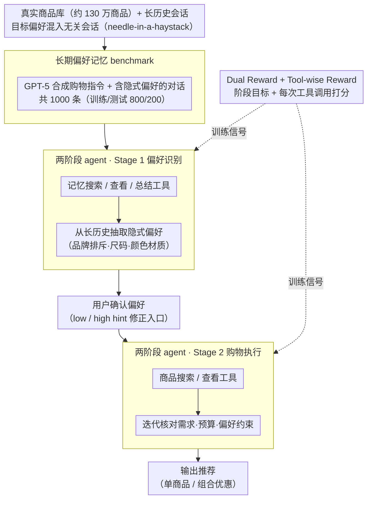

# Shopping Companion: A Memory-Augmented LLM Agent for Real-World E-Commerce Tasks

**会议**: ACL2026  
**arXiv**: [2603.14864](https://arxiv.org/abs/2603.14864)  
**代码**: 未公开  
**领域**: LLM Agent / 电商推荐  
**关键词**: 长期记忆、电商Agent、偏好识别、工具调用、强化学习

## 一句话总结
Shopping Companion 构建了一个带长期用户偏好记忆和真实商品库的电商任务基准，并用两阶段 agent 加双重奖励、工具级奖励联合优化偏好识别和商品推荐，使 4B 模型接近强闭源模型表现。

## 研究背景与动机
**领域现状**：电商 LLM agent 需要完成商品推荐、预算约束、组合优惠等任务。与普通问答不同，购物助手必须查询商品库、比较属性、满足硬约束，并且理解用户在过去多轮对话中隐含表达的品牌、尺码、风格和预算偏好。

**现有痛点**：现有 benchmark 往往只覆盖单会话商品搜索，或只评估长期记忆问答而不落到真实下游任务。WebShop 没有长期记忆，LongMemEval 不评估购物任务，ShoppingBench 和 ShopSimulator 也没有把跨会话偏好记忆、真实商品检索和用户干预同时放进一个端到端设置。

**核心矛盾**：偏好识别和购物执行在真实场景中是耦合的。把长期记忆检索当作上游模块、把商品推荐当作下游模块，会导致偏好提取错误无法被任务反馈纠正；而端到端一次性完成又容易让模型在长历史和大商品库中迷失。

**本文目标**：作者希望建立一个能同时评估长期记忆、真实商品约束和多轮用户干预的电商 agent 基准，并训练一个轻量模型，使它在偏好捕捉和最终推荐成功率上超过强开源模型、接近闭源大模型。

**切入角度**：论文把购物任务建模为部分可观测 MDP，状态由对话上下文、长期记忆库和当前购物指令组成；成功条件同时要求推荐满足显式需求和记忆中的隐式偏好。

**核心 idea**：把 agent 拆成“偏好识别”和“购物执行”两个阶段，再用 stage-level dual reward 评价阶段目标、tool-wise reward 评价中间工具调用，从而改善多轮工具交互中的稀疏信用分配。

## 方法详解

### 整体框架
论文先搭起一个大规模购物模拟环境：包含 1,298,797 个真实商品、长期会话历史、自然语言购物指令，以及 Single Product Recommendation 与 Add-on Deals 两类任务，每个样例配有 15-50 轮历史，目标偏好被刻意混在无关会话中形成 needle-in-a-haystack。在此之上，Shopping Companion agent 分两阶段串行运行：Stage 1（Preference Identification）调用记忆搜索、查看、总结工具，从长历史中抽取与当前指令相关的隐式偏好并交给用户确认；Stage 2（Shopping Assistance）以确认后的偏好为约束，调用商品搜索与查看工具迭代核对需求、预算和偏好，最终输出符合格式的推荐。训练上，stage-level dual reward 评价两个阶段目标、tool-wise reward 评价每次中间工具调用，把稀疏的终局成功率拆成密集反馈来对齐偏好抽取与商品推荐。

### 关键设计
**1. 长期偏好记忆 benchmark：把「记得偏好」绑定到购物成功率**

用户往往不会在当前请求里重复所有偏好，购物助手必须回到历史里找证据；可如果 benchmark 只做记忆问答，记忆模块就容易只优化文本召回而非任务成功。为此作者从真实商品库采样产品与优惠组合，用 GPT-5 生成购物指令和含隐式偏好的对话 session，再混入 LongMemEval 风格的无关会话，最终得到 1,000 条指令（训练/测试 800/200），每条都要求从历史中定位偏好证据并映射成商品约束。这样长期记忆的价值就由下游推荐结果直接检验，而不是停在召回指标上。

**2. 两阶段 agentic framework：先定偏好再执行购物**

一阶段端到端 agent 一旦在长历史中抽错偏好，就会带着错误继续搜索且无法回头。Shopping Companion 把流程切成 Stage 1 只负责从长期记忆识别偏好（品牌排斥、尺码历史、颜色或材质喜好等）并展示给用户确认，Stage 2 再把确认后的偏好当作硬约束或软约束去检索候选、逐个核对当前指令与历史偏好。这个中间可检查状态既降低了「长历史偏好抽取」与「商品多约束求解」两个难题的耦合，也为用户低粒度或高粒度反馈提供了天然的修正入口。

**3. Dual Reward + Tool-wise Reward：把终局信用提前到中间动作**

多轮工具 agent 若只有终局成功率，反馈过于稀疏——推荐失败可能源自记忆搜错、商品搜错、查看不足或格式错误，却无从区分。本文的复合奖励在这里体现为：Stage 1 reward 衡量查询相关性、偏好属性匹配以及 add-on deals 中产品数量是否识别正确，Stage 2 reward 衡量推荐是否可抽取、是否满足需求、是否匹配偏好与预算/数量约束；tool-wise reward 再对每次记忆检索、记忆查看、商品搜索、商品查看分别打分，检查是否命中 gold preference sessions 或 gold products，最终 reward 为阶段奖励、工具奖励与格式奖励之和。把反馈下沉到中间动作后，RL 更容易学会「搜什么、看什么、何时停止」。

### 损失函数 / 训练策略
训练分 SFT 与 RL 两步。SFT 用 GPT-4.1 rejection sampling 得到 2,948 条成功的 step-level trajectory，基于 LLaMA-Factory 对 Qwen3-4B-Thinking-2507 做 LoRA 微调，rank 为 64，目标层覆盖 q/k/v/o projection。RL 基于 VeRL 和 GRPO，每个样例 8 个 rollout，最大输出长度 32,768，最多 20 个 assistant turns，batch size 16，mini-batch size 8，temperature 0.6，top-k 20，top-p 0.95，学习率 $1\times10^{-6}$，训练约 2.6 个 epoch。

## 实验关键数据

### 主实验
主指标包括 Stage 1 的偏好抽取准确率 Acc. 和 Stage 2 的最终推荐成功率 Succ.。下表摘录 test set 上两类任务和平均结果。

| 类别 | 模型 | Single Acc | Single Succ | Add-on Acc | Add-on Succ | Avg Acc | Avg Succ |
|------|------|------------|-------------|------------|-------------|---------|----------|
| Closed | GPT-5 | 82.0 | 75.0 | 66.0 | 54.0 | 74.0 | 64.5 |
| Closed | GPT-4.1 | 88.0 | 78.0 | 39.0 | 24.0 | 63.5 | 51.0 |
| Closed | GPT-4o | 79.0 | 72.0 | 41.0 | 26.0 | 60.0 | 49.0 |
| Closed | Qwen3-Max | 80.0 | 72.0 | 35.0 | 24.0 | 57.5 | 48.0 |
| Open | Qwen3-Next-80B-A3B | 63.0 | 57.0 | 29.0 | 18.0 | 46.0 | 37.5 |
| Open | Qwen3-30B-A3B | 60.0 | 53.0 | 21.0 | 13.0 | 40.5 | 33.0 |
| Open | Qwen3-4B | 49.0 | 44.0 | 11.0 | 6.0 | 30.0 | 25.0 |
| Ours | Qwen3-4B-LoRA | 82.0 | 72.0 | 42.0 | 31.0 | 62.0 | 51.5 |
| Ours | + Dual-reward RL | 89.0 | 81.0 | 50.0 | 38.0 | 69.5 | 59.5 |
| Ours | + Dual & Tool-wise Reward | 90.0 | 84.0 | 55.0 | 43.0 | 72.5 | 63.5 |

最终模型平均成功率 63.5，接近 GPT-5 的 64.5，并明显超过所有开源基线。Single Product 已达到 84.0% 成功率，但 Add-on Deals 仍只有 43.0%，说明组合优惠类任务更难。

### 消融实验

| 策略 | Single Succ | Add-on Succ | Avg Succ | 说明 |
|------|-------------|-------------|----------|------|
| Oracle | 85.0 | 73.0 | 79.0 | 直接给 gold 偏好证据 |
| One-Stage | 73.0 | 32.0 | 52.5 | 偏好识别和购物执行混在一起 |
| Two-Stage None | 75.0 | 55.0 | 65.0 | 显式分阶段，无用户额外提示 |
| Two-Stage Low Hint | 78.0 | 59.0 | 68.5 | 用户只指出有缺漏/错误 |
| Two-Stage High Hint | 80.0 | 60.0 | 70.0 | 用户指出缺失维度但不直接给值 |

| 训练策略 | 平均轮数 | 平均工具调用 | 平均响应长度 | 结论 |
|----------|----------|--------------|--------------|------|
| Dual-Reward | 9.82 | 9.17 | 10485.39 | 只靠阶段奖励，轨迹较长 |
| Dual & Tool-wise | 8.89 | 8.47 | 10068.83 | 工具级奖励让检索更聚焦、更短 |

| 评估器元评测 | Single Product | Add-on Deals | 平均 |
|--------------|----------------|--------------|------|
| GPT-5 agent 输出 | 0.96 | 0.92 | 0.94 |
| GPT-4.1 agent 输出 | 0.92 | 0.88 | 0.90 |

### 关键发现
- 闭源模型在单商品任务上表现强，但 add-on deals 成功率大幅下降，GPT-5 也只有 54.0%。多商品组合、预算和偏好匹配形成组合优化难点。
- 4B 模型经过 LoRA 后已经从平均 25.0 Succ 提升到 51.5；再加 dual reward RL 到 59.5；加入工具级奖励后到 63.5，说明训练信号逐步对齐到任务目标。
- 两阶段结构本身贡献很大。One-Stage 在 add-on deals 上只有 32.0，而 Two-Stage None 到 55.0，说明先显式整理偏好能显著减轻后续搜索负担。
- 用户干预有稳定收益，但 High Hint 仍和 Oracle 有 9 个点平均差距，表明瓶颈不仅在偏好识别，也在商品检索和多约束决策。

## 亮点与洞察
- 论文把长期记忆评估从“能否回忆事实”推进到“记忆是否改善任务成功”。这比单纯问答式 memory benchmark 更贴近 agent 产品。
- 两阶段设计很实用：先让用户确认偏好，再执行购物，既提高可控性，也给系统一个自然的错误纠正点。
- Tool-wise reward 是本文最有工程价值的部分。它把 gold session 和 gold product 转化为中间动作反馈，解决了多轮工具调用中“终局失败不知道错在哪”的问题。
- 结果显示轻量模型并非只能追随闭源大模型。只要 benchmark、工具和 reward 设计足够贴合任务，4B agent 可以在垂直场景里接近 GPT-5。

## 局限与展望
- Add-on Deals 仍然很难，最终模型成功率只有 43.0%，说明预算、多商品兼容和偏好组合仍有大量改进空间。
- Tool-wise reward 与本文特定工具集和商品库强绑定，迁移到旅行规划、企业采购或医疗辅助等其他 agent 场景需要重新设计 gold actions 和奖励服务器。
- benchmark 由 LLM 合成指令和偏好会话，虽然有人工验证，但真实用户偏好表达可能更含糊、更矛盾，也更动态。
- 长期偏好记忆涉及隐私与公平问题。真实部署需要用户可查看、纠正和删除记忆，并避免推断敏感属性或诱导消费。
- 代码未公开，复现完整环境需要商品库、检索索引、工具协议和 reward server，工程门槛较高。

## 相关工作与启发
- **vs WebShop**: WebShop 关注网页购物操作，但缺少跨会话长期偏好；Shopping Companion 把历史偏好作为任务成功的必要条件。
- **vs LongMemEval**: LongMemEval 评估长期记忆问答，本文把长期记忆嵌入真实推荐任务，能衡量 memory 对下游行动的价值。
- **vs ShopSimulator**: ShopSimulator 有交互但偏好更静态，本文使用持久化记忆库和用户确认机制，更接近真实助手。
- **vs Agentic Memory**: Agentic Memory 优化记忆操作策略，Shopping Companion 将这一方向落到电商工具 agent，并把工具级奖励扩展到商品搜索。

## 评分
- 新颖性: ⭐⭐⭐⭐ 长期记忆、真实商品库和用户干预三者结合得很好。
- 实验充分度: ⭐⭐⭐⭐ 有强闭源/开源基线、两阶段消融和奖励消融，但真实用户研究不足。
- 写作质量: ⭐⭐⭐⭐ 问题设定和 reward 设计清楚，部分工具协议细节在附录里略分散。
- 价值: ⭐⭐⭐⭐⭐ 对垂直 agent benchmark、记忆系统和工具级 RL 都很有参考价值。

<!-- RELATED:START -->

## 相关论文

- [\[ICLR 2026\] Exploratory Memory-Augmented LLM Agent via Hybrid On- and Off-Policy Optimization](../../ICLR2026/llm_agent/exploratory_memory-augmented_llm_agent_via_hybrid_on-_and_off-policy_optimizatio.md)
- [\[ACL 2026\] MCP-Flow: Facilitating LLM Agents to Master Real-World, Diverse and Scaling MCP Tools](mcp-flow_facilitating_llm_agents_to_master_real-world_diverse_and_scaling_mcp_to.md)
- [\[ICLR 2026\] OpenAgentSafety: A Comprehensive Framework for Evaluating Real-World AI Agent Safety](../../ICLR2026/llm_agent/openagentsafety_a_comprehensive_framework_for_evaluating_real-world_ai_agent_saf.md)
- [\[ACL 2026\] AgencyBench: Benchmarking the Frontiers of Autonomous Agents in 1M-Token Real-World Contexts](agencybench_benchmarking_the_frontiers_of_autonomous_agents_in_1m-token_real-wor.md)
- [\[AAAI 2026\] D-GARA: A Dynamic Benchmarking Framework for GUI Agent Robustness in Real-World Anomalies](../../AAAI2026/llm_agent/d-gara_a_dynamic_benchmarking_framework_for_gui_agent_robust.md)

<!-- RELATED:END -->
