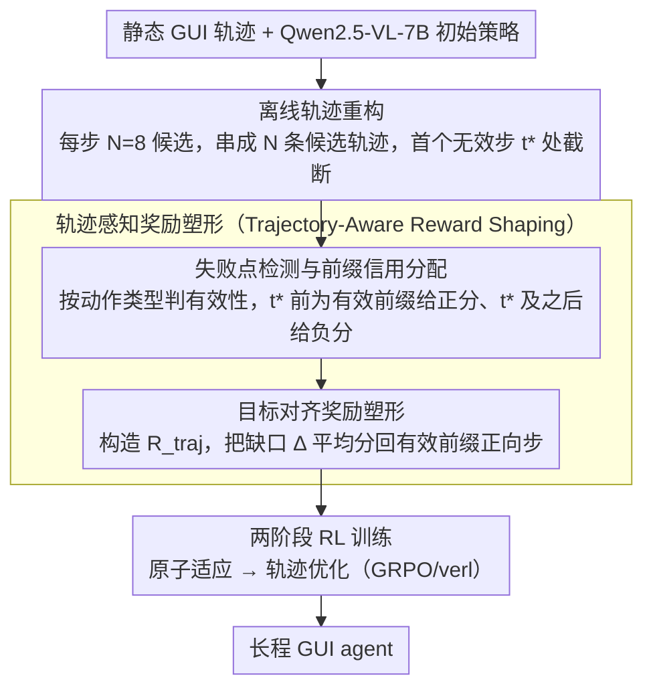

# SOLAR-RL: Semi-Online Long-horizon Assignment Reinforcement Learning

**会议**: ACL2026  
**arXiv**: [2604.22558](https://arxiv.org/abs/2604.22558)  
**代码**: 无公开代码（论文说明基于 verl 实现）  
**领域**: GUI Agent / 强化学习 / 机器人与具身智能  
**关键词**: GUI智能体、半在线强化学习、长程任务、信用分配、奖励塑形

## 一句话总结
SOLAR-RL 用离线轨迹重构、失败点检测和目标对齐奖励塑形，把静态 GUI 数据加工成带有伪在线反馈的长程训练信号，使 Qwen2.5-VL-7B 规模的 GUI agent 在 Android Control、GUI-Odyssey 和 Android World 上获得接近或超过强 offline baseline 的稳定表现。

## 研究背景与动机
**领域现状**：GUI agent 正从单步点击、控件定位走向跨应用、多步骤、长程任务。现有强方法一部分依赖 SFT/behavior cloning 学专家演示，另一部分用在线 RL 和环境交互收集新轨迹，以缓解部署时的 covariate shift。

**现有痛点**：纯 SFT 容易学到“专家路径上的局部反应”，一旦界面状态稍微偏离训练分布，就缺少恢复能力。在线 RL 可以获得真实动态反馈，但 GUI 环境交互昂贵、不稳定，长达 30 步以上的任务又常只有终局 success/failure，导致训练高方差、奖励稀疏和策略崩溃。标准 offline RL 虽然安全便宜，但常把静态数据切成局部 step transition，丢掉“这条轨迹整体成没成功、哪里开始失败”的全局信息。

**核心矛盾**：GUI 长程任务需要在线反馈式的信用分配，但实际训练又希望保持离线数据的可控性和低成本。关键问题不是简单增加轨迹数量，而是如何从已有静态轨迹中恢复“哪些前缀是有效的、哪个动作第一次让任务偏离、后续动作应如何惩罚”。

**本文目标**：作者要设计一种半在线 RL 机制，在不真实访问环境的前提下，把静态 GUI 数据转化为多条可训练候选轨迹，并给每个 step 分配和全局完成质量一致的 dense reward。

**切入角度**：论文把长程失败看作 credit assignment 问题。只要能检测第一处 breakdown，就可以把 breakdown 之前的有效前缀奖励化，把 breakdown 及之后动作负向化，再把总回报校准到轨迹级质量。

**核心 idea**：用离线数据模拟在线 rollout 的分支，再通过 failure-point based retroactive credit assignment 把稀疏终局信号变成目标对齐的逐步奖励。

## 方法详解

### 整体框架
SOLAR-RL 不更换 GUI agent 架构，而是在训练数据与奖励信号层面重构长程优化问题：以 Qwen2.5-VL-7B-Instruct 为初始策略，先把静态轨迹加工成多条可训练候选，再用专家标签或规则判断每个动作是否仍然有效，最后用塑形后的逐步奖励驱动 RL。整条流水线由两个模块衔接：离线轨迹重构（Offline Trajectory Reconstruction）对同一任务每步生成 $N$ 个候选、按候选索引串成 $N$ 条重构轨迹，并在首个无效步 $t^*$ 处截断；轨迹感知奖励塑形（Trajectory-Aware Reward Shaping）先按动作类型算 step validity score，再把 valid prefix、invalid suffix 与轨迹级成功/长度/质量合成为最终逐步奖励，其内部又拆成「失败点检测与前缀信用分配」和「目标对齐奖励塑形」两步。训练上采用先原子适应（atomic adaptation）、后轨迹优化（trajectory optimization）的两阶段安排，以提升长程稳定性。

### 关键设计
**1. 离线轨迹重构：在静态数据上模拟多条执行分支**

普通 offline RL 只看专家轨迹或局部 transition，无法观察「偏离之后会怎样」，探索空间被压得很窄。SOLAR-RL 给定一个任务后，在每个时间步运行 $N=8$ 个候选 rollout，并把相同索引的候选动作串接成一条 trajectory candidate；这些候选虽是离线生成，但可通过 ground-truth validity assessment 判断某条路径是否仍语义一致。如此一来训练能看到「从同一上下文出发的不同选择」，逼近在线探索的多样性，却不必付出真实 GUI 环境交互的成本与不稳定。

**2. 失败点检测与前缀信用分配：定位第一处崩坏并集中给分**

长程 GUI 任务的终局失败往往由早期某个关键错误触发，若只给整条失败轨迹负分，模型不知道前面哪些动作其实是对的；若每步都按局部相似度奖励，又会鼓励无意义的长序列。SOLAR-RL 对不同动作类型用不同 validity criteria——坐标动作（Click、Scroll）用空间相似度、文本动作（Type）用 F1、系统动作（Launch、Wait/Back）用 exact matching——一旦第 $t^*$ 步首次判为无效，便把 $0$ 到 $t^*-1$ 视为 valid prefix 给正向奖励，breakdown step 及其后续无效动作给负向惩罚。失败点把「有效前缀」和「崩坏后果」干净地分开，让信用集中落到真正推动任务的动作上。

**3. 目标对齐奖励塑形：让逐步奖励之和贴合轨迹质量**

dense reward 若只是把终局奖励平摊到每一步，会出现两个问题：局部奖励尺度在不同轨迹长度下不可比，模型还可能靠拉长序列或重复局部正确动作来「刷奖励」。SOLAR-RL 先构造轨迹级奖励 $R_{traj}$，由平均 step raw score、当前长度相对参考长度 $T/N_{ref}$ 与 success indicator 组成；step 级则把 valid action 保留正分、invalid action 改为 $-(1-s_{raw})$，再对正负部分归一化；最后算出缺口 $\Delta=R_{target}-\sum_t r_t^{base}$，把这份 reward gap 平均分配给 valid prefix 中的正向步骤。target alignment 由此把逐步奖励重新拉回全局目标，既保留 dense feedback，又约束总回报与执行质量一致。

### 损失函数 / 训练策略
SOLAR-RL 在 GRPO/verl 框架上训练，主要改动集中在 reward definition 而非优化器。策略初始化为 Qwen2.5-VL-7B-Instruct，使用 15k 条高质量静态轨迹、约 94k steps，轨迹重构温度为 1.0、每步 8 个候选。训练用 32 张 NVIDIA L40S，global batch size 128，最大上下文长度 6,144 tokens，650 update steps，约 60 小时。作为对照的 GRPO baseline 与 SOLAR-RL 使用相同训练预算，差别仅在于前者用 sparse trajectory reward、后者用 trajectory-aware shaped reward。

## 实验关键数据

### 主实验

| 模型 | 训练范式 | Android Control Low SR | Android Control High SR | GUI-Odyssey TM / EM | Android World SR | 训练数据 |
|--------|------|------|------|------|------|------|
| Qwen2.5-VL-7B | Generalist | 85.05 | 61.40 | 61.89 / 47.92 | 未报告 | 无专门 GUI 训练 |
| UI-TARS-7B-SFT | Online specialized | 94.81 | 77.99 | 86.94 / 68.82 | 33.3 | 145K trajectories |
| AgentCPM-GUI-8B | Offline specialized | 88.60 | 67.93 | 90.82 / 74.84 | 未报告 | >470K steps, >55K trajectories |
| UI-Venus-Navi-7B | Offline specialized | 86.16 | 68.61 | 87.30 / 71.09 | 49.1 | 350K steps |
| SOLAR-RL | Offline / semi-online shaping | 88.57 | 69.27 | 87.60 / 68.20 | 33.7 | 94K steps, 15K trajectories |

### 消融实验

| 配置 | 关键指标 | 说明 |
|------|---------|------|
| Direct GRPO, Super Long Low | 200 steps 后难以持续优化 | sparse terminal reward 造成 late-stage collapse |
| Direct SOLAR-RL, Super Long Low | 更高且更稳的 action SR | dense reward 缓解长程 credit assignment |
| 2-stage GRPO, High Long | SR 约 0.66-0.67 后快速饱和 | 好初始化不能完全解决长程稀疏反馈 |
| 2-stage SOLAR-RL, High Long | SR 约 0.70 | trajectory-aware shaping 继续带来增益 |
| 2-stage GRPO, High Super Long | SR 约 0.58-0.60 且振荡 | 超长路径中策略容易停滞 |
| 2-stage SOLAR-RL, High Super Long | 峰值 SR 约 0.66 | 长程任务优势更明显 |
| PressBack primitive | 精度 >0.8 且收敛更快 | 对错误恢复动作的学习更稳定 |

### 关键发现
- SOLAR-RL 在 Android Control High 上达到 69.27% SR，是 offline category 中最高，高于 UI-Venus 的 68.61% 和 AgentCPM 的 67.93%。这说明它的优势主要出现在需要多步推理的 split。
- 在 GUI-Odyssey 上，SOLAR-RL 的 TM 为 87.60，低于 AgentCPM 的 90.82，但 AgentCPM 使用超过 55k 轨迹，SOLAR-RL 只用 15k 轨迹，样本效率更突出。
- 在 Android World 上，SOLAR-RL 以 94k steps 达到 33.7% SR，略高于 UI-TARS-7B-SFT 的 33.3%，且不需要在线交互或 145k trajectories。
- 训练动态显示，GRPO 的 mean action reward 在约 600 steps 后出现策略崩溃，而 SOLAR-RL 单调提升并在约 0.75 附近收敛。

## 亮点与洞察
- 这篇论文最清楚地抓住了 GUI agent 的“长程失败归因”问题。很多 GUI RL 工作强调在线探索或 reward model，SOLAR-RL 则把重点放在静态数据内部的失败点结构。
- target-aligned reward shaping 的思想很实用：dense reward 不只是把终局奖励摊到每一步，而是明确约束总回报和轨迹质量一致，避免局部奖励诱导错误目标。
- 半在线范式适合成本高、真实环境不稳定的 agent 任务。类似思路可迁移到网页自动化、桌面操作、机器人离线演示学习和工具调用 agent。
- 论文的结果提示，数据规模不是唯一变量。更好的奖励归因可以让 15k 轨迹发挥接近更大训练集的效果。

## 局限与展望
- Semi-online feedback 仍受 offline dataset 覆盖限制。未出现过的弹窗、延迟、罕见 app 状态和跨平台事件无法凭静态轨迹生成出来。
- 当前 validity filter 依赖 ground-truth labels 和动作类型规则。若换成 learned verifier 或 process reward model，会引入 reward noise、校准漂移和 reward hacking。
- 实验集中在 Android 移动环境。桌面和浏览器有 hover、右键、快捷键、拖拽、多窗口和异步页面变化，validity criteria 要重新设计。
- 论文没有给出真实在线部署中的交互评估。SOLAR-RL 在静态和动态 benchmark 上有效，但仍需验证它是否能处理真实 app 版本变化和系统状态漂移。
- 消融主要以曲线和定性分析呈现，若能给出更多表格式超长任务最终数值，会更便于复现和横向比较。

## 相关工作与启发
- **vs SFT / Behavior Cloning**: SFT 学专家动作但缺少偏离后的恢复机制；SOLAR-RL 通过候选轨迹和失败点让模型看到偏离结构。
- **vs Online RL**: 在线 RL 有真实动态反馈但交互昂贵、方差高；SOLAR-RL 用静态数据模拟 feedback，牺牲一部分覆盖性换取稳定和低成本。
- **vs UI-S1 / semi-online GUI RL**: UI-S1 用 patch module 修正偏差，SOLAR-RL 更强调 outcome-aware credit assignment 和 reward shaping。
- **vs VAGEN / Bi-Level GAE**: VAGEN 奖励显式 world modeling 并做层级 credit propagation；SOLAR-RL 不依赖内部世界模型，而是从轨迹有效性和 breakdown 位置构造奖励。

## 评分
- 新颖性: ⭐⭐⭐⭐ 半在线 GUI RL 不算全新，但 failure-point + target-aligned shaping 的组合很有针对性。
- 实验充分度: ⭐⭐⭐⭐ 覆盖三个 GUI benchmark 和训练动态分析，但在线真实环境验证仍不足。
- 写作质量: ⭐⭐⭐⭐ 动机清楚、图示直观，部分表格和附录公式在 HTML 中可读性一般。
- 价值: ⭐⭐⭐⭐ 对低成本训练 GUI agent 很实用，尤其适合已有离线演示但难以大规模在线交互的场景。

<!-- RELATED:START -->

## 相关论文

- [\[ACL 2026\] TiMem: Temporal-Hierarchical Memory Consolidation for Long-Horizon Conversational Agents](timem_temporal-hierarchical_memory_consolidation_for_long-horizon_conversational.md)
- [\[ICLR 2026\] Solving the Granularity Mismatch: Hierarchical Preference Learning for Long-Horizon LLM Agents](../../ICLR2026/llm_agent/solving_the_granularity_mismatch_hierarchical_preference_learning_for_long-horiz.md)
- [\[ACL 2026\] StructMem: Structured Memory for Long-Horizon Behavior in LLMs](structmem_structured_memory_for_long-horizon_behavior_in_llms.md)
- [\[ACL 2026\] Hierarchical Reinforcement Learning with Augmented Step-Level Transitions for LLM Agents](hierarchical_reinforcement_learning_with_augmented_step-level_transitions_for_ll.md)
- [\[ICML 2026\] On Information Self-Locking in Reinforcement Learning for Active Reasoning of LLM Agents](../../ICML2026/llm_agent/on_information_self-locking_in_reinforcement_learning_for_active_reasoning_of_ll.md)

<!-- RELATED:END -->
