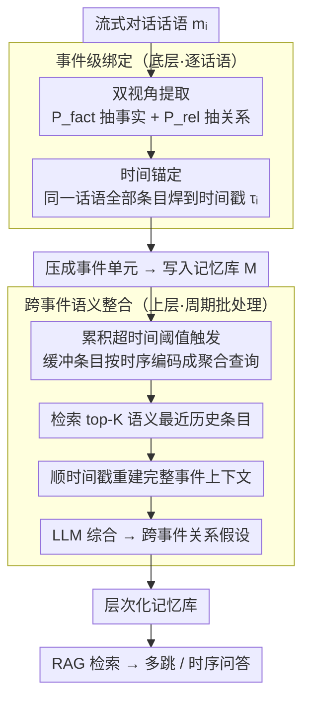

# StructMem: Structured Memory for Long-Horizon Behavior in LLMs

**会议**: ACL 2026  
**arXiv**: [2604.21748](https://arxiv.org/abs/2604.21748)  
**代码**: [https://github.com/zjunlp/LightMem](https://github.com/zjunlp/LightMem)  
**领域**: LLM Agent / 对话系统  
**关键词**: 长期记忆, 事件级绑定, 跨事件整合, 层次化记忆, 多跳推理

## 一句话总结

StructMem 提出了一种结构增强的层次化记忆框架，通过事件级双视角提取和跨事件语义整合，在 LoCoMo 长对话基准上实现 SOTA 性能（76.82%），同时大幅降低 token 消耗（1.94M vs. 图记忆的 35.8M）和 API 调用次数。

## 研究背景与动机

**领域现状**：持久记忆系统对于 LLM 代理在长期对话中保持连贯性至关重要。现有记忆系统分为两大范式：扁平记忆（flat memory）将事实或摘要存储为独立单元，用向量数据库做相似性检索；图记忆（graph memory）通过实体-关系抽取构建知识图谱，支持结构化推理。

**现有痛点**：扁平记忆高效但无法建模跨事件关系——检索退化为浅层相似性匹配，无法进行时序推理和多跳问答。图记忆能恢复关系结构，但成本极高——需要级联的 LLM 操作（实体抽取、关系抽取、去重、更新），且脆弱——噪声抽取会产生传播的结构性噪声。Mem0^g 的 token 消耗高达 35.8M、53514 次 API 调用、115670 秒运行时间。

**核心矛盾**：效率与结构化推理之间的根本性权衡。扁平方法快但浅，图方法深但慢。问题根源在于不合适的记忆单元选择：孤立的事实丢失上下文，三元组强制施加刚性模式。

**本文目标**：设计一种记忆单元，既能保留事件的因果和人际关系上下文，又不需要显式 schema 设计、实体消解和符号化图遍历。

**切入角度**：会话记忆的基本单元不应是孤立事实或三元组，而应是"时序锚定的关系事件"——保留"发生了什么"和"事件如何跨主体和时间相互关联"。

**核心 idea**：用事件级绑定（双视角提取 + 时间锚定）保留局部结构，用跨事件整合（语义检索 + 批量综合）构建全局连接，在不构建显式图的情况下实现结构化推理。

## 方法详解

### 整体框架

StructMem 把会话记忆组织成上下两个层次。底层处理单条话语：从每个话语里同时抽出「事实」和「关系」两路信息，并统一锚定到该话语的时间戳，把一条话语压成一个时序完整的「事件单元」；上层在事件之间运作，周期性地把语义相近的历史事件聚到一起综合，生成跨越时间边界的高层关系假设。输入是流式对话，输出是一个层次化记忆库，下游用 RAG 式检索回答多跳与时序问题。整套流程不构建显式知识图，全部条目都用自然语言表示，主干为 gpt-4o-mini，嵌入用 text-embedding-3-small，因此没有任何模型训练环节。

### 关键设计

**1. 双视角提取：一句话留下两份证词**

记忆系统的老问题是单一视角只能抓住一半信息——扁平记忆只留事实，三元组只留关系，两者都丢掉了情节接地所需的语境。StructMem 对每条话语 $m_i$ 用两个不同 prompt 各调一次 LLM：$\Phi_i = \mathcal{L}(P_{fact} \| m_i)$ 抽出事实条目（说了什么、做了什么），$\Psi_i = \mathcal{L}(P_{rel} \| m_i)$ 抽出关系条目（人际动态、因果影响、时序依赖）。两路条目都以自然语言书写而非强行套成三元组，因此既保住了关系结构，又免去了实体消解和 schema 设计的开销。

**2. 时间锚定：把事实和关系焊回同一时刻**

如果事实条目和关系条目各自散落进向量库，时序推理就无从谈起。StructMem 让同一话语产出的所有条目都锚定到它的原始时间戳 $\tau_i$，记忆库写成 $\mathcal{M} \leftarrow \bigcup_{i=1}^{N} \{ \langle x, \mathbf{e}_x, \tau_i \rangle \mid x \in \Phi_i \cup \Psi_i \}$，其中 $\mathbf{e}_x$ 是条目嵌入。检索命中任一条目后，顺着时间戳就能把同一刻的事实与关系重新拼回一个完整事件——时间戳成了从扁平检索里恢复事件完整性的纽带。

**3. 跨事件语义整合：让相关事件互相对话**

单条事件之间仍是孤立的，要做多跳推理必须建立跨时间的连接，而逐事件维护图谱代价高昂。StructMem 改用周期性批处理：累积事件超过时间阈值时触发整合，先把缓冲区里未整合的条目按时间排序、编码成一个聚合查询，检索历史中语义最相似的 top-K 条目作为种子；再对每个种子顺时间戳重建完整事件上下文 $E_\tau(x^*) = \{x' \in \mathcal{M} \mid \tau(x') = \tau(x^*)\}$；最后把重建事件与缓冲事件一并交给 LLM 综合，生成跨事件的关系假设。这一步不是有损压缩，而是在记忆里注入单条条目中本不存在的新推理链。之所以可行，是因为语义相关的事件天然聚集在相近的时间窗口内，利用这种时间局部性，把本该逐事件做的图更新降级成周期性批处理，从而把 API 调用和 token 消耗压下去。

## 实验关键数据

### 主实验（LoCoMo 基准）

| 方法 | Overall | Multi-hop | Temporal | Token (M) | API Calls | Time (s) |
|------|---------|-----------|----------|-----------|-----------|----------|
| FullContext | 73.83 | 68.79 | 50.16 | – | – | – |
| Mem0 | 66.88 | 67.13 | 59.19 | 12.196 | 9181 | 30057 |
| Mem0^g (图) | 68.44 | 65.71 | 58.13 | 35.825 | 53514 | 115670 |
| Zep | 75.14 | 74.11 | 67.71 | – | – | – |
| Memobase | 75.78 | 70.92 | 85.05 | – | – | – |
| **StructMem** | **76.82** | **68.77** | **81.62** | **1.937** | **1056** | **22854** |

### 消融实验

| 配置 | Multi-hop | Temporal |
|------|-----------|----------|
| Flat Memory（基线） | 66.31 | 78.50 |
| Graph Memory | 66.67 | 76.64 |
| w/o Cross-Event | 66.31 | 79.44 |
| StructMem (Full) | 68.77 | 81.62 |

### 关键发现
- **StructMem 在 Overall 上达到 76.82% SOTA**，超越 Memobase (75.78%) 和 Zep (75.14%)，且时序推理 81.62% 仅次于 Memobase 的 85.05%
- **效率优势极为显著**：token 消耗仅 1.94M，是 Mem0^g (35.8M) 的 1/18；API 调用 1056 次，是 Mem0^g (53514) 的 1/50
- 消融显示事件级结构主要改善时序推理（78.50→79.44），跨事件整合进一步提升至 81.62%
- 图记忆（Graph Memory）的时序推理反而比扁平记忆差（76.64 vs 78.50），说明刚性三元组结构对时序建模有害
- 扁平检索性能在 60 条条目时达到峰值并趋于平台，说明瓶颈在知识推理而非覆盖率

## 亮点与洞察
- **"记忆单元应该是时序锚定的关系事件"**这一洞察非常精准，找到了扁平 vs. 图的第三条路径。自然语言表示 + 时间耦合的设计简单但有效
- **时间局部性假设**的利用非常巧妙：语义相关的事件在短时间窗口内聚集，因此周期性整合比逐事件图更新更高效。这一假设在对话场景下高度成立
- 跨事件整合生成的是"关系假设"而非压缩摘要，这是一种创造性增强——在记忆中注入原始数据中不直接存在的推理链

## 局限与展望
- 双视角提取质量高度依赖 prompt 设计，次优的 prompt 可能导致不完整或不准确的关系信息
- 缺乏显式的冲突解决和记忆更新机制——用户偏好可能随时间演变，历史摘要与新信息可能产生不一致
- 仅在 LoCoMo 一个基准上评估，未在其他长对话基准（如 LongMemEval）上验证
- 时间局部性假设在对话场景成立，但在其他场景（如跨多天的工作日志）可能不成立

## 相关工作与启发
- **vs Mem0^g**: 图记忆方法，需要实体-关系抽取和图维护。StructMem 用自然语言事件替代三元组，效率提升 18 倍
- **vs HiMem**: 用物理会话边界组织层次化文本段。StructMem 不依赖会话边界，而是基于语义相似性做跨事件连接
- **vs TiMem**: 引入逐轮反思思维链加深单轮理解，但每轮都有开销。StructMem 的批量整合策略成本更低
- **vs EMem**: 保留原始 episode 优先检索忠实性。StructMem 在保留原始记忆的同时主动综合跨事件关系

## 评分
- 新颖性: ⭐⭐⭐⭐ 双视角 + 时间锚定 + 语义整合的层次化设计有新意，但各组件单独看并不算全新
- 实验充分度: ⭐⭐⭐ 仅一个基准（LoCoMo），消融不够深入；但效率对比全面
- 写作质量: ⭐⭐⭐⭐ 三范式对比图直观，方法描述清晰；但 Related Work 过长
- 价值: ⭐⭐⭐⭐ 效率提升极显著（1/18 token、1/50 API），对实际部署有重要意义

<!-- RELATED:START -->

## 相关论文

- [\[ACL 2026\] OCR-Memory: Optical Context Retrieval for Long-Horizon Agent Memory](ocr-memory_optical_context_retrieval_for_long-horizon_agent_memory.md)
- [\[ACL 2026\] TiMem: Temporal-Hierarchical Memory Consolidation for Long-Horizon Conversational Agents](timem_temporal-hierarchical_memory_consolidation_for_long-horizon_conversational.md)
- [\[ACL 2026\] OPeRA: A Dataset of Observation, Persona, Rationale, and Action for Evaluating LLMs on Human Online Shopping Behavior Simulation](opera_a_dataset_of_observation_persona_rationale_and_action_for_evaluating_llms_.md)
- [\[ACL 2026\] MemSearcher: Training LLMs to Reason, Search and Manage Memory via End-to-End RL](memsearcher_training_llms_to_reason_search_and_manage_memory_via_end-to-end_rein.md)
- [\[ACL 2026\] HiGMem: A Hierarchical and LLM-Guided Memory System for Long-Term Conversational Agents](higmem_a_hierarchical_and_llm-guided_memory_system_for_long-term_conversational_.md)

<!-- RELATED:END -->
