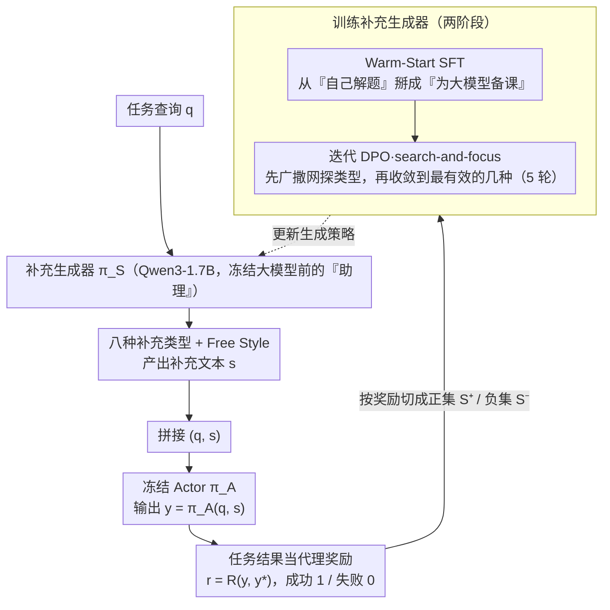

# Supplement Generation Training for Enhancing Agentic Task Performance

**会议**: ACL 2026 Findings  
**arXiv**: [2604.20727](https://arxiv.org/abs/2604.20727)  
**代码**: 无  
**领域**: 模型压缩  
**关键词**: 补充生成训练, 提示优化, 小模型辅助大模型, DPO, 代理任务

## 一句话总结

SGT（Supplement Generation Training）训练一个小型 LLM（1.7B）生成逐实例的补充文本（推理线索、摘要、错误提醒等），附加到输入后让冻结的大型 Actor 模型更有效地解决任务，在 5 个基准上平均提升 21%，无需修改大模型参数。

## 研究背景与动机

**领域现状**：最强的语言模型越来越多地以闭源 API 形式部署，梯度不可访问。即使可以微调，计算开销大且新模型持续发布使旧微调快速过时。优化压力自然从模型转移到输入端。现有的提示优化方法包括：全局模板方法（DSPy、TextGrad 优化指令模板）和局部方法（LPO、Prompt-OIRL 为每个输入定制提示）。

**现有痛点**：现有方法主要是从已有模板中选择或重排，而不是生成新的、特定于输入的内容。全局方法在整个数据集上优化固定模板，无法适应个体输入的特殊需求。局部方法虽然为每个输入定制，但仍在固定模板池中操作。它们都不能学习合成新的推理结构。

**核心矛盾**：提示优化不应局限于选择或重排现有模板，而应学习合成新的辅助内容来为冻结模型准备最佳上下文。这类似于执行官与助理的关系——助理的工作不是逐字转达指令，而是准备正确的上下文、提供相关背景、以最佳方式框架化每个问题。

**本文目标**：训练一个小型、开源的"补充生成器"（supplement generator），为每个输入动态生成辅助文本，引导冻结的大型 Actor 在推理时表现更好。

**切入角度**：将任务结果作为代理奖励信号训练生成器——如果补充帮助 Actor 解决了任务（成功），则该补充是好的。用 SFT warm-start + 迭代 DPO 的训练流程逐步改善补充质量。

**核心 idea**：用 1.7B 小模型学习生成逐实例的补充文本（8 种预定义类型 + 自由类型），通过 Actor 的任务结果作为代理奖励，用 SFT+DPO 优化生成策略——不修改 Actor 权重，只优化输入。

## 方法详解

### 整体框架

SGT 不去碰那个昂贵且不可微的大模型，而是在它前面挂一个 1.7B 的小模型当「助理」。任务查询 $q$ 先进补充生成器 $\pi_\mathcal{S}$ 产出一段补充文本 $s$，再把 $s$ 与 $q$ 拼接送进冻结的 Actor $\pi_\mathcal{A}$，得到最终输出 $y = \pi_\mathcal{A}(q, s)$。补充本身好坏没有现成标签，于是直接拿 Actor 解题成功与否当代理奖励来回传训练生成器。训练分两步：先用 Warm-Start SFT 把小模型从「自己解题」掰成「为大模型备课」，再用迭代 DPO 逐轮打磨补充质量与类型选择。

### 关键设计

**1. 八种补充类型 + 任务结果当代理奖励：用大模型答没答对来给补充打分**

补充文本好不好很难直接定义，SGT 把它绕开：预定义 8 种补充类型——Answer（直接回答）、Background（背景知识）、CoT（逐步推理）、Rephrase（改述）、Summary（摘要）、Mistakes（常见错误提醒）、One-shot（单样例）、Pairs（对比正误样例）——再用 Actor 的最终结果反推补充价值。奖励取 $r = R(y, y^*)$，成功记 1、失败记 0；对每个查询，所产补充集 $S$ 按奖励切成正集 $S^+$ 与负集 $S^-$。这样不同任务自然偏好不同类型（代码题可能要 Pairs，QA 题可能要 Background），由模型自己在训练中学出来。

**2. Warm-Start SFT：先教会小模型「生成补充」这件事本身**

未经训练的 LLM 拿到查询会本能地直接去解题，而不是产出一段供别人使用的补充，初始行为与目标行为之间隔着一条鸿沟。SGT 用初始模型 $\pi_\mathcal{S}^0$ 对每个查询生成 9 种类型（8 种预定义 + Free Style）、每种采 5 次，经 Actor 执行拿到代理奖励后筛出成功补充 $S'^+$，再做类型分层采样、用交叉熵损失 SFT。这一步把模型摆正到「会生成、格式对、初步会选类型」的起点，让后面的 DPO 训练更有效。

**3. 迭代 DPO 的 search-and-focus：先广撒网探类型，再收敛到最有效的那几种**

每轮迭代里，当前模型 $\pi_\mathcal{S}^t$ 生成新数据来训练下一代 $\pi_\mathcal{S}^{t+1}$。首轮补充集从三处构建：Pre-Defined（8 种预定义类型）、OOD（3 种最可能的非预定义类型）、Concat（3 对成功类型拼接），之后各轮直接采样 20 次。偏好对拆成跨类型对（教模型选类型）和类型内对（教模型提质量），每类上限 20 对，损失为 $\mathcal{L} = \mathcal{L}_{DPO} + \alpha \mathcal{L}_{NLL}$（$\alpha = 1$）。这样早期迭代广泛探索（search）、后期集中到最管用的类型（focus）：实验里 Pairs 在 Spider 和 HLE 上逐渐主导，DS-1000 上分布却保持均匀——模型自己学会了按任务挑补充。

### 损失函数 / 训练策略
SFT 阶段用标准交叉熵损失；DPO 阶段用 DPO 损失加长度归一化的 NLL 损失，$\alpha = 1$，共迭代 5 轮。补充生成器为 Qwen3-1.7B（关闭 thinking mode），Actor 为 v3.5-sonnet-v2 和 GPT-OSS-120B。

## 实验关键数据

### 主实验（5 个基准 × 2 个 Actor 平均增益）

| 方法 | Spider | DS-1000 | HotpotQA | HLE | superGPQA | Avg. Gain |
|------|--------|---------|----------|-----|-----------|-----------|
| ∅→π_A（无补充） | 0.674 | 0.553 | 0.694 | 0.030 | 0.288 | – |
| CoT 推理扩展 | 0.676 | 0.565 | 0.655 | 0.028 | 0.340 | +5% |
| TextGrad | 0.687 | 0.613 | 0.677 | 0.028 | 0.298 | +1% |
| DSPy | 0.707 | 0.598 | 0.680 | 0.032 | 0.297 | +4% |
| SGT (SFT only) | 0.718 | 0.573 | 0.689 | 0.035 | 0.273 | +5% |
| **SGT (DPO iter5)** | **0.784** | **0.593** | **0.705** | **0.049** | **0.314** | **+21%** |

### 消融：训练阶段增量

| DPO 迭代 | Avg. Gain |
|----------|-----------|
| SFT only | +5% |
| DPO iter1 | +10% |
| DPO iter3 | +16% |
| DPO iter5 | +21% |

### 关键发现
- **SGT 在所有基准上一致优于所有基线**，平均 +21%，远超 TextGrad (+1%) 和 DSPy (+4%)
- **结构化推理任务获益最大**：Spider 从 0.674 提升到 0.784（+16.3%p），因为补充帮助 Actor 外化中间推理步骤
- **开放式推理任务（HotpotQA）改善较小**，因为瓶颈在知识获取而非推理组织
- 小模型（1.7B）直接解决任务性能极差（-23%），但作为补充生成器效果显著（+21%），说明补充生成 ≠ 任务求解
- 类型分布在 DPO 训练中显著变化：Spider 上 Pairs 类型从均匀分布逐渐主导，DS-1000 保持多样性——模型自动适应了任务特性
- DPO 的迭代改善持续到第 5 轮，未见明显饱和

## 亮点与洞察
- **"助理-执行官"类比精准**：小模型不是来解决问题的，而是来为大模型"备课"的。这个角色分工的洞察转化为了非常实用的系统架构
- **search-and-focus 策略自然涌现**：早期迭代探索类型多样性，后期集中于最有效类型——这不是显式编程的，而是 DPO + 自然选择的结果
- **任务适应性的类型选择**：模型学会了为 Spider 生成 Pairs（对比正误 SQL），为 DS-1000 生成 Summary + CoT——这种自动策略适配能力是 SGT 超越固定模板方法的关键原因
- 该框架可迁移到任何"小模型辅助大模型"的场景：如 RAG 中的查询改写、Agent 中的规划辅助等

## 局限与展望
- 数据集规模刻意限制在百到千级别，大规模场景下的 scaling 行为未知
- 补充类型预定义为 8 种，虽然 DPO 过程中会发现新类型，但初始化仍依赖人工设计
- 评估在低资源设置下进行，实际生产中数据量更大时效果是否保持存疑
- 补充生成器和 Actor 来自不同模型家族，但未探索同家族模型组合可能的共线性问题
- Actor 设置为低推理强度（GPT-OSS medium），高推理强度下 SGT 的增益可能缩小

## 相关工作与启发
- **vs DSPy**: DSPy 优化全局提示模板，SGT 生成逐实例的新内容。DSPy +4%，SGT +21%
- **vs TextGrad**: TextGrad 用 LLM 反馈迭代优化提示变量，但也是全局优化。TextGrad +1%，SGT +21%
- **vs LPO**: 局部提示优化限制编辑在"优化 token"上，仍在编辑现有提示。SGT 直接生成全新的辅助内容
- **vs Liu et al. (2022)**: 早期工作显示 LLM 生成的上下文知识可以提升 Actor。SGT 不固定补充类型，而是学习最优策略

## 评分
- 新颖性: ⭐⭐⭐⭐ 补充生成器的角色定位新颖（不解决问题，只辅助大模型），SFT+迭代 DPO 的训练流程有工程创新
- 实验充分度: ⭐⭐⭐⭐ 5 个基准、2 个 Actor、多种基线对比、类型分布分析、消融研究全面
- 写作质量: ⭐⭐⭐⭐ "执行官-助理"类比生动，Figure 1/2 清晰，但方法细节（采样策略）较繁琐
- 价值: ⭐⭐⭐⭐⭐ 21% 平均提升 + 1.7B 小模型 + 不修改大模型 = 极高的实际部署价值

<!-- RELATED:START -->

## 相关论文

- [\[ICLR 2026\] PerfGuard: A Performance-Aware Agent for Visual Content Generation](../../ICLR2026/llm_agent/radiometrically_consistent_gaussian_surfels_for_inverse_rendering.md)
- [\[ICLR 2026\] AgentSynth: Scalable Task Generation for Generalist Computer-Use Agents](../../ICLR2026/llm_agent/agentsynth_scalable_task_generation_for_generalist_computer-use_agents.md)
- [\[ACL 2026\] GOAT: A Training Framework for Goal-Oriented Agent with Tools](goat_a_training_framework_for_goal-oriented_agent_with_tools.md)
- [\[ICLR 2026\] MC-Search: Evaluating and Enhancing Multimodal Agentic Search with Structured Long Reasoning Chains](../../ICLR2026/llm_agent/mc-search_evaluating_and_enhancing_multimodal_agentic_search_with_structured_lon.md)
- [\[ACL 2025\] Agentic Reasoning: A Streamlined Framework for Enhancing LLM Reasoning with Agentic Tools](../../ACL2025/llm_agent/agentic_reasoning_tools.md)

<!-- RELATED:END -->
