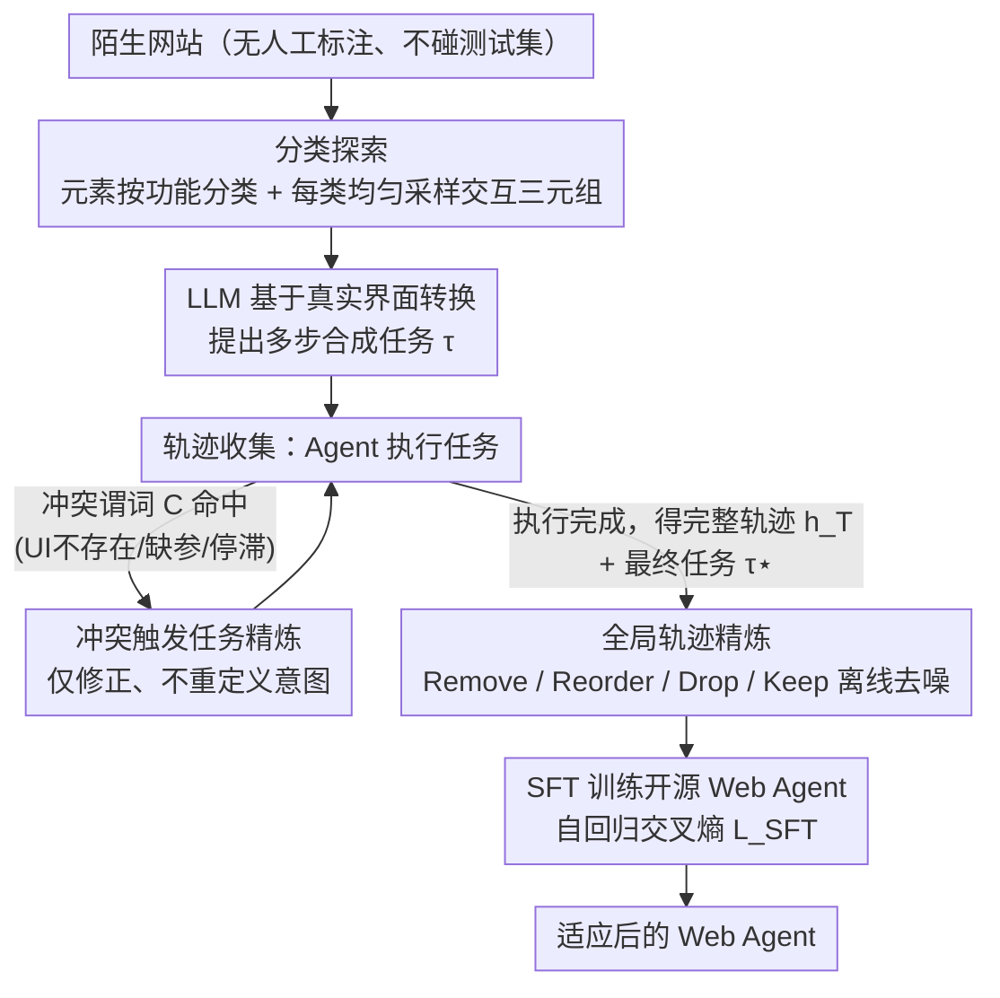

# SynthAgent: Adapting Web Agents with Synthetic Supervision

**会议**: ACL 2026  
**arXiv**: [2511.06101](https://arxiv.org/abs/2511.06101)  
**代码**: [GitHub](https://github.com/aiming-lab/SynthAgent)  
**领域**: LLM Agent / Web Agent 适应  
**关键词**: 合成数据, Web Agent, 双重精炼, 分类探索, 轨迹质量

## 一句话总结

本文提出 SynthAgent，一个完全基于合成监督的 Web Agent 适应框架，通过分类探索系统覆盖网页功能区域以合成多样化任务，再通过任务精炼（冲突检测触发修正幻觉）和轨迹精炼（全局视角去噪）的双重精炼策略提升合成数据质量，在 WebArena 和 Online-Mind2Web 上显著优于现有合成方法。

## 研究背景与动机

**领域现状**：LLM 驱动的 Web Agent 在标准化基准上展现出强大的网页交互能力，但在部署到训练中未见过的新网站时性能急剧下降。适应新环境需要环境特定的任务和演示数据，而人工标注成本高昂且无法规模化。

**现有痛点**：(1) Self-Instruct 直接让 LLM "想象" 任务，缺乏环境基础，任务简单且重复；(2) OS-Genesis 从单步观察反向合成任务，上下文不足导致大量幻觉（引用不存在的元素或状态）；(3) Explorer 在执行中持续精炼任务，但频繁改变任务意图（平均 8.6 次），导致 68.3% 的轨迹超出步数预算。

**核心矛盾**：任务合成需要环境基础（grounding）来避免幻觉，但在执行过程中过度基础化任务会引入轨迹噪声——这是合成监督中一个根本性的设计张力。

**本文目标**：设计一个完全合成的监督框架，在无需人工参与和测试集泄露的前提下，高效适应 Web Agent 到新环境。

**切入角度**：将任务精炼和轨迹精炼解耦为协同互补的两阶段：任务精炼确保可行性但引入噪声，轨迹精炼随后消除噪声。

**核心 idea**：双重精炼（dual refinement）——在执行中仅当检测到显式冲突时才精炼任务（冲突触发式，而非持续式），执行后利用全局上下文精炼轨迹，从而同时保证任务可行性和轨迹质量。

## 方法详解

### 整体框架

SynthAgent 想在没有人工标注、也不碰测试集的前提下，把开源 Web Agent 适应到陌生网站，整条流水线串起四个阶段：先做分类探索任务合成，把网页元素按功能分组、均匀采样交互三元组 $(o_t, a_t, o_{t+1})$，让 LLM 基于真实界面转换提出多步任务；再在轨迹收集中做冲突触发任务精炼，只在任务和观察显式冲突时才改任务；执行完后做全局轨迹精炼，利用完整轨迹和最终任务 $\tau^{\star}$ 离线清掉噪声与不对齐动作；最后在精炼过的合成数据上 SFT 开源模型。整套设计的核心张力是：任务精炼为保可行性会引入噪声，轨迹精炼随后把噪声清掉，二者互补。训练用标准自回归交叉熵：

$$\mathcal{L}_{\text{SFT}} = \mathbb{E}_{(\tau^{\star}, h^{\star}) \sim \mathcal{D}} \left[ -\sum_{t=1}^{T} \log p_\theta(a_t | \tau^{\star}, o_{\leq t}, a_{<t}) \right]$$

### 关键设计

**1. 分类探索：把随机点击变成功能覆盖**

OS-Genesis 那样的随机探索常常反复点冗余元素、却漏掉重要功能区，任务因此既简单又重复。SynthAgent 改成功能感知的覆盖问题：在每个页面 $o_t$ 上先让 LLM 把可交互元素按语义角色分类（如「账户管理」「搜索过滤」），每个类别最多均匀采样 2 个未访问元素去交互，并给每个类别设采样预算上限，防止单个密集区域吃掉整轮探索。这样每页平均能挖出 6.0 个功能类别，合成任务的多样性随之提升。

**2. 冲突触发任务精炼：只在出错时才动任务，别老改意图**

Explorer 每步都持续精炼任务，平均改 8.6 次、导致 68.3% 的轨迹超出步数预算——意图一直漂移。SynthAgent 反其道而行，定义一个轻量冲突谓词 $\mathcal{C}(h_t, \tau_t) = \neg\textsf{ExistsUI} \vee \textsf{MissingArgs} \vee \textsf{Stall}$，分别捕捉「引用的 UI 元素不存在」「参数缺失」「执行停滞」三种情况，只有命中时才调 LLM 精炼任务，且遵循具体化缺失细节、对齐实际观察、降低范围、保持类别四条原则。因为初始任务已经被分类探索充分指定，精炼只需「修正」而非「重定义」，平均仅触发 2.0 次、6.3% 超时，意图保持一致。

**3. 全局轨迹精炼：事后用上帝视角把噪声扫干净**

任务精炼留下的噪声需要一个全局视角来收尾。这一步离线审查完整轨迹 $h_T$ 和最终任务 $\tau^{\star}$，执行四类编辑：Remove(i) 删无关或冗余步骤、Reorder(i,j) 交换可交换步骤、Drop($h_T$) 丢弃过噪轨迹、Keep($h_T$) 保留好轨迹。设计上刻意偏向精确——拿不准的交换宁可拒绝也不冒险破坏因果依赖。结果 Reorder 只占编辑操作的 4.1%，但被重排过的轨迹偏好胜率明显更高（42% vs 27%），说明少量精准重排就能显著提升轨迹质量。

### 损失函数 / 训练策略

标准 SFT 范式，历史上下文窗口取最近 3 步。每个网站合成最多 500 个任务-轨迹对，混合五个网站的数据训练单一模型（学习率 1e-5，batch size 32，3 epochs）。

## 实验关键数据

### 主实验

**WebArena（5 个网站）- Qwen2.5-VL-7B 骨干**

| 方法 | 训练数据 | Shopping | CMS | Reddit | Gitlab | Maps | Overall |
|------|---------|---------|-----|--------|--------|------|---------|
| Base Qwen | - | 13.71 | 8.24 | 9.43 | 6.18 | 5.50 | 8.80 |
| +Self-Instruct | 合成 | 18.18 | 8.77 | 3.85 | 12.50 | 9.38 | 11.50 |
| +OS-Genesis | 合成 | 14.55 | 10.53 | 11.54 | 16.07 | 12.50 | 13.27 |
| +Explorer | 合成 | 10.91 | 3.51 | 0.00 | 1.82 | 3.12 | 4.44 |
| **+SynthAgent** | **合成** | **20.00** | **21.05** | **15.38** | **19.64** | **28.12** | **20.80** |

**Online-Mind2Web（136 个真实网站）**

| 方法 | GPT-4.1 Judge | GPT-5.1 Judge | WebJudge | 平均 |
|------|-------------|-------------|---------|------|
| Self-Instruct | 17.67 | 13.00 | 19.67 | 16.78 |
| OS-Genesis | 19.53 | 11.00 | 19.33 | 16.62 |
| **SynthAgent** | **31.67** | **15.67** | **23.33** | **23.56** |

### 消融实验

| 配置 | Overall | 变化 |
|------|---------|------|
| SynthAgent (完整) | 20.80 | - |
| w/o 分类探索 | 17.26 | -3.54 |
| w/o 任务精炼 | 15.93 | -4.87 |
| w/o 轨迹精炼 | 16.81 | -3.99 |
| w/o 双精炼 | 15.93 | -4.87 |

### 关键发现

- Explorer 性能甚至低于 base 模型——持续精炼产生了过长、不对齐的"负面监督"轨迹
- 合成数据质量：SynthAgent 轨迹质量 82.6 远超 Explorer 的 36.4 和 OS-Genesis 的 52.0
- SynthAgent 轨迹完成率 96.5% vs Explorer 30.5%，API 成本更低（$0.13 vs $0.22/轨迹）
- 在 Qwen3 更强骨干上仍有提升（15.93→24.34），验证方法的模型无关性

## 亮点与洞察

- "任务精炼和轨迹精炼是协同的"这一设计洞察精准——前者确保可行性但引入噪声，后者消除噪声
- 冲突触发式 vs 持续式精炼的对比揭示了关键设计原则：初始任务质量决定精炼策略
- 分类探索将随机探索转化为结构化覆盖问题，简单但有效

## 局限与展望

- 仅在离线和有限在线环境验证，未探索真实活跃网站的合成
- 任务和轨迹合成完全依赖 GPT-4.1，未探索更先进 LLM 或参数优化
- 仅使用标准 SFT，未探索 DPO 或在线 RL 等更高级训练方法

## 相关工作与启发

- **vs OS-Genesis**: OS-Genesis 从单步观察合成任务导致幻觉；SynthAgent 通过分类探索+冲突触发精炼解决
- **vs Explorer**: Explorer 持续精炼导致意图漂移和轨迹过长；SynthAgent 的冲突触发式精炼保持意图一致性
- **vs AgentTrek**: AgentTrek 依赖离线教程可能过时；SynthAgent 直接与环境交互合成

## 评分

- 新颖性: ⭐⭐⭐⭐ 双重精炼的协同设计和冲突触发机制是清晰的创新点
- 实验充分度: ⭐⭐⭐⭐⭐ 两个基准+多骨干+详细消融+数据质量分析+规模实验
- 写作质量: ⭐⭐⭐⭐⭐ 问题动机清晰，设计张力分析深入
- 价值: ⭐⭐⭐⭐ 为 Web Agent 无监督适应提供了实用且高质量的合成数据方案

<!-- RELATED:START -->

## 相关论文

- [\[ICLR 2026\] Towards Scalable Oversight via Partitioned Human Supervision](../../ICLR2026/llm_agent/towards_scalable_oversight_via_partitioned_human_supervision.md)
- [\[ICLR 2026\] Web-CogReasoner: Towards Knowledge-Induced Cognitive Reasoning for Web Agents](../../ICLR2026/llm_agent/web-cogreasoner_towards_knowledge-induced_cognitive_reasoning_for_web_agents.md)
- [\[ACL 2026\] ExpSeek: Self-Triggered Experience Seeking for Web Agents](expseek_self-triggered_experience_seeking_for_web_agents.md)
- [\[ACL 2026\] Don't Click That: Teaching Web Agents to Resist Deceptive Interfaces](dont_click_that_teaching_web_agents_to_resist_deceptive_interfaces.md)
- [\[ACL 2026\] WebClipper: Efficient Evolution of Web Agents with Graph-based Trajectory Pruning](webclipper_efficient_evolution_of_web_agents_with_graph-based_trajectory_pruning.md)

<!-- RELATED:END -->
