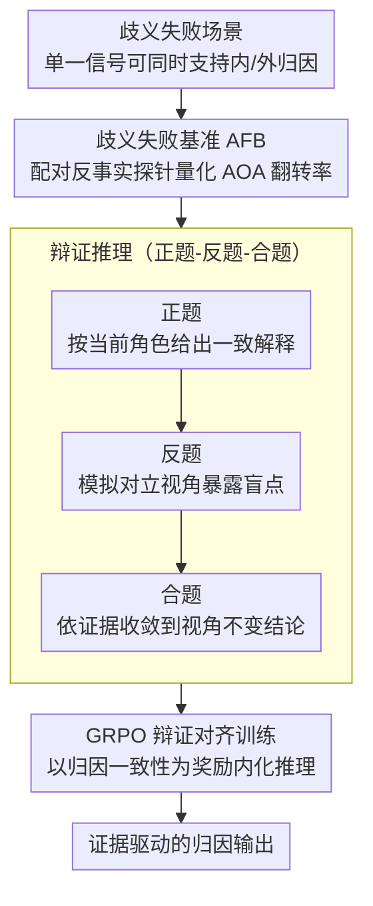

# Taming Actor-Observer Asymmetry in Agents via Dialectical Alignment

**会议**: ACL 2026  
**arXiv**: [2604.19548](https://arxiv.org/abs/2604.19548)  
**代码**: [https://unikcc.github.io/ReTAS/](https://unikcc.github.io/ReTAS/)  
**领域**: LLM推理  
**关键词**: 行动者-观察者不对称, 归因偏差, 辩证对齐, 多Agent协作, 自我反思

## 一句话总结

发现 LLM Agent 在角色扮演中会表现出类人的"行动者-观察者不对称"（AOA）认知偏差——作为行动者倾向归因外部因素，作为观察者倾向归因内部错误，提出 ReTAS 通过辩证推理（正题-反题-合题）和 GRPO 对齐来消除这一偏差。

## 研究背景与动机

**领域现状**：LLM 多 Agent 框架通过角色扮演来分配专业能力（如执行者、审查者），利用自我反思和相互审计提升可靠性。但角色分配不仅是功能规范，也充当了认知先验来塑造推理。

**现有痛点**：当 Agent 作为"行动者"（自我反思时）面对失败，倾向将原因归结于外部因素（如服务器问题）；而作为"观察者"（审计他人时），则倾向归结于内部错误（如代码逻辑错误）。这种矛盾的归因导致 Agent 间无法达成共识，削弱协作可靠性。

**核心矛盾**：角色扮演是多 Agent 系统的基础设计，但角色带来的认知偏差是其副作用。简单地指示 Agent"保持客观"无效（角色惯性导致防御性辩护），强制对立视角则导致过度纠正和无根据的自我指责。

**本文目标**：量化 LLM 中的 AOA 偏差，并设计一种结构化推理方法来消除这种视角依赖性的归因不一致。

**切入角度**：借鉴费希特辩证法（正题→反题→合题）——稳健的归因需要先表达立场、再面对否定、最后综合为统一真理。

**核心 idea**：训练 ReTAS 模型，将反思分解为三个显式阶段：正题（角色一致的解释）、反题（模拟对立视角暴露盲点）、合题（调和冲突观点得出视角不变的结论），并用 GRPO 的归因奖励对齐模型。

## 方法详解

### 整体框架

ReTAS 要解决的是一个隐蔽的认知偏差：同一个失败信号，Agent 站在"行动者"位置会甩锅给环境，站在"观察者"位置又会苛责他人的逻辑。整套方法因此走三步——先用一个故意构造的歧义失败基准把这种偏差量化出来，再把反思过程改写成"正题→反题→合题"的辩证推理轨迹作为监督信号，最后用 GRPO 以"归因一致性"为奖励把这种视角不变的推理内化进模型，输出从"角色驱动的归因"变成"证据驱动的归因"。

### 关键设计

**1. 歧义失败基准（AFB）：把偏差从能力中剥离出来**

要测"偏差"而不是"对错"，关键是让场景本身没有确定答案。AFB 构造了 200 个本质模糊的失败场景，每个场景的单一信号都能同时合理支持矛盾的根因——比如一次超时，既可以归为基础设施延迟（外部），也可以归为配置过于激进（内部）。基准用一组配对反事实探针来测量：对同一场景分别套上行动者和观察者的系统提示，强制模型在"内部/外部"间二选一，再统计两种视角下归因发生翻转的比例。之所以坚持用无确定根因的场景，是因为一旦存在明确对错，归因差异就会被能力差异污染；只有在歧义场景里，任何系统性的视角翻转才能干净地归结为认知偏差。结果显示大多数模型在超过 20% 的场景中出现 AOA 翻转，证实这一偏差在 LLM 中普遍存在。

**2. 辩证推理（正题-反题-合题）：用强制结构压住角色惯性**

简单地命令 Agent"保持客观"几乎无效，因为角色先验会把模型拉回防御性辩护。ReTAS 借费希特辩证法把反思拆成三个显式阶段：正题（Thesis）先按当前角色给出一致的解释，把专业立场表达充分；反题（Antithesis）强制模拟对立视角，专门暴露正题的盲点与反证；合题（Synthesis）再调和两种冲突观点，依据客观证据而非角色先验收敛到一个视角不变的结论。这三阶段被当作 CoT 的固定骨架嵌入推理过程——它的价值不在于多想几个角度，而在于用结构强制保证对立视角一定会被考虑，而不是被角色惯性悄悄跳过。

**3. GRPO 辩证对齐训练：把一致性变成奖励**

仅靠提示很难让模型稳定地执行三阶段辩证推理，于是 ReTAS 用 GRPO 把这套行为内化进参数。奖励信号直接对准偏差本身：对在行动者和观察者两种视角下给出不一致归因的轨迹施加惩罚，对收敛到真实根因的轨迹给予奖励。在这种归因一致性奖励的牵引下，模型逐步学会生成视角不变的辩证推理链，把"先表态、再被否定、最后综合"从临时提示固化为稳定的推理习惯。

### 损失函数 / 训练策略

训练采用 GRPO 优化框架，以归因一致性作为核心奖励信号。评估在 AFB 基准和多种下游任务上展开，覆盖 GPT-5 系列、DeepSeek-V3.2、Qwen3-4B 等模型。

## 实验关键数据

### 主实验

| 模型 | Human-Agent AOA翻转率 | Agent-Agent AOA翻转率 |
|------|---------------------|---------------------|
| GPT-5.1 | 6% | 26% |
| GPT-5 | 23% | 33% |
| DeepSeek-V3.2 | 15% | 39% |
| Qwen3-4B | 33% | - |
| QwQ-32B | 21% | - |

### 消融实验

| 配置 | 归因一致性 | 任务性能 | 说明 |
|------|----------|---------|------|
| 标准角色扮演 | 低 | 基线 | 存在 AOA 偏差 |
| + "保持客观"指令 | 微提升 | 无变化 | 角色惯性抵消 |
| + 辩证提示（无训练） | 中等提升 | 提升 | 结构化但不稳定 |
| ReTAS（辩证对齐） | **显著提升** | **显著提升** | 内化辩证推理 |

### 关键发现

- AOA 偏差在所有测试模型中普遍存在，Agent-Agent 场景（39% 翻转率 for DeepSeek）比 Human-Agent 更严重
- ReTAS 有效降低归因不一致性，同时显著提升歧义场景下的故障解决率
- 辩证推理的三阶段结构比简单的"多角度思考"更有效
- 偏差程度与模型能力成正比——更强的模型通常更一致（GPT-5.1 最低翻转率6%）

## 亮点与洞察

- **将社会心理学的经典理论引入 AI Agent 分析**：AOA 作为人类认知偏差被系统地验证存在于 LLM 中，这一发现对多 Agent 系统的可靠性设计有重要启示
- **辩证法作为去偏工具的应用很有创意**：正题-反题-合题的结构天然适合调和冲突视角，比"保持客观"的指令更有操作性
- **AFB 基准的设计巧妙**：故意构造无确定性根因的歧义场景，使得任何系统性偏差都可归因于认知偏差而非能力差异

## 局限与展望

- AFB 基准规模较小（200场景），可能未覆盖所有偏差模式
- 辩证对齐训练的泛化性——是否能迁移到 AFB 未覆盖的领域
- 合题阶段仍可能被某一视角主导，未完全消除偏差
- 未探索 AOA 偏差在非失败场景（如成功归因）中的表现

## 相关工作与启发

- **vs Reflexion/自我反思方法**: 自我反思在角色框架内进行，受 AOA 偏差影响反而加固错误归因。ReTAS 通过显式的反题阶段打破角色惯性
- **vs 多Agent辩论方法**: 辩论让不同 Agent 各持一方，但没有结构化的综合机制。ReTAS 的合题阶段提供了明确的冲突调和框架

## 评分

- 新颖性: ⭐⭐⭐⭐⭐ AOA 在 LLM 中的发现是原创性贡献，辩证对齐的解决方案有创意
- 实验充分度: ⭐⭐⭐⭐ 多模型+专门基准+消融分析，但基准规模可以更大
- 写作质量: ⭐⭐⭐⭐⭐ 问题定义清晰，社会心理学理论与 AI 方法的结合自然

<!-- RELATED:START -->

## 相关论文

- [\[ICML 2026\] Position: Assistive Agents Need Accessibility Alignment](../../ICML2026/llm_agent/position_assistive_agents_need_accessibility_alignment.md)
- [\[ACL 2025\] Multiple LLM Agents Debate for Equitable Cultural Alignment](../../ACL2025/llm_agent/multiple_llm_agents_debate_for_equitable.md)
- [\[AAAI 2026\] MoralReason: Generalizable Moral Decision Alignment For LLM Agents Using Reasoning-Level Reinforcement Learning](../../AAAI2026/llm_agent/moralreason_generalizable_moral_decision_alignment_for_llm_agents_using_reasonin.md)
- [\[ACL 2026\] ProPer Agents: Proactivity Driven Personalized Agents for Advancing Knowledge Gap Navigation](proper_agents_proactivity_driven_personalized_agents_for_advancing_knowledge_gap.md)
- [\[ACL 2026\] Exploring Reasoning Reward Model for Agents](exploring_reasoning_reward_model_for_agents.md)

<!-- RELATED:END -->
