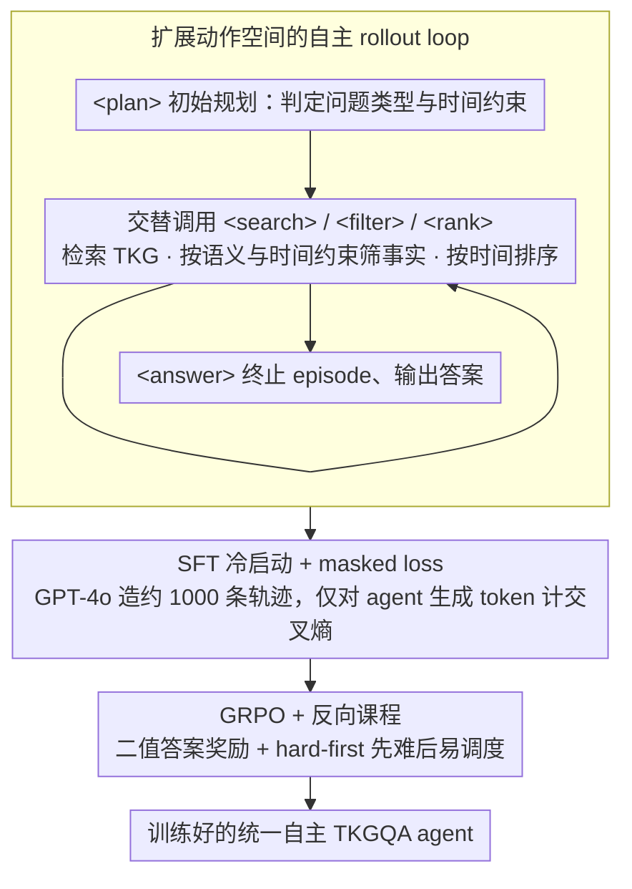

# Temp-R1: A Unified Autonomous Agent for Complex Temporal KGQA via Reverse Curriculum Reinforcement Learning

**会议**: ACL 2026  
**arXiv**: [2601.18296](https://arxiv.org/abs/2601.18296)  
**代码**: https://github.com/zjukg/Temp-R1  
**领域**: LLM Agent / 时序知识图谱问答  
**关键词**: Temporal KGQA、Autonomous Agent、GRPO、Reverse Curriculum、工具调用

## 一句话总结
Temp-R1 把时序知识图谱问答从人工设计的固定 prompt workflow 改造成可强化学习训练的自主 agent，通过显式内部动作、SFT 冷启动、GRPO 和“先难后易”的反向课程，在 8B 开源模型上超过多种 GPT-4o/DeepSeek-V3 驱动的强基线。

## 研究背景与动机
**领域现状**：Temporal Knowledge Graph Question Answering（TKGQA）要求模型在带时间戳的事实四元组上回答问题，既要检索实体关系，又要处理先后顺序、时间区间、多跳依赖和答案粒度。近年的 LLM 方法通常把任务拆成 decomposer、planner、retriever、generator 等固定模块，再用多个精心设计的 prompt 串起来。

**现有痛点**：固定 workflow 的短期效果不错，但成本和灵活性都很差。一方面，它们常依赖 GPT-4o、DeepSeek-V3 等闭源 API，复杂问题多轮调用会让成本上升；另一方面，人工规定的流程会限制模型的探索路径，遇到不同问题类型时难以动态调整推理步骤。

**核心矛盾**：TKGQA 需要开放式、多步、可变长度的时序推理，但现有方法把推理过程锁死在固定 prompt 模板里。普通 ReAct 风格 agent 虽有工具调用能力，却容易把所有内部推理塞进一个 <think>，在复杂时间约束下认知负担过重。

**本文目标**：作者希望训练一个小型开源模型，使它能自主决定何时规划、何时检索、何时过滤时间约束、何时排序事实并输出答案，同时避免 RL 训练早期被简单问题带偏。

**切入角度**：论文把 TKGQA 写成 MDP：状态是原问题和历史交互轨迹，动作既包括外部 <search>，也包括内部 <plan>、<filter>、<rank>，最终用 <answer> 结束。这样，时序推理不再是写死的 prompt 流程，而是可由策略模型学习的动作序列。

**核心 idea**：先用少量高质量轨迹教会模型合法动作格式，再用 GRPO 在可验证答案奖励下训练，并采用 hard-first 反向课程迫使模型先学复杂工具链，再迁移到简单问题。

## 方法详解
Temp-R1 的核心不是提出新的检索器，而是改变 TKGQA 的控制范式。传统方法通常是“先分解，再检索，再生成”的流水线，模型只能在预设槽位里填内容；Temp-R1 则让模型自己选择动作。它可以先规划问题类型和时间约束，再搜索 TKG，随后过滤不满足时间条件的事实，必要时按时间排序，最后给出答案。这个过程既保留工具使用的可解释性，又允许不同问题走不同轨迹。

### 整体框架
论文先定义 temporal KG：事实为 $(s,p,o,t)$ 四元组，其中 $s/o$ 是实体，$p$ 是关系，$t$ 是时间戳。TKGQA 的目标是根据问题 $q$ 和相关时序事实推断实体或时间答案。

在 agent MDP 中，状态 $s_t=(q,h_t)$，其中 $h_t$ 记录截至当前的动作和观察；动作空间分成内部动作和外部动作。内部动作包括 <plan>、<filter>、<rank>，分别负责初始规划、按语义关系/时间约束筛事实、按时间排序事实；外部动作 <search> 调用 TKG 检索器；<answer> 终止 episode。训练流程分三步：先 rollout 形成可执行轨迹，再 SFT 冷启动学习格式和基础策略，最后用 GRPO 和反向课程做 RL 优化。

### 关键设计

**1. 扩展动作空间的自主 rollout loop：把复杂时序推理拆成可观测、可优化的动作序列**

固定 workflow 把所有隐式推理塞进一个 `<think>`，复杂时间约束一多就容易乱，RL 也没办法分别奖励“工具用得对不对”“过滤准不准”。Temp-R1 给模型一套显式动作：每次响应必须从 `<plan>` 起手做初始规划，之后可以交替调用 `<search>` 检索 TKG、`<filter>` 按语义关系和时间约束筛事实、`<rank>` 把候选事实按时间排序，最后用 `<answer>` 终止 episode。这样时序推理的每一步都落到一个可观测的 token 段上，RL 能对工具调用、过滤、排序分别给信号，而不是只对最终答案打一个分。状态 $s_t=(q,h_t)$ 里的 $h_t$ 记录截至当前的全部动作和观察，模型据此决定下一步该继续规划、检索还是收尾。

**2. SFT 冷启动 + masked loss：先教会合法格式，再放进 RL 探索**

如果直接从 base model 上 RL，模型早期会大量输出非法标签、无意义搜索或混乱推理，KL 容易爆、训练容易崩。作者先用 GPT-4o 构造约 1000 条高质量 $(q,\tau_{gold})$ 轨迹，过滤掉结构不合法和答案语义错误的，再做 SFT 冷启动。关键在于 loss 只对 agent 自己生成的 token 计交叉熵，系统 prompt、用户问题和检索回来的观察全部被 mask 掉——模型只学“该怎么写动作”，不会被环境文本带偏。这给后续 RL 提供了一个会用合法工具链的稳定初始策略。

**3. GRPO + 反向课程：用可验证奖励学灵活策略，用 hard-first 防捷径**

奖励用最简单的二值信号：答案完全匹配 gold answer 给 1，否则给 0，这天然适配 KGQA 这种可验证任务，省掉了奖励模型的成本。对每个问题采样一组轨迹，用组内均值和标准差把奖励归一化成 advantage，再优化带 KL 正则的 GRPO 目标。真正关键的是训练调度：普通 easy-first 课程会让模型早早学到 `<search>→<answer>` 的捷径，遇到复杂题时根本不主动组合 `<filter>`/`<rank>`；hard-first 反向课程反其道而行，前期只喂复杂的 multi-hop / multiple-constraint 问题，等准确率过阈值后再加入简单题，逼 agent 先掌握完整工具链、再迁移到简单场景。

### 一个例子：agent 怎么走一条轨迹
面对“X 在担任某职位之后、又在哪一年获得某奖项”这类带先后约束的多跳问题，Temp-R1 不会一步答出来。它先 `<plan>` 判断这是“多约束 + 时间排序”问题，需要先定位职位起始时间、再筛奖项；接着 `<search>` 检索与 X 相关的四元组，`<filter>` 把时间戳早于该职位起始的奖项事实剔除，`<rank>` 把剩下的获奖事实按时间排序取最早一条，最后 `<answer>` 输出年份。换成简单题（如“X 是谁”），它可能 `<plan>` 后直接 `<search>→<answer>` 收尾。这正对应消融里观察到的自适应行为：复杂问题里 `<think>` 平均从 1.36 增到 2.93、`<search>` 从 1.33 增到 1.92。

### 损失函数 / 训练策略
SFT 阶段优化 masked cross-entropy：只在模型应生成的动作和推理 token 上施加损失。RL 阶段使用 GRPO，轨迹比率 $\rho_i(\theta)=\frac{\pi_\theta(\tau_i|q)}{\pi_{old}(\tau_i|q)}$，advantage 为 $\hat A_i=\frac{r_i-mean(\{r_k\})}{std(\{r_k\})+\eta}$，奖励 $r_i$ 是答案完全匹配的二值信号。实现上，作者微调 Llama3.1-8B-Instruct，使用与 Search-R1 类似的 E5 retriever，GRPO 只用 MultiTQ 训练集约 9% 的未标注 QA 对。

## 实验关键数据

### 主实验
MultiTQ 是最核心的主实验。Temp-R1 和 embedding 方法、prompt-based LLM workflow、fine-tuning based LLM 方法比较，指标为 Hits@1。

| 方法类型 | 方法 | Overall | Multiple | Single | Entity | Time |
|----------|------|---------|----------|--------|--------|------|
| TKG embedding | EmbedKGQA | 0.206 | 0.134 | 0.235 | 0.290 | 0.001 |
| TKG embedding | MultiQA | 0.293 | 0.159 | 0.347 | 0.349 | 0.157 |
| Prompt-based LLM | TempAgent | 0.702 | 0.316 | 0.857 | 0.624 | 0.870 |
| Prompt-based LLM | RTQA | 0.765 | 0.424 | 0.902 | 0.692 | 0.942 |
| FineTune-based LLM | TimeR4 | 0.728 | 0.335 | 0.887 | 0.639 | 0.945 |
| FineTune-based LLM | PoK | 0.779 | 0.409 | 0.929 | 0.696 | 0.962 |
| Temp-R1 | Temp-R1 | 0.780 | 0.550 | 0.888 | 0.714 | 0.969 |

整体分数上，Temp-R1 以 0.780 略高于 PoK 的 0.779；更重要的是，它在复杂 multiple question 上达到 0.550，显著高于 PoK 的 0.409、RTQA 的 0.424 和 MemoTime 的 0.459。论文摘要中强调的 19.8% 提升主要来自复杂问题类别，说明自主动作序列确实缓解了固定 workflow 在复杂约束下的僵硬性。

| 数据集 | 方法 | Overall | Simple | Medium | Complex | 说明 |
|--------|------|---------|--------|--------|---------|------|
| TimelineKGQA-Cron | RAG Baseline | 0.235 | 0.704 | 0.092 | 0.009 | 简单题可检索命中，复杂题几乎失败 |
| TimelineKGQA-Cron | GPT-4o | 0.206 | 0.069 | 0.130 | 0.376 | 闭源模型裸用不适合结构化 TKGQA |
| TimelineKGQA-Cron | PoK | 0.651 | 0.737 | 0.539 | 0.683 | 强微调基线 |
| TimelineKGQA-Cron | Temp-R1 | 0.705 | 0.960 | 0.486 | 0.672 | Overall 最好，simple 大幅领先 |
| TimelineKGQA-ICEWS Actor | GPT-4o | 0.113 | 0.051 | 0.035 | 0.353 | OOD 专门领域中表现很差 |
| TimelineKGQA-ICEWS Actor | PoK | 0.602 | 0.744 | 0.456 | 0.578 | 强 OOD 基线 |
| TimelineKGQA-ICEWS Actor | Temp-R1 | 0.642 | 0.866 | 0.388 | 0.595 | OOD overall 仍领先 |

TimelineKGQA 的结果说明 Temp-R1 不只是在 MultiTQ 上过拟合。尤其在 ICEWS Actor 这个 out-of-domain 设置里，它的 overall 0.642 高于 PoK 的 0.602，而 GPT-4o 只有 0.113，显示小型开源 agent 经任务式 RL 后可以比通用闭源模型更稳。

### 消融实验
作者在 MultiTQ 上逐个去掉内部动作、反向课程和 SFT 冷启动，结果如下。

| 配置 | Overall | Multiple | Single | Entity | Time | 主要结论 |
|------|---------|----------|--------|--------|------|----------|
| Temp-R1 | 0.780 | 0.550 | 0.888 | 0.714 | 0.969 | 完整模型 |
| w/o internal actions | 0.620 | 0.388 | 0.729 | 0.563 | 0.783 | 缺少 <plan>/<filter>/<rank> 后，复杂约束推理负担回到隐式 <think> |
| w/o Reverse CL | 0.556 | 0.143 | 0.750 | 0.447 | 0.868 | 掉点最大，multiple 几乎崩掉 |
| w/o SFT | 0.582 | 0.325 | 0.703 | 0.536 | 0.713 | 直接 RL 难以学稳定格式和工具链 |

### 关键发现
- 反向课程是最关键的训练策略。去掉它后 overall 从 0.780 降到 0.556，Multiple 从 0.550 降到 0.143，说明 easy-first 或混合训练会让模型陷入简单检索捷径。
- 内部动作不是格式装饰，而是能力载体。去掉 <filter>/<rank> 后，模型仍可 search，但时序约束处理明显变差。
- 模型规模仍然重要。Qwen 7B 训练峰值 accuracy 约 0.790，而 1.5B 只有 0.532；但 Llama 与 Qwen 架构都能稳定受益，说明框架不依赖单一 backbone。
- 轨迹复杂度会随问题难度自适应增加。复杂问题中 <think> 平均从 1.36 增到 2.93，<search> 从 1.33 增到 1.92，符合“难题调用更多动作”的 agent 行为预期。

## 亮点与洞察
- 这篇论文最有价值的地方是把 TKGQA 的 prompt pipeline 改成 policy learning 问题。它没有把每个模块写死，而是让模型学习什么时候用哪种内部动作。
- Hard-first 反向课程很适合工具型 agent。许多 agent 任务都有“简单样本可用捷径解决、复杂样本必须组合工具”的结构，先训难题能减少 shortcut learning。
- 二值答案奖励虽然简单，却非常适合 KGQA 这类可验证任务。它避免了奖励模型成本，也让 GRPO 可以直接优化最终 answer correctness。

## 局限与展望
- 实验最大只到 8B，没有验证 14B 或更大模型。更大模型可能在复杂时序推理上进一步提升，但训练成本和工具调用长度也会增加。
- 反向课程是否适用于非 TKGQA 任务还没有证明。对于没有清晰 easy/hard 划分或 hard 样本噪声较高的任务，hard-first 可能导致训练早期不稳定。
- 奖励只看最终答案，可能无法区分“过程正确但答案格式错”和“过程错误但碰巧命中”。未来可以加入轨迹级 reward，例如工具调用有效性、过滤事实正确性、时间排序一致性。
- 当前检索器和数据集都是固定的，真实开放环境下 TKG 不完整、事实冲突和时间粒度不一致会更复杂。

## 相关工作与启发
- **vs TempAgent / MemoTime / RTQA**: 这些方法依赖人工设计的分解和生成流程，Temp-R1 则通过动作空间和 RL 学习动态轨迹，复杂问题上更灵活。
- **vs Search-R1**: Search-R1 证明了 RL + search 对问答有效，Temp-R1 把这一范式扩展到 TKGQA，并额外加入 <filter>/<rank> 等时序专用动作。
- **vs PoK / TimeR4**: PoK 和 TimeR4 属于微调式 TKGQA 强基线，Temp-R1 不只微调答案生成，而是训练完整 agent policy，因此在 OOD TimelineKGQA 上更稳。
- **启发**: 对可验证结构化推理任务，可以把“任务专用中间操作”显式做成 action tokens，再用小规模 SFT 冷启动和 RL 学会调用，而不是把所有逻辑塞进自然语言 chain-of-thought。

## 评分
- 新颖性: ⭐⭐⭐⭐ 将 GRPO、自主工具调用和反向课程系统地结合到 TKGQA，任务适配性很强。
- 实验充分度: ⭐⭐⭐⭐ 有主结果、OOD、消融、backbone/scale 和轨迹分析；但更大模型和真实噪声 KG 还缺验证。
- 写作质量: ⭐⭐⭐⭐ 整体结构清楚，表格丰富；部分训练细节放在附录，复现时需要来回查。
- 价值: ⭐⭐⭐⭐ 对时序 KGQA 和可验证 agent 训练都有参考价值，尤其是 hard-first curriculum 的经验很值得迁移。

<!-- RELATED:START -->

## 相关论文

- [\[ACL 2026\] Hierarchical Reinforcement Learning with Augmented Step-Level Transitions for LLM Agents](hierarchical_reinforcement_learning_with_augmented_step-level_transitions_for_ll.md)
- [\[ACL 2026\] Robust Tool Use via Fission-GRPO: Learning to Recover from Execution Errors](robust_tool_use_via_fission-grpo_learning_to_recover_from_execution_errors.md)
- [\[ACL 2026\] SOLAR-RL: Semi-Online Long-horizon Assignment Reinforcement Learning](solar-rl_semi-online_long-horizon_assignment_reinforcement_learning.md)
- [\[AAAI 2026\] MoralReason: Generalizable Moral Decision Alignment For LLM Agents Using Reasoning-Level Reinforcement Learning](../../AAAI2026/llm_agent/moralreason_generalizable_moral_decision_alignment_for_llm_agents_using_reasonin.md)
- [\[ICML 2025\] Aguvis: Unified Pure Vision Agents for Autonomous GUI Interaction](../../ICML2025/llm_agent/aguvis_unified_pure_vision_agents_for_autonomous_gui_interaction.md)

<!-- RELATED:END -->
