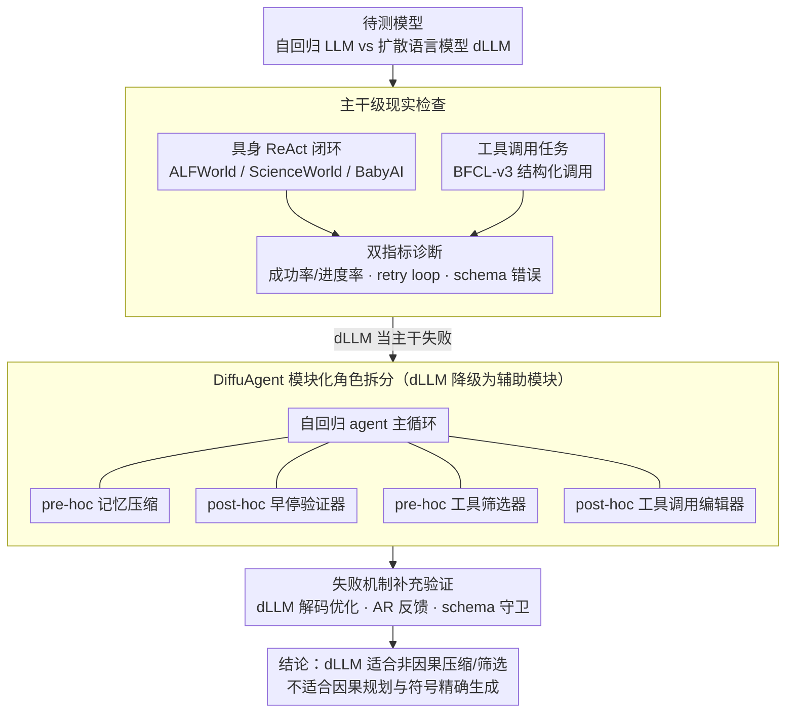

# The Bitter Lesson of Diffusion Language Models for Agentic Workflows: A Comprehensive Reality Check

**会议**: ACL2026  
**arXiv**: [2601.12979](https://arxiv.org/abs/2601.12979)  
**代码**: 无  
**领域**: Agent / 扩散语言模型  
**关键词**: 扩散语言模型、智能体、工具调用、长程规划、DiffuAgent  

## 一句话总结
这篇论文系统评估扩散语言模型在具身智能体和工具调用智能体中的表现，发现它们虽然有并行解码带来的速度潜力，却在长程因果规划和严格格式生成上显著落后于自回归 LLM，并进一步用 DiffuAgent 证明 dLLM 更适合作为记忆压缩、工具筛选等非因果辅助模块。

## 研究背景与动机
**领域现状**：LLM agent 已经在 ReAct 式具身任务、工具调用、交互式决策中成为主流范式。典型系统把语言模型放在循环中心，每一步读取历史轨迹、环境反馈或工具描述，再生成下一步思考和动作。这个流程能力强，但天然受自回归解码限制，多轮任务越长，延迟和推理成本越明显。

**现有痛点**：扩散语言模型通过并行去噪一次更新多个 token，看起来能打破逐 token 生成瓶颈。问题是，agent 场景并不只要求“快写文本”，还要求模型能根据最新反馈改变计划、在多步交互中保持状态一致、并在调用工具时输出完全合法的 JSON 或函数调用格式。现有 dLLM 在通用语言 benchmark 上表现接近同规模 LLM，但它们是否能承担 agent backbone 还缺少系统验证。

**核心矛盾**：dLLM 的优势来自非自回归并行生成，而 agent 的关键能力往往来自因果、逐步、可纠错的决策过程。具身任务要求模型把新观察强约束到下一步动作；工具调用要求每个括号、字段名和参数值都精确落位。并行去噪中的双向注意和模糊中间状态，可能正好削弱这两类能力。

**本文目标**：作者要回答三个问题：第一，当前 dLLM 能否直接作为具身和工具调用 agent 的主干；第二，它们的失败是偶然波动还是系统性模式；第三，如果不能当主干，dLLM 是否还能在 agent 工作流中承担某些辅助认知角色。

**切入角度**：论文没有只看单轮问答，而是选择 AgentBoard 的 ALFWorld、ScienceWorld、BabyAI 以及 BFCL-v3 工具调用任务，把模型放进真实多轮闭环里观察行为。这个角度很关键，因为 dLLM 的短文本生成能力并不能暴露“反复撞墙”和“格式错一位就执行失败”这类 agent 级缺陷。

**核心 idea**：用统一实验把 dLLM 放在 agent 主干和辅助模块两种位置上，证明“扩散式并行生成适合非因果压缩和筛选，不适合当前 agent 所需的因果规划与符号精确生成”。

## 方法详解
论文的方法不是提出一个单一训练算法，而是构造一套现实检查和模块化诊断框架。作者先把 dLLM 当作完整 agent backbone，直接替换 Qwen-8B、Ministral-8B 这类自回归 LLM，观察它们在具身任务和工具调用任务中的成败。随后，作者提出 DiffuAgent，把 dLLM 拆到记忆、验证、工具选择、格式编辑等模块中，分析它们到底在哪类认知角色上可用。

### 整体框架
整体流程可以分为两层。

第一层是 backbone reality check。具身任务采用 ReAct 流程，模型在第 $t$ 步根据历史动作与观察 $e_{1:t-1}$、任务描述 $u_{task}$ 生成中间思考 $q_t$ 和动作 $a_t$。工具调用任务则给定用户请求和工具库，模型需要输出一组结构化调用 $\mathcal{C}=\{(\tau_i,\alpha_i)\}$，再由工具执行器返回结果。作者在这两类流程中分别比较 Qwen-8B、Ministral-8B 与 LLaDA-8B、Dream-7B、FdLLM-7B、DVar-8B。

第二层是 DiffuAgent 模块化评估。作者不再让 dLLM 控制整个循环，而是把它们作为可插拔认知模块嵌进自回归 agent 外围。具身侧包含 pre-hoc memory 和 post-hoc early-exit verifier；工具调用侧包含 pre-hoc tool selector 和 post-hoc tool-call editor。这样能区分“模型当主干失败”与“模型某个局部能力不可用”两件事。

### 关键设计

**1. 主干级现实检查：直接测 dLLM 当完整 agent 控制器时的长程规划与工具调用能力**

只看平均准确率分不清 dLLM 到底是“能力弱一点”还是“交互机制整个失效”，所以作者把它们直接塞进 ReAct 闭环当 backbone，再用两套互补指标暴露病因。具身侧用 AgentBoard 的 ALFWorld/ScienceWorld/BabyAI，成功率衡量任务是否完成、progress rate 衡量离目标推进了多少；工具侧用 BFCL-v3，官方评测逐项检查函数名、参数、结构和多轮状态。作者还专门统计 retry loop——连续三步以上重复同一动作——用来抓 dLLM 收到新观察却照旧执行的行为。把具身和工具调用并排测，正好分别照出“非因果规划失败”和“模糊格式生成失败”这两类毛病。

**2. DiffuAgent 的模块化角色拆分：把 dLLM 从全流程决策者降级成辅助模块**

既然当主干不行，那是不是某类局部能力还有用？作者不再让 dLLM 控制整个循环，而是把它当可插拔认知模块嵌进自回归 agent 外围。具身侧放两个：pre-hoc memory 每 $k_{mem}=5$ 步压缩一次过去轨迹，之后 agent 只读压缩记忆加最近交互；post-hoc early-exit verifier 每 $k_{earlyexit}=5$ 步判断轨迹是否陷入死循环。工具侧也放两个：pre-hoc tool selector 从完整工具库筛出与当前请求相关的子集，post-hoc tool-call editor 试着把格式损坏的调用修成合法结构。这样能把“当主干失败”和“某个局部能力可用”彻底分开，看 dLLM 的并行全局建模究竟在哪类不需要逐 token 承诺的任务上有价值。

**3. 失败机制的补充验证：排除“只是解码没调好”或“加个修复器就行”的解释**

dLLM 是高速迭代的方向，主结论若只基于原始解码，很容易被指为不公平。作者在附录里把能想到的补救都试了一遍：APD、D2F、DCD 等 dLLM 解码优化，AR self-refine 和周期性 AR feedback，以及 Tau-Bench mock 与轻量 schema guardrails。所有实验都围着同一个问题转——这些手段能不能把 dLLM 拉到自回归 agent 的水平。结果是它们能缓解局部指标（比如 D2F 把 Dream-7B 的 BFCL Single-Live 从 1.5 提到 34.3），却没动摇“长程因果和符号精度仍是瓶颈”这个主判断。

### 损失函数 / 训练策略
本文没有训练新的 dLLM，也没有提出新的监督损失。实验重点是 inference-only evaluation：自回归模型通过 vLLM 部署，dLLM 使用 Fast-dLLM/FastAPI 复现，统一在单张 NVIDIA A800 80GB 上运行。具身任务采用 ReAct prompt；BFCL 按官方模板构造 OpenAI API 风格输入。这个设置有意避免任务特定微调，让比较集中在当前开源 dLLM 的原生 agent 行为上。

## 实验关键数据

### 主实验
具身任务结果非常尖锐：自回归 Qwen-8B 平均成功率 45.0%，而最好的 dLLM LLaDA-8B 只有 7.5%；DVar-8B 平均成功率仅 2.0%。progress rate 也呈同样趋势，说明 dLLM 不只是差在最后一步，而是连中间子目标推进都困难。

| 模型 | ALFWorld 成功率 | ScienceWorld 成功率 | BabyAI 成功率 | 平均成功率 | 平均进度率 |
|------|----------------|---------------------|---------------|------------|------------|
| Qwen-8B | 76.1 | 26.7 | 32.1 | 45.0 | 62.1 |
| Ministral-8B | 45.5 | 13.3 | 36.6 | 31.8 | 54.9 |
| LLaDA-8B | 5.2 | 1.1 | 16.1 | 7.5 | 16.4 |
| Dream-7B | 0.7 | 0.6 | 8.9 | 3.4 | 8.7 |
| FdLLM-7B | 3.3 | 0.7 | 5.4 | 3.1 | 8.9 |
| DVar-8B | 0.7 | 0.0 | 5.4 | 2.0 | 8.9 |

工具调用实验同样显示 dLLM 与 AR LLM 的巨大差距。Qwen-8B 在 BFCL 总体成功率达到 57.8%，DVar-8B 作为最强 dLLM 只有 28.0%，LLaDA-8B 为 19.4%。更关键的是，多轮工具调用中所有 dLLM 的成功率都是 0.0，这直接说明它们难以在交互式工具协议里保持状态和格式稳定。

| 模型 | Non-Live | Single-Turn Live Avg. | Multi-Turn Avg. | Hallucination Rel. | Hallucination Irrel. | Overall |
|------|----------|-----------------------|-----------------|--------------------|----------------------|---------|
| Qwen-8B | 87.5 | 78.0 | 12.5 | 94.4 | 68.0 | 57.8 |
| Ministral-8B | 49.8 | 60.0 | 4.0 | 66.7 | 58.0 | 39.5 |
| LLaDA-8B | 23.0 | 11.6 | 0.0 | 66.7 | 56.0 | 19.4 |
| Dream-7B | 4.2 | 1.5 | 0.0 | 27.8 | 77.0 | 13.6 |
| FdLLM-7B | 1.2 | 0.0 | 0.0 | 5.6 | 99.0 | 15.0 |
| DVar-8B | 35.0 | 34.1 | 0.0 | 44.4 | 63.0 | 28.0 |

### 消融实验
DiffuAgent 的结果更有层次。作为完整主干，dLLM 很弱；但作为 memory module，它们能显著帮助 Qwen-8B 和 Ministral-8B。以 Qwen-8B agent 为例，无记忆平均成功率 28.4%，加入 Qwen-8B 记忆后为 34.9%，加入 LLaDA-8B 记忆后反而达到 40.5%。这说明 dLLM 的全局压缩能力在“总结历史”这种非因果角色上是有用的。

| Agent | Memory 模块 | 平均成功率 | 平均进度率 | 说明 |
|-------|-------------|------------|------------|------|
| Qwen-8B | w/o | 28.4 | 50.6 | 只保留最近交互 |
| Qwen-8B | Qwen-8B | 34.9 | 54.8 | AR 记忆带来稳定收益 |
| Qwen-8B | LLaDA-8B | 40.5 | 59.6 | dLLM 记忆在该设置下最强 |
| Qwen-8B | Dream-7B | 38.9 | 57.3 | 接近 LLaDA，优于 AR 记忆 |
| Qwen-8B | FdLLM-7B | 35.6 | 54.8 | 有收益但较弱 |
| Qwen-8B | DVar-8B | 37.3 | 56.8 | 稳定优于无记忆 |

工具调用模块消融则显示 selector 比 editor 更适合 dLLM。以 Qwen-8B agent 为主干时，DVar-8B selector 的平均成功率为 11.5%，仍能保留部分有效工具筛选；但 DVar-8B editor 平均为 0.0，FdLLM-7B editor 也只有 2.0。也就是说，dLLM 可以缩小工具候选空间，却不适合修复严格 schema。

| 主 agent | Selector | Editor | BFCL Multi-Turn Avg. | 解读 |
|----------|----------|--------|----------------------|------|
| Qwen-8B | Qwen-8B | - | 18.5 | AR selector 基线最强 |
| Qwen-8B | LLaDA-8B | - | 12.5 | dLLM 可做相关工具筛选 |
| Qwen-8B | Dream-7B | - | 13.0 | selector 表现接近 LLaDA |
| Qwen-8B | - | LLaDA-8B | 16.0 | LLaDA 作为 editor 尚可 |
| Qwen-8B | - | FdLLM-7B | 2.0 | 格式编辑几乎失效 |
| Qwen-8B | DVar-8B | DVar-8B | 0.0 | selector+editor 叠加后完全失败 |

附录验证进一步强化主结论。DCD 能把 FdLLM-7B 在 ALFWorld 的成功率从 3.3 提到 10.4，D2F 能把 Dream-7B 的 BFCL Single-Live 从 1.5 提到 34.3，但它们仍明显落后于强 AR LLM。schema guardrails 的组合版本只让 21% 输出语法可解析、14% 语义正确，86% 仍失败，说明问题不只是表面括号修复。

| 补救设置 | 原始结果 | 改进后结果 | 仍未解决的问题 |
|----------|----------|------------|----------------|
| Dream-7B + D2F | ALFWorld SR 0.7 / BFCL 1.5 | ALFWorld SR 2.9 / BFCL 34.3 | 工具单轮改善明显，具身成功率仍很低 |
| FdLLM-7B + DCD | ALFWorld SR 3.3 / BFCL 0.0 | ALFWorld SR 10.4 / BFCL 30.7 | 有收益但离 Qwen-8B 很远 |
| DVar-8B + AR feedback | ALFWorld SR 0.7 | 最高 SR 2.2 | AR 辅助不能补齐主干能力 |
| Schema G1+G2+G3 | 无修复 | Parse 21 / Semantic 14 / Fail 86 | 大量错误是深层结构和语义错误 |

### 关键发现
- dLLM 的效率优势没有转化为 agent 成功率。FdLLM-7B、DVar-8B 能达到较高吞吐，但具身平均成功率低于 3.1%，工具多轮成功率为 0.0。
- 具身失败主要表现为 retry loop。模型收到新观察后仍重复旧动作，说明并行去噪生成没有稳定地把环境反馈转化为下一步计划。
- 工具调用失败主要表现为 schema 和参数错误。dLLM 经常知道要调用什么工具，却生成破碎括号、错误键值或不完整参数，导致执行器无法解析。
- dLLM 的可用角色偏向非因果模块。记忆压缩、工具筛选、保守早停验证表现较好；需要严格逐步承诺的主干决策和格式编辑表现较差。

## 亮点与洞察
- 论文最有价值的地方是把“扩散语言模型更快”这个叙事放回 agent 闭环中验证。速度只有在动作有效、格式可执行时才有意义；如果每一步都重复或报错，高吞吐反而会更快地产生无效轨迹。
- DiffuAgent 的模块化设计很巧妙。它没有简单否定 dLLM，而是把 agent 能力拆成不同认知角色，最后得到更细的结论：dLLM 不是不能用于 agent，而是不该直接承担当前范式下的因果控制核心。
- “非因果”和“模糊”两个失败概念解释力较强。前者对应具身任务中的无法分支，后者对应工具调用中的 schema 崩坏；这比泛泛地说模型能力弱更有诊断价值。
- 这篇论文对后续 diffusion-native agent 有明确启发：未来不应只追求 parallel decoding，而要在去噪过程中显式加入因果状态、可执行语法约束和逐步验证机制。

## 局限与展望
- 覆盖的 dLLM 和 benchmark 仍有限。AgentBoard 只选了具身子任务，BFCL 虽覆盖工具调用核心场景，但没有系统覆盖网页代理、代码修复、长上下文软件工程等更复杂 agent 工作流。
- 实验主要是 inference-only。这个设置适合公平比较原生能力，但不能回答经过 agent 轨迹训练、RL 或 diffusion-native workflow 共同设计后，dLLM 是否会出现质变。
- DiffuAgent 默认主流程仍由自回归 LLM 控制，因此更像“把 dLLM 放进现有 AR agent 外围”。如果未来 agent 框架本身为扩散生成重新设计，本文结论可能需要重新检验。
- 论文的理论解释偏机制直觉，尚未给出严格可验证的因果模型。比如双向注意如何具体导致 retry loop、哪些 token 位置最容易破坏 tool schema，仍可通过更细粒度日志分析继续研究。
- 一个自然改进方向是把语法约束和环境反馈注入扩散去噪过程。例如在每轮去噪中维护可执行 AST 状态，或让环境观察以强约束方式重新加权下一步动作候选。

## 相关工作与启发
- **vs LLaDA / Dream 等扩散语言模型**: 这些工作强调非自回归或离散扩散生成的通用性能和推理效率，本文则把它们放进多轮 agent 闭环中，指出通用 benchmark 的竞争力不能直接推出 agent 可用性。
- **vs ReAct / AgentBoard**: ReAct 和 AgentBoard 提供了具身推理评测框架，本文继承这种思考-行动循环，但研究对象从 AR LLM 扩展到 dLLM，额外分析重复行动和错误传播。
- **vs BFCL 工具调用评测**: BFCL 主要测函数调用成功率，本文进一步把 dLLM 的失败归因到 diffusion noise 下的符号精度不足，并用 schema guardrails 证明错误不只是浅层格式问题。
- **vs agent memory / verifier 工作**: 既有工作把记忆和验证看作增强 LLM agent 的模块，本文提供了一个新启发：这些模块可能正是 dLLM 比较合适的落点，因为它们更偏全局压缩和轨迹判断，而非逐步动作生成。

## 评分
- 新颖性: ⭐⭐⭐⭐☆ 选题很及时，把 dLLM 从通用生成拉到 agent 闭环中做系统现实检查，问题定义有新意。
- 实验充分度: ⭐⭐⭐⭐☆ 主实验、模块消融和附录补救验证都比较完整，但 benchmark 覆盖仍集中在 AgentBoard 与 BFCL。
- 写作质量: ⭐⭐⭐⭐☆ 论证线清楚，“bitter lesson”主线鲜明，个别理论解释还可以更形式化。
- 价值: ⭐⭐⭐⭐⭐ 对 diffusion LLM 和 agent 两个社区都有提醒意义，特别是明确指出 dLLM 更适合作为辅助认知模块而不是直接替代 AR backbone。

<!-- RELATED:START -->

## 相关论文

- [\[CVPR 2026\] Towards GUI Agents: Vision-Language Diffusion Models for GUI Grounding](../../CVPR2026/llm_agent/towards_gui_agents_vision-language_diffusion_models_for_gui_grounding.md)
- [\[ACL 2026\] Don't Adapt Small Language Models for Tools; Adapt Tool Schemas to the Models](don39t_adapt_small_language_models_for_tools_adapt_tool_schemas_to_the_models.md)
- [\[ACL 2026\] Dynamic Generation of Multi-LLM Agents Communication Topologies with Graph Diffusion Models](dynamic_generation_of_multi-llm_agents_communication_topologies_with_graph_diffu.md)
- [\[ACL 2026\] Feedback-Driven Tool-Use Improvements in Large Language Models via Automated Build Environments](feedback-driven_tool-use_improvements_in_large_language_models_via_automated_bui.md)
- [\[ACL 2026\] Polaris: A Gödel Agent Framework for Small Language Models through Experience-Abstracted Policy Repair](polaris_a_gödel_agent_framework_for_small_language_models_through_experience-abs.md)

<!-- RELATED:END -->
