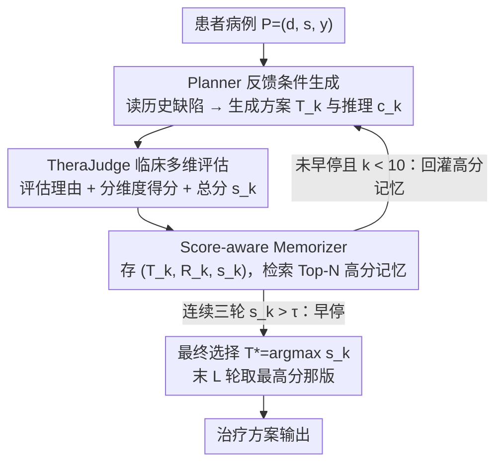

# TheraAgent: Self-Improving Therapeutic Agent for Precise and Comprehensive Treatment Planning

**会议**: ACL 2026  
**arXiv**: [2605.05963](https://arxiv.org/abs/2605.05963)  
**代码**: 无  
**领域**: LLM Agent / 医疗 AI / 治疗方案生成  
**关键词**: 自改进 agent、治疗计划、TheraJudge、临床安全、推理时迭代  

## 一句话总结
TheraAgent 把治疗方案生成从一次性回答改造成 generate-reflect-refine 的自改进 agent 流程，用临床维度化评估器 TheraJudge 和 score-aware memory 不断修正方案，在 HealthBench 治疗规划子集和医生盲评中显著超过强基线。

## 研究背景与动机
**领域现状**：LLM 已经能完成医学问答、诊断辅助和临床文本生成，但治疗计划生成比单步问答更复杂。它需要同时选择药物、剂量、适应证、禁忌证、监测指标、随访方案和风险控制。

**现有痛点**：通用 LLM 或医学微调模型往往采用 one-shot generation。一次性输出容易粗糙、不完整，甚至出现安全风险，例如遗漏剂量、忽略禁忌证、没有说明何时停药或何时升级治疗。

**核心矛盾**：真实医生制定治疗计划通常会反复核对诊断、指南、患者条件和潜在伤害，而多数 LLM 只是给出一个看似流畅的文本答案。治疗计划质量不是单一 accuracy，而是多个临床维度的组合优化。

**本文目标**：作者希望构建一个可在推理时自我改进的 therapeutic agent，让模型先生成初稿，再由临床评估器指出问题，最后带着反馈继续改写，逐步得到更精确、更完整、更安全的治疗方案。

**切入角度**：论文把治疗计划质量形式化为 $Q(T\mid P)=\sum_i q_i(T\mid P)$，其中每个 $q_i$ 对应 Accuracy、Targeting、Completeness、Harm Control 等维度。这为后续的多维反馈和记忆检索提供了目标函数。

**核心 idea**：用一个临床对齐的 internal critic 作为推理环路中的反馈源，把“写治疗方案”变成“生成、评价、记忆、再生成”的 test-time optimization。

## 方法详解
TheraAgent 的核心不是训练一个新医学模型，而是设计一个 agentic workflow。底座模型可以是 DeepSeek-R1 等强推理模型；外层系统负责组织 Planner、TheraJudge 和 Memorizer，让模型在多轮推理中吸收之前方案的错误和得分。

### 整体框架
输入患者病例 $P=(d,s,y)$，其中 $d$ 是基本临床信息，$s$ 是症状和检查结果，$y$ 是已确认诊断。目标是生成治疗方案 $T$ 和显式推理过程 $c$。与封闭式分类不同，治疗方案处在开放组合空间里，因此必须同时满足准确性、完整性、个体化、共识一致性和伤害控制。

在第 $k$ 次迭代中，Planner 根据病例 $P$ 和上一轮记忆 $\mathcal{M}^{(k-1)}$ 生成候选方案 $T_k$ 与推理 $c_k$。随后 TheraJudge 评估该方案，输出评估理由 $R_k$、各临床维度得分 $\{q_{k,i}\}$ 和总分 $s_k$。Memorizer 把 $(T_k,R_k,s_k)$ 存起来，并在下一轮检索高质量历史方案与反思，作为 Planner 的上下文。

最终输出不是简单使用最后一轮答案，而是在最后 $L$ 轮中选择得分最高的 $T^*=\arg\max s_k$。系统还设置早停：如果连续三轮分数都超过阈值 $\tau$，则提前停止，减少不必要开销。论文默认最大 10 轮、输出窗口 $L=3$、Top-N memory 为 3。

### 关键设计

**1. Planner 的反馈条件生成：让下一版方案对着具体缺陷改，而不是泛泛“写得更好”**

治疗计划最常见的毛病是遗漏项和安全边界不清——忘了写剂量、漏了禁忌证、没说何时停药或升级。Planner 因此不只看当前病例，还读取 Memorizer 里上一轮或高分历史方案的治疗文本、评估理由和分数，形式化为 $(T_k,c_k)=f_{\theta}(P,\mathcal{M}^{(k-1)})$。把上一轮 TheraJudge 点出的具体问题显式放回 prompt，下一轮生成就能集中修补那几个缺口，而不是又写一篇同样粗糙的方案。

**2. TheraJudge 的临床多维评估：给出可驱动迭代的结构化反馈，而非只看文本流畅度**

普通 LLM judge 容易被流畅文字和表面医学词汇糊弄，但治疗计划要的是能指出具体风险、可追责的 clinical critic。TheraJudge 每轮输出 rationale、分维度得分和总分，按 Scientific Consensus Compliance、Plan Completeness、Situation Targeting、Rationale-Measure Coherence、Harm Control 等维度打分；它可以用 RAG 检索 600 多份临床指南/文献补强证据，也可以用每个科室 3 个 few-shot 专家样例稳定评分行为。正因为评估维度贴近真实医生的判断框架，产出的反馈才能真正告诉下一轮“哪里不安全、哪里不完整”。

**3. Score-aware Memorizer 与最终选择：留住有用经验，挡住后期漂移**

自改进 agent 常见的坑是“把所有历史都当经验”，低分方案的错误反复进上下文会造成错误强化、后期漂移。Memorizer 把每轮存成 $M_i=(T_i,R_i,s_i)$，下一轮只检索得分最高的 Top-N 条做 in-context refinement；最终输出也不机械取最后一轮，而是在最后 $L$ 轮里按 TheraJudge 分数挑最高的 $T^*=\arg\max s_k$。再配一个早停：连续三轮分数都超过阈值 $\tau$ 就提前停，省掉无谓开销。论文默认最大 10 轮、输出窗口 $L=3$、Top-N memory 为 3。

### 一个例子：一份治疗方案怎么被迭代改好
拿一个内分泌病例走一遍：第 1 轮 Planner 在空记忆下生成初稿 $T_1$，TheraJudge 评出偏低的总分，并点名“漏了血糖监测频率、未写禁忌证”等具体问题，连同分数一起存进记忆；第 2 轮 Planner 读到这条带反思的高信息记忆，补上监测和禁忌，分数随之上升。如果某轮方案质量回退，score-aware 检索会优先把前面的高分方案、而非这条低分方案喂回上下文，避免错误被强化。如此最多迭代 10 轮，一旦连续三轮都超过 $\tau=98$ 就早停；最后不是直接用第 10 轮，而是在末 $L=3$ 轮里取 TheraJudge 分数最高的那版输出。代价是算力：3 轮需 6 次调用、13,445 tokens / 332.6 秒（R1 单次的 9.9 倍），10 轮则到 87,005 tokens / 753.5 秒（64.1 倍）。

### 损失函数 / 训练策略
本文主要是推理时优化，没有端到端训练损失。HealthBench 实验中，Planner 和 TheraJudge 都使用 DeepSeek-R1 作为 backbone；TheraAgent 设置 Top-N=3、最大 10 轮、早停阈值 $\tau=98$、最后窗口 $L=3$。为了避免地区性指南对 HealthBench 的通用评估造成偏差，HealthBench 上禁用 RAG；在真实病例分析中则考察 RAG 对临床共识对齐的作用。

## 实验关键数据

### 主实验
作者从 HealthBench 中筛选治疗规划相关样本，共 1,241 个病例，覆盖内分泌 265、消化 262、神经 395、呼吸 319 个病例。下面摘取主表中代表性强模型和 TheraAgent 的结果。

| 模型 | Overall ↑ | Global Health ↑ | Hedging ↑ | Context Seeking ↑ | Communication ↑ | Accuracy ↑ | Completeness ↑ | Context Awareness ↑ |
|------|-----------|-----------------|-----------|-------------------|------------------|------------|----------------|---------------------|
| DeepSeek-R1 | 42.94 | 39.53 | 48.85 | 39.02 | 48.16 | 41.89 | 47.29 | 31.97 |
| Gemini-2.5-Pro | 43.49 | 34.42 | 44.48 | 38.85 | 51.46 | 41.32 | 39.49 | 34.08 |
| Claude-4-Sonnet | 44.28 | 35.10 | 46.50 | 40.91 | 50.64 | 40.63 | 40.86 | 36.26 |
| TheraAgent | 48.94 | 47.49 | 55.63 | 44.65 | 55.29 | 44.80 | 51.72 | 37.16 |

TheraAgent 的 Overall 比第二名 Claude-4-Sonnet 高 4.66 分。维度上，它在 Accuracy 比第二名高 2.91 分，在 Completeness 比第二名高 4.43 分，说明迭代反馈最明显地减少了医学信息错误和治疗方案遗漏。

### 消融实验
作者从多个角度验证反馈器和记忆机制确实有用。HealthBench 上的 TheraJudge 组件消融显示，few-shot 和维度化评分比单纯 RAG 更关键；Memory 消融显示，选择“最高分三条记忆”优于使用所有记忆或最近记忆。

| 配置 | HealthBench Score ↑ | 说明 |
|------|---------------------|------|
| Base Model w/o Judge | 41.15 | 没有 judge 的非迭代基线 |
| Vanilla Judge | 48.50 | 普通评估器已带来明显提升 |
| Dimensions only | 48.66 | 维度化打分能提供更具体反馈 |
| Few-shots only | 50.62 | 专家样例最能稳定评分行为 |
| RAG only | 45.98 | 在 HealthBench 上单独使用 RAG 收益较小 |
| Dimensions + Few-shots | 52.36 | 最优组合，兼顾结构化维度与评分稳定性 |
| Dimensions + Few-shots + RAG | 45.96 | 在该评测中引入 RAG 反而下降，可能受地区性指南差异影响 |

| Memory 配置 | HealthBench Score ↑ | 解读 |
|-------------|---------------------|------|
| w/o Memory | 0.4115 | 退化为缺少历史经验的流程 |
| all Memory | 0.4859 | 所有历史都放入上下文有帮助但噪声较多 |
| nearest three Memory | 0.5002 | 使用近邻记忆继续提升 |
| best three Memory | 0.5236 | 按得分取前三条最有效，说明质量筛选很重要 |

### 关键发现
- 医生盲评的真实病例实验包含 35 个 physician-authored cases。三方排序中，TheraAgent 被选为最优的比例为 65.7%，高于 DeepSeek-R1 的 25.7% 和医生原始方案的 8.6%。
- 与医生方案的 pairwise 比较中，TheraAgent 总体胜率达到 86%，尤其在 Targeting、Completeness 和 Harm Control 上表现突出。论文解释说，真实医生记录常因工作流压缩而省略显式阈值和监测细节，而 TheraAgent 会把隐含临床逻辑展开。
- TheraJudge 与 HealthBench 的相关性明显高于传统文本指标。其 Spearman 为 0.6669、Pearson 为 0.7052、CCC 为 0.6467；BLEU/ROUGE/BERTScore 与 HealthBench 的相关性都很弱。
- 成本是显著代价。DeepSeek-R1 单次调用平均 1,358 tokens、30.6 秒；TheraAgent 3 轮需要 6 次调用、13,445 tokens、332.6 秒，相对成本 9.9 倍；10 轮达到 20 次调用、87,005 tokens、753.5 秒，相对成本 64.1 倍。

## 亮点与洞察
- 论文抓住了医疗场景的本质：治疗规划不是“回答正确医学知识点”，而是多约束、多目标、开放空间的安全决策草案生成。
- TheraJudge 的价值不只是评估最终结果，而是把评估变成可用于下一轮生成的优化信号。这比只在末尾打分的 LLM-as-judge 更像 agent 内部控制器。
- score-aware memory 是一个实用细节。自反思系统常见问题是“把所有历史都当经验”，但医疗计划里低分方案的错误如果重复进入上下文，可能造成错误强化。
- 真实病例中医生方案输给 TheraAgent 这个结果要谨慎解读：它更多说明医生记录常是精简工作文档，而不是医生临床能力差。论文也把 TheraAgent 定位为结构化草案和安全提醒，而非替代医生。

## 局限与展望
- 推理成本很高，尤其是 10 轮版本。高风险治疗规划可以接受较高成本，但急诊、实时分诊或低资源医院未必适用。
- 主要验证依赖 DeepSeek-R1、GPT-4o、OpenAI-o4-mini 等强模型；在更小模型、私有医院模型或本地部署模型上的收益还需要系统评估。
- 目前输入主要是文本病例，尚未直接纳入检验时间序列、影像、生命体征监控和结构化电子病历。真实治疗规划往往需要多模态临床数据。
- TheraJudge 仍可能产生错误评价。即使与 HealthBench 相关性较高，也不能把它视为临床金标准；真实部署必须有医生审核和本地指南适配。

## 相关工作与启发
- **vs MedPlan**: MedPlan 更像基于临床工作流的分阶段/RAG 系统，TheraAgent 的重点是多轮自改进和 internal judge 反馈。
- **vs TxAgent**: TxAgent 强调治疗推理和工具生态，TheraAgent 则强调治疗方案文本的迭代评估、记忆和重写。
- **vs 通用 self-reflection agent**: 普通反思 agent 常用自由文本自评，TheraAgent 把反思约束到临床维度、指南证据和专家样例，更适合安全敏感领域。
- **对后续研究的启发**: 医疗 agent 不应只追求更长 chain-of-thought，而应把评估维度、反思记忆和风险控制做成可审计模块，并明确什么时候必须交给医生。

## 评分
- 新颖性: ⭐⭐⭐⭐☆ 将 self-improving agent 系统化用于治疗计划生成，TheraJudge+Memory 的组合很实用。
- 实验充分度: ⭐⭐⭐⭐☆ HealthBench、真实病例医生盲评、judge agreement、成本和组件消融都覆盖到，但多模态临床输入缺失。
- 写作质量: ⭐⭐⭐⭐☆ 任务动机清楚，框架图和案例分析有说服力，部分表格在 HTML 中排版较拥挤但信息量足。
- 价值: ⭐⭐⭐⭐⭐ 对医疗 LLM agent 的安全部署很有参考价值，尤其是把临床评估器纳入推理环路这一点。

<!-- RELATED:START -->

## 相关论文

- [\[CVPR 2026\] Learning to Adapt: Self-Improving Web Agent via Cognitive-Aware Exploration](../../CVPR2026/llm_agent/learning_to_adapt_self-improving_web_agent_via_cognitive-aware_exploration.md)
- [\[ICLR 2026\] Agentic Context Engineering: Evolving Contexts for Self-Improving Language Models](../../ICLR2026/llm_agent/agentic_context_engineering_evolving_contexts_for_self-improving_language_models.md)
- [\[ICML 2025\] Improving LLM Agent Planning with In-Context Learning via Atomic Fact Augmentation and Lookahead Search](../../ICML2025/llm_agent/improving_llm_agent_planning_with_in-context_learning_via_atomic_fact_augmentati.md)
- [\[NeurIPS 2025\] Zero-Shot Large Language Model Agents for Fully Automated Radiotherapy Treatment Planning](../../NeurIPS2025/llm_agent/zero-shot_large_language_model_agents_for_fully_automated_radiotherapy_treatment.md)
- [\[ICML 2026\] SafeHarbor: Defining Precise Decision Boundaries via Hierarchical Memory-Augmented Guardrail for LLM Agent Safety](../../ICML2026/llm_agent/safeharbor_hierarchical_memory-augmented_guardrail_for_llm_agent_safety.md)

<!-- RELATED:END -->
