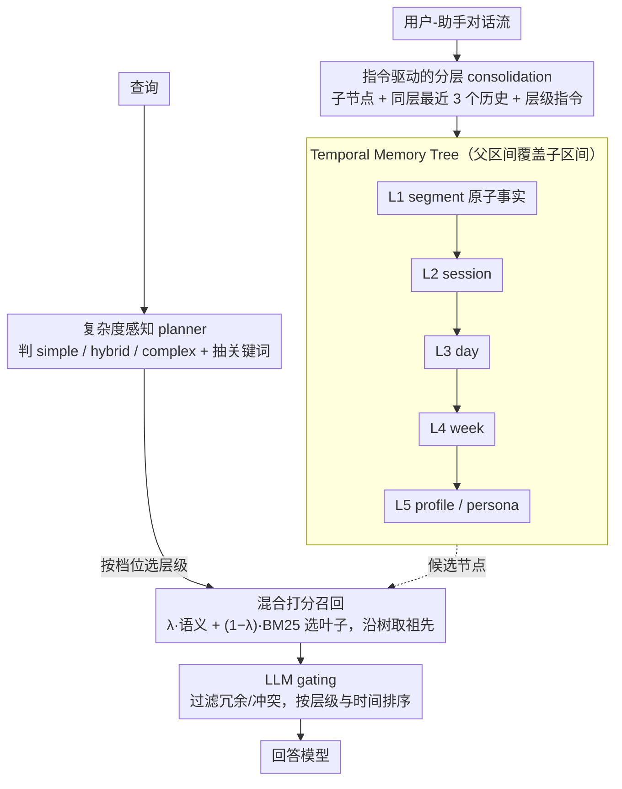

# TiMem: Temporal-Hierarchical Memory Consolidation for Long-Horizon Conversational Agents

**会议**: ACL2026 Findings  
**arXiv**: [2601.02845](https://arxiv.org/abs/2601.02845)  
**代码**: https://github.com/TiMEM-AI/timem  
**领域**: LLM效率 / 长期记忆 / 会话智能体  
**关键词**: 时序层次记忆, 长对话智能体, 记忆压缩, 自适应检索, 个性化

## 一句话总结
TiMem 将长程对话记忆组织成显式时间包含的五层 Temporal Memory Tree，并用复杂度感知检索在细粒度事实和高层 persona 之间动态取舍，在 LoCoMo 和 LongMemEval-S 上同时提升准确率并显著减少召回上下文长度。

## 研究背景与动机
**领域现状**：长程会话智能体要在多轮、多天甚至多周的互动中保持一致的人设理解和事实记忆。常见路线大致有两类：一类扩大模型上下文或压缩 KV / hidden state，另一类把外部记忆作为持久存储，通过 embedding 检索、聚类、图结构或操作系统式 memory tier 来管理历史信息。

**现有痛点**：这些方法往往把“语义相似”当成主要组织原则，时间只是附属字段。结果是相似但跨越很久的片段可能被混在一起，短期事件和长期偏好之间缺少清晰证据链；另一方面，高层摘要如果过早替代原始片段，又会丢掉回答具体问题所需的事实细节。

**核心矛盾**：长程记忆既需要压缩，否则上下文长度和检索成本会持续膨胀；又需要保留时间连续性，否则人格、偏好和事件因果关系会被拆成零散碎片。问题不只是“召回多少内容”，而是“怎样把时间上相邻、层级上相关的记忆组织成可检索的结构”。

**本文目标**：作者希望构建一个无需额外微调、可插拔到不同 LLM 后端的记忆框架，能够从原始对话逐层提炼出 session、day、week、profile 等表示，并在查询时根据问题复杂度选择合适层级。

**切入角度**：论文借鉴认知科学里的 memory consolidation 思路，把短期 episodic memory 逐步转化为稳定的 semantic / persona memory。关键观察是：对话历史天然有时间顺序，因此 memory hierarchy 不应只由聚类或相似度决定，而应先满足时间包含关系，再在每个层级做语义整合。

**核心 idea**：用 Temporal Memory Tree 把长对话切成“时间上严格嵌套、语义上逐层抽象”的记忆树，再用查询复杂度决定召回哪些层级，从而在准确性、个性化和上下文成本之间取得平衡。

## 方法详解

### 整体框架
TiMem 想解决的是长程对话里「既要压缩、又要保住时间证据链」的两难。它不训练新模型，而是把整个系统拆成两个用 LLM prompt 驱动的阶段：写入时把不断增长的用户-助手对话流逐层提炼成一棵时间层次树，查询时再从这棵树里取出与问题复杂度匹配的节点。

写入阶段，每一轮或短片段对话先被转成底层的 factual segment，再按 session、day、week、profile 五个层级自底向上合并。每个节点都带一个时间区间和一段文本记忆，且父节点的时间区间必须覆盖所有子节点——这条硬约束保证了从任意底层事实都能沿树向上追溯到对应的长期模式或 persona。查询阶段则走三步：先由 recall planner 判断问题是 simple、hybrid 还是 complex 并抽取关键词；再从 L1 底层记忆用语义相似度与 BM25 混合打分选出候选叶子，并沿树召回被选层级的祖先节点；最后用 LLM gating 过滤掉冗余或冲突的候选，按层级和时间距离排序后送给回答模型。

### 关键设计

**1. Temporal Memory Tree：用时间包含关系而非语义聚类充当记忆骨架**

很多记忆系统会记 timestamp，但聚合时仍由相似度说了算，结果是相隔很久的相似片段被混在一起，长期画像也找不到具体证据。TiMem 直接把时间从附属字段提升为结构约束：每个记忆节点 $m$ 存时间区间 $\tau(m)$ 和语义文本 $\sigma(m)$，父子边强制要求父节点的时间区间覆盖子节点，于是同一棵树里依次堆叠了 L1 segment、L2 session、L3 day、L4 week、L5 profile，层级越高节点越少、语义越抽象。因为长程个性化问题往往依赖「某个事件如何逐步沉淀成偏好或人格线索」，这种显式时间包含让高层 persona 必然挂着可回溯的时间证据，避免了纯语义聚类带来的时间错位。

**2. 指令驱动的分层 consolidation：边压缩边保留近期历史**

只留原始对话会让检索成本无限膨胀，只留摘要又会丢掉回答具体问题所需的事实细节。TiMem 用一组分层 consolidator 在两者之间取舍：第 $i$ 层的 consolidator 接收它的子节点集合、同层最近 $w_i=3$ 个历史节点以及一段层级专用指令，输出新的第 $i$ 层记忆。L1 在每轮对话后即时写入，L2-L5 则分别在 session、day、week、month 等窗口结束时定期触发。把同层最近历史一并喂进去，是为了减少跨窗口的断裂，让短期事实和长期模式并存，而且整个过程靠 prompt 完成、无需针对数据集微调。

**3. 复杂度感知的层级召回与 gating：把「看哪几层」和「留哪些」分开**

不同问题对记忆粒度的需求差别很大，固定召回范围要么欠召回、要么把大量无关摘要塞进上下文。TiMem 让 planner 先把查询映射成 simple、hybrid 或 complex 三档：simple 默认只搜事实层 L1-L2 加 profile L5，hybrid 额外取部分 pattern 层，complex 则取完整 L1-L5。底层候选用混合打分挑出：

$$s = \lambda\, s_{sem} + (1-\lambda)\, s_{lex}$$

其中 $s_{sem}$ 是语义相似度、$s_{lex}$ 是 BM25 词法分，实验取 $\lambda=0.9$。召回到的候选再过一道 LLM gating，只保留真正 query-relevant 的记忆。planner 决定召回范围、gating 决定最终压缩，这种拆分让准确率和 token 成本可以分别调，也比单个 reranker 更好解释。

### 一个完整示例：一个 complex 查询怎么走完整棵树

设用户问「我最近半年对咖啡的偏好有什么变化」。planner 判定为 complex 并抽出关键词 coffee、preference，于是召回范围放开到 L1-L5。系统先在 L1 底层用 $\lambda=0.9$ 的混合打分从大量 segment 里选出与咖啡相关的叶子，再沿树把这些叶子的 session、day、week 祖先和顶层 profile 一并取回——这样既有「三月某天说想戒咖啡因」这种原子事实，也有「逐渐偏好手冲」这种周级模式和 persona 画像。接着 LLM gating 把跟咖啡无关或互相冲突的祖先节点剔掉，最终只留少量层级互补的节点按时间排序送入回答模型。对照之下，若同样问题来了一句「我昨天喝的是什么咖啡」，planner 会判成 simple，只搜 L1-L2 加 L5，召回内容大幅收窄——这正是复杂度感知让简单问题少取、复杂问题多取的体现。

### 损失函数 / 训练策略
TiMem 本身不引入监督训练或参数更新。所有实验中，记忆写入、planner、gating 和回答生成使用统一 LLM 配置；embedding 使用 Qwen3-Embedding-0.6B，回答和记忆操作使用 gpt-4o-mini-2024-07-18。关键超参包括底层召回预算 $k=20$、同层历史窗口 $w_i=3$、语义-词法混合系数 $\lambda=0.9$。

## 实验关键数据

### 主实验
论文在 LoCoMo 和 LongMemEval-S 两个长程会话记忆基准上评估，比较 MemoryBank、A-MEM、Mem0、MemoryOS 和 MemOS。指标以 LLM-as-a-Judge 准确率为主，同时报告 LoCoMo 的 F1 / ROUGE-L 和效率指标。

| 数据集 | 指标 | TiMem | 最强基线 | 提升 |
|--------|------|-------|----------|------|
| LoCoMo | Overall LLJ | 75.30 | MemOS 69.24 | +6.06 |
| LoCoMo | F1 / ROUGE-L | 54.40 / 54.68 | MemoryOS 45.36 / MemOS 47.41 | +9.04 F1 / +7.27 RL |
| LongMemEval-S, gpt-4o-mini | Overall LLJ | 76.88 | MemOS 68.68 | +8.20 |
| LongMemEval-S, gpt-4o | Overall LLJ | 78.96 | MemOS 73.07 | +5.89 |

在 LoCoMo 的四类问题上，TiMem 分别达到 Single-Hop 81.43、Temporal 77.63、Open-Domain 52.08、Multi-Hop 62.20，全部优于被比较基线。LongMemEval-S 中，TiMem 在 Knowledge Update、Multi-Session、Temporal Reasoning 等类别也保持整体领先，说明时间树不仅对事实问答有用，也能支持跨会话和时间推理。

### 消融实验
planner、gating 和层级结构是主要消融对象。表中 Mem Len 是每个查询召回进回答上下文的平均 token 数。

| 配置 | LoCoMo LLJ | LoCoMo Mem Len | LME-S LLJ | LME-S Mem Len | 说明 |
|------|------------|----------------|-----------|---------------|------|
| 固定 Simple, 无 gating | 73.51 | 3710.30 | 73.20 | 3371.53 | 范围窄但仍有大量候选 |
| 固定 Hybrid, 有 gating | 73.38 | 691.59 | 75.00 | 1673.93 | 固定策略里最稳 |
| planner, 无 gating | 72.99 | 4411.09 | 73.80 | 3941.98 | 动态选层级但噪声仍多 |
| planner + gating | 75.30 | 511.25 | 76.88 | 1270.62 | 完整 TiMem，准确率和长度最好平衡 |

层级结构消融进一步说明，只有底层事实或只有高层摘要都不够。

| 记忆层级与召回 | LoCoMo LLJ | LoCoMo Mem Len | LME-S LLJ | LME-S Mem Len | 结论 |
|----------------|------------|----------------|-----------|---------------|------|
| L1 only, flat recall | 70.06 | 995.15 | 57.40 | 1823.98 | 细节多但缺少跨时间结构 |
| L1 only, hierarchical recall | 73.18 | 361.23 | 72.40 | 437.42 | 层级传播能恢复部分依赖 |
| L2-L5 only, hierarchical recall | 57.08 | 3786.44 | 64.20 | 2344.92 | 只有摘要会丢事实证据 |
| L1-L5, flat recall | 70.71 | 1715.65 | 55.40 | 4519.26 | 有层级但不沿树召回仍不稳 |
| L1-L5, hierarchical recall | 75.30 | 511.25 | 76.88 | 1270.62 | 细节和抽象互补 |

### 关键发现
- 完整 TiMem 在 LoCoMo 上只召回 511.25 tokens，比 Mem0 的 1070.10 tokens 少 52.20%，但准确率更高；这说明它不是单纯“多塞上下文”，而是在更结构化地压缩和筛选。
- 完整五层 TMT 的 consolidation 调用数比 L1-only 多 25%-30%，但这是历史写入阶段的摊销成本；在线回答阶段的输入上下文明显变短。
- L1 segment 粒度越粗，准确率越差：从 1 turn 的 75.30% 降到 8 turns 的 65.26%，说明底层原子证据对长程问答非常关键。
- 语义-词法混合检索对 $lambda$ 不太敏感，在 $lambda in [0.7, 1.0]$ 内 LoCoMo 准确率维持在 73.96%-75.30%，峰值出现在 $lambda=0.9$。

## 亮点与洞察
- 最重要的亮点是把“时间连续性”从 metadata 提升为结构约束。很多记忆系统会记录 timestamp，但检索和聚合仍由相似度支配；TiMem 要求父子节点满足时间包含，因此高层 persona 必然有可追溯的时间证据。
- planner 与 gating 的组合很实用：planner 决定看哪几层，gating 决定哪些节点真的进入上下文。这个拆分比单个 reranker 更容易解释，也方便针对延迟和 token 成本调参。
- 论文的 manifold 分析提供了一个不错的诊断视角：LoCoMo 上高层记忆让 10 个用户群分离更清楚，LongMemEval-S 上分层 consolidation 则让 embedding dispersion 减少约 50%，说明“抽象”在不同数据分布下可以表现为区分 persona 或抑制噪声。
- 这个框架可以迁移到其他长期状态建模任务，例如长期教育 tutor、医疗随访、客服工单和个人助理，只要事件天然按时间累积，就可以用类似树结构把事实、模式和用户画像分层保存。

## 局限与展望
- TiMem 依赖 LLM 做 consolidation、planner 和 gating，虽然无需微调，但系统成本和稳定性仍受内部 LLM 质量影响；如果 planner 误判复杂度，召回范围会过宽或过窄。
- 五层时间窗口是经验配置。不同应用的时间尺度差异很大，例如客服可能按 ticket，教育可能按课程单元，直接套用 segment/session/day/week/profile 不一定最优。
- 实验主要关注 QA 式记忆评估，还没有充分展示在真实多轮交互中如何处理用户偏好改变、隐私删除、冲突记忆覆盖等持续运维问题。
- 未来可以把 TMT 与可学习路由或轻量 RL 结合，让系统根据任务反馈自动调整层级窗口、召回预算和 gating 阈值；也可以加入显式 conflict resolution，避免旧 persona 与新行为长期共存。

## 相关工作与启发
- **vs Mem0 / A-MEM**: 这些方法更偏向语义记忆组织和 agentic memory 更新，TiMem 的区别是用时间树约束所有 consolidation 路径。优势是证据链更清楚，劣势是需要预设窗口和更多写入阶段调用。
- **vs RAPTOR / MemTree**: RAPTOR 类方法也做树状摘要，但通常以语义聚类组织节点；TiMem 则强调父节点必须覆盖子节点时间区间，更适合用户状态随时间演化的场景。
- **vs MemoryOS / MemOS**: OS 式记忆系统强调 memory tier、虚拟内存和系统管理，TiMem 更像一套针对长对话 personalization 的数据结构与召回协议。两者可以互补：MemoryOS 负责生命周期管理，TMT 负责时间层级语义结构。
- **启发**: 长程 agent 的记忆问题不应只被看作检索问题，而应被看作“写入时怎样形成可推理结构”的问题。高质量 memory layout 可能比更强的 reranker 更能决定最终回答质量。

## 评分
- 新颖性: ⭐⭐⭐⭐☆ 把 temporal containment 和 hierarchical consolidation 系统化用于长程会话记忆，结构思想清晰但组件多由 prompt 驱动。
- 实验充分度: ⭐⭐⭐⭐☆ 主实验、planner/gating、层级结构、效率和参数研究较完整，但真实在线交互和长期更新冲突还可加强。
- 写作质量: ⭐⭐⭐⭐☆ 动机、方法和消融逻辑顺畅，表格支撑充分；部分实现细节依赖附录 prompt。
- 价值: ⭐⭐⭐⭐⭐ 对长程个性化 agent 很有参考价值，尤其适合需要控制上下文成本的实际系统。

<!-- RELATED:START -->

## 相关论文

- [\[ACL 2026\] HiGMem: A Hierarchical and LLM-Guided Memory System for Long-Term Conversational Agents](higmem_a_hierarchical_and_llm-guided_memory_system_for_long-term_conversational_.md)
- [\[ACL 2026\] RecMem: Recurrence-based Memory Consolidation for Efficient and Effective Long-Running LLM Agents](recmem_recurrence-based_memory_consolidation_for_efficient_and_effective_long-ru.md)
- [\[ACL 2026\] OCR-Memory: Optical Context Retrieval for Long-Horizon Agent Memory](ocr-memory_optical_context_retrieval_for_long-horizon_agent_memory.md)
- [\[ACL 2026\] StructMem: Structured Memory for Long-Horizon Behavior in LLMs](structmem_structured_memory_for_long-horizon_behavior_in_llms.md)
- [\[ACL 2026\] SOLAR-RL: Semi-Online Long-horizon Assignment Reinforcement Learning](solar-rl_semi-online_long-horizon_assignment_reinforcement_learning.md)

<!-- RELATED:END -->
