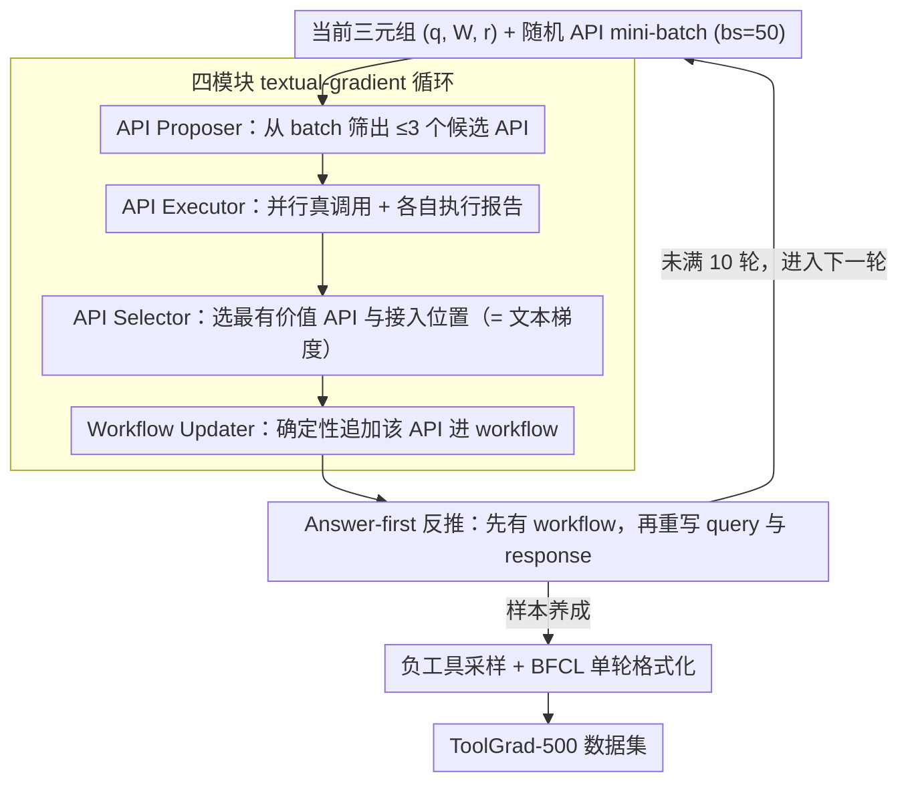

# ToolGrad: Efficient Tool-use Dataset Generation with Textual "Gradients"

**会议**: ACL2026  
**arXiv**: [2508.04086](https://arxiv.org/abs/2508.04086)  
**代码**: https://github.com/zhongyi-zhou/toolgrad  
**领域**: LLM Agent / 工具使用数据生成  
**关键词**: 工具调用, 合成数据, 文本梯度, answer-first, API工作流

## 一句话总结
ToolGrad 把工具使用数据生成从“先写用户问题、再用 DFS 找工具链”反过来做成“先生成可执行成功的工具链、再反推用户问题”，并用类似 textual gradients 的 API 选择循环构造 ToolGrad-500，使数据生成 pass rate 达到 99.8%，训练出的 Gemma-3 小模型还能超过多种闭源强模型的单轮工具调用表现。

## 研究背景与动机
**领域现状**：工具调用让 LLM 能访问搜索、数据库、代码执行和各类 API，是降低幻觉、增强事实性和执行复杂任务的重要路径。训练这类模型的关键不只是 API 列表，而是大量“用户请求 - 工具调用链 - 最终回答”的监督样本。

**现有痛点**：主流合成方案通常先让 LLM 根据一组 API 生成用户 query，再让 agent 通过 DFS 或 ReAct 式探索去找可行工具链。这种 query-first 流程成本高、失败率高，而且失败样本会浪费大量工具调用。更糟的是，即便 DFS 找到一条成功路径，探索中也可能混入低质量或错误工具步骤，作为“ground truth”训练时会污染模型。

**核心矛盾**：真实用户问题天然是模糊的，而工具链是具体、可验证的。从模糊 query 搜索答案需要昂贵探索；但如果先有一条可执行工具链，再反推一个能由该工具链解决的 query，就容易得多。问题在于：如何直接从 8k 规模 API 数据库里生成复杂且有效的工具链。

**本文目标**：作者希望设计一个高 pass rate、低工具调用成本、能产生复杂多 API workflow 的数据生成框架，并验证用这种便宜合成数据训练的小模型，是否能在 ToolBench 和 BFCL 上获得真实工具调用能力。

**切入角度**：论文借鉴 TextGrad 的“文本梯度”思想，但把被优化对象从 prompt 换成数据集。每一步不是让 critic 写自然语言建议，而是让 LLM 在候选 API 执行报告中选择最有价值的 API，把这个离散选择视为数据生成过程的“梯度”。

**核心 idea**：先构造成功工具答案，再生成对应用户问题；工具链构造通过 API proposal、execution、selection、workflow update 四步迭代完成，避免 query-first 搜索中的大规模失败探索。

## 方法详解

### 整体框架
ToolGrad 要解决的是工具调用训练数据「生成贵、失败多、还容易掺进错误工具步骤」的问题，做法是把生成方向反过来。它产出的每个样本是三元组 $(q, \mathcal{W}, r)$：$q$ 是用户 query，$\mathcal{W}$ 是由多条 API chain 组成的 workflow，$r$ 是基于该 workflow 给用户的最终回答。因为作者训练的推理模型在单次输出里就要预测完整工具调用（而非 ReAct 式逐步调用），数据必须带结构化的 API workflow。

整个生成从一个当前 workflow 出发，逐轮把它「养大」。每轮随机取一个 API mini-batch，由四个模块接力：API Proposer 先从 mini-batch 里挑出少量可能有用的 API 和使用指令；多个 API Executor 并行真正调用这些 API 并各自生成执行报告；API Selector 比较这些报告，选出最值得并入 workflow 的 API 以及它该追加到哪条 chain；Workflow Updater 把该 API 确定性地写进 workflow，再让 LLM 根据更新后的 workflow 生成新的用户 query 和最终回答。重复若干轮，一个 answer-first 样本就长成了。

### 关键设计

**1. Answer-first 工具链生成：先保证调用链能跑通，再反推用户问题**

真实用户问题天然模糊，从模糊 query 出发用 DFS/ReAct 搜可行工具链既贵又常失败，哪怕搜到一条成功路径，途中混进的低质量工具步骤还会作为「ground truth」污染训练。ToolGrad 把这个搜索难题换成更可控的生成难题：不从 query 出发，而是把可执行成功的 API 调用当作生成锚点，workflow 每并入一个 API，系统就同步更新对应的 query 和 response，让三元组始终自洽。工具链是结构化、可验证的对象，而 query 只是自然语言描述，从前者反推后者远比反向搜索容易，也从源头杜绝了「无解 query」和失败工具步骤进入训练集。

**2. 四模块 textual-gradient 循环：用离散的 API 选择充当数据生成的「梯度」**

要在 8k 规模的 API 数据库里逐步搭出复杂 workflow，同时还得压住每轮的工具调用成本。ToolGrad 借了 TextGrad 的「文本梯度」思想，但把被优化对象从 prompt 换成数据样本：API Proposer 用普通 LLM 从大小 $bs=50$ 的 API batch 里提出最多 $m=3$ 个候选，先把绝大部分无关 API 过滤掉，因为真正昂贵的是工具执行；API Executor 用支持工具调用的 LLM agent 实际跑这些候选，返回 success/failure 与调用历史；API Selector 读执行报告，挑出最有价值的 API 和它该接的 chain 位置——这个离散选择就相当于告诉系统「沿哪个 API 方向去优化当前数据样本」，正是 ToolGrad 里的 textual gradient；最后 Workflow Updater 不再依赖搜索，而是确定性地追加该 API 并让 LLM 重写 query/response。

**3. 负工具采样与单轮函数调用格式化：让训练贴近「可见 API 多于必需 API」的真实部署**

如果训练时只给正确工具，模型根本学不到怎么做工具选择；可要是把全量 8k API 都摆上来又不现实。ToolGrad 取折中：对 workflow 里的每个正 API，按 embedding 相似度采样一批相似的负 API，让模型面对 top-$p$ 的候选工具集合而非只看到正确答案，这种相似负样本提供了更难、更接近 RAG 检索式工具选择的训练环境。生成配置上，每个样本跑 10 次迭代、负工具数取 $p=10$，用 gemini-2.5-flash-lite 配 500 个不同 seed 生成，最终形成 ToolGrad-500，并按 BFCL 风格组织成单轮工具调用格式。

### 损失函数 / 训练策略
ToolGrad 本身是数据生成框架，不训练生成器。生成 ToolGrad-500 后，作者用监督微调训练 Gemma-3 的 1B、4B、12B 模型，使其在给定 OpenAI-style tool definitions 时输出 Python-style tool use。对照数据包括 ToolBench 生成的数据，对照模型包括 Gemini-2.5、Claude-4.5、GPT-5 系列闭源模型，以及 ToolACE、Hammer 等工具调用模型。评估主要在 ToolBench-I3 单轮工具使用和 BFCL v1/v2 单轮工具调用上进行。

## 实验关键数据

### 主实验
下表比较 query-first DFS 与 ToolGrad 的数据生成效率。ToolGrad 不只更容易成功，还生成了更复杂的工具链。

| 数据生成方法 | Pass rate ↑ | 平均 GT 工具数 ↑ | LLM cost ↓ | Tool cost ↓ |
|--------------|-------------|------------------|------------|-------------|
| DFS / ToolBench 风格 | 63.8% | 2.1 | 64.5 | 34.3 |
| ToolGrad | 99.8% | 3.4 | 63.9 | 20.0 |

这个表是全文最有说服力的证据：ToolGrad 的 LLM 调用成本几乎不增加，工具调用成本反而从 34.3 降到 20.0，同时 pass rate 从 63.8% 提升到 99.8%，平均工具链复杂度从 2.1 提升到 3.4。作者还检查失败日志，发现 500 次生成里只有 3 个 API 执行失败导致空样本，失败率约 0.2%。

### 消融实验
作者进一步比较 ToolGrad-500 训练出的小模型与闭源模型在 ToolBench 单轮工具使用上的绝对 judge score。

| 模型 / 数据 | Score | 备注 |
|-------------|-------|------|
| ToolGrad-Gemma-3-1B | 14.1 | 1B 小模型已超过 Gemini-2.5-flash-lite |
| ToolGrad-Gemma-3-4B | 17.6 | 表中第二高 |
| ToolGrad-Gemma-3-12B | 19.6 | 表中最高 |
| Gemini-2.5-flash-lite | 6.9 | ToolGrad 的数据生成 teacher |
| Gemini-2.5-pro | 11.4 | 闭源强模型基线 |
| Claude-4.5-opus | 15.4 | 闭源强模型基线 |
| GPT-5-nano | 15.4 | 闭源强模型基线 |
| GPT-5-mini | 14.7 | 闭源强模型基线 |

同一组 Gemma 模型的训练对比也支持数据有效性：ToolGrad 将 Gemma-3-1B 从 1.0 提升到 14.1，将 4B 从 11.2 提升到 17.6，将 12B 从 9.8 提升到 19.6。论文还报告 ToolGrad 模型在 BFCL 上对 1B、4B、12B 分别带来 +8.1、+8.0、+6.3 的整体分数提升，其中 non-live synthetic 子集提升更大，但 live 子集也有 +1.93、+4.74、+4.22 的增益。

### 关键发现
- answer-first 流程显著降低无解 query 和失败轨迹污染。相比 query-first，ToolGrad 生成时已经以可执行成功的工具链为锚，因此样本天然更容易验证。
- 小模型能超过 teacher 模型是一个强信号。Gemini-2.5-flash-lite 参与生成数据，但训练出的 ToolGrad-Gemma-3-12B 在 ToolBench 和 BFCL 上都能超过它，说明数据结构本身提供了额外监督价值。
- scaling 并非无限变好。迭代次数在 8-12 左右 pass rate 趋于饱和；样本数从 100 增到 500/1k 有收益，但继续增大后性能反而下降，作者认为核心原因是缺少跨样本 memory，导致生成工具使用模式重复。

## 亮点与洞察
- “先答案后问题”的反转非常有工程直觉。工具调用场景里，可执行链条比自然语言 query 更容易验证，先保证答案有效再反推问题，等于把最难的搜索问题换成了更可控的生成问题。
- ToolGrad 对 textual gradients 的改造很有意思。它没有让 LLM 写模糊建议，而是让 LLM 在执行报告中选择一个 API，这个离散动作既可解释又能直接改变数据生成方向。
- 论文把数据生成效率和下游模型能力放在一起评估，避免只证明“生成便宜”。更关键的是，用更便宜数据训练出来的小模型确实能在 OOD 工具集合上泛化。

## 局限与展望
- 当前训练格式偏单轮、一次性输出完整工具调用，不能直接覆盖 ReAct/DFS 式多步交互和带中间推理的 agent 框架。
- 论文只验证了 SFT 使用 ToolGrad 数据的效果，没有探索这些高 pass-rate 工具链数据在 RL 或偏好优化中的价值。
- 生成 query 仍由 LLM 反推，可能不符合真实用户表达习惯，例如语言风格、模糊程度、上下文缺失方式都可能偏合成。
- scaling plateau 是一个明显瓶颈。缺少全局 memory 会导致不同样本重复探索相似 API 组合，未来可以加入共享记忆、覆盖度约束或 DPP 式多样性选择来提高数据规模化效率。

## 相关工作与启发
- **vs ToolBench / ToolLLM**: ToolBench 先生成 query 再用 DFS 搜索工具链，覆盖面大但成本高且失败多；ToolGrad 先生成工具链再生成 query，牺牲了一部分 query-first 的自然性，换来高可解性和高 pass rate。
- **vs TextGrad**: TextGrad 用自然语言 feedback 优化 prompt；ToolGrad 借用了“文本梯度”概念，但梯度体现为 API Selector 对执行报告的离散选择，用于优化数据样本而非 prompt。
- **vs ToolACE / Hammer**: ToolACE 和 Hammer 更偏训练或构造强工具调用模型；ToolGrad 聚焦数据生成机制，可以作为这些模型后训练的数据来源，尤其适合快速 bootstrap 小模型工具能力。

## 评分
- 新颖性: ⭐⭐⭐⭐☆ answer-first 反转很朴素但有效，把 textual gradients 落到 API 选择上也很有辨识度。
- 实验充分度: ⭐⭐⭐⭐☆ 数据效率、ToolBench、BFCL、scaling study 都覆盖了，但多轮 agent 和 RL 使用仍缺实验。
- 写作质量: ⭐⭐⭐⭐☆ 问题动机清晰，框架图和四模块描述易懂，部分成本指标的单位还可以解释得更细。
- 价值: ⭐⭐⭐⭐⭐ 工具调用数据生成是 agent 训练的核心瓶颈，这篇提供了低成本且可复现的强 baseline。

<!-- RELATED:START -->

## 相关论文

- [\[ICLR 2026\] Efficient Agent Training for Computer Use](../../ICLR2026/llm_agent/efficient_agent_training_for_computer_use.md)
- [\[ACL 2026\] Robust Tool Use via Fission-GRPO: Learning to Recover from Execution Errors](robust_tool_use_via_fission-grpo_learning_to_recover_from_execution_errors.md)
- [\[ACL 2026\] Meta-Tool: Efficient Few-Shot Tool Adaptation for Small Language Models](meta-tool_efficient_few-shot_tool_adaptation_for_small_language_models.md)
- [\[ACL 2026\] Feedback-Driven Tool-Use Improvements in Large Language Models via Automated Build Environments](feedback-driven_tool-use_improvements_in_large_language_models_via_automated_bui.md)
- [\[ICLR 2026\] AgentSynth: Scalable Task Generation for Generalist Computer-Use Agents](../../ICLR2026/llm_agent/agentsynth_scalable_task_generation_for_generalist_computer-use_agents.md)

<!-- RELATED:END -->
