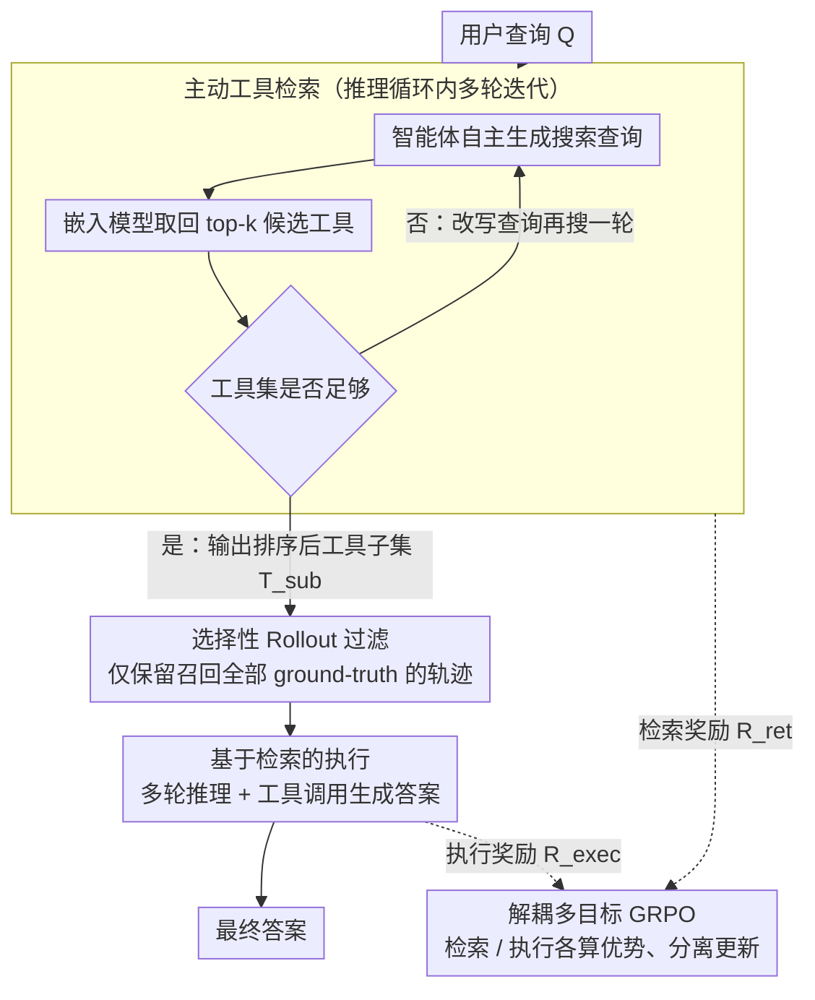

# ToolOmni: Enabling Open-World Tool Use via Agentic Learning with Proactive Retrieval and Grounded Execution

**会议**: ACL 2026  
**arXiv**: [2604.13787](https://arxiv.org/abs/2604.13787)  
**代码**: [GitHub](https://github.com/Huangsz2021/ToolOmni)  
**领域**: LLM Agent  
**关键词**: 工具学习, 主动检索, 开放世界, GRPO, 端到端

## 一句话总结

本文提出 ToolOmni，一个统一的智能体框架，将主动工具检索和基于检索结果的工具执行整合在同一推理循环中，通过冷启动 SFT + 解耦多目标 GRPO 联合优化检索和执行能力，在 ToolBench 上端到端执行成功率超过强基线 +10.8%。

## 研究背景与动机

**领域现状**：LLM 通过调用外部工具增强问题解决能力。在开放世界场景中，工具库规模庞大（>10,000 个 API）且动态更新，模型不仅需要会用工具，还需要能主动搜索和选择正确的工具。

**现有痛点**：(1) **嵌入检索方法**依赖语义相似度进行被动检索，将检索与智能体推理解耦，无法根据任务需求主动参与工具选择或细化搜索；(2) **参数记忆方法**将工具文档内化到模型参数中，每次工具集更新都需要昂贵的重训练，泛化性差；(3) 现有智能体 RL 训练框架将 LLM 限制在搜索引擎/代码执行器等少数工具上，无法扩展到多样化的开放世界场景。

**核心矛盾**：开放世界工具使用需要同时解决"找到正确工具"（检索）和"正确使用工具"（执行）两个问题，但现有方法要么将它们作为独立流水线处理，要么只优化其中一个。

**本文目标**：构建一个端到端的智能体框架，将主动工具发现和工具执行统一到一个推理循环中。

**切入角度**：将检索和执行视为相互关联但独立的子任务，通过解耦多目标 GRPO 同步优化两个子任务，避免相互干扰。

**核心 idea**：用两阶段训练——先用 SFT 冷启动赋予基础能力，再用解耦 GRPO 分别计算检索和执行的奖励/优势并独立更新，在在线环境中端到端优化主动检索和基于检索的执行。

## 方法详解

### 整体框架

给定用户查询 $Q$，ToolOmni 在统一推理循环中交替执行两个阶段：(1) **主动检索阶段**：智能体自主决定是否需要检索、生成搜索查询、调用嵌入检索服务器获取候选工具，迭代多轮直到收集到足够的工具集 $\mathcal{T}_{sub}$；(2) **基于检索的执行阶段**：基于检索到的工具文档，通过多轮推理和工具调用生成最终答案。训练侧由解耦多目标 GRPO 在线优化整个循环，并在执行前用选择性 Rollout 过滤保证执行阶段只在高质量上下文里学习。

### 关键设计

**1. 主动工具检索：让智能体自己决定搜什么、何时停**

开放世界里工具库超过一万个 API 还在动态更新，被动的一次性嵌入检索很难一步命中。ToolOmni 把检索变成推理循环里的主动动作：智能体在 `<search>` 标签内自己生成搜索查询，调用预训练嵌入模型取回 top-k 候选工具，再根据这一轮的结果判断是否要继续搜、要不要改写查询，多轮迭代直到工具集足够，最后在 `<tool_call>` 标签里输出排序后的工具子集 $\mathcal{T}_{sub}$。这种主动性让检索不再与推理脱节——智能体能按任务复杂度和已有结果动态调整搜索策略，复杂任务多搜几轮、简单任务早早收手。

**2. 解耦多目标 GRPO：让检索和执行各算各的账**

检索和执行是两个性质不同的子任务，如果硬塞进单一奖励，执行奖励的稀疏性会盖过检索信号，两个目标互相干扰。ToolOmni 因此把它们解耦：检索奖励 $R_{ret}$ 由格式正确性、召回率、转化率三个加权分量构成，执行奖励 $R_{exec}$ 则由格式正确性和答案正确性构成；优势估计仍用组内归一化，但按子任务各自独立计算。梯度更新更进一步采用分离更新（Separated Update），对检索和执行依次回传，避免某一目标的梯度压倒另一个。这样两个能力在同一推理循环里被同步优化，却不会彼此拖累。

**3. 选择性 Rollout 过滤：只在干净上下文里练执行**

执行策略的质量高度依赖它拿到的工具集——如果在错误检索结果上训练，就会注入噪声梯度、拖垮稳定性。ToolOmni 在启动执行阶段生成前先做一道过滤：只保留检索阶段成功召回全部 ground-truth 工具的轨迹（即满足 $\mathcal{T}_{gold} \subseteq \mathcal{T}_{sub}$），把无效检索实例剔除掉。如此一来执行策略始终在高质量上下文中学习，训练信号更干净。

### 损失函数 / 训练策略

两阶段训练：(1) SFT 冷启动，在约 28K 检索轨迹 + 33K 执行轨迹上用交叉熵损失训练，赋予基础检索与执行能力；(2) 解耦 GRPO，检索和执行分别计算优势并依次更新，采样组大小 $G=5$，温度 $T=1.0$。

## 实验关键数据

### 检索性能（NDCG 平均，Multi-Domain）

| 方法 | NDCG 平均 |
|------|-----------|
| BM25 | 18.29 |
| EmbSim | 37.13 |
| ToolGen | 68.64 |
| ToolRetriever | 76.44 |
| **ToolOmni** | **78.29** |

### 消融实验

| 配置 | 效果 |
|------|------|
| 完整 ToolOmni | 最佳 |
| 单轮检索 | 下降，缺少迭代精化 |
| 耦合 GRPO（单一奖励） | 下降，信号干扰 |
| 无选择性 Rollout | 下降，噪声训练数据 |

### 关键发现
- ToolOmni 在检索和执行上都达到 SOTA，端到端执行成功率超过基线 +10.8%
- 在 NDCG@1 和 @3 上显著优于基线，说明主动检索在精确定位"黄金工具"方面优势明显
- 对未见过的指令和工具表现出强泛化性，学到的是通用的工具使用机制而非死记硬背

## 亮点与洞察
- **"主动检索"范式转变**很重要：从"被动接受检索结果"到"智能体自主决定搜索什么、何时停止"，检索与推理紧密耦合
- **解耦多目标 GRPO** 提供了在多子任务 RL 中避免信号干扰的通用方案，可迁移到其他多阶段智能体任务
- **选择性 Rollout** 巧妙地解决了训练数据质量问题

## 局限与展望
- 基于 Qwen3-4B 的较小模型，更大模型的效果未知
- 依赖预训练嵌入模型进行底层检索，嵌入模型的质量会影响上限
- ToolBench 中使用 LLM 模拟器替代真实 API 调用，可能与真实环境存在偏差
- 检索阶段最多 4 轮，可能不够处理极端复杂的多工具协作场景

## 相关工作与启发
- **vs ToolGen**: ToolGen 用生成式方法直接生成工具标识符但需重训练来适应新工具，ToolOmni 用主动检索天然泛化
- **vs Meta-Tool**: Meta-Tool 将检索和执行作为流水线阶段而非联合优化
- **vs Search-R1**: 这些智能体 RL 框架启发了 ToolOmni，但后者将范围扩展到了开放世界的多样化工具集

## 评分
- 新颖性: ⭐⭐⭐⭐ 主动检索+解耦 GRPO 的框架设计新颖
- 实验充分度: ⭐⭐⭐⭐ 在 ToolBench 上全面评估检索和执行两个维度
- 写作质量: ⭐⭐⭐⭐ 框架清晰，技术细节完整
- 价值: ⭐⭐⭐⭐ 为开放世界工具使用提供了实用的端到端解决方案

<!-- RELATED:START -->

## 相关论文

- [\[ACL 2026\] Robust Tool Use via Fission-GRPO: Learning to Recover from Execution Errors](robust_tool_use_via_fission-grpo_learning_to_recover_from_execution_errors.md)
- [\[ACL 2026\] FAMA: Failure-Aware Meta-Agentic Framework for Open-Source LLMs in Interactive Tool Use Environments](fama_failure-aware_meta-agentic_framework_for_open-source_llms_in_interactive_to.md)
- [\[ACL 2026\] IntrAgent: An LLM Agent for Content-Grounded Information Retrieval through Literature Review](intragent_an_llm_agent_for_content-grounded_information_retrieval_through_litera.md)
- [\[NeurIPS 2025\] ContextAgent: Context-Aware Proactive LLM Agents with Open-World Sensory Perceptions](../../NeurIPS2025/llm_agent/contextagent_context-aware_proactive_llm_agents_with_open-world_sensory_percepti.md)
- [\[ACL 2026\] SafeMCP: Proactive Power Regulation for LLM Agent Defense via Environment-Grounded Look-Ahead Reasoning](safemcp_proactive_power_regulation_for_llm_agent_defense_via_environment-grounde.md)

<!-- RELATED:END -->
