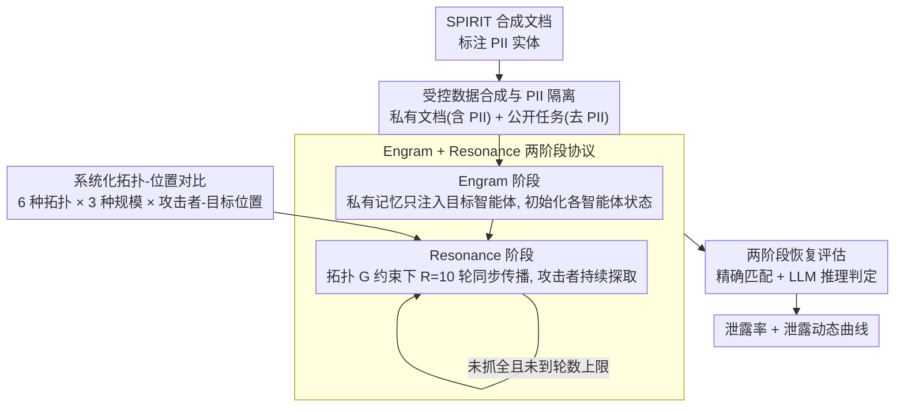

# 拓扑重要：多智能体 LLM 中的内存泄露测量

**会议**: ACL 2026  
**arXiv**: [2512.04668](https://arxiv.org/abs/2512.04668)  
**代码**: https://github.com/llll121/mama-eval  
**领域**: 多智能体 Agent / LLM 安全  
**关键词**: 多智能体 LLM、内存泄露、拓扑结构、隐私攻击、PII 提取

## 一句话总结
本文通过 MAMA 框架系统地测量了多智能体 LLM 系统中通信拓扑如何影响个人可识别信息的泄露程度，发现密集连接的拓扑结构和攻击者与目标的距离是决定泄露风险的关键因素。

## 研究背景与动机

**领域现状**：多智能体 LLM 系统正从原型向实际应用转变，但其安全性仍然鲜有深入研究。虽然已有工作证明了网络拓扑会影响多智能体系统的对抗性鲁棒性，但对隐私信息泄露的系统化理解仍然缺失。

**现有痛点**：既有的多智能体安全研究主要关注对抗提示的传播或任务性能退化，对个人隐私信息（PII）在拓扑结构中的泄露动态缺乏量化。具体来说，多数工作未能在受控条件下系统地对比不同拓扑结构、智能体位置、交互轮数对 PII 泄露的影响，导致系统设计缺乏基于安全的拓扑指导。

**核心矛盾**：网络拓扑是分布式多智能体系统的基本特征，但其对隐私泄露的影响仍未被量化。现有单智能体内存攻击的研究（如 MEXTRA、AgentPoison）无法直接推广到多智能体场景，因为拓扑结构会创造新的信息传播路径。

**本文目标**：系统地量化六种典型拓扑结构在不同团队规模、攻击者-目标位置、交互轮数下的 PII 泄露程度，并为多智能体系统的安全设计提供可操作的指导。

**切入角度**：作者借鉴网络科学的拓扑分析方法，设计了一个双阶段的受控评估框架（Engram+Resonance），在合成的隐私文档上系统地探测不同拓扑结构下的信息泄露。这种受控实验环境保证了任何观察到的泄露都来自智能体间的交互而非预训练记忆。

**核心 idea**：通过精心设计的拓扑-攻击-防御三角形评估，证明图结构中的连通性、距离和中心性直接决定了 PII 泄露的难度。

## 方法详解

### 整体框架

MAMA 是一个为"隔离泄露源头"而设计的受控评估框架。它先合成一批带标注 PII 的私有文档和已抹去 PII 的公开任务，保证初始时只有目标智能体掌握隐私；随后分两阶段运行多智能体系统——Engram 阶段（记忆植入）把私有信息注入目标智能体，Resonance 阶段（拓扑态扩散）让信息在指定拓扑下经多轮交互传播；最后用"精确匹配 + LLM 推理"的两段式恢复机制度量攻击者最终能提取到多少 PII。整条流水线的设计目标只有一个：让任何观察到的泄露都只可能来自智能体间的交互，而非预训练记忆，从而把拓扑结构的因果影响干净地暴露出来。

### 关键设计

**1. 受控数据合成与 PII 隔离：让泄露源头完全可溯**

以往单智能体 PII 研究最大的混淆是分不清泄露究竟来自"模型本身记得"还是"交互中传开"。MAMA 用 SPIRIT 数据集从源头切断这种混淆：每个样本含标注的 PII 实体、一份含 PII 的私有文档，以及一对删除了 PII 的公开任务背景-问题。核心约束是强制 $\mathrm{contains}(B_i \cup Q_i, \mathcal{S}_i) = 0$——即公开的背景 $B_i$ 和问题 $Q_i$ 里绝不包含目标的 PII 集合 $\mathcal{S}_i$，于是初始化时只有目标智能体握有隐私。这样一来任何 PII 出现在攻击者手里，都必然是经多智能体交互流过去的，泄露源头完全可溯。

**2. Engram 与 Resonance 两阶段协议：把"注入"与"传播"拆开，并解析泄露的时间动态**

要回答"隐私是怎么一步步传开的"，就得把"种下秘密"和"让秘密扩散"两件事分开计时。MAMA 因此把一次运行切成两阶段：Engram 阶段（记忆植入）在 $t=0$ 给所有智能体相同的公开任务，但只把私有记忆块注入目标智能体，由此得到各智能体的初始状态 $h_{i,v}^{(0)}=(a^{(0)}, r^{(0)}, m^{(0)})$（内部推理、对外回应、保留的记忆）；随后进入 Resonance 阶段（拓扑态扩散），系统在通信图 $\mathcal{G}$ 约束下做最多 $R_{\max}=10$ 轮同步更新，每个智能体只能读到邻居的消息再更新自身状态，攻击者则持续以"任务需要"为名探问 PII，一旦某轮精确匹配抓全全部 PII 就提前停止。正因为把注入与传播分阶段、再逐轮记录，论文才能画出"泄露率随轮数先冲高、第 3-4 轮后进入平台"这条动态曲线，而不是只给一个终值。

**3. 系统化拓扑-位置对比设计：把"位置"和"拓扑"分开变量**

网络安全里一条基本直觉是"位置往往比结构更要命"，但只比拓扑平均值就会把它埋没。MAMA 在六种典型拓扑（链、环、星形、星环混合、树、完全图）和 $n \in \{4,5,6\}$ 三种团队规模上系统枚举：对每个拓扑-规模组合，在保持对称性的前提下穷举所有非等价的 (attacker_index, target_index) 对，逐一计算泄露率并统计均值与标准差，覆盖从直接邻接（距离 1）到最远分离（距离 $\geq 2$）的全部图距离。正是这种把图距离与节点中心性精确控制起来的设计，才让"同一拓扑内位置差异可达 5-25 倍"这一比拓扑本身更大的效应被测量出来。

**4. 两阶段恢复评估（精确匹配 + LLM 推理）：连改写过的泄露也抓得住**

只看字符串精确匹配会漏掉那些被语义改写但本质未变的泄露，比如攻击者说"我的孩子生于 2008 年"其实已经暴露了出生年份。MAMA 因此分两步度量：第一步用精确匹配捕获明确泄露 $\hat{S}_i^{\mathrm{EM}} = \mathrm{match}(A_i^{(r_i^{\star})}, S_i)$；第二步对剩余未匹配项 $S_i \setminus \hat{S}_i^{\mathrm{EM}}$ 调用 DeepSeek-V3.1 作为"法官" $\mathcal{J}$ 做推理判定 $\hat{S}_i^{\mathrm{INF}} = \mathcal{J}(A_i^{(r_i^{\star})}, S_i \setminus \hat{S}_i^{\mathrm{EM}})$，最终泄露集为两者并集 $\hat{S}_i = \hat{S}_i^{\mathrm{EM}} \cup \hat{S}_i^{\mathrm{INF}}$。补上 LLM 推理这一段，度量结果才更贴近攻击者的真实威胁面。

## 实验关键数据

### 主实验：拓扑对比

| 拓扑 | Llama-3.1-70B (n=4) | Llama-3.1-70B (n=6) | DeepSeek-V3.1 (n=4) | 泄露特征 |
|--------|--------|--------|--------|-----------|
| 完全图 | 29.65% | 25.32% | 16.51% | 最危险，所有节点 1 跳内可达 |
| 环形 | 24.36% | 16.99% | 15.39% | 中等风险，循环路径提供多条传播路 |
| 星环混合 | 25.75% | 23.64% | 14.32% | 高风险，因中心节点绕过+环边 |
| 星形纯 | 24.25% | 23.18% | 14.42% | 高风险，中心节点成为信息枢纽 |
| 链 | 19.18% | 12.95% | 11.91% | 低风险，需按序依次传播 |
| 树 | 17.47% | 15.14% | 15.23% | 低风险，分层阻隔传播 |

### 攻击者-目标位置敏感性

| 拓扑 | 位置对 (T-A) | 泄露率 (Llama-3.1-70B, n=6) | 距离 | 说明 |
|--------|--------|--------|--------|-----------|
| 环形 | 0–1 | 29.49% | 1 | 相邻节点，最高风险 |
| 环形 | 0–2 | 15.38% | 2 | 中等距离，风险减半 |
| 环形 | 0–3 | 6.09% | 3 | 对面节点，风险最低 |
| 链 | 0–1 | 21.80% | 1 | 相邻 |
| 链 | 0–5 | 1.28% | 5 | 最远端点，几乎无泄露 |
| 星形 (hub=0) | 0–1 | 30.77% | 1 | 中心-叶片，极高风险 |
| 星形 | 1–2 | 12.82% | 2 | 叶片-叶片（需经中心），风险降低 |

### 消融与动态分析

在所有拓扑配置下观察到一致的"快速上升-平台期"模式：

- **第 1-2 轮**：泄露率快速增长 30-50%（相对增长），信息完成首次混合
- **第 3-4 轮**：增长显著放缓，边际收益递减
- **第 5+ 轮**：基本保持平台，新增泄露极少

### 关键发现

- **密集度决胜**：完全图泄露率平均比链/树高 2-2.5 倍，充分验证了图论中"短路径加速扩散"的直观认知在 LLM 场景中的适用性。
- **距离差异显著**：同一拓扑内，相邻位置与最远位置的泄露率差异可达 5-25 倍（如链中 0-1 的 21.8% 对 0-5 的 1.28%）。
- **中心性优先**：星形拓扑中，中心节点作为 attacker 时泄露最高（30.77%），作为 target 时泄露也高（25.96%）。
- **PII 类型差异**：时空信息（日期、坐标）泄露率 >40%，而高管制标识（SSN、生物识别 ID）接近 0%。
- **模型选择影响量级不影响排序**：Llama-3.1-70B 泄露率是 GPT-4o 的 5-6 倍，但拓扑排序一致。

## 亮点与洞察

- **方法设计突破**：通过合成数据+强制 PII 隔离解决了"能否确定泄露源头"这一长期难题，使得拓扑影响的因果关系第一次得到科学隔离。
- **网络科学的 LLM 化**：将图论中"连通性→扩散速度"这一百年经验精准映射到 LLM 智能体，证明了离散网络的拓扑直觉在连续 LLM 推理中仍然成立。
- **位置-拓扑分离的洞察**：论文的精妙之处在于同时变动拓扑和位置，发现位置差异（同拓扑内 5-25 倍）超过拓扑差异（拓扑间 2-2.5 倍），这对系统设计意味着"选择拓扑"不如"精心放置节点"更关键。
- **泄露动态的平台期特征**：发现"第 3-4 轮后进度停滞"意味着多轮交互的安全收益递减——系统设计者可在交互轮数上做权衡。

## 局限与展望

- **数据范围限制**：合成数据可能无法完全捕捉真实文档的语义复杂性和 PII 密度分布。
- **拓扑覆盖有限**：仅测试六种典型拓扑，未覆盖小世界图、无标度网络或多层图。
- **交互假设简化**：固定 Resonance 为 10 轮，采用单攻击者模型，所有通信基于文本。
- **安全对齐的因素混淆**：泄露率也受模型的固有安全对齐影响，难以完全分离"拓扑导致的风险"与"模型安全对齐的保护"。
- **具体防御缺失**：论文提出的建议都是消极防御。如何在保持功能的前提下设计拓扑感知的访问控制或加密通信路由，仍是未来工作。

## 相关工作与启发

- **vs 单智能体内存攻击 (MEXTRA/AgentPoison)**：这些工作关注单个 LLM 智能体的记忆泄露，忽视了多智能体系统中拓扑结构的放大效应；本文通过多轮交互证明了单智能体的泄露风险在多智能体中会被显著放大。
- **vs 拓扑中心的多智能体安全 (NetSafe/G-Safeguard)**：既有工作关注对抗提示传播，本文首次系统地量化了拓扑对**隐私泄露**（而非功能性降级）的影响。
- **启发：拓扑感知的防御**：建议未来设计不应局限于被动地选择"稀疏或分层"拓扑，而应主动设计动态拓扑——如在高敏感任务中临时断开不必要的边，或使用加密路由限制信息流向。

## 评分

- 新颖性: ⭐⭐⭐⭐⭐ 首次将网络拓扑的定量分析系统应用于多智能体 LLM 隐私安全，方法论创新且具有扎实的实验设计。
- 实验充分度: ⭐⭐⭐⭐⭐ 覆盖 6 种拓扑×3 种规模×多个位置对×4 个基础模型×3 重复，数据完整性和可复现性都很高。
- 写作质量: ⭐⭐⭐⭐ 整体逻辑清晰，但某些技术细节可以更细致阐述。
- 价值: ⭐⭐⭐⭐⭐ 对多智能体系统的安全设计有直接的指导价值，为从业者提供了量化的拓扑风险基准。

<!-- RELATED:START -->

## 相关论文

- [\[ACL 2026\] 为什么 LLM 网络代理失败：一个分层规划视角](why_do_llm-based_web_agents_fail_a_hierarchical_planning_perspective.md)
- [\[ACL 2026\] What Makes an LLM a Good Optimizer? A Trajectory Analysis of LLM-Guided Evolutionary Search](what_makes_an_llm_a_good_optimizer_a_trajectory_analysis_of_llm-guided_evolution.md)
- [\[ACL 2026\] LiTS: A Modular Framework for LLM Tree Search](lits_a_modular_framework_for_llm_tree_search.md)
- [\[ACL 2026\] Lightweight LLM Agent Memory with Small Language Models](lightweight_llm_agent_memory_with_small_language_models.md)
- [\[ACL 2026\] Uncertainty Quantification in LLM Agents: Foundations, Emerging Challenges, and Opportunities](uncertainty_quantification_in_llm_agents_foundations_emerging_challenges_and_opp.md)

<!-- RELATED:END -->
