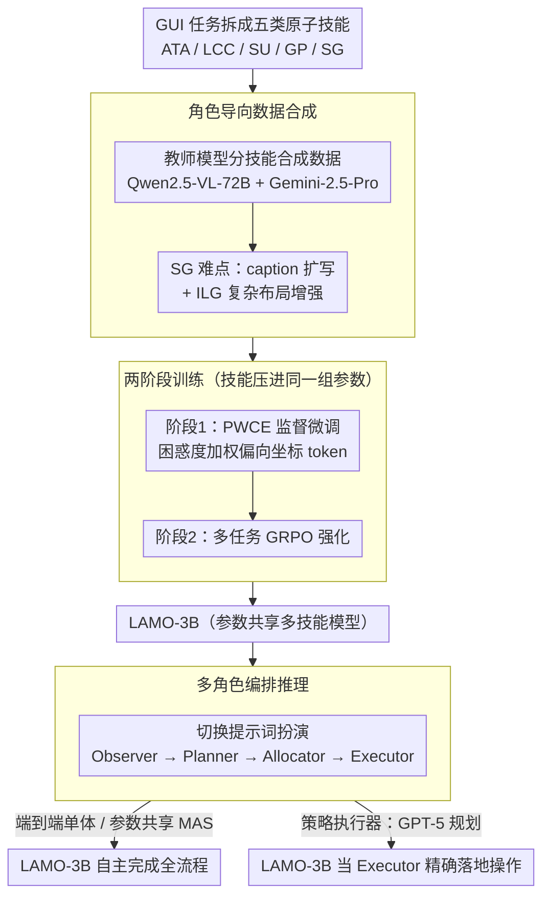

# Towards Scalable Lightweight GUI Agents via Multi-role Orchestration

**会议**: ACL 2026  
**arXiv**: [2604.13488](https://arxiv.org/abs/2604.13488)  
**代码**: [GitHub](https://github.com/BigTaige/LAMO)  
**领域**: LLM Agent / GUI自动化  
**关键词**: GUI Agent, 轻量模型, 多角色编排, 策略执行器, 强化学习

## 一句话总结

本文提出 LAMO 框架，通过角色导向的数据合成和两阶段训练（SFT with Perplexity-Weighted Cross-Entropy + 多任务 RL），将轻量 3B MLLM 训练为可灵活编排多角色的 GUI Agent，在单体推理、多 Agent 协作和即插即用策略执行器三种模式下工作，搭配 GPT-5 规划器在 AndroidWorld 上达 77.6% 成功率，超越 72B 参数的专用 GUI Agent。

## 研究背景与动机

**领域现状**：基于 MLLM 的 GUI Agent 正从静态环境向复杂的在线真实场景演进。当前最先进的方法（如 UI-TARS-72B、Agent-S2）通过扩展参数规模和数据获得了显著提升，但部署成本极高。轻量 GUI Agent（≤7B）虽然在静态基准上表现不错，但在在线真实环境中性能急剧下降。

**现有痛点**：(1) 轻量 MLLM 受限于参数规模，在需要同时处理屏幕分析、策略决策和工具调用的端到端长时序任务中表现不佳；(2) 端到端的单体学习（episodic learning）将高层推理和低层执行耦合在固定管线中，导致任务可扩展性差，难以适配多 Agent 系统（MAS）；(3) 训练多个技能专家成本高昂——例如 Agent-S2 需要同时部署 UI-TARS-72B（视觉定位）、Tesseract OCR（文本定位）和 UNO（结构定位），系统成本极高；(4) 轻量 Agent 缺乏任务可扩展性，无法通过上下文工程灵活切换角色。

**核心矛盾**：成本-可扩展性困境——大模型有任务可扩展性但部署成本高，轻量模型部署廉价但能力受限且不可扩展。

**本文目标**：在轻量 MLLM 上实现任务可扩展性，通过参数共享和多角色编排，让 3B 模型在不同推理模式下灵活工作，并能作为即插即用的策略执行器搭配先进规划器持续受益。

**切入角度**：将 GUI 自动化分解为五个核心能力（动作-工具对齐 ATA、逻辑一致 CoT LCC、屏幕理解 SU、目标规划 GP、屏幕定位 SG），通过角色导向的数据合成和参数共享让单一 3B 模型承担多个角色。

**核心 idea**：用参数共享的多角色编排替代多个专用模型——一个轻量模型通过上下文工程切换为 Observer、Planner、Allocator、Executor 四个角色，实现 MAS 级别的性能。

## 方法详解

### 整体框架

LAMO 要回答的问题是：能不能让一个 3B 的轻量 MLLM 既具备 GUI 自动化所需的全部子能力，又能像多 Agent 系统那样灵活地分工协作。它的做法是先把 GUI 任务拆成五类原子技能，用教师模型为每类技能合成训练数据，再经过两阶段训练（PWCE 监督微调 + 多任务 GRPO）把这些技能压进同一组参数。训练完的 LAMO-3B 在推理时通过切换提示词扮演不同角色，从而支持三种由弱到强的工作模式：端到端单体推理、参数共享的多 Agent 协作、以及作为即插即用执行器搭配 GPT-5 这类先进规划器。

### 关键设计

**1. 角色导向数据合成：把长时序难题拆成可靠的子能力**

轻量模型在端到端长任务上表现糟糕，但单独处理某一项子能力时却足够可靠，于是本文把 GUI 自动化分解成五类任务——ATA（动作-工具对齐）、LCC（逻辑一致 CoT）、SU（屏幕理解）、GP（目标规划）、SG（屏幕定位），分别用 Qwen-2.5-VL-72B（ATA、SG）和 Gemini-2.5-Pro（SU、LCC、GP）合成数据，让一个模型通过参数共享同时学会全部技能。

其中定位（SG）最难，针对两个实际痛点做了专门处理：一是语义稀疏元素，把原始简短描述用教师模型扩写成语义丰富的 caption，训练时让模型同时预测丰富描述和坐标，迫使它真正"看懂"目标而非死记坐标；二是复杂布局干扰，通过规则增强把前景目标叠到背景屏幕上并加入干扰项，合成出 Intricate-Layout Grounding（ILG）数据，专门锻炼在拥挤界面中定位的能力。

**2. Perplexity-Weighted Cross-Entropy（PWCE）：让损失偏向最难的坐标 token**

SFT 能把文本推理学得不错，但预测出的坐标往往有系统性偏差——根因在于坐标 token 困惑度高，却和普通 token 共享相同的损失权重，模型缺乏对数值细节的感知压力。PWCE 据此按 token 困惑度动态加权：$w_i = \frac{1 + \alpha \frac{PPL_i}{\overline{PPL} + \epsilon}}{\frac{1}{|M|}\sum_{j \in M}(1 + \alpha \frac{PPL_j}{\overline{PPL} + \epsilon})}$，再算加权交叉熵 $\mathcal{L}_{PW} = \frac{1}{|M|}\sum_{i \in M} w_i \cdot CE(h_i^*, \tilde{y}_i)$，最终损失为 $\mathcal{L}_{PWCE} = \mathcal{L}_{CE} + \lambda \mathcal{L}_{PW}$。困惑度越高的坐标 token 权重越大，模型被迫把注意力投到这些不确定的数值上，从而显著改善定位精度——消融中移除 PWCE 在 ScreenSpot-pro 上掉了 38.3%。

**3. 多角色编排推理：一套参数演出整支团队**

为了在不堆参数的前提下获得 MAS 的优势，LAMO-3B 仅靠上下文工程就在推理时切换为四个角色：Observer 产出屏幕语义描述 $\mathcal{C}_{s2w}$，Planner 把目标分解为子任务 $\mathcal{C}_{plan}$ 与提示 $\mathcal{C}_{tips}$，Allocator 结合历史与上下文给出当前动作 $\mathcal{C}_{action}$，Executor 再把动作指令落成原子操作 $a_t$。这种分解让每个角色面对的上下文更短更聚焦，缓解了单体推理中的"lost-in-the-middle"和思维-行动幻觉。

更关键的是策略执行器模式：把规划职责交给更强的 MLLM（如 GPT-5）生成高层指令 $\mathcal{C}_{action}^*$，LAMO-3B 退居为可靠的"手"，只负责把指令转成精确的屏幕操作。这样轻量模型不必自己承担长程规划的短板，还能随着规划器持续进步而水涨船高，性能天花板被外部模型不断抬高。

### 一个完整示例

以 AndroidWorld 上"在购物 App 里搜索某商品并加入购物车"为例，策略执行器模式下的一轮交互如下：GPT-5 规划器读取任务后生成高层指令 $\mathcal{C}_{action}^*$="点击顶部搜索框并输入商品名"；LAMO-3B 作为 Executor 先观察当前截图，定位到搜索框的坐标，输出原子操作 $a_t$=点击 (x, y)，再输入文本；环境返回新截图后，规划器据此给出下一条指令"点击第一个搜索结果"，Executor 再次定位并执行。整个过程中 3B 模型从不做长程决策，只在每一步把抽象指令精确落地为屏幕操作，凭借 PWCE 强化过的定位能力保证点击落点准确。

### 损失函数 / 训练策略

SFT 阶段：1 epoch，学习率 4e-6，warmup ratio 0.03，global batch size 256，LoRA（rank 128, alpha 256）。RL 阶段：冻结视觉骨干，仅训练 merge layer 和 LLM，GRPO 1 epoch，学习率 1e-6，rollout batch 32，每样本 8 rollouts。多任务 RL 奖励：SU/GP 用 TF-IDF 相似度归一化，SG 用坐标距离，ATA 用工具类别和值的字符串匹配，加长度惩罚 $r_{penalty} = -\varphi \cdot \frac{length(y_{pred})}{L_{max}}$。

## 实验关键数据

### 主实验

**MiniWob++ 在线环境成功率**

| 方法 | 成功率 |
|------|--------|
| Qwen2.5-VL-3B | 34.6 |
| UI-TARS-7B | 58.7 |
| Gemini-2.5-pro (单体) | 71.0 |
| LAMO-3B (端到端) | 50.0 |
| LAMO-3B (MAS) | 60.9 (+21.8%) |
| LAMO-3B (Gemini-2.5-pro 规划) | **77.2** (+54.4%) |

**AndroidWorld 成功率**

| 方法 | 成功率 |
|------|--------|
| UI-TARS-72B | 46.6 |
| Agent-S2 | 54.3 |
| Mobile-Agent-V3 | 73.3 |
| LAMO-3B (Gemini-2.5-pro 规划) | 60.3 |
| LAMO-3B (GPT-5 规划) | **77.6** |

### 消融实验

**关键组件消融（相对 LAMO-3B 的性能下降）**

| 消融项 | SP | SP-v2 | SP-pro | MiniWob++ |
|--------|-----|-------|--------|-----------|
| 移除 ILG 数据 | -2.1% | -3.8% | -34.7% | -2.7% |
| 仅 SFT（无 RL） | -1.1% | -3.0% | -32.7% | -22.5% |
| 移除 PWCE | -1.7% | -3.5% | -38.3% | -26.9% |
| Qwen2.5-VL-3B (无训练) | -7.7% | -6.3% | -51.0% | -44.5% |

### 关键发现

- MAS 模式比端到端推理提升 21.8%（MiniWob++），策略执行器模式进一步提升 54.4%
- LAMO-3B + GPT-5 规划器在 AndroidWorld 上达 77.6%，超越 Mobile-Agent-V3（73.3%）和 UI-Venus-Navi-72B（65.9%）
- ScreenSpot-pro 上 LAMO-3B（36.1%）超越 UI-TARS-7B（35.7%）和多个 72B 模型
- PWCE 对复杂布局场景贡献最大：SP-pro 上移除导致 38.3% 下降
- RL 阶段对在线环境至关重要：仅 SFT 在 MiniWob++ 上下降 22.5%
- 在 OSWorld 上，LAMO-3B（38.5%）超越 UI-TARS-1.5-7B（28.2%），且仅比 Qwen2.5-VL-32B（43.6%）低 5.1 个点（参数少 10×）

## 亮点与洞察

- 策略执行器模式是一个极具前瞻性的设计——轻量模型不需要自己做规划，只需成为可靠的"手"，随着规划器（GPT-5 等）不断进步，整体性能天花板持续上升
- PWCE 损失函数针对 GUI Agent 的坐标预测问题设计了优雅的解决方案——困惑度加权让模型更关注不确定的数值 token
- 参数共享的多角色编排在不增加模型参数的情况下实现了 MAS 的优势，是一种高效的能力扩展方式
- InfiGUI-R1-3B 在静态环境有竞争力但在线环境暴跌（38.5 vs 10.3 in OSWorld），凸显了端到端学习的任务可扩展性缺陷

## 局限与展望

- 受限于 3B 参数，在需要超过 10 步的长时序任务中推理深度不足，仍需搭配大模型规划器
- 在桌面环境（特别是电子表格和需要软件先验的场景）表现不如移动端
- ILG 数据增强的合成质量和多样性仍有提升空间
- 未探索与更多类型规划器的组合效果（如开源规划器 vs 闭源规划器）

## 相关工作与启发

- **vs UI-TARS**: UI-TARS-72B 参数量是 LAMO-3B 的 24 倍，在 AndroidWorld 上仅达 46.6%，而 LAMO-3B + GPT-5 达 77.6%——证明"大执行器"不如"轻执行器+强规划器"
- **vs GUI-R1 / InfiGUI-R1**: 这些方法在端到端 episodic RL 上训练，静态环境表现好但在线环境崩溃；LAMO 通过角色分解实现了更好的任务可扩展性
- **vs Agent-S2**: Agent-S2 使用多个大参数专用执行器（UI-TARS-72B + Tesseract + UNO），系统成本极高；LAMO-3B 用一个 3B 模型完成所有执行功能

## 评分

- 新颖性: ⭐⭐⭐⭐⭐ PWCE 损失、角色导向数据合成、参数共享多角色编排三个设计均有独创性，策略执行器模式有很强的实用前瞻性
- 实验充分度: ⭐⭐⭐⭐⭐ 横跨静态（ScreenSpot-pro, AndroidControl）和在线（MiniWob++, AndroidWorld, OSWorld）五个基准，消融详细
- 写作质量: ⭐⭐⭐⭐ 问题定义清晰，三种推理模式的层次感强，但符号系统略复杂
- 价值: ⭐⭐⭐⭐⭐ 为轻量 GUI Agent 指出了"执行器+规划器"的可行路径，77.6% AndroidWorld 成功率是实打实的顶尖水平

<!-- RELATED:START -->

## 相关论文

- [\[ICML 2026\] NaviAgent: Graph-Driven Bilevel Planning for Scalable Tool Orchestration](../../ICML2026/llm_agent/naviagent_graph-driven_bilevel_planning_for_scalable_tool_orchestration.md)
- [\[ACL 2026\] Lightweight LLM Agent Memory with Small Language Models](lightweight_llm_agent_memory_with_small_language_models.md)
- [\[AAAI 2026\] History-Aware Reasoning for GUI Agents](../../AAAI2026/llm_agent/history-aware_reasoning_for_gui_agents.md)
- [\[ACL 2026\] LPO: Towards Accurate GUI Agent Interaction via Location Preference Optimization](lpo_towards_accurate_gui_agent_interaction_via_location_preference_optimization.md)
- [\[ACL 2025\] MAM: Modular Multi-Agent Framework for Multi-Modal Medical Diagnosis via Role-Specialized Collaboration](../../ACL2025/llm_agent/mam_modular_multi-agent_framework_for_multi-modal_medical_diagnosis_via_role-spe.md)

<!-- RELATED:END -->
