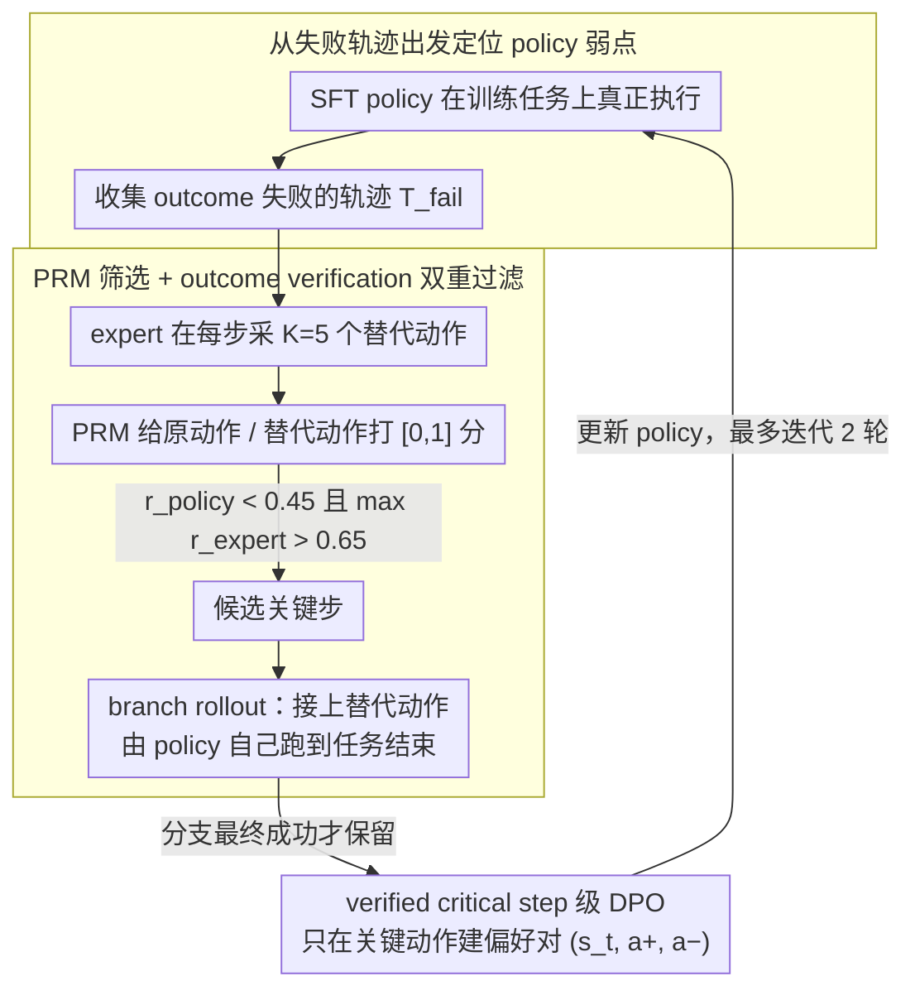

# Verified Critical Step Optimization for LLM Agents

**会议**: ACL2026  
**arXiv**: [2602.03412](https://arxiv.org/abs/2602.03412)  
**代码**: https://github.com/kiaia/CSO；https://github.com/Tencent/CognitiveKernel-Pro  
**领域**: llm_agent  
**关键词**: LLM Agent, 关键步骤优化, DPO, 过程奖励模型, 信用分配  

## 一句话总结
CSO 从 agent 自己失败的轨迹中找出“换一个动作就能让任务成功”的 verified critical steps，只在这些关键决策点构造 DPO 偏好对，从而用更少、更可靠的监督提升长程 LLM agent 的后训练效果。

## 研究背景与动机
**领域现状**：LLM agent 正在处理越来越长程的任务，例如网页搜索、工具调用、文件操作和多步信息综合。常见后训练路线是先用高质量轨迹做 SFT，再用 RL 或偏好优化提升实际执行能力。相比纯聊天模型，agent 的输出不是单个答案，而是一串状态、动作、观察交替组成的轨迹。

**现有痛点**：轨迹级方法把成功/失败奖励施加到整条轨迹上，容易把失败轨迹里的合理步骤一起惩罚，也可能强化成功轨迹中的偶然错误步骤。密集 step-level 方法看似更细，但往往依赖 PRM 对每一步的估计分数，PRM 噪声会在长程任务中放大。Monte Carlo 式 step reward 又需要从每个中间状态继续 rollout，成本很高。

**核心矛盾**：agent 轨迹中并非每一步都值得学习。许多步骤只是顺序执行或信息搬运，真正决定成功/失败的是少数分叉点，例如选择哪个工具、如何写搜索 query、如何从页面中抽取证据。后训练需要精细信用分配，但不应对所有步骤同等建模。

**本文目标**：作者希望找到一种介于轨迹级 DPO 和昂贵在线 RL 之间的方法：只学习那些被验证能改变最终结果的关键步骤，既避免全轨迹粗粒度奖励，也避免对每一步都相信 PRM 估计。

**切入角度**：论文借鉴 RLVR 中“少数高熵 token 驱动有效学习”的观察，把长程 agent 里的关键 action 视为类似的稀疏学习位置。它从当前 policy 的失败轨迹出发，让 expert 提供候选替代动作，再用 outcome verification 判断这些动作是否真的能把失败分支翻成成功分支。

**核心 idea**：先用 PRM 高效筛出“policy 原动作差、expert 替代动作好”的候选关键步，再通过从替代动作继续 rollout 到任务结束来验证结果，只有 verified 成功的分支才被构造成 DPO 偏好对。

## 方法详解
CSO 的核心不是给每一步打更准的 reward，而是改变训练数据的构造方式。它把 agent 后训练视为一个“从失败中定位关键错误”的过程：让当前 policy 真正执行任务，收集失败轨迹；在每个可能的决策点，让 expert 生成若干替代动作；用 PRM 先筛选候选关键点；再把 expert 替代动作接到原轨迹状态上，让 policy 自己继续执行后续步骤。只有当这个分支最终成功，作者才认为该步骤是 verified critical step，并把“expert 替代动作优于原 policy 动作”写成偏好对。

### 整体框架
论文把 agent 轨迹形式化为 $\tau=(s_1,a_1,o_1,\ldots,s_T,a_T,o_T)$，其中 $s_t$ 包含原始任务和历史交互，$a_t$ 是 policy 在该状态下的动作，$o_t$ 是环境返回的观察，最终 outcome $y\in\{0,1\}$ 表示任务是否成功。模型先经过 SFT，得到能基本执行任务的 policy $\pi_\theta$，但它仍会在某些关键决策处失败。

CSO 分为六步：第一，部署当前 policy 收集失败轨迹；第二，在失败轨迹的每个步骤上用 expert model 采样 $K=5$ 个替代动作；第三，用 PRM 对 policy 原动作和 expert 替代动作打 $[0,1]$ 分数；第四，把满足 $r^{policy}_t<\gamma_{low}$ 且 $max_j r^{expert}_{t,j}>\gamma_{high}$ 的步骤作为候选关键步，主实验中 $\gamma_{low}=0.45$、$\gamma_{high}=0.65$；第五，对高分 expert 替代动作做 branch rollout，即替换当前动作后由 policy 自己继续完成任务；第六，只保留最终成功的分支，构造 $(s_t,a_t^+,a_t^-)$ 偏好对并用 DPO 训练。

### 关键设计

**1. 从失败轨迹出发定位 policy 弱点：训练数据对准模型真正会犯错的状态分布**

如果只从 expert 成功 demo 里泛化，模型可能学到超出自身能力的动作；如果只看成功轨迹，又无从知道 policy 的具体短板在哪。CSO 反过来，先让当前 policy 在训练任务上真正执行，把 outcome 为失败的轨迹收集成 $\mathcal{T}_{fail}$，所有后续候选关键步都只从这些失败轨迹里产生。失败轨迹天然提供了半 on-policy 的状态覆盖，让学习信号直接落在「模型此刻最需要被修正」的地方，而不是遥不可及的 expert 状态上。

**2. PRM 筛选 + outcome verification 双重过滤：把 PRM 从监督者降级为召回器**

step-level 方法直接拿 PRM 分数当 reward，但 PRM 估计本身有噪声，长程任务里会被放大；而要给每一步都做 Monte Carlo 验证又太贵。CSO 把这两件事分开：PRM 只当候选召回器，找出「原动作低分、至少一个 expert 替代动作高分」的步骤——具体地，保留满足 $r^{policy}_t < \gamma_{low}$ 且 $\max_j r^{expert}_{t,j} > \gamma_{high}$ 的位置，主实验取 $\gamma_{low}=0.45$、$\gamma_{high}=0.65$；随后才对这些高分 expert 替代动作做 branch rollout，用最终任务正确性来精确确认这一步是否真的能翻盘。PRM 负责高召回的初筛、outcome verification 负责精确的终判，于是既不必验证海量分支，也不会让 PRM 噪声直接污染训练目标。

**3. verified critical step 级 DPO：学习信号只施加到能改变成败的局部动作上**

轨迹级 DPO 会把整段成功/失败轨迹拿来互相对比，信用分配很粗——失败轨迹里的合理步骤会被一起惩罚，成功轨迹里的偶然错误又被强化。CSO 只对验证过的关键步建偏好对 $(s_t, a_t^+, a_t^-)$，其中 $a_t^+$ 是使分支最终成功的 expert 替代动作、$a_t^-$ 是原失败轨迹里的 policy 动作，训练目标写作

$$L_{CSO}=-\mathbb{E}\log\sigma\!\Big(\beta\log\frac{\pi_\theta(a_t^+|s_t)}{\pi_{ref}(a_t^+|s_t)}-\beta\log\frac{\pi_\theta(a_t^-|s_t)}{\pi_{ref}(a_t^-|s_t)}\Big)$$

把偏好只压在稀疏的关键动作上，减少了大量无关 token 对训练目标的干扰，也让信用分配比轨迹级精细得多。

### 一个完整示例：一条失败轨迹如何变成一个偏好对

设 policy 在某个 GAIA 任务上跑出一条失败轨迹，共 12 步。CSO 先在每一步用 expert model 采 $K=5$ 个替代动作，再让 PRM 给原动作和这些替代动作打 $[0,1]$ 分。绝大多数步骤要么原动作分就不低、要么替代动作也没明显更好，被直接跳过；只有第 7 步——policy 当时选错了搜索工具、原动作得分 0.3，而某个 expert 替代动作（改用网页检索并重写 query）得分 0.8——同时满足 $r^{policy}<0.45$ 和 $\max_j r^{expert}>0.65$，进入候选。接着系统把这个 expert 替代动作接到第 7 步的状态上，让 policy 自己继续往下跑后 5 步：这一次任务成功了，于是第 7 步被确认为 verified critical step，构造出偏好对 $(s_7,\,a_7^+\!=\text{网页检索动作},\,a_7^-\!=\text{原搜索工具动作})$。注意正例之所以「够得着」，正是因为后续步骤仍由 policy 亲自执行——它学的是「在一个更好的起点下自己能走通的轨迹」，而非 expert 的完整 demo。这样层层过滤后，一轮下来全数据集只留下约 671 个高质量偏好对。

### 损失函数 / 训练策略
基础模型是 CK-Pro-8B，一个基于 Qwen3-8B SFT 的 agent policy，运行在 Cognitive Kernel Pro 框架中。训练数据从 CK-Pro-8B 的 47K SFT 任务轨迹出发，通过 policy 执行收集失败案例。expert model 和 PRM 主实验都使用 Claude-3.7-Sonnet，PRM 采用 rubric-based prompt，考察代码正确性、任务相关性、逻辑推进、信息利用和思考质量。DPO 训练使用 LlamaFactory，KL 系数 $\beta=0.5$。框架支持迭代训练：每轮更新 policy 后重新收集失败轨迹，构造新的 $\mathcal{D}_{pref}$，并把上一轮 policy 作为 reference，最多进行 2 轮主训练。

## 实验关键数据

### 主实验
实验使用 GAIA-Text-103 和 XBench-DeepSearch2505。GAIA-Text-103 是 GAIA 的文本子集，包含 L1/L2/L3 三个难度；XBench-DeepSearch 是需要深度搜索和证据综合的复杂任务。评测遵循 WebThinker/CK-Pro-8B 协议，用 LLM judge 参考 gold answer 判断输出是否正确。

| 模型/方法 | GAIA L1 | GAIA L2 | GAIA L3 | GAIA All | XBench Score |
|-----------|---------|---------|---------|----------|--------------|
| GPT-4.1 | 56.4 | 44.2 | 16.7 | 45.6 | 27.0 |
| Claude-3.7-Sonnet | 76.9 | 57.7 | 33.3 | 62.1 | 41.0 |
| Qwen3-8B | 35.9 | 13.5 | 0.0 | 20.4 | 7.0 |
| CK-Pro-8B (SFT) | 46.2 | 34.6 | 8.3 | 35.9 | 23.0 |
| CK-Pro-8B + ETO | 51.2 | 36.5 | 8.3 | 38.9 | 22.0 |
| CK-Pro-8B + RFT | 51.2 | 28.8 | 8.3 | 34.9 | 20.0 |
| CK-Pro-8B + Step-DPO | 53.3 | 34.6 | 8.3 | 38.9 | 25.0 |
| CK-Pro-8B + IPR | 56.4 | 42.3 | 16.7 | 44.6 | 24.0 |
| CK-Pro-8B + CSO | 61.5 | 48.1 | 16.7 | 49.5 | 29.0 |

### 消融实验

| 配置 | GAIA-Text | 样本数/成本 | 说明 |
|------|-----------|------------|------|
| Expert Success + Expert Failure | 46.6 | 同一关键步集合 | 只对比 expert 自己的成败，不够贴近 policy 弱点 |
| Policy Success + Policy Failure | 42.7 | 同一关键步集合 | policy 成功动作质量有限，学习信号偏弱 |
| Expert Success + Policy Failure | 49.5 | 同一关键步集合 | 最优组合，正例高质量、负例来自 policy 真实失败 |
| PRM + Verification | 49.5 | 671 preference pairs | 性能最好且样本数最少 |
| w/o PRM | 48.5 | 1,967 preference pairs | 不先筛选也能接近，但验证成本约 3 倍 |
| w/o Verification | 43.6 | 4,126 preference pairs | PRM-only 噪声明显，性能大幅下降 |

| 分析项 | 结果 | 含义 |
|--------|------|------|
| 分支候选数 $k=3$ | GAIA 46.6，XBench 26.0 | 候选太少，探索不足 |
| 分支候选数 $k=5$ | GAIA 49.6，XBench 29.0 | 最佳成本效果平衡 |
| 分支候选数更大 | GAIA 49.6，XBench 28.0 | 收益饱和，验证成本增加 |
| PRM Claude-3.7-Sonnet | CSO 61.5，Step-level BoN 56.2 | 同一 PRM 下 CSO 优于直接用 PRM 选动作 |
| PRM GPT-4.1 | CSO 53.3，Step-level BoN 48.7 | PRM 质量影响明显，但验证仍能缓解噪声 |
| per-round 额外 token | CSO 约 168M，Step-DPO 约 141M，ETO 约 212M | CSO 比 Step-DPO 多 19%，但比 ETO 低得多 |

### 关键发现
- CSO 在 GAIA-Text-103 上从 SFT 的 35.9 提升到 49.5，相对提升约 37%；XBench 从 23.0 到 29.0，相对提升约 26%。
- CSO 的 8B 开源 agent 在 GAIA All 上达到 49.5，超过 GPT-4.1 的 45.6，说明关键步骤级后训练能明显放大小模型 agent 的执行能力。
- IPR 也使用 outcome-grounded step-level 信号，但仍把结果传播给更多步骤；CSO 只保留 verified critical steps，因此比 IPR 高 5.0 个 GAIA All 点。
- 手工分类显示 critical steps 分布广：工具调用错误 26.1%，推理错误 25.1%，其他错误 24.1%，任务理解错误 13.0%，信息抽取错误 11.7%。这说明 CSO 找到的不是固定位置，而是多种语义关键决策。

## 亮点与洞察
- 论文最强的点是把 PRM 从“直接监督者”降级为“候选召回器”。这很像检索系统里的 high-recall first stage：允许 PRM 有噪声，但最终必须由真实 outcome 验证。
- 从失败轨迹出发非常适合 agent。agent 的错误往往和当前框架、工具、提示格式绑定，直接修 policy 自己会失败的位置，比泛化学习 expert 成功轨迹更精准。
- “可达性”设计很重要：branch rollout 后续步骤仍由 policy 自己执行。这样正例不是遥不可及的 expert 轨迹，而是 policy 在一个更好关键动作起点下能够完成的轨迹。
- CSO 的思想可以迁移到代码 agent、网页 agent、自动科研 agent：不必给每一步 dense reward，只要找出少数能改变最终结果的工具调用、搜索 query 或解析动作。

## 局限与展望
- outcome verification 需要把分支执行到任务结束，在复杂在线环境中仍然耗时。论文虽然显示额外 token 成本可控，但真实 wall-clock 和工具调用费用可能更敏感。
- 主实验依赖 Claude-3.7-Sonnet 作为 expert 和 PRM，虽然附录显示 GPT-4.1 与 Qwen3-235B-A22B 也能提升，但最强结果仍来自闭源模型。
- 方法需要有可靠的最终正确性判断。对于开放式任务、主观写作任务或没有明确 gold answer 的 agent 工作流，verified outcome 的定义会更难。
- 当前 PRM 与 policy 没有联合训练；如果 policy 进步后错误类型发生变化，PRM rubric 可能需要动态适配。

## 相关工作与启发
- **vs 轨迹级 ETO/DPO**: ETO 对整条成功/失败轨迹做偏好学习，信用分配粗；CSO 只对 verified critical step 建偏好，能避免把无关步骤一起惩罚。
- **vs Step-DPO / AgentRPM**: Step-level 方法依赖 PRM 对每一步的估计分数，细但噪声大；CSO 用 PRM 找候选，再用最终结果确认，减少 PRM 噪声进入训练目标。
- **vs IPR**: IPR 用 outcome verification 构造 step-level 信号，但仍可能让 outcome 污染非关键步骤；CSO 通过“原动作低分 + expert 替代高分 + branch 成功”三重条件只保留稀疏关键点。
- **vs 在线 RLVR**: 在线 RLVR 更贴近 policy 分布，但 rollout 成本高且 reward 稀疏；CSO 用离线/半在线 DPO 达到更稳定的数据效率。

## 评分
- 新颖性: ⭐⭐⭐⭐⭐ verified critical step 这个训练单元很清晰，把 PRM、branch rollout、DPO 组合得有新意。
- 实验充分度: ⭐⭐⭐⭐☆ 主实验、数据源消融、PRM 使用分析、成本对比都较完整；开放式任务验证还不足。
- 写作质量: ⭐⭐⭐⭐☆ 问题拆解和方法流程很清楚，表格支持充分；部分实验依赖外部 agent 框架，复现门槛较高。
- 价值: ⭐⭐⭐⭐⭐ 对长程 agent 后训练的信用分配问题非常有价值，尤其适合需要工具调用和深度搜索的系统。

<!-- RELATED:START -->

## 相关论文

- [\[ACL 2026\] Hierarchical Reinforcement Learning with Augmented Step-Level Transitions for LLM Agents](hierarchical_reinforcement_learning_with_augmented_step-level_transitions_for_ll.md)
- [\[ACL 2026\] SEARL: Joint Optimization of Policy and Tool Graph Memory for Self-Evolving Agents](searl_joint_optimization_of_policy_and_tool_graph_memory_for_self-evolving_agent.md)
- [\[AAAI 2026\] DEPO: Dual-Efficiency Preference Optimization for LLM Agents](../../AAAI2026/llm_agent/depo_dual-efficiency_preference_optimization_for_llm_agents.md)
- [\[ACL 2026\] Agent-GWO: Collaborative Agents for Dynamic Prompt Optimization in Large Language Models](agent-gwo_collaborative_agents_for_dynamic_prompt_optimization_in_large_language.md)
- [\[ICLR 2026\] Exploratory Memory-Augmented LLM Agent via Hybrid On- and Off-Policy Optimization](../../ICLR2026/llm_agent/exploratory_memory-augmented_llm_agent_via_hybrid_on-_and_off-policy_optimizatio.md)

<!-- RELATED:END -->
