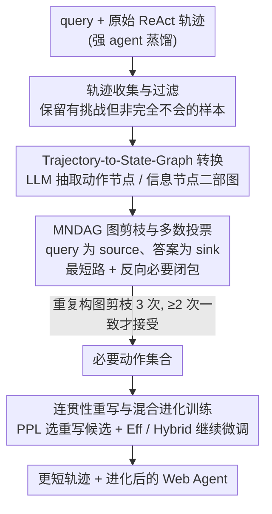

# WebClipper: Efficient Evolution of Web Agents with Graph-based Trajectory Pruning

**会议**: ACL2026  
**arXiv**: [2602.12852](https://arxiv.org/abs/2602.12852)  
**代码**: https://github.com/AQ-MedAI/AntAFu-DeepResearch  
**领域**: LLM Agent  
**关键词**: Web Agent、轨迹剪枝、状态图、工具调用效率、Agent 训练

## 一句话总结
WebClipper 把 Web Agent 的长工具调用轨迹建模成“动作节点-信息节点”状态图，再挖掘最小必要 DAG 来剪掉循环搜索和无效分支，使 Deep Research 类 agent 平均减少约 21% 工具轮次和 19.4% token，同时保持甚至提升准确率。

## 研究背景与动机
**领域现状**：Deep Research 类 Web Agent 已经能处理复杂信息检索任务，典型系统会反复搜索、访问网页、运行代码并最终生成答案。现有开源 agent 主要追求最终正确率，通过更长上下文、更深搜索和更多工具调用来提升覆盖率。

**现有痛点**：这种“多搜一点总没坏处”的策略在真实部署中代价很高。Tongyi-DeepResearch 允许最多 100 轮工具调用，MiroThinker 甚至允许到 600 轮；如果后端使用商业搜索、网页解析或代码执行工具，延迟和成本都会迅速上升。更糟的是，长轨迹不一定带来更高正确率，很多错误来自重复验证、偏离主问题或在噪声分支上越走越远。

**核心矛盾**：Web Agent 的有效信息往往稀疏分布在长轨迹里，最终答案只依赖少数关键动作和观测，但训练数据却把所有绕路步骤都保留下来。直接剪短轨迹又容易破坏 ReAct 结构，让剩余 thought 提到已经删除的 observation，产生不连贯的训练信号。

**本文目标**：作者希望不从头训练一个新 agent，而是把已有高性能但低效率的 Web Agent 继续进化成更省工具调用的版本。具体目标是在不牺牲准确率的情况下，去掉冗余搜索、循环验证和无效分支，并用统一指标衡量准确率与效率的平衡。

**切入角度**：论文的关键观察是，agent 轨迹可以被抽象为状态图：动作产生信息，后续动作依赖已有信息。这样一来，“哪些步骤对最终答案真正必要”就可以变成图上的最小必要子图挖掘问题，而不是让另一个 LLM 粗略判断每一步是否多余。

**核心 idea**：用图结构显式表示工具调用轨迹中的信息依赖，挖掘从初始问题到最终答案的最小必要 DAG，再经过连贯性重写和继续训练，让 agent 学会更短、更聚焦的搜索路径。

## 方法详解
WebClipper 不是推理时即时剪枝，而是一个训练数据加工与 agent evolution 框架。它先从强 agent 蒸馏原始轨迹，再把轨迹转成状态图，找出必要动作集合，删除冗余步骤，重写被剪断的 thought，最后用这些精炼轨迹继续微调原 agent。

### 整体框架
输入是一批 query 及原始 Web Agent 生成的 ReAct 轨迹，每条轨迹形式上包含初始 observation、每轮 thought、action 和新的 observation。输出是更短但仍能支撑正确答案的轨迹集合，以及在这些轨迹上继续训练后的 agent。

流程分为四个阶段。第一，收集并过滤初始轨迹，只保留对原 agent 有一定挑战但并非完全不会的样本。第二，将轨迹转成由 Action nodes 和 Information nodes 构成的有向二部图。第三，在图上寻找近似 minimum necessary DAG，得到必要动作集合。第四，对剪枝后的轨迹做 coherence-aware thought rewriting，并用效率导向或混合训练策略继续训练 agent。

### 关键设计

**1. Trajectory-to-State-Graph 转换：把线性工具调用还原成信息依赖图，让“哪步多余”有据可查**

长轨迹里的冗余不是简单的“文字太长”，而是信息依赖链上长出了无用环路和分支——光看每轮文本很难判断某次搜索到底有没有为最终答案做贡献。WebClipper 把轨迹抽象成一张有向二部图：动作节点 $A_t$ 代表第 $t$ 轮 agent 的 thought 和 action，信息节点 $I_t$ 代表环境返回的原子信息。某个动作若依赖某条信息就连一条 $I \rightarrow A$ 边，若产生新信息就连一条 $A \rightarrow I$ 边。这张图由 LLM extractor 构造：它先抽取每轮 action 的类型和目标，再把 observation 拆成原子信息，并判断后续动作究竟依赖了哪些信息。依赖关系一旦显式化，剪枝就能落在“信息通路”上，比让另一个 LLM 逐轮主观判断每步是否多余要细得多。

**2. MNDAG 图剪枝与多数投票：在图上挖最小必要 DAG，只留支撑答案的关键路径**

按语义相似度或 LLM 主观打分去删 turn，很容易把关键证据一并误删。WebClipper 把剪枝定义成一个明确的图问题：初始 query 节点是 source，最终 answer action 是 sink，动作节点成本为 1、信息节点成本为 0——因为真正昂贵的是工具调用轮次，信息本身只是依赖证据。它先用 Dijkstra 风格的最短路搜索找低成本路径，再从最终答案反向闭包必要前驱，把所有可能支撑答案的关键依赖都收进必要动作集合。考虑到 LLM 构图本身不稳定，同一条轨迹会重复构图、剪枝三次，只有至少两次得到相同必要动作集合时才接受这次剪枝，用多数投票换来更高的置信度。

**3. 连贯性重写与混合进化训练：把剪断的轨迹缝合成自然 ReAct 数据，并在效率与准确率间留一个旋钮**

剪枝会让两个保留动作在原轨迹里不再相邻，后一个 thought 可能仍提到已经被删掉的 observation，直接拿去 SFT 会教模型养成“凭空引用不存在观察”的坏习惯。WebClipper 因此对被剪断处的 thought 做 coherence-aware 重写：基于完整上下文和被删掉的中间步骤生成多个候选，再用 base model 的 perplexity 选出最贴合其语言风格的一版，避免训练分布偏移。训练阶段提供两个旋钮——Eff 只用剪枝轨迹，适合成本敏感部署；Hybrid 把剪枝轨迹和来自不同 query 的未剪枝困难轨迹混在一起，保留一部分长链搜索能力，让 agent 在确实需要深挖时不至于因为只学过短轨迹而过度保守。

### 损失函数 / 训练策略
训练目标是普通轨迹似然最大化。效率导向训练在剪枝轨迹集合上优化 $L_{eff}=-\sum_{\tilde{\tau}}\log P_M(\tilde{\tau})$；混合训练在剪枝轨迹和未剪枝困难轨迹并集上优化 $L_{hybrid}=-\sum_{\tau^*}\log P_M(\tau^*)$。评测时作者提出 F-AE Score，将 accuracy 与效率分数 $E=1-Rounds/Max\_Rounds$ 做调和平均，形式为 $F\text{-}AE=2\times Acc\times E/(Acc+E)$，实验中 $Max\_Rounds=100$。

## 实验关键数据

### 主实验
作者以 Tongyi-DeepResearch 为主要 base agent，在 xbench-deepsearch、Browsecomp、GAIA、HLE 四个 benchmark 上评估。WebClipper(Eff) 更偏节省工具调用，WebClipper(Hybrid) 更偏综合准确率。

| 方法 | xbench Acc / F-AE / Rounds | Browsecomp Acc / F-AE / Rounds | GAIA Acc / F-AE / Rounds | HLE Acc / F-AE / Rounds |
|------|----------------------------|--------------------------------|--------------------------|-------------------------|
| Tongyi-DeepResearch | 0.713 / 0.779 / 14.26 | 0.410 / 0.385 / 63.70 | 0.682 / 0.733 / 20.56 | 0.358 / 0.487 / 23.92 |
| WebClipper (Eff) | 0.713 / 0.792 / 10.81 | 0.427 / 0.431 / 56.50 | 0.684 / 0.760 / 14.44 | 0.353 / 0.492 / 18.60 |
| WebClipper (Hybrid) | 0.733 / 0.797 / 12.57 | 0.467 / 0.428 / 60.42 | 0.695 / 0.744 / 19.92 | 0.361 / 0.495 / 21.07 |

与原始 Tongyi-DeepResearch 相比，Eff 版本在平均意义上减少约 21% 工具调用轮次和 19.4% token，同时保持相当或更高准确率。Hybrid 版本平均准确率提升约 4.8%，工具轮次仍减少约 7%，说明混合轨迹能在不完全牺牲效率的情况下补回复杂任务能力。

| 剪枝/训练方法 | xbench Acc / Rounds / Token | Browsecomp Acc / Rounds / Token | 主要结论 |
|---------------|-----------------------------|----------------------------------|----------|
| Prompt Control | 0.676 / 12.50 / 6321 | 0.373 / 62.80 / 12222 | 只靠提示约束轮次，降得不多且掉准确率 |
| Coarse Prune | 0.603 / 8.85 / 4774 | 0.220 / 37.10 / 8365 | 粗剪能缩短轨迹，但严重损害正确率 |
| WebClipper (Eff) | 0.713 / 10.81 / 5931 | 0.427 / 56.50 / 10599 | 保持准确率并显著减少调用 |
| WebClipper (Hybrid) | 0.733 / 12.57 / 6205 | 0.467 / 60.42 / 11507 | 准确率最高，效率仍优于原模型 |

### 消融实验
组件消融主要验证三个设计：图剪枝、PPL-based rewrite selection 和 context-aware selective rewriting。论文的图示显示，移除任一组件都会退化，其中去掉上下文选择性重写最严重，因为剩余 thought 会引用被删除的上下文，训练信号变得自相矛盾。

| 消融配置 | 改动 | 观察到的影响 | 原因解释 |
|----------|------|--------------|----------|
| w/o GP | 用粗粒度剪枝替代图剪枝 | 性能下降 | 单次 LLM 判断难以理解长轨迹依赖，容易误删或漏删 |
| w/o PPL-S | 不用 PPL 选择重写候选 | 性能下降 | 重写 thought 与 base model 风格不匹配，训练分布偏移 |
| w/o CSR | 无条件重写所有 thought，不给历史上下文 | 退化最严重 | 重写破坏原有逻辑，甚至引入和保留轨迹不一致的引用 |
| Unpruned-Distill | 直接用未剪枝困难轨迹 SFT | 准确率可升，但轮次变长 | 它放大了 base agent 的能力，也继承并强化了低效率行为 |

### 关键发现
- WebClipper(Eff) 在 GAIA 上尤其有效，工具轮次约从 20.56 降到 14.44，接近 30% 减少。作者认为 GAIA 中约 15% 是脑筋急转弯或逻辑题，不需要长工具链，剪枝训练能抑制过度依赖外部工具。
- F-AE 的价值在于不会单独奖励短轨迹。Kimi 等模型虽然轮次少，但准确率低，因此 F-AE 仍低；Tongyi 准确率高但轮次长，也被 F-AE 惩罚。
- case study 显示，baseline 常把注意力转移到枝节细节上，例如找到正确论文后又深挖题目中的次要材料，最终反而误答。WebClipper 学到的是沿关键路径前进，而不是盲目增加验证。

## 亮点与洞察
- 这篇论文把 agent 轨迹压缩从“删短文本”改成“保留信息依赖路径”，这比一般的 CoT compression 更适合工具调用场景。
- MNDAG 里的信息节点成本为 0、动作节点成本为 1，这个设计很自然：真正昂贵的是工具调用/动作轮次，而信息只是依赖证据。
- 多数投票是一个务实工程细节。既然构图依赖 LLM extractor，就不能假设单次图完全可靠；重复三次只接受一致结果，可以换来更高剪枝置信度。
- 连贯性重写是容易被忽略但很关键的部分。剪枝后的训练数据如果逻辑断裂，模型可能学到“凭空引用不存在观察”的坏习惯。

## 局限与展望
- WebClipper 继承 base agent 的能力边界。如果原 agent 本身不会做某类任务，剪枝只能去冗余，不能发现全新的解决策略。
- 当前评测主要集中在搜索、网页访问和代码执行工具。多模态工具、数据库查询、企业 API 等动作空间是否能直接套用同样的状态图，还需要验证。
- 构图和重写依赖大模型以及较重的离线处理，论文使用 Qwen3-235B 做 extractor/rewriter，并在 8×H800 上处理约 1 天。对小团队来说，构建剪枝轨迹的成本仍不可忽略。
- F-AE 依赖 $Max\_Rounds$ 的设定，不同部署预算下分数会变化。实际系统可能还需要同时考虑 token、延迟、API 价格和失败重试。

## 相关工作与启发
- **vs Deep Research / WebExplorer / WebDancer**: 这些工作多强调长程信息搜索能力和数据合成，WebClipper 关注的是已有 agent 的效率进化，目标从“更会搜”变成“少走弯路”。
- **vs Prompt Control**: prompt 里要求 agent 少调用工具只能弱约束行为，模型遇到不确定性仍会反复验证；WebClipper 通过训练数据改变搜索模式，效果更稳定。
- **vs CoT 压缩方法**: 单模型 reasoning compression 通常处理文本推理链，而 WebClipper 处理带环境反馈的 ReAct 轨迹，需要维护 action-observation 依赖和工具结果一致性。
- **对后续研究的启发**: 可以把状态图扩展为在线 memory graph，在推理时动态提醒 agent 哪些信息已获取、哪些分支无贡献；也可以把 MNDAG 信号转成 RL reward，直接惩罚无效工具调用。

## 评分
- 新颖性: ⭐⭐⭐⭐☆ 将 Web Agent 轨迹剪枝形式化为状态图和最小必要 DAG，问题建模很清楚。
- 实验充分度: ⭐⭐⭐⭐☆ 覆盖四个 benchmark、多种 baseline 和组件消融，但部分消融图缺少更细数字表述。
- 写作质量: ⭐⭐⭐⭐☆ 方法链条完整，F-AE 指标解释充分，个别表格在 HTML 中排版略拥挤。
- 价值: ⭐⭐⭐⭐⭐ 对长程 Web Agent 降成本非常实用，尤其适合需要商业搜索/API 的部署场景。

<!-- RELATED:START -->

## 相关论文

- [\[AAAI 2026\] Prune4Web: DOM Tree Pruning Programming for Web Agent](../../AAAI2026/llm_agent/prune4web_dom_tree_pruning_programming_for_web_agent.md)
- [\[ACL 2025\] Explorer: Scaling Exploration-Driven Web Trajectory Synthesis for Multimodal Web Agents](../../ACL2025/llm_agent/explorer_scaling_exploration-driven_web_trajectory_synthesis_for_multimodal_web_.md)
- [\[ACL 2026\] SEARL: Joint Optimization of Policy and Tool Graph Memory for Self-Evolving Agents](searl_joint_optimization_of_policy_and_tool_graph_memory_for_self-evolving_agent.md)
- [\[ICLR 2026\] ToolTree: Efficient LLM Agent Tool Planning via Dual-Feedback Monte Carlo Tree Search and Bidirectional Pruning](../../ICLR2026/llm_agent/tooltree_efficient_llm_agent_tool_planning_via_dual-feedback_monte_carlo_tree_se.md)
- [\[ACL 2026\] CoEvolve: Training LLM Agents via Agent-Data Mutual Evolution](coevolve_training_llm_agents_via_agent-data_mutual_evolution.md)

<!-- RELATED:END -->
