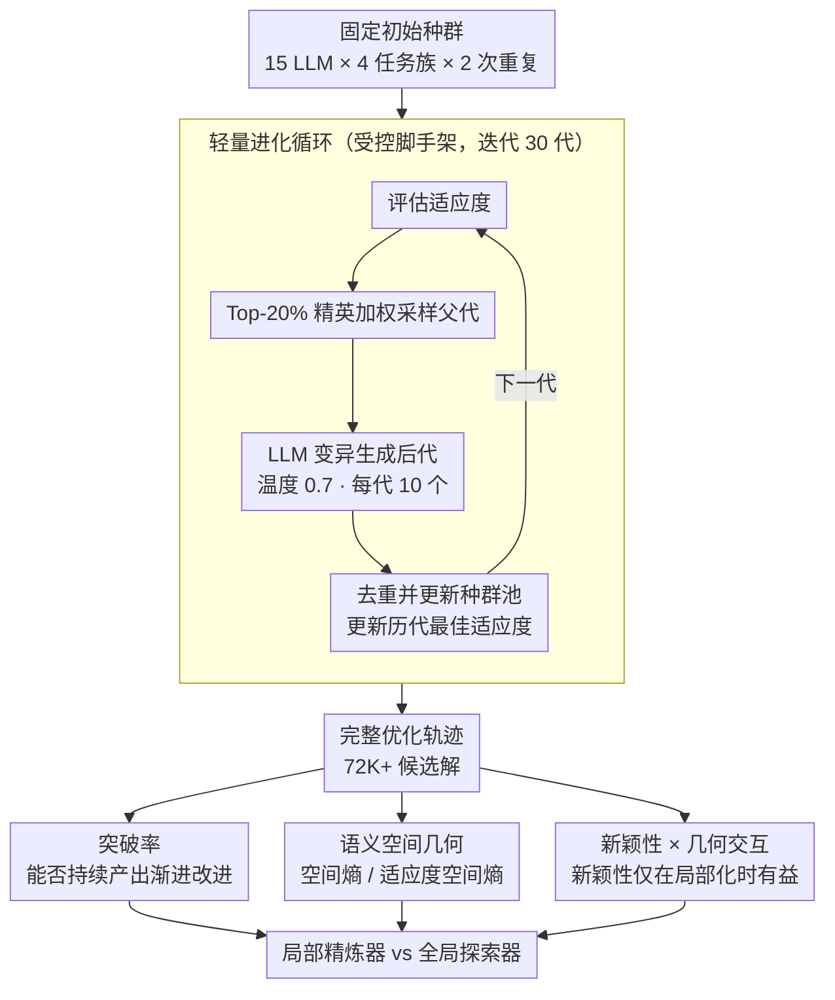

# What Makes an LLM a Good Optimizer? A Trajectory Analysis of LLM-Guided Evolutionary Search

**会议**: ACL 2026  
**arXiv**: [2604.19440](https://arxiv.org/abs/2604.19440)  
**代码**: [https://github.io/traj_evo_search](https://github.io/traj_evo_search)  
**领域**: LLM Agent / 优化  
**关键词**: LLM优化器, 进化搜索, 轨迹分析, 探索-利用权衡, 语义几何

## 一句话总结

本文通过大规模实验（15 个 LLM × 8 个任务、72K 候选解）发现优秀的 LLM 优化器表现为"局部精炼器"——持续产生频繁的渐进式改进并在语义空间中逐步集中搜索，而非产生高新颖性的跳跃式突破；关键发现是新颖性本身并不预测优化性能，只有当搜索保持足够局部化时新颖性才有益。

## 研究背景与动机

**领域现状**：LLM 越来越多地被嵌入进化搜索循环中作为黑盒优化器——在提示优化、科学发现、组合优化等领域通过迭代提出候选解、接收反馈、改进解来实现优化。

**现有痛点**：尽管 LLM 引导的进化工作流已展示了显著的经验增益，但驱动这些改进的机制仍不清楚。即使在严格控制的优化循环、选择规则和评估函数下，不同 LLM 表现出截然不同的优化轨迹和最终性能。

**核心矛盾**：直觉上，更多新颖性/多样性应该帮助探索更广的搜索空间，从而找到更好的解。但实际上，LLM 驱动的进化中探索并非盲目随机的——LLM 的语义先验已经约束了变异方向，所以经典的"更多新颖性=更好探索"等式不再成立。

**本文目标**：理解是什么让 LLM 成为好的优化器——差异是基础能力的反映还是搜索过程中更微妙的探索-利用动态的产物？

**切入角度**：不只看最终结果，而是分析完整的优化轨迹——在语义空间中如何搜索、突破何时发生、空间几何如何演化。

**核心 idea**：有效的 LLM 优化器是"局部精炼器"——它们的轨迹在语义空间中逐步集中到高性能区域，持续产生小幅改进；而非"全局探索器"——后者虽然新颖性高但漫无目的地漂移。

## 方法详解

### 整体框架

本文要回答的是"什么让一个 LLM 成为好的优化器"，因此它不提出新算法，而是把所有模型放进同一个被严格控制的轻量进化循环里，再去显微镜般地分析它们留下的搜索轨迹。这个循环以固定的初始种群为输入，每代先评估适应度、按 Top-20% 精英加权选出父代，再把父代作为上下文提示交给 LLM 做变异、生成新后代并更新种群；如此进化 30 代、每代 10 个后代。15 个 LLM × 4 个任务族（路线优化、提示优化、方程发现、启发式设计）× 2 次重复共产生 72K+ 个候选解（变异温度固定 0.7），输出则是每个模型完整的优化轨迹——后续所有指标都建立在这些轨迹上。在这些轨迹之上，本文用三把分析透镜逐层解释"为什么有的模型搜得好"：突破率回答"过程好不好"、语义空间几何回答"搜在哪、怎么收"、新颖性 × 几何交互回答"新颖性到底有没有用"。

### 关键设计

**1. 突破率：用搜索过程的质量解释优化结果**

仅凭模型的零样本能力无法解释一个反复出现的现象：基础能力相近的模型，最终优化结果却天差地别。为此本文定义"突破"为某个后代超过所有历代最佳适应度的事件，突破率 = 突破事件数 / 总代数，用它刻画一条轨迹能否持续产出改进。轨迹级回归（OLS）显示突破率的标准化系数最大、单独解释的方差也最多（约为零样本能力的两倍）；当把零样本能力与突破率一起放进模型时解释力进一步上升，而零样本能力的系数随之下降——说明基础能力的作用有相当一部分是经由突破率这个"过程变量"中介的，而不是直接决定结果。

**2. 语义空间几何：看搜索在哪、怎么收**

适应度曲线只告诉你结果好不好，却讲不清"为什么"成功或失败，因此本文把每个候选解嵌入任务特定的语义空间（TSP 用边集距离、提示用 embedding 余弦距离、方程用功能行为距离），再用核密度熵刻画搜索的空间形态。其中空间熵 $H_{\text{spatial}}$ 度量候选解整体的扩散程度，适应度空间熵 $H_{\text{fitness}}$ 度量高质量解的集中程度。强优化器的两个熵都随代数单调下降，意味着搜索逐步向高性能区域局部化收敛；弱优化器则始终维持高熵，表现为在空间里持续漫无目的地漂移。正是这套几何视角让"局部精炼器 vs 全局探索器"的区分变得可测量。

**3. 新颖性 × 几何的交互效应：新颖性只有在局部时才有用**

直觉上更高的新颖性应当帮助探索、找到更好的解，但代级混合效应回归给出了一个被条件化的结论：新颖性的正效应被"新颖性 × 空间熵"的强负交互项压住了。换句话说，只有当搜索已经足够局部化（空间熵低）时，新颖性才提高突破概率；高新颖性叠加高空间分散反而对应低突破概率，这一交互在并发与滞后分析中都显著。MDS 可视化进一步佐证：突破事件集中落在"高新颖性 + 低空间熵"的区域。这一发现直接打破了"更多新颖性 = 更好探索"的等式，揭示了 LLM 驱动进化中新颖性的条件性价值。

## 实验关键数据

### 主实验

**15 个 LLM 跨 8 个任务的优化性能分层**

| 模型层 | 代表模型 | 零样本性能 | 最终优化性能 | 突破率 |
|--------|---------|----------|------------|--------|
| 强优化器 | Gemini-1.5-Pro, GPT-4o | 高 | 最高 | 高（频繁渐进改进） |
| 中等优化器 | DeepSeek-V3 | 最高零样本 | 中高 | 中等 |
| 弱优化器 | Mistral-7B | 中等 | 低 | 低（稀疏突破+漂移） |

### 消融实验

| 预测因子 | 标准化系数 | 解释方差 | 显著性 |
|---------|----------|---------|--------|
| 零样本能力 | 正（中等） | ~25% | *** |
| 突破率 | 正（最大） | ~50% | *** |
| 平均新颖性 | ~0 | ~0% | n.s. |
| 初始新颖性 | ~0 | ~0% | n.s. |
| 零样本+突破率 | - | ~60% | *** |

### 关键发现

- DeepSeek-V3 在零样本中最强但长期优化中并非最佳，证实"好的解题者 ≠ 好的搜索算子"
- 小/便宜的模型在展现更可靠的精炼行为时可以超越更强的基础模型
- 新颖性完全不是优化性能的预测因子（系数接近 0，不显著）
- 扰动实验：通过模型混合直接操纵精炼行为，导致可预测的优化性能变化，验证了因果关系

## 亮点与洞察

- "局部精炼器"vs"全局探索器"的区分为理解 LLM 作为搜索算子提供了清晰的概念框架
- 新颖性的条件性价值是反直觉但严谨的发现——为设计更好的 LLM 优化器提供了直接指导
- 轨迹分析方法论本身是可复用的框架，可应用于任何 LLM 驱动的优化系统

## 局限与展望

- 实验规模虽大但每对模型-任务仅 2 次重复
- 语义距离的定义是任务特定的，通用性有限
- 未探索如何训练 LLM 成为更好的搜索算子
- 未来可开发专门的"搜索算子微调"策略，强调局部精炼能力

## 相关工作与启发

- **vs FunSearch/EoH**: 它们展示了 LLM 进化的端到端性能，本文解释了为什么某些 LLM 更适合作为搜索算子
- **vs van Stein et al. (2025)**: 行为空间研究将有效优化与持续改进关联，本文扩展到统一的跨模型跨任务分析
- **vs EvoTune**: 提出训练专用搜索算子，本文的发现为训练目标提供了指导（优化精炼行为而非通用能力）

## 评分

- 新颖性: ⭐⭐⭐⭐⭐ 首次大规模系统分析 LLM 作为进化搜索算子的轨迹行为
- 实验充分度: ⭐⭐⭐⭐⭐ 15 LLM × 8 任务、72K 解、混合效应回归和扰动实验
- 写作质量: ⭐⭐⭐⭐⭐ 分析逻辑严密，发现的实践含义阐述清楚
- 价值: ⭐⭐⭐⭐⭐ 为 LLM 优化系统的设计和模型选择提供了可操作的洞察

<!-- RELATED:START -->

## 相关论文

- [\[ACL 2026\] LiTS: A Modular Framework for LLM Tree Search](lits_a_modular_framework_for_llm_tree_search.md)
- [\[AAAI 2026\] AgentSwift: Efficient LLM Agent Design via Value-guided Hierarchical Search](../../AAAI2026/llm_agent/agentswift_efficient_llm_agent_design_via_value-guided_hierarchical_search.md)
- [\[ACL 2026\] HiGMem: A Hierarchical and LLM-Guided Memory System for Long-Term Conversational Agents](higmem_a_hierarchical_and_llm-guided_memory_system_for_long-term_conversational_.md)
- [\[ACL 2026\] Mem²Evolve: Towards Self-Evolving Agents via Co-Evolutionary Capability Expansion and Experience Distillation](mem2evolve_towards_self-evolving_agents_via_co-evolutionary_capability_expansion.md)
- [\[ACL 2026\] 为什么 LLM 网络代理失败：一个分层规划视角](why_do_llm-based_web_agents_fail_a_hierarchical_planning_perspective.md)

<!-- RELATED:END -->
