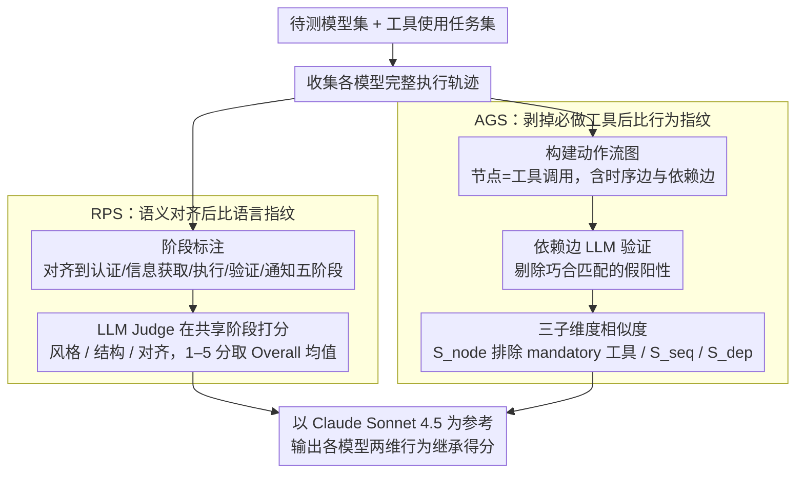

# When Agents Look the Same: Quantifying Distillation-Induced Similarity in Tool-Use Behaviors

**会议**: ACL 2026  
**arXiv**: [2604.21255](https://arxiv.org/abs/2604.21255)  
**代码**: [https://github.com/Syuchin/AgentEcho](https://github.com/Syuchin/AgentEcho)  
**领域**: LLM Agent  
**关键词**: 模型蒸馏、行为同质化、工具使用、Agent评测、行为相似度

## 一句话总结
本文提出了 RPS 和 AGS 两个互补指标来量化 LLM Agent 在工具使用行为上的蒸馏导致的同质化现象，通过区分必要行为和非必要行为，在 18 个模型上揭示了跨家族行为继承模式，发现 Kimi-K2 与 Claude Sonnet 4.5 的行为相似度甚至超过 Anthropic 自家模型。

## 研究背景与动机

**领域现状**：当前 LLM Agent 正经历"寒武纪大爆发"，大量高性能 Agent 不断涌现。然而，尽管这些模型来源各异，它们在推理步骤、工具调用习惯甚至失败模式上表现出高度一致的行为，暗示许多模型可能是少数主导教师模型的"蒸馏回声"。

**现有痛点**：现有的相似度度量方法主要关注静态对话中的响应级别相似性，无法捕捉多步工具使用轨迹的动态特性。更关键的是，这些方法无法区分"必要行为"（任务成功所必需的操作）和"非必要行为"（反映模型自主偏好的操作），导致相似度被任务本身要求的共同正确路径所膨胀。

**核心矛盾**：不区分必要行为和非必要行为，就无法判断两个模型趋同是因为只有一条正确路径，还是因为一个模型在盲目模仿另一个模型的习惯——这是量化蒸馏影响的根本障碍。

**本文目标**：设计一套系统框架来隔离非必要行为模式，从语言表达和工具操作两个维度量化 Agent 之间的蒸馏引发的行为同质化。

**切入角度**：作者观察到很多 Agent 会执行冗余的工具调用（如在答案显而易见时仍逐个尝试所有可用工具），这些非必要的行为选择恰恰是判断模型是否被蒸馏的"行为指纹"。

**核心 idea**：通过将 Agent 轨迹分解为必要行为和非必要行为，分别用 RPS（语言表达相似度）和 AGS（动作图相似度）两个指标来捕捉不同维度的行为继承信号。

## 方法详解

### 整体框架

框架的输入是一组待检测模型和一个工具使用任务集，目标是量化模型之间被蒸馏"传染"的行为同质化程度。具体做法是先收集每个模型在任务上的完整执行轨迹，再从两个正交维度切入：RPS 关注模型如何用语言表达回复（verbal fingerprint），AGS 关注模型如何选择和组织工具调用（behavioral fingerprint）。分析时以 Claude Sonnet 4.5 (thinking) 作为参考 oracle，计算其余模型与它的相似度，最终输出每个模型在两个维度上的行为继承得分。

### 关键设计

**1. Response Pattern Similarity（RPS）：在语义对齐后的阶段上比语言指纹**

直接拿整条轨迹或逐轮去对齐，会把功能上无关的内容也匹配进来，使评分变得不可靠——尤其当不同模型用不同轮次数完成同一任务时。RPS 因此采用两阶段管线：先做 Stage Annotation，把轨迹语义对齐到认证、信息获取、执行、验证、通知这五个规范阶段，保证只比较功能等价的交互片段；再在共享阶段上由 LLM Judge 从风格（Style）、结构（Structure）、对齐（Alignment）三个维度各打 1–5 分，取 Overall 分的均值作为两模型的语言相似度。

**2. Action Graph Similarity（AGS）：剥掉"必做"工具后再比行为指纹**

工具调用层面最大的陷阱是：任务本身只有一条正确路径时，模型们会因"被迫做对"而显得高度相似，从而虚高分数。AGS 先把对话轨迹建成有向图 $G=(V, E_s, E_d)$，节点是工具调用、$E_s$ 是时序边、$E_d$ 是依赖边（前一工具的输出被后一工具使用），再从三个子维度度量相似度：$S_{\text{node}}$ 是可选工具一致率，$S_{\text{seq}}$ 取写后验证率/写前确认率/错误重试率三维特征向量的余弦相似度，$S_{\text{dep}}$ 取输出复用率/最长依赖链长度/输出扇出率的余弦相似度。其中真正的关键是 $S_{\text{node}}$：它先用交集 $\mathcal{F}_t^{\text{mandatory}} = \bigcap_{M \in \mathcal{M}_t^*} \text{Tools}(M, t)$ 识别出所有成功模型都必须调用的 mandatory 工具并排除，只在可选工具上算一致性，从而避开因共同正确性带来的分数膨胀（平均膨胀达 12.2pp），把"自主偏好"这部分非必要行为单独暴露出来。

**3. 依赖边的 LLM 验证：让依赖图不被巧合污染**

依赖边若靠字符串匹配判定会产生大量假阳性——一个日期或 ID 恰好在两处出现，并不代表后者真的消费了前者的输出。为此每条候选依赖边都交给 LLM Judge 做语义有效性验证，判断匹配到的值是否确实来自源工具的输出，还是事先已知的信息（如用户输入）。这一步保证了 $E_d$ 的准确性，避免噪声边把 $S_{\text{dep}}$ 等依赖相关指标带偏。

## 实验关键数据

### 主实验

| 模型 | AGS (%) | RPS Overall | $S_{\text{node}}$ (%) | $S_{\text{dep}}$ (%) |
|------|---------|-------------|----------------------|---------------------|
| Claude Opus 4.1 (thinking) | 83.0 | 3.85 | 81.0 | 93.7 |
| Kimi-K2 (thinking) | 82.7 | 3.65 | 82.6 | 94.7 |
| GPT-4.1 | 79.5 | 3.15 | 75.9 | 88.0 |
| GPT-5 | 76.1 | 2.70 | 71.3 | 87.7 |
| DeepSeek-R1 | 78.6 | 3.05 | 78.3 | 85.0 |
| GLM-4.6 | 80.3 | 3.42 | 80.4 | 88.7 |
| Qwen3-235B (thinking) | 75.9 | 2.40 | 68.1 | 92.4 |

### 消融实验

| 配置 | AGS toward Teacher | AGS toward Control | 说明 |
|------|-------------------|-------------------|------|
| Baseline (未蒸馏) | 0.59 | 0.64 | 原始 Qwen2.5-14B |
| Distilled (蒸馏后) | 0.72 (+0.13) | 0.59 (-0.05) | AGS 呈现方向性信号 |
| GED Baseline | 0.42 | 0.39 | 原始对比 |
| GED Distilled | 0.65 (+0.23) | 0.59 (+0.20) | GED 无法区分方向 |

### 关键发现
- Within-family 模型对的 AGS 比 cross-family 高 5.9pp，验证了指标能捕捉行为继承
- Kimi-K2 (thinking) 的 $S_{\text{node}}$ 和 $S_{\text{dep}}$ 均超过 Anthropic 自家的 Opus 4.1，暗示强烈的跨家族行为继承
- RPS 和 AGS 的 Pearson 相关系数仅为 0.491，说明两个指标捕捉了独立的行为维度

## 亮点与洞察
- 将 mandatory/optional 工具的区分引入蒸馏检测是非常巧妙的设计，排除 mandatory 工具后 $S_{\text{node}}$ 平均降低 12.2pp，说明不做此区分会严重高估跨模型相似度。这一思路可推广到其他 Agent 行为分析场景。
- 受控蒸馏实验的方向性验证设计精巧：AGS 向教师方向增加（+0.13）而向对照方向减少（-0.05），而 GED 向两个方向都增加（+0.23/+0.20），清晰证明了 AGS 能区分"特定教师导向的趋同"与"通用能力提升"。
- 案例分析中发现 Kimi-K2 和 Claude 共享"热情肯定语气"（如 "Excellent!", "Perfect!"）和冗余验证偏好（先调用 find_user_id_by_email 再继续），而 GPT-5 风格完全不同，这些细粒度的行为指纹非常有说服力。

## 局限与展望
- 仅以 Claude Sonnet 4.5 (thinking) 为参考模型报告结果，完整的 18 模型两两比较需要 153 次对比，计算成本较高
- 评测仅覆盖 τ-Bench 和 τ²-Bench 的三个英语客服领域，对其他领域、任务类型和语言的泛化性有待验证
- RPS 依赖于特定领域的阶段分类法，推广到代码生成或多 Agent 协作等非工具使用范式需要进一步方法论工作

## 相关工作与启发
- **vs RSE (Lee et al., 2025)**: RSE 在模型响应上计算语义相似度，但不区分必要/非必要行为，导致无法检测蒸馏方向性（向教师和对照方向都上升）
- **vs GED (图编辑距离)**: GED 度量图结构差异但同样无法区分行为的必要性，蒸馏后 GED 向教师和非教师方向均大幅上升，丧失了方向性判别力

## 评分
- 新颖性: ⭐⭐⭐⭐⭐ 首次提出区分必要/非必要行为的工具使用蒸馏检测框架，切入点非常独特
- 实验充分度: ⭐⭐⭐⭐ 覆盖 8 个提供商 18 个模型，受控实验设计严谨，但仅限英语客服领域
- 写作质量: ⭐⭐⭐⭐⭐ 论文结构清晰，案例分析生动，从直觉到量化的论证链条完整
- 综合推荐: ⭐⭐⭐⭐⭐ 对理解当前 LLM 生态中的行为同质化现象具有重要价值

<!-- RELATED:START -->

## 相关论文

- [\[ACL 2026\] Robust Tool Use via Fission-GRPO: Learning to Recover from Execution Errors](robust_tool_use_via_fission-grpo_learning_to_recover_from_execution_errors.md)
- [\[ACL 2026\] Your LLM Agents are Temporally Blind: The Misalignment Between Tool Use Decisions and Human Time Perception](your_llm_agents_are_temporally_blind_the_misalignment_between_tool_use_decisions.md)
- [\[ACL 2026\] Mem²Evolve: Towards Self-Evolving Agents via Co-Evolutionary Capability Expansion and Experience Distillation](mem2evolve_towards_self-evolving_agents_via_co-evolutionary_capability_expansion.md)
- [\[ACL 2026\] Feedback-Driven Tool-Use Improvements in Large Language Models via Automated Build Environments](feedback-driven_tool-use_improvements_in_large_language_models_via_automated_bui.md)
- [\[ACL 2026\] ToolGrad: Efficient Tool-use Dataset Generation with Textual "Gradients"](toolgrad_efficient_tool-use_dataset_generation_with_textual_gradients.md)

<!-- RELATED:END -->
