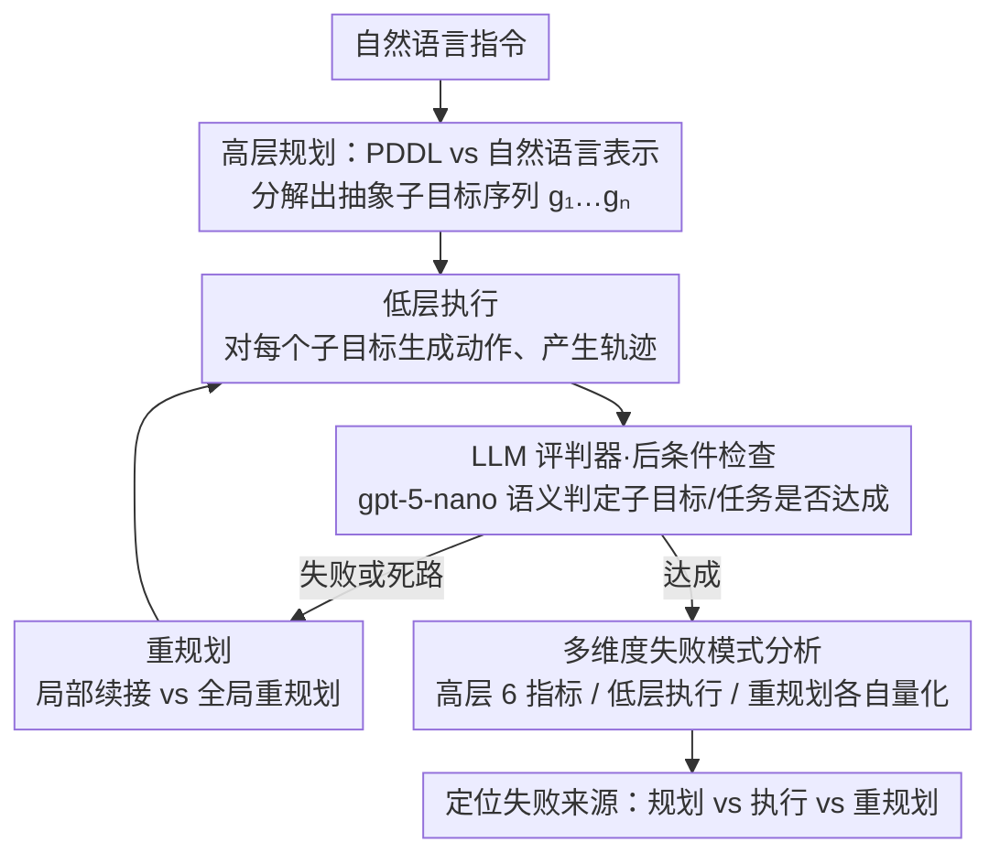

# 为什么 LLM 网络代理失败：一个分层规划视角

**会议**: ACL 2026  
**arXiv**: [2603.14248](https://arxiv.org/abs/2603.14248)  
**代码**: https://github.com/Ziyu-Yao-NLP-Lab/llm-hierarchical-web-agents  
**领域**: LLM Agent / 网络导航  
**关键词**: 网络代理失败分析, 分层规划, 自然语言 vs PDDL, 执行瓶颈

## 一句话总结

本文通过分层规划框架（高层计划、低层执行、重规划）系统分析 LLM 网络代理的失败原因，发现 PDDL 表示优于自然语言规划，但低层执行和感知接地是真正的瓶颈。

## 研究背景与动机

**领域现状**：LLM 网络代理在长任务上表现远低于人类水平，但现有评估主要关注端到端成功率，对失败来源的理解有限。

**现有痛点**：端到端的评估指标（如任务成功率）掩盖了真实问题——无法区分是高层规划错误、低层执行不足，还是重规划机制失效。

**核心矛盾**：不同组件的瓶颈不同，但现有方法混为一谈地优化整体性能，导致改进方向模糊不清。

**本文目标**：建立一个系统的分层评估框架，将网络代理的能力分解为三个独立的维度进行诊断。

**切入角度**：受自动规划（如 HTN 规划）启发，人类解决复杂任务也采用"抽象策略→具体执行→动态重规划"的三层流程，LLM 代理应该也能这样分解。

**核心 idea**：用分层规划框架而不是黑盒端到端评估，来精准定位 LLM 代理的失败原因。

## 方法详解

### 整体框架

框架把网络代理的能力拆成三层来诊断，让"端到端成功率"背后的失败来源变得可定位。给定一条自然语言指令，LLM 先做高层规划，分解出抽象子目标序列 $P = [g_1, g_2, \ldots, g_n]$；对每个子目标 $g_i$，代理在低层生成可执行动作 $a_t \in \mathcal{A}$ 并产生执行轨迹 $\tau_i = (o_t, a_t, o_{t+1}, \ldots, o_{t+k})$；随后用 LLM 评判器做后条件检查，验证执行结果是否满足子目标的预期效果 $\Phi(g_i, s') = 1$；若子目标失败或陷入死路，则触发重规划，决定是从最后成功的子目标局部续接还是从头全局重规划。输出是各层独立的诊断指标，使得"问题出在规划、执行还是重规划"可以分开回答。

### 关键设计

**1. PDDL vs 自然语言表示：用形式化约束抑制计划的过度具体化**

自然语言（NL）规划灵活，但实践中经常混入低层细节、出现过度具体化或过度分解，让高层计划失去抽象性。本文把同一套高层规划分别用 NL 和 PDDL 表示来对照：PDDL 通过 preconditions、effects 这类形式化结构强制清晰的计划语义，约束模型只描述"做什么"而非"怎么点击"。这一对比要回答的核心问题是——符号约束能否换来更抽象、冗余更少、可执行性更强的计划，从而把高层规划这一层的贡献从混杂的端到端指标里剥离出来。

**2. LLM 作为评判器：在脆弱的网页环境里做语义级判定**

真实网页环境下，基于规则的成功判断非常脆弱，机械的字符串匹配难以判断子目标是否真正达成。框架因此用 gpt-5-nano 作为评判器，基于执行轨迹和最终网页状态来判断子目标完成与整体任务成功；它理解的是语义而非表面匹配。对 50 个样本的人工核验显示该评判器有 82%–86% 的准确率，足以支撑大规模的分层诊断。

**3. 多维度失败模式分析：把三层能力各自量化**

要让改进方向变明确，就不能用一个总分概括所有层。本文为每一层分别定义指标：高层用 6 种对齐指标（Perfect Match / Partial / Missing / Decomposed / Unmatched / Matched Rate）量化生成计划与人类参考计划的偏离；低层用子目标完成率、计划完成率、任务成功率、动作效率刻画执行可靠性；重规划层则比较其前后的性能变化。这样分离后就能给出可操作的结论——比如当低层执行很差但高层计划本身很好时，应当去优化感知接地而不是继续堆推理能力。

## 实验关键数据

### 高层规划：自然语言 vs PDDL

| 指标 | NL (重规划前) | PDDL (重规划前) | NL (重规划后) | PDDL (重规划后) |
|------|------------|------------|------------|------------|
| Perfect Match | 60.6% | 67.7% | 56.1% | 59.0% |
| Partial | 5.7% | 7.4% | 6.1% | 6.9% |
| Missing | 4.2% | 2.2% | 4.0% | 14.5% |
| Decomposed | 29.5% | 22.7% | 33.8% | 19.6% |
| Unmatched | 29.4% | 15.4% | 35.0% | 15.4% |
| Matched (有效步数) | 70.6% | 84.6% | 65.0% | 84.6% |

**关键发现**：PDDL 计划的 Perfect Match 更高（67.7% vs 60.6%），Unmatched 步数更少（15.4% vs 29.4%）。NL 计划倾向于过度分解（29.5%），产生冗余步骤。

### 低层执行：识别真实瓶颈

| 数据集指标 | gpt-5-nano (human plan) | gpt-5-nano (NL plan) | gpt-5-nano (PDDL plan) |
|---------|------|------|------|
| 子目标完成率 | 38.5% | 26.8% | 32.1% |
| 计划完成率 | 38.5% | - | - |
| 最终任务成功率 | 36.4% | 18.5% | 24.7% |

**低层执行失败模式**：

| 失败模式 | 发生率 | 根本原因 |
|--------|-------|---------|
| 幻觉链接（goto 动作） | 32.0% | LLM 虚构不存在的 URL |
| 冗余动作 | 34.2% | 对环境状态理解不足，执行无效操作 |
| 域外链接 | 16.7% | 导向目标网站外（如搜索结果跳到 Wikipedia） |
| 重复执行 | 10.4% | 无法从失败反馈中学习，陷入循环 |

**关键发现**：即使给定人类标注的完美高层计划，LLM 执行器的成功率仅 36.4%，说明**低层执行和感知接地是真正的瓶颈**。

### 重规划的效果

| 配置 | 子目标完成率 | 任务成功率 | 变化幅度 |
|-----|----------|---------|--------|
| 重规划前 (NL) | 26.8% | 18.5% | 基准 |
| 重规划后 (NL) | 31.2% | 22.3% | +4.4pp |
| 重规划前 (PDDL) | 32.1% | 24.7% | 基准 |
| 重规划后 (PDDL) | 35.5% | 28.9% | +3.4pp |

单轮重规划能改善 4-5 个百分点的成功率，说明重规划机制有效，但改善幅度有限。

### 不同 LLM 对比

- gpt-5-nano: 最强表现，36.4% 任务成功率（human plan）
- claude-haiku-4.5: 29.2% 成功率，最高重复失败率（16.7%），反馈利用能力弱
- gemini-flash-2.5: 17.3% 成功率，低层执行最差，冗余动作率最高（41.2%），但计划最紧凑

## 亮点与洞察

- **分层诊断框架的创新**：不是改进端到端性能，而是系统地隔离三层能力评估，使得改进方向更精准。这个思路从自动规划领域引入，但首次用于 LLM 网络代理的故障分析。
- **PDDL 表示的定量优势**：论文定量证明了形式化表示优于自然语言——PDDL 虽然学习成本高，但产出的计划更精准、冗余更少、可执行性更强。
- **低层执行才是核心问题**：打破了"改进 LLM 推理能力就能改进网络代理"的常见假设。研究证明，即使高层规划完美，低层执行的 36.4% 成功率表明问题不在推理而在感知接地。
- **失败模式的细粒度分类**：将执行失败分为幻觉链接、冗余动作、域外跳转、重复循环四类，各占 30%-16%，为针对性优化提供了路线图。
- **重规划的有限性**：单轮重规划仅改善 4-5pp，表明需要更复杂的适应机制而非简单的重试。

## 局限与展望

**作者承认的局限**：

- 仅实验了有限的高层表示（NL 和 PDDL）、动作空间（3 种）和代理配置
- 不考虑多模态设置（视觉信息）
- 高层计划评估需要人工标注参考计划，灵活性低

**自己发现的局限**：

- 评估限于 Mind2Web-Live 的 104 个任务，样本规模偏小
- LLM-as-Judge 虽有 82%-86% 准确率，但处理复杂网页时边界情况仍可能失判
- 重规划仅探索了 1 轮，未研究多轮迭代的收敛特性
- 没有探索混合方案（如 PDDL 规划+神经网络低层执行器）的可能性

**具体改进思路**：

1. **感知接地**：引入视觉特征或结构化页面表示（如 DOM 树的符号化），改善链接幻觉问题
2. **动作空间设计**：允许代理显式表达"不确定"或"需要澄清"而非盲目猜测
3. **分布式执行**：分离规划模块（用 PDDL）和执行模块（用工具或神经网络），各自优化
4. **多轮重规划策略**：设计自适应的反馈机制，让代理学会何时需要回退 vs 前进

## 相关工作与启发

- **vs WebArena/Mind2Web（端到端评估）**：这些基准只测任务成功率，无法诊断失败来源。本文引入过程性评估，是从诊断学而非纯性能测试的角度重新定义评估。
- **vs 之前的 PDDL 规划工作（Silver et al.）**：以往研究在经典规划中用 PDDL+LLM，本文首次引入网络代理并做了定量对比。发现形式化表示在开放世界网页环境中仍有优势。
- **vs 低层执行改进（WALT 等工具调用）**：这些方法用工具或网站特定 API 改进执行，但没有诊断为什么执行失败。本文的框架可以与这些方向正交结合。
- **vs 自适应代理（Reflexion 等）**：这些方法已经用反馈改进，但本文量化了单轮重规划的具体收益（+4-5pp），指出需要多层反馈机制。

## 评分

- 新颖性: ⭐⭐⭐⭐ 将分层规划框架系统地应用于网络代理诊断是新视角，但分层规划本身不新。PDDL vs NL 的对比也是新的贡献。
- 实验充分度: ⭐⭐⭐⭐ 实验设计严谨，覆盖多个 LLM 模型和多维度指标，但数据集仅 104 个任务稍显单薄；失败模式分析细致。
- 写作质量: ⭐⭐⭐⭐⭐ 逻辑清晰，从动机→框架→实验→建议的流程完整，论文可读性强。
- 价值: ⭐⭐⭐⭐ 实用性强，提供了明确的改进方向（专注低层执行而非规划），对网络代理社区有指导意义。

<!-- RELATED:START -->

## 相关论文

- [\[ACL 2026\] 拓扑重要：多智能体 LLM 中的内存泄露测量](topology_matters_measuring_memory_leakage_in_multi-agent_llms.md)
- [\[ACL 2026\] LiTS: A Modular Framework for LLM Tree Search](lits_a_modular_framework_for_llm_tree_search.md)
- [\[ACL 2026\] Lightweight LLM Agent Memory with Small Language Models](lightweight_llm_agent_memory_with_small_language_models.md)
- [\[ACL 2026\] Uncertainty Quantification in LLM Agents: Foundations, Emerging Challenges, and Opportunities](uncertainty_quantification_in_llm_agents_foundations_emerging_challenges_and_opp.md)
- [\[ACL 2026\] What Makes an LLM a Good Optimizer? A Trajectory Analysis of LLM-Guided Evolutionary Search](what_makes_an_llm_a_good_optimizer_a_trajectory_analysis_of_llm-guided_evolution.md)

<!-- RELATED:END -->
