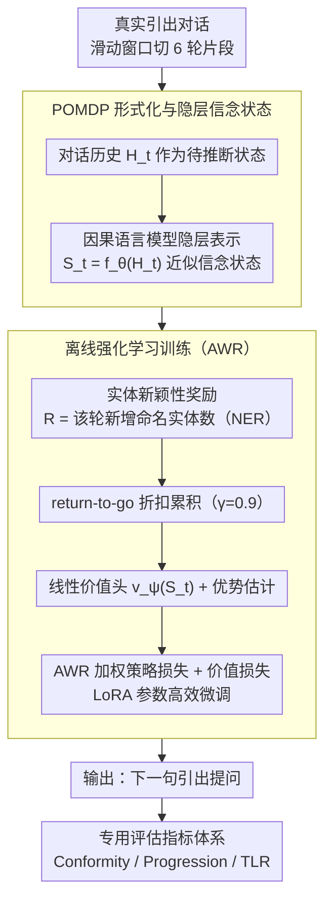

# YIELD: A Large-Scale Dataset and Evaluation Framework for Information Elicitation Agents

**会议**: ACL 2026  
**arXiv**: [2604.10968](https://arxiv.org/abs/2604.10968)  
**代码**: [https://github.com/infosenselab/yield](https://github.com/infosenselab/yield)  
**领域**: 模型压缩  
**关键词**: 信息引出, 对话数据集, 强化学习, 会话代理, POMDP

## 一句话总结

提出信息引出代理（IEA）作为新的对话范式，发布了首个大规模（2,281 段对话，26M token）人与人信息引出对话数据集 YIELD，将信息引出形式化为有限视野 POMDP，并设计了专门的评估指标（Conformity、Progression、TLR），实验表明在 YIELD 上微调能显著提升 LLM 与真实引出行为的对齐。

## 研究背景与动机

**领域现状**：大多数对话代理（CA）设计用于满足用户需求的用户驱动交互——用户控制议程和方向，代理提供帮助。常见数据集如 MultiWOZ、SGD 都面向这一范式。

**现有痛点**：许多现实场景（学术访谈、司法程序、新闻调查）需要代理主动从用户中引出信息，以支持代理方的机构或任务目标。这种"信息引出"与传统 CA 存在根本差异：(1) 对话主导权不同——代理需要主动提问引导方向；(2) 目标不同——成功的定义是获取了多少有价值的信息而非解决了用户的问题；(3) 没有单一最优问题，而是多种可能方向，每条都可能产生有价值的信息。

**核心矛盾**：尽管对 IEA 的需求明确，但缺乏专门的数据集、形式化框架和评估指标来支持研究。现有对话数据集对话轮次短（DSTC2 平均 14.49 轮），无法捕捉长程引出策略。

**本文目标**：(1) 定义 IEA 作为新的对话范式；(2) 构建首个大规模 IEA 数据集；(3) 形式化信息引出问题；(4) 设计专用评估指标。

**切入角度**：从真实的人与人引出对话（口述历史、司法听证、学术访谈、新闻调查）中收集数据，确保数据反映真实的引出行为模式。

**核心 idea**：将信息引出建模为 POMDP，利用实体新颖性作为代理奖励信号，通过离线强化学习（AWR）微调 LLM 使其学会像人类引出者一样提问。

## 方法详解

### 整体框架

YIELD 要解决的问题是：让 LLM 学会像真实引出者那样主动提问，而真实引出者面对的是一个看不全的对话环境——受访者脑中的信息永远是隐藏的，只能靠一轮轮提问把它慢慢挖出来。为此作者把整个引出过程建模成有限视野 POMDP：输入是当前对话历史，中间通过语言模型的隐层表示来近似不可观测的信念状态、并用「新引出的实体数」作为奖励信号，输出是下一句最该问的话。在这套形式化之上，用离线强化学习（offline RL，简称 ORL；优化器为 AWR）在 2,281 段真实引出对话上微调模型，再用三个专门指标从分布吻合度、对话推进度、提问效率三个角度衡量引出质量。

### 关键设计

**1. POMDP 形式化与隐层信念状态：把「问什么」变成可优化的序贯决策**

引出的本质困难在于引出者永远无法完全看到受访者的知识库，只能通过提问间接探测，这天然就是部分可观测问题。作者把受访者的隐藏信息记作状态 $X_t$，引出者的提问是行动 $A_t$，受访者的回答是观测 $O_{t+1}$。由于隐藏状态空间无界、无法显式维护传统信念状态，方法改用因果语言模型的隐层表示 $S_t = f_\theta(H_t^s)$ 直接编码「到目前为止知道了什么」。奖励则定义为这一轮回答中新出现的命名实体数量 $R_{t+1} = |\mathcal{E}_{t+1} \setminus \mathcal{E}_{\leq t}|$——用实体新颖性作为信息增量的代理，绕开了「信息价值」难以客观定义的难题，同时配合多种约束防止刷分。

**2. 离线强化学习训练（AWR）：让模型偏向能挖出更多新信息的提问**

标准 SFT 只会逐轮模仿真实引出者，无法区分「这句问得好」还是「这句无关紧要」。方法改用 Advantage-Weighted Regression：额外训练一个线性价值头估计状态价值 $v_\psi(S_t)$，据此算出每句引出发言的优势函数，优势越高（引出更多新信息）的样本在训练中权重越大。整体用 LoRA 做参数高效微调，联合优化策略损失与价值损失 $\mathcal{L}(\theta, \psi) = \mathcal{L}_\pi(\theta) + \mathcal{L}_v(\psi)$。这样模型学到的是「这句话对整段后续对话的贡献」，从而习得长程引出策略而非短视模仿。

**3. 专用评估指标体系：从三个维度刻画引出能力**

传统的 BLEU、任务成功率抓不住引出对话的关键——对话有没有往前走、提问效不效率、风格像不像真人。为此作者设计三个指标：Conformity 用困惑度和回复长度衡量模型输出是否落在真实引出者的分布里；Progression 用衰减余弦距离窗口衡量对话是否持续推进、还是卡在同一话题原地打转；Turn-Length Ratio 是受访者平均回复长度与引出者的比值，好的引出者应当言简意赅地提问、却换来受访者的长篇回答。三者合起来才能完整刻画「会不会引出」这件事。

### 损失函数 / 训练策略

AWR 加权策略损失为 $\mathcal{L}_\pi(\theta) = -\frac{1}{|\mathcal{B}|} \sum_{i \in \mathcal{B}} \bar{w}_i \log \pi_\theta(A_i | S_i)$，其中权重 $\bar{w}_i$ 按优势函数缩放。数据用滑动窗口（6 轮）分段，折扣因子 $\gamma=0.9$，温度 $\alpha=0.25$，在 3 张 A6000 GPU 上训练。

## 实验关键数据

### 主实验

Conformity 评估（困惑度和回复长度对比）：

| 模型 | 学术困惑度 | 司法困惑度 | 学术回复长度 | 真实回复长度 |
|------|-----------|-----------|-------------|-------------|
| Llama-3.1-8B Prompt | 46.9 | 22.6 | 39.5 tokens | 16.9 tokens |
| Llama-3.1-8B SFT | 10.9 | 10.9 | 11.2 tokens | 16.9 tokens |
| Llama-3.1-8B ORL | 12.5 | 11.3 | 11.6 tokens | 16.9 tokens |

### 消融实验

| 配置 | 关键发现 | 说明 |
|------|---------|------|
| Prompt-only vs SFT/ORL | 困惑度下降 3-4 倍 | 微调显著提升与真实引出行为的对齐 |
| SFT vs ORL | SFT 困惑度略低 | ORL 牺牲逐 token 似然以优化长程策略 |
| DeepSeek-R1 Prompt | 回复长度 414-472 tokens | 推理模型的冗长元思考严重偏离引出风格 |
| 3B vs 8B 模型 | 性能接近 | 说明 YIELD 数据而非模型规模是关键 |

### 关键发现

- 提示方法（Prompt-only）产生的引出者发言远长于真实引出者（39-53 vs 17-39 tokens），且提示本身也很长（540-648 tokens），极不经济
- DeepSeek-R1 的推理模式在引出任务上完全不适用——生成超长的元推理前缀，微调后才恢复正常
- ORL 训练的模型在 Progression 指标上与 SFT 竞争，且回复长度分布更接近真实引出者
- 人工评估证实了自动指标的发现，经过 YIELD 训练的模型在引出质量上显著优于提示方法

## 亮点与洞察

- **IEA 概念的提出**具有开创性——明确定义了"代理主动引出信息"这一对话范式，与传统"用户提问代理回答"形成鲜明对比，这个框架可以统一学术访谈、司法听证、新闻调查等多种场景
- **实体新颖性奖励**简洁有效——用 NER 提取新实体数作为引出成功的代理指标，避免了定义"信息价值"的主观性问题，同时通过多种约束防止奖励作弊
- **数据集本身的构建方法论**值得学习——从多种公域/CC 授权的真实人与人对话中手工标注，平均 171 轮/对话远超现有数据集（13-20 轮）

## 局限与展望

- 实验仅在离线设置下评估，未与真实用户交互测试，IEA 的实际引出效果未知
- 实体新颖性奖励过于简单，无法衡量信息的"深度"或"相关性"，更精细的奖励设计是关键方向
- 数据集全为英文，且某些领域数据量较小（新闻调查仅 129 段对话）
- IEA 的伦理边界需要更多讨论——在何种程度上代理的引出行为是合适的

## 相关工作与启发

- **vs MultiWOZ/SGD**: 这些数据集面向用户驱动的任务完成对话，平均 13-20 轮/对话。YIELD 面向代理驱动的信息引出，平均 171 轮/对话，规模和范式都完全不同
- **vs LLM-as-Interviewer**: 现有工作多聚焦于 LLM 模拟面试官，但缺乏系统的数据集和形式化框架。YIELD 提供了从数据到理论到评估的完整研究基础设施

## 评分

- 新颖性: ⭐⭐⭐⭐⭐ 定义了信息引出代理这一新范式，数据集、形式化和评估指标都是首创
- 实验充分度: ⭐⭐⭐⭐ 多模型对比和人工评估充分，但缺乏在线交互实验
- 写作质量: ⭐⭐⭐⭐⭐ 概念定义清晰，论文结构严谨，从动机到方法到评估的逻辑链完整
- 价值: ⭐⭐⭐⭐ 开创性数据集和框架对社区有长远价值，但应用范围相对专业

<!-- RELATED:START -->

## 相关论文

- [\[ICML 2026\] Video2GUI: Synthesizing Large-Scale Interaction Trajectories for Generalized GUI Agent Pretraining](../../ICML2026/llm_agent/video2gui_synthesizing_large-scale_interaction_trajectories_for_generalized_gui_.md)
- [\[ACL 2025\] FACT-AUDIT: An Adaptive Multi-Agent Framework for Dynamic Fact-Checking Evaluation of Large Language Models](../../ACL2025/llm_agent/fact_audit_factcheck.md)
- [\[ACL 2026\] Feedback-Driven Tool-Use Improvements in Large Language Models via Automated Build Environments](feedback-driven_tool-use_improvements_in_large_language_models_via_automated_bui.md)
- [\[ACL 2026\] AdaRubric: Task-Adaptive Rubrics for Reliable LLM Agent Evaluation and Reward Learning](adarubric_task-adaptive_rubrics_for_reliable_llm_agent_evaluation_and_reward_lea.md)
- [\[ACL 2026\] IntrAgent: An LLM Agent for Content-Grounded Information Retrieval through Literature Review](intragent_an_llm_agent_for_content-grounded_information_retrieval_through_litera.md)

<!-- RELATED:END -->
