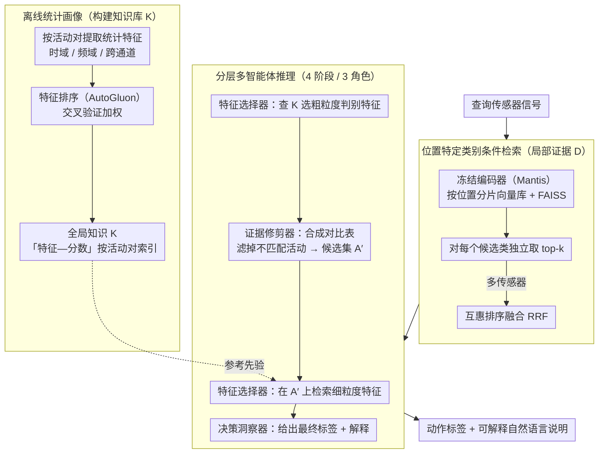

# ZARA: Training-Free Motion Time-Series Reasoning via Evidence-Grounded LLM Agents

**会议**: ACL 2026  
**arXiv**: [2508.04038](https://arxiv.org/abs/2508.04038)  
**代码**: [https://github.com/zechenli03/ZARA](https://github.com/zechenli03/ZARA)  
**领域**: LLM Agent  
**关键词**: 人体活动识别, 时间序列推理, 检索增强生成, 多智能体推理, 免训练

## 一句话总结

提出 ZARA，一个基于知识和检索增强的多智能体框架，通过将传感器信号蒸馏为结构化文本知识库、类别条件检索和分层 LLM 推理，在完全免训练的设置下实现了可解释的人体活动识别，8 个数据集上大幅超越现有方法。

## 研究背景与动机

**领域现状**：人体活动识别（HAR）是数字健康、自适应界面等应用的核心技术。目前主流方法依赖于针对特定任务的深度神经网络，需要在固定的传感器配置和活动类别下进行监督训练。

**现有痛点**：现有方法面临三大瓶颈：(1) 泛化性差——适配新用户或新硬件需要代价高昂的模型重训练；(2) 免训练适配受限——时间序列基础模型如 Moment、Mantis 虽提供可迁移表示，但仍需训练特定分类头，UniMTS 等对比学习方法在参数冻结设置下难以区分细粒度活动；(3) 缺乏可解释性——大多数方法只输出类别预测，没有透明的推理过程。

**核心矛盾**：LLM 虽然具备强大的开放集推理能力，但直接将数值时间序列输入 LLM 会导致幻觉和弱接地（weak grounding），因为 LLM 无法从原始数值流中直觉地理解物理动态特性。

**本文目标**：构建一个完全免训练的 HAR 框架，能够跨用户、跨数据集泛化，同时提供可解释的推理过程。

**切入角度**：作者观察到，正如 NLP 中的 RAG 依赖高质量文档语料库，HAR 中的 RAG 需要一个领域特定的知识库，将物理运动如何在传感器数据中表现的隐式统计模式，转化为可验证的自然语言先验（如"跑步的垂直加速度方差高于步行"）。

**核心 idea**：将传感器信号的统计特征蒸馏为成对的文本知识库，结合类别条件检索和分层多智能体推理，实现基于证据的免训练活动识别。

## 方法详解

### 整体框架

ZARA 想让冻结的 LLM 在不做任何训练的前提下读懂传感器时间序列、判断人在做什么动作。难点在于直接把数值流喂给 LLM 会幻觉、弱接地，于是 ZARA 把信息解耦成两条线索：一条是全局知识 $\mathcal{K}$——离线统计出来的「成对活动哪些特征最有区分力」的静态参考注册表；另一条是局部证据 $\mathcal{D}$——原始信号嵌入构成的向量数据库，提供查询样本的局部分布接地。在线时，系统先按候选类别检索相关证据，再由多个 LLM 智能体分层推理，最终输出动作标签和一段可解释的自然语言说明。整体流程是「离线建知识库 → 在线类别条件检索 → 分层多智能体推理」。

### 关键设计

**1. 离线统计画像（Offline Statistical Profiling）：把信号特征蒸馏成可验证的语言先验**

LLM 无法从原始数值直觉地理解物理动态，所以 ZARA 先把「信号长什么样」翻译成「文字能读懂的统计规律」。对每个活动对 $(a_i, a_j)$，提取时域（均值、方差、RMS）、频域（频谱熵、主频）和跨通道（相关性、倾斜角度）等人类可解释统计特征，再用基于排列的特征排序（AutoGluon）估算每个特征的重要性得分，并经交叉验证加权平均保证鲁棒。所有「特征—分数」元组按活动对索引存入 $\mathcal{K}$。成对组织的好处是系统能针对任意候选子集动态拼出相关知识，添加新活动只需注册它的统计画像、无需重训练，这正是免训练扩展的关键。

**2. 位置特定类别条件检索（Class-Wise Multi-Sensor Retrieval）：让长尾类也能拿到均衡证据**

标准 RAG 一把抓的全局检索会被高频类淹没、长尾活动召回不足，ZARA 改成按类别分别检索。系统维护按传感器位置分片的向量库 $\{\mathcal{D}^{loc}\}$，用冻结的时间序列基础编码器（默认 Mantis）生成嵌入并以 FAISS IndexFlatIP 索引；对查询信号，针对每个候选类别独立取 top-k 证据，从而保证每个类都有充分召回。多传感器场景再用互惠排序融合（RRF）聚合各位置结果 $\text{RRF}(d) = \sum_{loc} \frac{1}{k_{rrf} + r_{loc}(d)}$。按位置分片则确保检索到的证据与查询的物理上下文对齐。

**3. 分层多智能体推理（Hierarchical Multi-Agent Reasoning）：逐步缩小假设空间、步步留下可解释痕迹**

一次性在大量候选里直接选答案既容易混淆又不透明，ZARA 让三个专门化角色在四个阶段里接力推理。特征选择器先查 $\mathcal{K}$ 锁定粗粒度判别特征；证据修剪器把检索到的类别证据合成统计对比表、滤掉分布不匹配的活动，得到精炼候选集 $\mathcal{A}'$；特征选择器再在 $\mathcal{A}'$ 上检索细粒度特征；最后决策洞察器分析更新后的统计数据给出最终标签并生成解释。逐步精炼比直接推理更可靠，而且每一步都产出可核查的中间结果。

### 一个完整示例

以区分「跑步」和「快走」为例：特征选择器先从知识库读出「垂直加速度方差」「主频」是这对活动最具区分力的特征；证据修剪器按这两个维度检索两类的代表信号、合成对比表，发现两者方差差距悬殊，于是把明显不符的活动（如「静坐」「上楼」）剔除，候选集收缩到几个步态类；特征选择器再在这个小候选集上检索「步频」「触地相关性」等细粒度特征；决策洞察器综合更新后的统计数据判定为「跑步」，并输出「垂直加速度方差显著高于快走、主频更高」这样一段人能读懂的依据。

### 损失函数 / 训练策略

ZARA 完全免训练，不涉及损失函数或训练过程：知识库由离线统计分析构建，推理由冻结的 LLM 完成，所有智能体温度设为 0 以保证确定性可复现。对于大规模数据集（WISDM、DSADS），用动态检索替代静态候选列表，通过余弦相似度先选出 top-10 最相关类别。

## 实验关键数据

### 主实验

跨主体泛化（Cross-Subject），8 个 HAR 数据集，参数冻结设置：

| 方法 | 平均 Acc | 平均 F1 | 类型 |
|------|---------|---------|------|
| UniMTS | 39.4 | 32.1 | 对比预训练 |
| IMU2CLIP | 22.7 | 17.9 | 对比预训练 |
| ZARA (Qwen-30B) | 71.0 | 70.2 | 知识增强推理 |
| ZARA (GPT-4.1-mini) | 77.5 | 77.2 | 知识增强推理 |
| ZARA (Gemini) | **81.6** | **81.4** | 知识增强推理 |

ZARA 最佳变体比最强基线 UniMTS 的 Acc 高出 42.2 个百分点。

### 消融实验

| 配置 | 平均 Acc | 说明 |
|------|---------|------|
| ZARA (完整) | 81.6 | Gemini backbone |
| 无知识库 | 显著下降 | 缺乏统计先验导致推理无据可依 |
| 全局检索替代类别条件检索 | 下降 | 长尾类别召回不足 |
| 单阶段推理替代分层推理 | 下降 | 缺乏逐步精炼导致混淆增加 |
| DTW 替代 Mantis 编码器 | 71.0→81.6 | Mantis 嵌入更优但 DTW 也可用 |

### 关键发现

- ZARA 的增益来源于知识和检索增强的框架设计而非 LLM 骨干规模，Qwen-30B 到 Gemini 都大幅超越所有基线
- 直接提示方法（HARGPT、Gemini Text/Table/Plot）彻底失败，证明没有显式参考接地，即使强大的 LLM 也无法对数值传感器流进行推理
- ZARA 的 Acc 和 F1 高度一致，而基线方法 Acc 和 F1 差距大，表明 ZARA 通过类别平衡检索有效识别长尾活动
- 跨数据集泛化实验中，交叉知识（Cross-Dataset Knowledge）设置超越无知识和同域知识设置，证明统计知识具有跨域迁移能力

## 亮点与洞察

- **信号到文本的知识蒸馏**非常巧妙——将传感器时间序列的统计特征转化为成对的语言先验，既保留了物理可解释性又让 LLM 能够进行有依据的推理，这一范式可迁移到任何需要 LLM 处理数值数据的场景
- **类别条件检索**解决了标准 RAG 中的长尾偏见问题——对每个候选类别独立检索 top-k，确保少数类也有充分证据，这个设计思路可以直接迁移到其他分类型 RAG 任务中
- 完全免训练且即插即用：添加新活动只需注册统计画像，无需重训练，实现了真正的开放集活动识别

## 局限与展望

- 推理成本较高：每个查询需要多轮 LLM 调用（特征选择→证据修剪→再选择→决策），实时应用受限
- 知识库构建仍需标注数据的离线统计分析，在标注数据极少时效果可能受限
- 目前仅在加速度计/陀螺仪传感器上验证，更多传感器模态（如 EMG、气压计）的适用性待探索
- 对于动作非常相似的细粒度活动（如不同类型的步态），统计特征的区分力可能不足

## 相关工作与启发

- **vs UniMTS**: UniMTS 通过合成骨架运动与文本对齐实现免分类器识别，但缺乏语义粒度。ZARA 通过显式的统计知识注入和类别条件检索，在相同免训练设置下 Acc 高出 42 个百分点
- **vs HARGPT**: HARGPT 直接将原始信号作为文本/图像提示输入 LLM，导致高 token 成本和严重信息损失。ZARA 将信号转化为结构化统计知识再输入 LLM，从根本上解决了接地问题

## 评分

- 新颖性: ⭐⭐⭐⭐⭐ 首个将知识和检索增强的多智能体框架应用于传感器时间序列推理的工作，信号到文本知识蒸馏范式非常新颖
- 实验充分度: ⭐⭐⭐⭐⭐ 8 个数据集、10 个基线、跨主体和跨数据集两种评估协议、多种 LLM 骨干对比、丰富消融
- 写作质量: ⭐⭐⭐⭐ 结构清晰，方法描述详尽，但表格格式在 LaTeX 中稍显冗长
- 价值: ⭐⭐⭐⭐ 为 LLM 处理数值传感器数据提供了新范式，但实时推理成本是实际部署的障碍

<!-- RELATED:START -->

## 相关论文

- [\[CVPR 2026\] BAMI: Training-Free Bias Mitigation in GUI Grounding](../../CVPR2026/llm_agent/bami_training-free_bias_mitigation_in_gui_grounding.md)
- [\[ACL 2026\] CoEvolve: Training LLM Agents via Agent-Data Mutual Evolution](coevolve_training_llm_agents_via_agent-data_mutual_evolution.md)
- [\[ACL 2026\] SafeMCP: Proactive Power Regulation for LLM Agent Defense via Environment-Grounded Look-Ahead Reasoning](safemcp_proactive_power_regulation_for_llm_agent_defense_via_environment-grounde.md)
- [\[ACL 2026\] IntrAgent: An LLM Agent for Content-Grounded Information Retrieval through Literature Review](intragent_an_llm_agent_for_content-grounded_information_retrieval_through_litera.md)
- [\[CVPR 2025\] TANGO: Training-free Embodied AI Agents for Open-world Tasks](../../CVPR2025/llm_agent/tango_training-free_embodied_ai_agents_for_open-world_tasks.md)

<!-- RELATED:END -->
