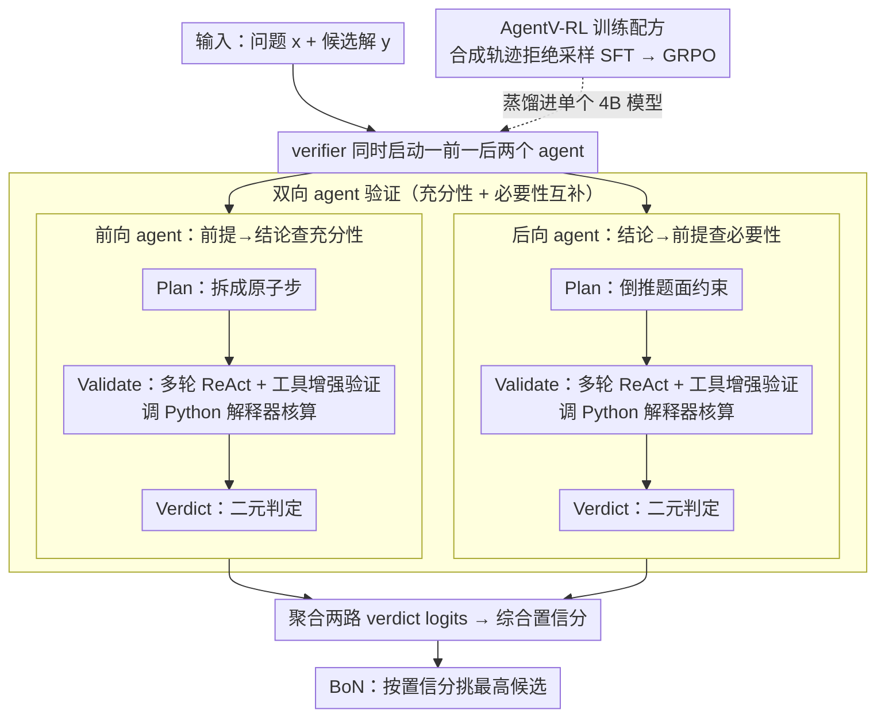

# AgentV-RL: Scaling Reward Modeling with Agentic Verifier

**会议**: ACL 2026  
**arXiv**: [2604.16004](https://arxiv.org/abs/2604.16004)  
**代码**: 有 (GitHub)  
**领域**: LLM Agent / 奖励建模  
**关键词**: Agentic Verifier, 奖励模型, Test-Time Scaling, 工具增强推理, GRPO

## 一句话总结
把奖励模型从"单轮打分"重塑为"前向+后向双 agent + 工具调用"的多轮审议流程，并通过 SFT+GRPO 把多 agent 能力蒸馏到单个 4B 模型中，使其在 BoN 选择上比 70B 量级 ORM 高 25.2%。

## 研究背景与动机

**领域现状**：在数学等复杂推理任务上，Test-Time Scaling（BoN 并行采样、迭代修正等顺序细化）越来越依赖奖励模型（verifier）来挑选/批判候选解。主流方案分三类：ORM（标量输出、零解释）、PRM（步骤级标量）和 GenRM（自然语言生成式判断）。

**现有痛点**：（1）**错误传播**：GenRM 多用 next-token 训练，且训练数据偏正例，遇到"看起来合理但实际错误"的解时容易被表面逻辑带跑、给出错误正判；（2）**缺乏外部 grounding**：纯文本 verifier 在数值计算、长链算术、知识密集任务上容易自己也算错，无法独立验证。

**核心矛盾**：单轮文本推理同时承担"逻辑链审查 + 数值/事实校验"两个任务，前者会被错误前提污染，后者会因 LLM 自身算术弱点失败——两者天然冲突。

**本文目标**：把奖励建模从"一次性看完打分"升级为"像人类做证明那样多轮、双向、工具增强地审查"，并训练单个模型同时具备这种能力。

**切入角度**：借鉴数学证明的"充分性 + 必要性"双向检查——一个 agent 从前提推到结论查充分性，另一个 agent 从结论倒推到前提查必要性，两边都允许 Python 解释器介入计算。这两路互补且通常会暴露对方忽略的错误。

**核心 idea**：用"双 agent × 多轮 ReAct × 代码解释器"替代单轮 GenRM，再用"合成轨迹 + 拒绝采样 SFT + GRPO"把这套多 agent 流程蒸馏进单 LLM。

## 方法详解

### 整体框架

AgentV-RL 把"奖励模型"从一次性读完候选解打个分，改造成像人做证明那样多轮、双向、带工具的审议过程。推理时，给定问题 $x$ 和某条候选解 $y$，verifier $\pi_\psi$ 同时启动一前一后两个 agent：forward agent 从题目前提一路推到结论、查每一步是否充分，backward agent 从最终答案倒推回题面、查所有约束是否真被满足，两者都能在中途调用 Python 解释器核算数值。两路各自走完 "Plan → Validate → Verdict" 后输出二元判定，聚合 verdict 的 token logits 得到这条解的综合置信分；BoN 场景下就按置信分从一批候选里挑最高的那条。训练上则分两步把这套多 agent 流程压进单个 4B 模型——先用合成轨迹做拒绝采样 SFT 灌入 ReAct + 工具行为，再用 GRPO 释放更深的推理。

### 关键设计

**1. 双向 agent 验证：充分性与必要性互补检查**

纯前向审查有个老毛病：遇到"看似步步自洽、实则绕开了某条约束"的伪证时容易被表面逻辑带跑，给出错误的正判。本文借数学证明里"充分性 + 必要性"的方法论破解这点——forward agent 把解拆成原子步 $\Pi = \{v_1, \ldots, v_n\}$，沿前提到结论逐步检查相邻步之间的逻辑是否充分；backward agent 反过来从答案倒推回问题陈述，验证题目每条约束是否真的被用到、有没有隐性遗漏。两者共享同一套 "Plan / Validate / Verdict" 三段提示模板，但审查方向相反，因此暴露的错误类型天然互补：前向漏掉的"偷换约束"往往正是反向能抓到的，反之亦然。最终把两个 verdict 聚合成综合置信度，避免单一视角的系统盲区。

**2. 多轮 ReAct + 工具增强验证：让 verifier 在关键节点调用代码核算**

审查 AIME 这类竞赛题时，卡点常常是"这个等式到底成不成立"，而 LLM 自己做长链算术、枚举、检验恰恰最不可靠，纯文本 verifier 很容易自己也算错。为此 Validate 阶段被组织成一条 ReAct 轨迹 $\mathcal{H} = (s_0, a_0, o_0, \ldots, s_t, a_t, o_t)$，其中 $s$ 是思考、$a$ 是代码动作、$o$ 是 Python 解释器返回的观测；动作段用特殊 token 包裹，方便训练时把观测部分的梯度排除掉。实际上一题往往要走 5–6 轮思考、穿插 1 次左右工具调用（见表 5）——调用频率不高，但在判定成败的那个等式上交给解释器一锤定音，远比让模型脑补可靠。

**3. AgentV-RL 训练配方：合成轨迹 SFT 蒸馏 + GRPO 释放推理**

直接部署多 agent 推理成本太高，要落地就得把这套能力蒸馏进单个模型。具体先从 Polaris / DeepScaleR / AReaL-boba 等数据各采 $k=8$ 条候选解，滤掉全对/全错的过简单题，让 LLM 分别扮演 forward 或 backward agent 生成验证轨迹，只保留 verdict 与 ground truth 一致的轨迹，凑出 $\mathcal{D}_{\text{sft}}$ 共 15K 条；SFT 阶段对所有非 observation token 做 NLL，即 $\mathcal{L} = -\mathbb{E}_\tau\big[\sum_i \mathbb{I}[\tau_i \neq o_i] \log \pi_\theta(\tau_i \mid \mathcal{H}_{<i})\big]$，把 ReAct + 工具的行为模式先灌进去。随后在 50K 样本上跑 GRPO，奖励设为 $r(\mathcal{H}) = 1$（verdict 正确）或 $-1$（错误），并借 DAPO 风格动态过滤掉全 +1 / 全 -1 的零方差组，让模型自主探索更优的工具使用与推理路径——SFT 负责"会做"，GRPO 负责"做得更好"。

### 损失函数 / 训练策略

GRPO 目标为 $\mathcal{J}_{\mathrm{GRPO}}(\psi) = \mathbb{E}\big[\frac{1}{G}\sum_i \frac{1}{|\mathcal{H}_i|} \sum_t \min(r_{i,t}\hat{A}_{i,t}, \mathrm{clip}(r_{i,t}, 1-\epsilon_{\text{low}}, 1+\epsilon_{\text{high}})\hat{A}_{i,t}) - \beta D_{\mathrm{KL}}(\pi_\psi \| \pi_{\mathrm{ref}})\big]$，混合采样让同一模型既扮演 forward 也扮演 backward agent。为避免模型去记忆环境观测字符串而非学习推理，loss 计算时显式 mask 掉解释器的执行结果。

## 实验关键数据

### 主实验

| 模型 | MATH500@128 | GSM8K@128 | Gaokao2023@128 | AIME24@128 |
|------|------------|-----------|---------------|------------|
| Qwen3-4B-Think (base) | 72.4 | 92.2 | 51.9 | 36.7 |
| INF-ORM-Llama3.1-70B | 55.4 | 91.5 | 44.4 | 40.0 |
| Qwen2.5-Math-PRM-7B | 70.2 | 95.4 | 54.3 | 46.7 |
| Skywork-V2-Llama-8B | 53.8 | 87.6 | 39.7 | 36.7 |
| **Agentic-Verifier-Qwen3-4B** | **79.0** | 93.3 | **57.4** | **53.3** |

在 MATH500@128 上比最强 ORM (Skywork-V2-Llama-8B 的 53.8) 高 25.2 个百分点；4B 体量战胜 70B ORM。

### 消融实验

| 配置 | MATH500 (BoN) | 说明 |
|------|--------------|------|
| Full (Forward + Backward + Tool) | 78.9 | 完整模型 |
| Forward only | ~75 | 单向充分性检查 |
| Backward only | ~74 | 单向必要性检查 |
| w/o Tool | 明显下降 | 去掉 Python 解释器后掉点 |
| Train-free | 比 base +2.6 (Gaokao) | 不训练直接 prompt 已有效 |
| SFT only | 中等 | 仅 SFT 不做 RL |
| SFT + RL (Full) | 最佳 | 完整 AgentV-RL 配方 |

### 关键发现
- 双向 agent 比单向显著更好——前向和后向暴露的错误类型互补，去掉任一路都掉点。
- 工具使用频率不算高（4B 全模型平均每轨迹仅 1.6 次 Python 调用），但去掉后掉点明显，说明关键节点工具不可替代。
- BoN 的 N 越大（32 → 64 → 128）本方法越占便宜，AIME24 上 N=128 时拉到 53.3%。
- 模型 size scaling 也很顺：0.6B → 1.7B → 4B 在 Gaokao2023 上从 43.9 → 49.4 → 57.4 单调上升。
- 在 LiveCodeBench (70.86) 和 HotpotQA (66.00) 上同样大幅领先，表明方法不止限于数学。

## 亮点与洞察
- 把"奖励模型"重新定义为"agent"——这是从 PRM/GenRM 的标量/单轮范式向 agentic reward modeling 的明显范式转换，潜力很大。
- 双向证明的思路很巧妙：把数学证明里"充分性 + 必要性"的方法论直接搬进 RM，自然解释了为什么两个 agent 应当互补而不是冗余。
- 工具使用通过 token 级 mask 排除 observation 梯度——这是训练 ReAct 风格 agent 必要的小细节，否则模型会记环境字符串而非学推理。
- 4B 模型干翻 70B ORM 这个结果暗示：RM 比 actor 更值得花 inference compute，因为 RM 的错误会成倍放大。

## 局限与展望
- 多轮 + 工具让推理 token 量从 base 的 2560 飙到 8349、单题延时从 119s 增到 323s（A100, batch 128），实时场景不友好。
- 合成轨迹的覆盖偏数学/代码，对开放域偏好（如 helpfulness、写作风格）能否迁移未验证。
- 工具仅限 Python 解释器，对需要外部知识（如真实事实校验）的任务仍可能漏检。
- 双 agent 之间没有显式协商机制，目前是独立打分再聚合，可能存在两边都漏的"系统性盲区"。

## 相关工作与启发
- **vs GenRM (Zhang et al., 2025)**: GenRM 单轮文本判定容易被 plausible-but-wrong 解骗，本文用多轮 + 工具 + 双向解决；但代价是 3× token、3× 延时。
- **vs PRM (Lightman et al., 2024 等)**: PRM 给步骤级标量监督但缺解释性、且训练需密集步骤标注；本文 verdict 自带可读 critique，且只需结果级监督（verdict 是否正确）。
- **vs Tool-augmented RM (Li et al., 2024)**: 现有 tool-RM 工具调用是松耦合的；本文把工具调用嵌进 ReAct 推理链，工具结果直接进入验证决策。

## 评分
- 新颖性: ⭐⭐⭐⭐ 双向 agent + 工具 + RL 的组合在 RM 领域是新颖范式
- 实验充分度: ⭐⭐⭐⭐⭐ 4 数学基准 + LCB + HotpotQA + scaling 实验 + 充分消融
- 写作质量: ⭐⭐⭐⭐ 动机清晰，技术细节交代完整
- 价值: ⭐⭐⭐⭐ 4B > 70B 的结果对工业落地很有吸引力，开了 agentic RM 的方向

<!-- RELATED:START -->

## 相关论文

- [\[ACL 2026\] Aligning Agents via Planning: A Benchmark for Trajectory-Level Reward Modeling](aligning_agents_via_planning_a_benchmark_for_trajectory-level_reward_modeling.md)
- [\[ACL 2025\] Dynamic Scaling of Unit Tests for Code Reward Modeling](../../ACL2025/llm_alignment/dynamic_scaling_of_unit_tests_for_code_reward_modeling.md)
- [\[ICLR 2026\] Skywork-Reward-V2: Scaling Preference Data Curation via Human-AI Synergy](../../ICLR2026/llm_alignment/skywork-reward-v2_scaling_preference_data_curation_via_human-ai_synergy.md)
- [\[ACL 2026\] MAESTRO: Meta-learning Adaptive Estimation of Scalarization Trade-offs for Reward Optimization](maestro_meta-learning_adaptive_estimation_of_scalarization_trade-offs_for_reward.md)
- [\[ICML 2026\] Mitigating Reward Hacking in RLHF via Bayesian Non-negative Reward Modeling](../../ICML2026/llm_alignment/mitigating_reward_hacking_in_rlhf_via_bayesian_non-negative_reward_modeling.md)

<!-- RELATED:END -->
