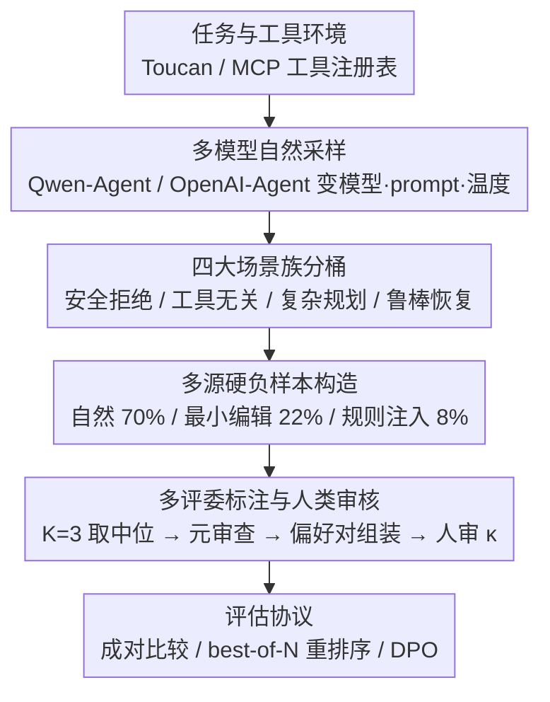

# Aligning Agents via Planning: A Benchmark for Trajectory-Level Reward Modeling

**会议**: ACL 2026  
**arXiv**: [2604.08178](https://arxiv.org/abs/2604.08178)  
**代码**: 无（待企业审批后公开）  
**领域**: LLM对齐  
**关键词**: 奖励模型, 智能体评估, 轨迹级偏好, 工具调用, 规划基准

## 一句话总结

提出 Plan-RewardBench，一个面向复杂工具增强场景的轨迹级偏好基准，用于评估奖励模型在多步规划、工具使用和错误恢复等场景下区分优劣智能体轨迹的能力。

## 研究背景与动机

**领域现状**: 大语言模型已从被动对话系统演变为能自主调用工具、进行复杂推理的智能体系统，行为表现从单次回复扩展为包含用户输入、推理、工具执行和环境反馈的完整轨迹。

**现有痛点**: 现有 RM 基准（如 RewardBench、RM-Bench）主要聚焦于回复级偏好评估，仅评估有用性和安全性等有限维度，且局限于短上下文场景；工具调用基准（如 FC-RewardBench）仅验证原子动作正确性，忽视长程规划行为的评估。

**核心矛盾**: 智能体系统本质上需要多轮交互，但现有基准无法评估奖励模型在长程、多步轨迹上的判断能力，尤其是规划一致性、错误恢复和拒绝质量等关键维度。

**本文目标**: 构建一个轨迹级偏好基准，系统评估奖励模型在复杂工具集成场景中判断规划逻辑和工具使用忠实度的能力。

**切入角度**: 基于 MCP 工具注册表和真实执行环境，通过多模型自然采样、规则扰动和最小编辑构造"难以区分"的负样本对。

**核心 idea**: 将 RM 评估从回复级提升到轨迹级，覆盖安全拒绝、工具无关性、复杂规划和鲁棒错误恢复四大场景族。

## 方法详解

### 整体框架

Plan-RewardBench 把智能体对齐评估从"回复级"抬到"轨迹级"：每道题给定一个工具环境 $\mathcal{T}$、一段多轮用户交互，以及两条完整候选轨迹 $(\tau_A, \tau_B)$，由奖励模型判断哪条更优——轨迹里不只有最终回复，还包含推理、工具调用和环境反馈的全过程。整条数据流水线从 Toucan/MCP 的真实任务与工具注册表出发，先用 Qwen-Agent、OpenAI-Agent 等多模型多参数自然采样得到正常轨迹，再通过规则注入和最小编辑造出"近似正确但有语义错误"的负样本，最后经多 LLM 评委打分加人类审核组装成偏好对。基准同时支持三类评估协议：训练判别式/生成式 RM 的偏好数据、推理时 best-of-N 重排序，以及 DPO 式优化。

### 关键设计

**1. 四大场景族：覆盖智能体轨迹的核心挑战维度**

现有 RM 基准大多只盯一个维度（有用性、安全性或原子动作正确性），可真实智能体要在多种情境下都不出错。本文据此把基准切成四个场景族——Safety Refusal（安全拒绝）、Tool-Irrelevance（工具无关性）、Complex Planning（复杂规划）和 Robust Recovery（鲁棒恢复），分别对应"该拒的要拒"、"无关工具别乱调"、"长程多步规划要自洽"、"出错后能正确恢复"这几类典型考点。这样设计让一条轨迹的优劣判断不再是单一标量，而是要求 RM 在不同失败模式上都具备区分力。

**2. 多源硬负样本构造：逼 RM 看语义而非表面线索**

简单负样本往往能靠长度、格式这类表面信号一眼识破，根本测不出 RM 的真实判断力，所以必须造"看着对、实则错"的硬负样本。本文按 70% 自然采样 + 22% 最小编辑扰动 + 8% 规则注入的比例混合生成拒绝/错误轨迹，并刻意控制 chosen 与 rejected 之间的长度和格式偏差，把差异隔离到纯语义层面（如表中 Tool-Irrelevance 场景两侧 token 数 1363/1358 几乎持平）。这样 RM 想答对就只能真正读懂规划逻辑和工具使用是否忠实，绕不开表面捷径。

**3. 多评委标注与人类审核：保证偏好标签可靠**

单个 LLM 评委容易带系统性偏差，标签一歪整个基准就失真。为此每对轨迹由 $K=3$ 个 LLM 评委独立打分、取中位数，再叠一层元审查，最后由人类审计抽查；人审与机审的一致性以 Cohen's $\kappa \in [0.71, 0.86]$ 落在"实质一致"区间，说明这条标注管线产出的偏好标签足够可信，可作为评估各类 RM 的可靠基准。

## 实验关键数据

### 主实验

| 模型类型 | 代表模型 | 评估方式 | 特点 |
|---------|---------|---------|------|
| 判别式 RM | Inf-ORM-Llama3.1-70B | 逐点打分 → 选高分 | 独立评估每条轨迹 |
| 生成式 RM | Skywork-o1 等 | 生成式评分 | 通过生成过程评估 |
| LLM-as-Judge | GPT-o3, Claude 等 | 成对比较 | 直接比较两条轨迹 |

### 数据集统计

| 场景 | 对数 | 平均 Token (Chosen/Rejected) | 最大 Token |
|------|-----|---------------------------|-----------|
| Tool-Irrelevance | 275 | 1,363 / 1,358 | ~5K |
| Planning-Multi (Hard) | 73 | 6,523 / 6,554 | ~17K |
| Robust Recovery | 361 | 4,545 / 4,462 | ~29K |
| Safety Refusal | 51 | 1,219 / 2,233 | ~11K |

### 关键发现

- 三类评估器（判别式、生成式、LLM-as-Judge）在长程轨迹上性能均大幅下降
- 工具接地幻觉（声称使用工具但无实际调用）是复杂规划中最常见的失败模式
- 安全拒绝场景中，延迟拒绝（先部分执行再拒绝）是主要混淆源
- 盲目重试是鲁棒恢复中最常见的错误模式

## 亮点与洞察

- 首次系统地将 RM 评估从回复级提升到智能体轨迹级，填补了智能体对齐评估的空白
- 硬负样本构造方法论可作为通用蓝图，用于构建智能体规划偏好训练数据
- 人类审核结果（Cohen's $\kappa > 0.7$）验证了标注管线的可靠性
- 发现所有主流 RM 在长程轨迹上都面临重大挑战，指出了专门化训练的必要性

## 局限与展望

- 仅涵盖文本模态，未考虑多模态智能体场景
- 数据规模受限于高质量标注成本
- 安全拒绝场景样本较少（51对），统计显著性有限
- 未来可扩展至多模态、更长程和更复杂的工具链场景

## 相关工作与启发

- RewardBench 系列（Lambert et al., 2025）：回复级 RM 评估的基础
- AgentRewardBench（Lù et al., 2025）：Web 智能体轨迹评估，但非工具增强场景
- FC-RewardBench（Agarwal et al., 2025）：工具调用正确性评估，局限于单轮
- 本文可启发未来在 RL-from-agent-feedback 方向的研究

## 评分

- 新颖性: ⭐⭐⭐⭐⭐ 首个面向工具增强智能体的轨迹级偏好基准
- 实验充分度: ⭐⭐⭐⭐ 覆盖多种模型类型，人类审核验证
- 写作质量: ⭐⭐⭐⭐ 结构清晰，场景分类系统
- 价值: ⭐⭐⭐⭐⭐ 填补了智能体 RM 评估的关键空白

<!-- RELATED:START -->

## 相关论文

- [\[ACL 2026\] AgentV-RL: Scaling Reward Modeling with Agentic Verifier](agentv-rl_scaling_reward_modeling_with_agentic_verifier.md)
- [\[ACL 2025\] PRMBench: A Fine-grained and Challenging Benchmark for Process-Level Reward Models](../../ACL2025/llm_alignment/prmbench_a_fine-grained_and_challenging_benchmark_for_process-level_reward_model.md)
- [\[ACL 2025\] SDPO: Segment-Level Direct Preference Optimization for Social Agents](../../ACL2025/llm_alignment/sdpo_segment-level_direct_preference_optimization_for_social_agents.md)
- [\[ACL 2025\] World Modeling Makes a Better Planner: Dual Preference Optimization for Embodied Task Planning](../../ACL2025/llm_alignment/world_modeling_makes_a_better_planner_dual_preference_optimization_for_embodied_.md)
- [\[ICML 2026\] Mitigating Reward Hacking in RLHF via Bayesian Non-negative Reward Modeling](../../ICML2026/llm_alignment/mitigating_reward_hacking_in_rlhf_via_bayesian_non-negative_reward_modeling.md)

<!-- RELATED:END -->
