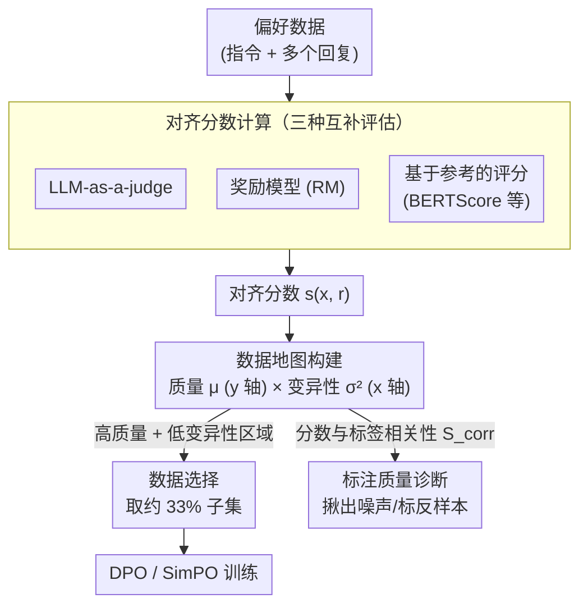

# Alignment Data Map for Efficient Preference Data Selection and Diagnosis

**会议**: ACL 2026  
**arXiv**: [2505.23114](https://arxiv.org/abs/2505.23114)  
**代码**: [GitHub](https://github.com/01choco/Alignment-Data-Map)  
**领域**: LLM Alignment / Data Selection  
**关键词**: 偏好学习, 数据选择, 对齐数据地图, 标注质量诊断, DPO

## 一句话总结

提出 Alignment Data Map，一个通过联合考量回复质量(quality)和回复变异性(variability)来可视化、选择和诊断偏好数据的分析工具，仅用 33% 数据即可达到全量训练的对齐效果。

## 研究背景与动机

**领域现状**：偏好数据是 LLM 对齐学习（如 DPO、SimPO）的核心资源，但收集高质量的人类偏好标注成本高昂且效率低下。如何识别和选择最有效的偏好数据成为关键问题。

**现有痛点**：现有数据选择方法主要依赖**奖励边界**(reward margin)——即两个回复之间的奖励差值。直觉是边界小的样本提供更强的学习信号。但奖励边界只反映了相对差异，忽略了回复的**绝对质量**——相同边界的数据样本可能由两个高质量回复或两个低质量回复组成，训练效果截然不同。

**核心矛盾**：低边界样本可能来自"两个优质回复难以区分"（有价值的困难样本）或"两个劣质回复都很差"（无价值的噪声样本），单靠边界无法区分二者。

**本文目标**：构建一个同时考虑回复质量和变异性的数据分析工具，实现高效的数据选择和标注质量诊断。

**核心idea**：借鉴数据集制图(Dataset Cartography)的思想，将偏好数据映射到以变异性为 x 轴、质量为 y 轴的二维空间中。"高质量+低变异性"区域的数据最适合偏好学习——它们提供了高质量但难以区分的回复候选，在高度模糊的偏好空间中提供最丰富的学习信号。

## 方法详解

### 整体框架

Alignment Data Map 借数据集制图（Dataset Cartography）的思路，把偏好数据从一维的"奖励边界"升级到二维的"质量 × 变异性"平面来分析。整条流程分三步：先用多种互补方法（LLM-as-a-judge、显式奖励模型、基于参考的评分）给每条回复算一个对齐分数；再据这些分数为每个样本算出质量（均值，作 y 轴）和变异性（方差，作 x 轴），把数据点铺到二维地图上；最后在地图上"高质量 + 低变异性"区域选训练子集，或用对齐分数与人工标签的相关性来诊断标注质量。其核心判断是：这个区域的数据既保证了 chosen 回复够好、监督信号有效，又因回复之间难以区分而在高度模糊的偏好空间里提供最丰富的学习信号。

### 关键设计

**1. 对齐分数计算：用三种互补评估量化回复质量**

任何单一评估器都可能带自己的偏差，只靠一种打分容易把地图画歪，所以本文用三路互补方法给每条回复打对齐分数：(a) LLM-as-a-judge，让高能力 LLM 直接评估回复对指令的对齐程度；(b) 奖励模型，用偏好数据上训练好的 RM 打分；(c) 基于参考的评分，通过与高性能模型生成的参考回复算语义相似度（如 BERTScore）来间接评估。三者从不同角度交叉印证，得到比单一指标更稳健的对齐度量，作为后续画图与选数据的基础。

**2. 数据地图构建与选择：在"高质量 + 低变异性"区域取子集**

奖励边界只反映两条回复的相对差，相同边界既可能是"两个优质回复难以区分"（有价值的困难样本），也可能是"两个劣质回复都很差"（无价值的噪声），单看边界没法分辨。为此对每个数据点 $d$ 同时算质量 $\mu_d = \frac{1}{|\mathcal{R}|}\sum_{i \in \mathcal{R}} s(x^d, r_i^d)$ 和变异性 $\sigma_d^2 = \frac{\sum_i (s(x^d, r_i^d) - \mu_d)^2}{|\mathcal{R}|}$，把质量放 y 轴、变异性放 x 轴，专挑"高质量 + 低变异性"（High Average）区域训练——高质量保证 chosen 回复对 DPO 学习确实有用，低变异性则意味着回复够接近、比较更有信息量。值得一提的是，当每条数据只有两个回复时，变异性恰好退化为传统的奖励边界，因此该框架天然兼容现有方法。

**3. 标注质量诊断：用分数与标签的相关性揪出噪声标注**

人类偏好标注里难免混入错标，放着不管会拖累整个数据集质量。本文用一个轻量信号来自动检测：算标注标签 $\mathcal{Y}$ 与对齐分数 $\mathcal{S}$ 之间的余弦相似度 $S_{\mathrm{corr}}$——当标注与客观对齐分数高度一致时相关性高，而相关性偏低的样本就很可能是噪声或被标反了。这样不必逐条人工复核，就能批量定位系统性的标注错误，让对齐数据地图除了选数据，还多了一重诊断价值。

### 损失函数 / 训练策略

对齐算法直接沿用标准 DPO 和 SimPO，本文不改训练目标本身。数据选择发生在训练之前：先按 Alignment Data Map 取出"高质量 + 低变异性"区域约 33% 的样本，再照常做偏好学习训练。

## 实验关键数据

### 主实验

| 骨干模型 | 数据比例 | 选择策略 | MT-Bench(DPO) | AlpacaEval(DPO) |
|---------|---------|---------|-------------|----------------|
| Mistral-7B | 100% | Full | 49.7 | 6.81 |
| Mistral-7B | 33% | HighAvg | 45.6 | 6.65 |
| Mistral-7B | 33% | Random | 45.0 | 6.82 |
| Mistral-7B | 33% | LowAvg | 48.8 | 7.20 |
| LLaMA-3-8B | 33% | HighAvg(SimPO) | 最佳 | 最佳 |

### 消融实验

| 区域 | 质量 | 变异性 | 效果 | 说明 |
|------|------|--------|------|------|
| HighAvg | 高 | 低 | 最佳或与Full持平 | 高质量+模糊比较=最优学习信号 |
| LowAvg | 低 | 低 | 明显下降 | 质量差的回复即使边界小也无用 |
| HighVar | 高/低 | 高 | 明显下降 | 过于容易区分，学习信号不足 |

### 关键发现
- 仅 33% 的"高质量+低变异性"数据即可达到甚至超越全量数据的对齐性能
- 在 SimPO 上 HighAvg 选择一致优于全量训练，证明数据选择对较新对齐方法更有效
- 奖励边界单独不足以选择有效数据——相同边界下质量差异巨大
- 标注诊断功能能有效检测系统性的标注错误和偏差

## 亮点与洞察
- **简洁而深刻的洞察**：将偏好数据分析从一维(边界)扩展到二维(质量×变异性)，揭示了边界选择的盲区
- **从数据集制图到对齐制图的迁移**：优雅地将 Swayamdipta et al. 的思想迁移到偏好学习场景
- **变异性 vs 边界的统一**：当只有两个回复时变异性退化为边界，保证了与现有方法的兼容性
- **实用的标注诊断功能**：除了数据选择，还能检测标注错误，具有双重实用价值
- **数据效率的实际意义**：67% 的数据可以被安全丢弃，对标注成本有直接节约

## 局限与展望
- 对齐分数计算依赖于外部评估器（LLM judge 或奖励模型），评估器本身的偏差会影响结果
- 实验主要在 UltraFeedback 和 Preference-Dissection 上进行，其他数据集仍需进一步验证
- 33% 是经验选择的阈值，不同数据集的最优比例可能不同
- 未探索动态/在线的数据选择策略（如训练过程中动态调整选择区域）
- 未来可结合课程学习，先训练 HighAvg 再逐步引入其他区域

## 相关工作与启发
- **vs 基于边界的选择(Yang et al., 2024)**：边界选择混淆了高质量和低质量的低边界样本，Alignment Data Map 通过加入质量维度解决此问题
- **vs Dataset Cartography (Swayamdipta et al., 2020)**：原始方法基于训练动态中的置信度和变异性，本文适配为对齐场景中的质量和变异性
- **vs DPO 数据质量研究(Pan et al., 2025)**：该工作证明 chosen 回复质量是关键，本文将此发现操作化为数据选择工具

## 评分
- 新颖性: ⭐⭐⭐⭐ 二维数据地图的思路在对齐领域是新颖的，洞察深刻
- 实验充分度: ⭐⭐⭐⭐ 多骨干(Mistral/LLaMA)、多算法(DPO/SimPO)、多基准(MT-Bench/Evol/AlpacaEval)
- 写作质量: ⭐⭐⭐⭐ 动机清晰，可视化直观，方法简洁
- 价值: ⭐⭐⭐⭐ 提供了实用的数据选择工具，对降低对齐训练成本有直接帮助

<!-- RELATED:START -->

## 相关论文

- [\[AAAI 2026\] Importance-Aware Data Selection for Efficient LLM Instruction Tuning](../../AAAI2026/llm_alignment/importance-aware_data_selection_for_efficient_llm_instruction_tuning.md)
- [\[ICLR 2026\] Towards Understanding Valuable Preference Data for Large Language Model Alignment](../../ICLR2026/llm_alignment/towards_understanding_valuable_preference_data_for_large_language_model_alignmen.md)
- [\[ICLR 2026\] Is On-Policy Data always the Best Choice for Direct Preference Optimization-based LM Alignment?](../../ICLR2026/llm_alignment/is_on-policy_data_always_the_best_choice_for_direct_preference_optimization-base.md)
- [\[NeurIPS 2025\] T-SHIRT: Token-Selective Hierarchical Data Selection for Instruction Tuning](../../NeurIPS2025/llm_alignment/t-shirt_token-selective_hierarchical_data_selection_for_instruction_tuning.md)
- [\[ACL 2026\] What Makes Good Instruction-Tuning Data? An In-Context Learning Perspective](what_makes_good_instruction-tuning_data_an_in-context_learning_perspective.md)

<!-- RELATED:END -->
