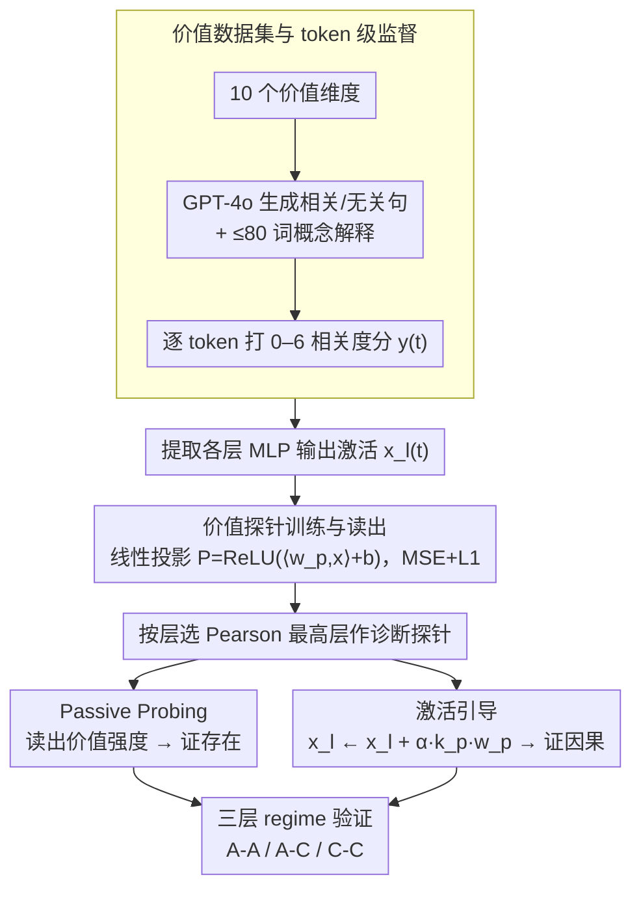

# BACH-V: Bridging Abstract and Concrete Human-Values in Large Language Models

**会议**: ACL 2026  
**arXiv**: [2601.14007](https://arxiv.org/abs/2601.14007)  
**代码**: 无  
**领域**: LLM 对齐 / 价值观 / 可解释性  
**关键词**: 价值表示, 概念探针, 激活引导, 对齐机制, 抽象-具体落地

## 一句话总结
本文提出 abstraction-grounding 框架，把 LLM 的概念理解拆成"抽象-抽象 / 抽象-具体 / 具体-具体"三层，并用概念探针 + 激活引导在 6 个开源 LLM、10 个价值维度上证明：LLM 内部确实存在结构化的价值表示，能跨抽象层迁移、并因果地驱动具体决策。

## 研究背景与动机

**领域现状**：当前的 LLM 价值对齐基本停留在行为层——RLHF、Constitutional AI 都是用偏好数据塑造输出，使其符合人类预期。

**现有痛点**：行为层对齐没法保证模型"真懂"抽象原则——一旦遇到分布外场景或新颖伦理困境，对齐行为往往脆性失效，模型只是表面上模仿正确答案，而非内化原则。

**核心矛盾**：把"理解抽象概念"当成一个不可分的整体来评估是错的——模型可能在概念间关系上很连贯，却没法把概念落到具体事件；也可能识别得出具体实例，却没法用概念去约束决策。这三种能力本质不同，混在一起测就分不清失败原因。

**本文目标**：(1) 给"抽象概念理解"一个可操作化的分层框架；(2) 验证 LLM 内部是否存在真正的价值表示；(3) 验证这些表示能否因果地控制具体行为。

**切入角度**：作者借用 superposition 假说——LLM 中间层激活近似是特征向量的正交叠加，每个方向编码一种语义。如果价值真的被编码，就应该能用线性探针读出来；如果能读出来的方向也能"写进去"，就证明这是因果性的、可干预的表示。

**核心 idea**：用同一个方向同时做概率读出（probing）和激活注入（steering），在 A-A / A-C / C-C 三种 regime 下系统测一遍 —— 既证存在性，又证迁移性，又证因果性。

## 方法详解

### 整体框架
BACH-V 用「三层 regime × 两种工具」的矩阵来拆解并验证 LLM 的价值表示。三层 regime 把「模型懂不懂一个价值」分成抽象-抽象（A-A，能否区分不同抽象概念的语义）、抽象-具体（A-C，抽象概念能否在具体事件里被识别）、具体-具体（C-C，抽象原则能否调控具体决策）三个递进层级；两种工具则分别从两个方向验证——Passive Probing 用线性探针被动读出激活里的价值强度以证明「存在」，Active Steering 把探针方向反向注入激活以证明「因果」。给定 prompt 加一段文本（抽象描述、具体事件或决策场景），系统提取每层 MLP 输出激活，输出该价值的相关性打分或调控后的行为分布；每个价值在每层都单独训一个探针，并选 Pearson 相关最高的那层作为后续实验的「诊断探针」。

### 关键设计

**1. 价值数据集与 token 级监督信号：用逐 token 强度对齐方向**

要让线性探针学到的方向真正对应「价值语义」而非句子层面的无关特征，监督信号的粒度至关重要。BACH-V 为 10 个价值维度（爱国、平等、正直、合作、个人主义、纪律、好奇、勇气、满足、休息）用 GPT-4o 两步构造语料：step1 为每个价值各产 400 条相关与 400 条无关句子，step2 再为每句生成 ≤80 词的解释作为「抽象概念语义」；随后对每个 token 用 0-6 的七级标尺打 token 级相关度分数 $y(t)$，其中 90% 用于训探针、10% 留作测试。

用 token 级分数而非句子级 label，能让探针方向逐 token 地对齐「价值语义的强度」，避免被句子里的其他特征带偏；而由同一模型生成成对的相关 / 无关对照样本，则进一步压制了虚假关联。

**2. 价值探针的训练与读出：稀疏线性投影 + 按层选最优**

在某一层 $l$ 上，BACH-V 学一个线性投影 $P(\vec{x}) = \text{ReLU}(\langle \vec{w}_p, \vec{x} \rangle + b)$，把 MLP 输出激活映射成该价值的强度分，训练目标是带 L1 正则的 MSE：$\Omega(\vec{w}_p, b) = \mathbb{E}\|y(t) - P(\vec{x}_l(t))\|_2^2 + \lambda \|\vec{w}_p\|_1$。读出时对一段文本的所有 token 取分数平均，即得该文本的价值激活分。

线性加稀疏正则的组合既保留了方向的可解释性、又避免过拟合到 token 噪声；而之所以逐层都训、再选验证集 Pearson 相关最高的层作诊断探针，是因为实验发现 probing 性能呈「浅层升、中层峰、深层降」的曲线，最优层因模型而异，固定某一层并不可靠。

**3. 激活引导：用同一方向把价值写回去**

证明价值表示是因果的而非旁观的，关键在于「读出的方向也能写入」。BACH-V 直接把探针方向 $\vec{w}_p$ 当作干预向量，按 $\vec{x}_l(t) \mapsto \vec{x}_l(t) + \alpha k_p \vec{w}_p$ 修改激活，其中归一化因子 $k_p = k_0 / |\vec{w}_p|$、$\alpha$ 为引导强度。其依据是 superposition 与 aggregation 假说——读出方向与写入方向在几何上等价，因此在某些 token-stream 上注入该方向就能放大或抑制对应价值的内部表示，再观察输出选项分布的变化。

与行为层 RLHF 那种看不出「动了哪个概念」的 black-box 修改不同，这种几何注入是 white-box 干预，能把「激活了哪个价值」直接对应到行为变化上，从而把表示与行为之间的因果链做实。

### 损失函数 / 训练策略
整套流程只训练线性探针参数 $\vec{w}_p, b$（LLM 全程冻结），目标为 MSE + L1 正则；干预阶段不涉及任何训练，仅在推理时改激活。实验在 6 个开源 LLM（Qwen3-4B/8B、Llama3-3B/8B、Mistral-7B、Gemma2-9B）上整套跑一遍，构成 3 (regime) × 2 (probing/steering) × 10 (value) × 6 (model) 的完整实验矩阵。

## 实验关键数据

### 主实验

**探针特异性**（diagonal vs off-diagonal 激活差，Qwen3-8B 为例）：

| Regime | 任务 | 对角格（匹配） | 非对角格（错配） | 现象 |
|--------|------|----------------|-------------------|------|
| A-A | 抽象概念描述 | 显著高 | 显著低 | 完美区分 10 个价值 |
| A-C | 具体事件叙述 | 显著高 | 显著低 | 抽象探针成功识别隐含价值 |
| C-C | 决策推理链 | 显著高 | 显著低 | 抽象探针识别决策动机 |

外部验证：用 GPT-5.2 / Gemini-3-Pro / Claude-Sonnet-4.5 给 A-C 语料打价值相关度，与探针均值分高度一致，说明探针抓的不是噪声而是真实价值信号。

### 消融 / 引导实验

| 设置 | 现象 | 解读 |
|------|------|------|
| A-A + steering（$\alpha$ 从负到正扫） | 平均相关度恒 ~50%，几乎不动 | 抽象描述里语义本身高度极化，干预无法撼动 |
| A-C + steering | 分布按 $\alpha$ 单调上下平移 | 中间地带的事件被显著推到"相关 / 不相关" |
| C-C + steering | 选项概率分布按 $\alpha$ 系统迁移 | 价值真的因果性地影响了决策 |
| 跨 6 个 LLM | 三类 regime 模式一致 | 现象不是单模型偶发 |

### 关键发现
- **不对称性是核心发现**：A-A 抗干预、A-C/C-C 可被干预——说明抽象概念一旦被编码就像"稳定锚点"，不容易被局部线性扰动撼动，但它会下游传播到具体判断和决策。
- **中间层最有效**：所有 LLM 的探针性能都呈现浅层升 / 中层峰 / 深层降的曲线，提示价值编码主要发生在中间表示层。
- **极化样本对 steering 不敏感**：被引导的主要是处于"中间地带"的语料，已经强极化的样本几乎不动，意味着 steering 是边际改写而非全局重写。

## 亮点与洞察
- **三层 regime 是这篇最值钱的概念贡献**：把"模型懂不懂这个概念"拆成可操作的存在 / 落地 / 应用三层，未来任何"模型理解 X"的研究都可以套这个分解。
- **读出方向 = 写入方向**：用同一向量做 probing 和 steering，把"语义存在性 → 行为因果性"两步一气呵成，方法学上比之前分别做 SAE 解释 + 单独搞 steering 的工作更紧凑。
- **A-A 抗干预这个 null 结果反而最有价值**：揭示"抽象概念是锚点而非可滑动激活"，对未来想做 value editing / unlearning 的工作是重要警示——你能改它对具体决策的影响，却很难改它的"定义"。

## 局限与展望
- 单层线性探针对分布式信号刻画有限，作者承认这是天花板；可尝试多层 / SAE 特征 / cross-layer transcoder。
- Steering 强度 $\alpha$ 过大时干预反而失效，作者只做了 preliminary 观察，缺少机制性解释。
- 价值集只有 10 个、且依赖 GPT-4o 合成数据，跨文化 / 真实场景泛化未验证；C-C 的二选一决策场景也偏理想化，离真实 agent 还远。
- 没讨论引导对其他能力的副作用（如改 curiosity 是否伤害 reasoning），实际部署需补充。

## 相关工作与启发
- **vs SAE-based interpretability**（Anthropic Templeton 等）：他们用 SAE 找单义特征做解释 + 干预，本文用线性探针走更轻量路线，且把"三层 regime"作为新的评估维度，互补而非冲突。
- **vs ValueBench / ValueCompass**：那些工作把 LLM 当被试者填问卷做行为评估，本文反过来直接读内部激活、追踪价值信号的传播路径，是从黑盒走向白盒。
- **vs CAA / Steering vectors**（Panickssery 等）：传统 steering 向量来自对比样本的激活差，本文直接用 probing 训出的方向做干预，从理论上更连贯（同方向同时读 / 写）。

## 评分
- 新颖性: ⭐⭐⭐⭐ 三层 regime 框架和"读 = 写"的统一视角是清晰原创贡献。
- 实验充分度: ⭐⭐⭐⭐ 6 模型 × 10 价值 × 3 regime × 2 工具的完整矩阵，外部 LLM 评估也做了。
- 写作质量: ⭐⭐⭐⭐ 概念框架表述清晰，A-A 抗干预的解释富有洞见。
- 价值: ⭐⭐⭐⭐ 给可解释对齐和 value editing 提供了机械论基础，A-A null 结果对 unlearning 研究有警示意义。

<!-- RELATED:START -->

## 相关论文

- [\[ACL 2026\] Mitigating Selection Bias in Large Language Models via Permutation-Aware GRPO](mitigating_selection_bias_in_large_language_models_via_permutation-aware_grpo.md)
- [\[ACL 2026\] Large Language Models Are Overconfident in Their Own Responses](large_language_models_are_overconfident_in_their_own_responses.md)
- [\[ACL 2026\] Why Supervised Fine-Tuning Fails to Learn: A Systematic Study of Incomplete Learning in Large Language Models](why_supervised_fine-tuning_fails_to_learn_a_systematic_study_of_incomplete_learn.md)
- [\[NeurIPS 2025\] Can DPO Learn Diverse Human Values? A Theoretical Scaling Law](../../NeurIPS2025/llm_alignment/can_dpo_learn_diverse_human_values_a_theoretical_scaling_law.md)
- [\[ACL 2026\] Towards Bridging the Reward-Generation Gap in Direct Alignment Algorithms](towards_bridging_the_reward-generation_gap_in_direct_alignment_algorithms.md)

<!-- RELATED:END -->
