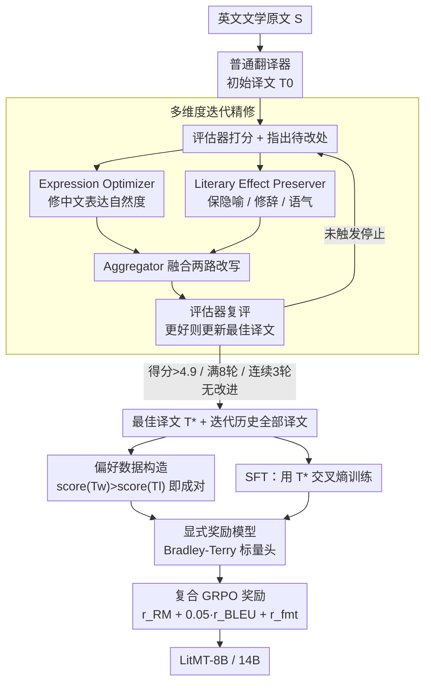

# Better Literary Translation: A Multi-Aspect Data Generation and LLM Training Approach

**会议**: ACL2026  
**arXiv**: [2606.05924](https://arxiv.org/abs/2606.05924)  
**代码**: 无公开仓库，论文给出了数据生成与评测 prompt 细节  
**领域**: LLM 对齐 / 文学机器翻译  
**关键词**: 文学翻译, 多维度数据生成, 偏好优化, 奖励模型, GRPO

## 一句话总结
这篇论文把文学翻译质量拆成“表达流畅”和“文学效果”两个维度，用专门 LLM 反复生成高质量参考译文和偏好对，再用 SFT + 显式奖励模型 + GRPO 训练 LitMT，使 8B/14B 小模型在英译中文学翻译上接近甚至超过部分大模型。

## 研究背景与动机
**领域现状**：文学翻译不同于普通机器翻译，它不仅要准确传达语义，还要保留隐喻、修辞、语气和叙事风格。近年的做法主要有两类：一类用大模型或长 CoT 直接生成更细致的译文，另一类用 LLM-as-a-judge 在强化学习中打分，代表包括 DRT、DeepTrans 和 ExTrans 等文学翻译专用模型。

**现有痛点**：这些方法有效但成本很高。长 CoT 会显著增加推理延迟，论文中指出可带来最高约 $10\times$ 的延迟开销；而在 RL 中把强 LLM 当奖励函数，则每个训练样本、每次训练都要调用昂贵的评审模型，数据和奖励信号难以复用。

**核心矛盾**：文学翻译的质量并不是单一标量。译文越自然流畅，可能越容易牺牲原文的隐喻和陌生化表达；越强调文学效果，又可能变得生硬或不符合目标语言习惯。直接让一个模型“综合优化”容易把这两个目标混在一起，难以得到稳定、可训练的监督信号。

**本文目标**：作者希望先离线生成可复用的高质量参考译文和偏好数据，再用它们训练较小的专用翻译模型。具体来说，目标包括：提升 MetaphorTrans 上英译中文学翻译质量；比较 DPO 系列隐式偏好优化和显式奖励模型 + GRPO 在该任务中的差异；让最终模型不依赖长 CoT 或在线 LLM 评审，从而更适合实时翻译。

**切入角度**：作者的观察是，文学翻译至少可以分解为表达流畅度和文学效果保留两个可讨论的维度。与其一次性采样多个译文再让 judge 选最好，不如让不同“译者”分别朝一个维度改写，再由聚合器融合，最后用评估器打分并留下完整迭代轨迹。

**核心 idea**：用“多维度专门译者 + 迭代评估聚合”生成比原始标注更好的译文参考和偏好对，再用显式奖励模型把这些偏好信号转化为稳定的 GRPO 训练奖励。

## 方法详解
论文的方法分为两个阶段：第一阶段是离线数据生成，负责把 MetaphorTrans 的训练源句扩展成高质量参考译文和偏好对；第二阶段是模型训练，分别尝试 SFT、DPO/SimPO/CPO 和奖励模型 + GRPO。关键点在于，昂贵的强 LLM 只用于一次性构造训练数据，最终推理时的 LitMT 模型不需要长链式推理，也不需要调用外部 LLM judge。

### 整体框架
输入是一句英文文学文本 $S$。系统先用一个普通翻译器生成初始译文 $T_0$，再进入迭代循环：评估器给当前最佳译文打分并指出问题；Expression Optimizer 重点修正中文表达是否自然；Literary Effect Preserver 重点保护隐喻、修辞和语气；Aggregator 把两种改写合成为一个新译文；评估器再次打分，如果更好就更新当前最佳译文。循环在得分超过阈值 $\tau=4.9$、达到最大轮数 $K=8$，或连续 $N=3$ 轮没有改进时停止。

生成阶段留下两类产物。第一类是每个源句的最佳译文 $T^*$，用于 SFT；第二类是迭代历史中所有“高分译文优于低分译文”的偏好对，用于 DPO 系列训练或奖励模型训练。训练阶段先用高质量参考做 SFT，然后比较隐式偏好优化与显式奖励建模。最终最好的方案是从 SFT checkpoint 出发，训练一个 8B reward model，再用 GRPO 结合复合奖励继续优化策略模型。

### 关键设计

**1. 多维度迭代精修：把“好读”和“有文学性”拆成两个译者各自负责，而不是让一个模型混着优化**

文学翻译的质量天生是两难的：译文越自然流畅，越容易磨平原文的隐喻和陌生化表达；越死守文学效果，又容易写得生硬、不合中文习惯。随机采样多个译文再让 judge 选一个，只能在已有候选里挑，而普通自我改写又往往被单一偏好牵着走。这套方法把优化拆成三个专职模块协作：Expression Optimizer 专管让中文更自然、凝练、搭配地道，Literary Effect Preserver 专管保留比喻、修辞、语气和文学张力，Aggregator 再把两路改写融成一个平衡版本。评估器在每轮不仅打分，还给出下一轮该改哪里的具体反馈。这样模型是在“好读”和“有文学性”两个方向上显式探索，而迭代轨迹本身也自然沉淀出一条由低到高的质量层级。

**2. 从迭代历史构造偏好数据：让每个源句不只贡献一个 SFT 目标，还贡献一串细粒度比较信号**

如果只保留每个源句的最终最佳译文，模型只知道“该输出什么”，却学不到“为什么这版比那版好”——而文学翻译的差距恰恰藏在这些细微处。这里的做法是把迭代过程中所有被评估过的译文都利用起来：对同一源句，只要 $score(T_w)>score(T_l)$，就构造一个偏好对 $(T_w,T_l)$。于是每个样本既给出一个 SFT target，又派生出多个细粒度的优劣比较。这些偏好对既能喂给 DPO、CPO、SimPO 这类隐式偏好优化，也能拿去单独训练一个 reward model，复用率远高于一次性的最佳译文。

**3. 显式奖励模型 + 复合 GRPO 奖励：用本地标量奖励替代训练期反复调用昂贵的 LLM-as-a-judge**

论文发现 DPO 系列在这个任务上反而让性能下降，说明离线偏好对直接推策略并不稳定；而每步都调强 LLM 当奖励又太贵、信号难复用。于是作者把 LLM 的语言建模头换成一个线性标量头，用 Bradley-Terry loss 训练奖励模型，并加 $\lambda(r_w+r_l)^2$ 这一项把 reward 居中、避免漂移。进入 GRPO 阶段后，对每个源句采样 $G=16$ 个译文，用复合奖励 $r(x,y)=r_{RM}+0.05\cdot r_{BLEU}+r_{fmt}$ 来打分：reward model 负责整体质量，BLEU 提供一个稳定的词汇层信号，格式奖励则惩罚不符合 JSON 输出格式的结果。显式 RM 配 GRPO 的在线探索，既能真正吃进迭代历史里的质量差异，又把昂贵的强 LLM 调用一次性留在了离线数据生成阶段。

### 损失函数 / 训练策略
SFT 使用最佳译文 $y^*$ 做交叉熵训练：$\mathcal{L}_{SFT}=-\mathbb{E}_{(x,y^*)}[\log \pi_\theta(y^*|x)]$。DPO 系列直接在偏好对上优化策略，论文比较了 DPO、CPO 和 SimPO。显式奖励模型使用 Bradley-Terry 目标 $\mathcal{L}_{RM}=-\mathbb{E}[\log\sigma(r_w-r_l)]+\lambda(r_w+r_l)^2$，其中 $\lambda=0.01$。

实验使用 MetaphorTrans 的 19,264 个训练样本和 2,000 个测试样本。偏好数据按样本划分为 17,337 个训练源句和 1,927 个开发源句，构造出 179,588 个训练偏好对和 19,767 个开发偏好对。LitMT-8B 和 LitMT-14B 分别从 Qwen3-8B-Base 与 Qwen3-14B-Base 训练。SFT 和 DPO 系列使用学习率 $1e^{-5}$、warmup ratio 0.05、3 个 epoch；GRPO 从 SFT checkpoint 出发，学习率 $1e^{-7}$、3 个 epoch、temperature 1.0、top-p 0.9、KL 系数 $\beta=0.01$。

## 实验关键数据

### 主实验
论文使用 Claude Opus 4.5 作为主评估器，报告 CRF、CEA5 和 CEA100，其中 CEA100 是主要指标。下表摘取最关键的 MetaphorTrans 主结果。

| 模型 | 参数规模 | CEA100 | 备注 |
|------|----------|--------|------|
| Qwen3-8B | 8B | 52.77 | 未专门训练的通用模型 |
| DRT-14B | 14B | 58.43 | 文学翻译专用模型 |
| DeepTrans-7B | 7B | 61.15 | 使用 RL 的专用模型 |
| ExTrans-7B | 7B | 62.95 | 强专用基线 |
| Qwen3-235B-A22B | 235B / 22B activated | 65.62 | 数据生成 teacher |
| LitMT-8B | 8B | 67.25 | 本文模型 |
| Claude Sonnet 4.5 | - | 68.43 | 闭源强模型 |
| GPT-5.2 | - | 68.68 | 闭源强模型 |
| LitMT-14B | 14B | 69.07 | 本文模型 |
| Claude Opus 4.5 | - | 73.30 | 最强评估列表模型 |

在域外 O. Henry Collection 上，LitMT-8B 得到 70.38 CEA100，显著超过 Qwen3-32B 的 65.81；LitMT-14B 得到 73.71，接近 Qwen3-235B-A22B 的 74.01。这说明模型并不是只记住 MetaphorTrans 风格，对早期美国英语叙事也有迁移能力。

### 消融实验
训练策略消融显示，偏好优化方法之间差异很大。

| 训练方法 | CRF | CEA5 | CEA100 | 结论 |
|----------|-----|------|--------|------|
| SFT | 72.66 | 3.54 | 65.74 | 高质量参考译文本身已经很强 |
| SimPO | 69.98 | 3.41 | 62.62 | 低于 SFT |
| DPO | 70.50 | 3.44 | 63.39 | 低于 SFT |
| CPO | 70.69 | 3.45 | 63.67 | 低于 SFT |
| RM+GRPO | 73.03 | 3.61 | 67.25 | 比 SFT 高 1.51 点 |

多维度数据生成本身也有清晰贡献。

| 数据或模块配置 | CEA100 | 关键含义 |
|----------------|--------|----------|
| DRT Ground Truth | 57.09 | 原始标注作为 SFT target 明显偏弱 |
| Qwen3-235B-A22B 单次蒸馏 | 61.08 | teacher 输出强于原标注，但仍不够 |
| DeepSeek V3.1 单次蒸馏 | 62.78 | 换强模型有提升 |
| 本文多维度精修数据 | 65.74 | 比 Qwen3 单次蒸馏高 4.66 点，比原始 GT 高 8.65 点 |

### 关键发现
- LitMT-8B 的 67.25 CEA100 高于生成数据所用的 Qwen3-235B-A22B 的 65.62，说明多轮、多维度精修不是简单蒸馏，而是在数据层面提升了 target 质量。
- DPO、CPO、SimPO 都比 SFT 低 2-3 个 CEA100 点，偏好对在文学翻译中直接用于隐式策略优化并不稳定。
- RM+GRPO 比 SFT 高 1.51 点，说明显式奖励模型加在线采样能更好利用迭代历史中的质量差异。
- 数据生成统计显示，平均得分从 4.43 提升到 4.73，最佳译文平均分 4.88，61.6% 样本达到 $\tau=4.9$ 阈值；reward model 在 19,767 个 dev 偏好对上总体准确率为 72.49%，当分差 $\geq3.0$ 时准确率达到 96.20%。

## 亮点与洞察
- 这篇论文最强的点是把“数据生成”做成了可解释的翻译工作流，而不是让一个大模型凭空产出参考答案。表达流畅和文学效果两个维度的拆解很贴合文学翻译本身的矛盾。
- 结果中最有启发的是 student 超过 teacher：Qwen3-235B 生成数据，LitMT-8B 反而在 CEA100 上超过它，说明高质量迭代数据可以把大模型的能力重新组织成更适合任务的小模型行为。
- DPO 系列整体退化也很有价值。它提醒我们，偏好数据并不天然适合所有任务；当偏好对来自细粒度语言质量比较时，显式 reward model 和在线探索可能比封闭形式的偏好目标更稳。
- 复合奖励里的 BLEU 权重只有 0.05，却能改善训练稳定性。对于生成任务，这种“小剂量传统指标 + 学习奖励”的设计比完全依赖神经奖励更可控。

## 局限与展望
- 作者只在英译中文学翻译上验证，尚不清楚多维度译者的 prompt 和权重是否能直接迁移到中译英、低资源语种或诗歌翻译。
- 评估主要依赖 Claude Opus 4.5 等 LLM judge，虽然作者做了多评审器一致性分析，但文学翻译最终仍需要更强的人类专家验证。
- 论文观察到 DPO 系列退化，但理论解释还不充分。为什么显式 RM+GRPO 更适合这种偏好数据，仍需要从偏好分布、探索范围和 reward misspecification 角度继续分析。
- 方法需要一次性调用强 LLM 做 19,264 个样本的多轮精修，数据生成成本不低。虽然相比训练期反复调用 judge 更可复用，但对小团队仍可能有门槛。
- 未来可以把质量维度扩展到文化典故、人物语气一致性、章节级上下文连贯性，也可以研究如何把长 CoT 的显式推理能力压缩进不带 CoT 的 LitMT 模型。

## 相关工作与启发
- **vs DRT**: DRT 用长 CoT 合成文学翻译训练数据，本文则用多维度短输出精修。前者更强调推理过程，后者更强调可复用的参考译文和偏好对，推理成本更低。
- **vs DeepTrans / ExTrans**: DeepTrans 和 ExTrans 依赖 LLM-as-a-judge 做 RL 奖励，训练时成本高；本文把 judge 的角色前移到离线数据生成和 reward model 训练中，最终 GRPO 使用本地复合奖励。
- **vs Self-Refinement**: 普通自我精修通常由同一个模型反复修改，容易陷入单一偏好。本文的多 agent 拆解更像专业翻译流程：一个人润色中文表达，一个人检查文学效果，最后综合。
- **对其他任务的启发**: 任何存在多维质量 trade-off 的生成任务都可以借鉴这个范式，例如医学报告生成中的准确性与可读性、对话回复中的有用性与安全性、代码生成中的简洁性与鲁棒性。

## 评分
- 新颖性: ⭐⭐⭐⭐☆ 将多维度精修、偏好数据和 GRPO 串成完整文学翻译训练管线，任务贴合度很高。
- 实验充分度: ⭐⭐⭐⭐☆ 主实验、域外测试、训练方法消融、数据源消融和 reward model 分析都比较完整，但人类专家评估仍偏少。
- 写作质量: ⭐⭐⭐⭐☆ 方法线索清楚，表格信息密集，DPO 退化这一反直觉发现解释得比较充分。
- 价值: ⭐⭐⭐⭐⭐ 为低延迟文学翻译模型提供了强基线，也给“如何把强 LLM 变成可复用训练数据”提供了很好的范例。

<!-- RELATED:START -->

## 相关论文

- [\[NeurIPS 2025\] Limited Preference Data? Learning Better Reward Model with Latent Space Synthesis](../../NeurIPS2025/llm_alignment/limited_preference_data_learning_better_reward_model_with_latent_space_synthesis.md)
- [\[ACL 2026\] Too Correct to Learn: Reinforcement Learning on Saturated Reasoning Data](too_correct_to_learn_reinforcement_learning_on_saturated_reasoning_data.md)
- [\[ACL 2026\] MDP-GRPO: Stabilized Group Relative Policy Optimization for Multi-Constraint Instruction Following](mdp-grpo_stabilized_group_relative_policy_optimization_for_multi-constraint_inst.md)
- [\[AAAI 2026\] LaF-GRPO: In-Situ Navigation Instruction Generation for the Visually Impaired via GRPO with LLM-as-Follower Reward](../../AAAI2026/llm_alignment/laf-grpo_in-situ_navigation_instruction_generation_for_the_visually_impaired_via.md)
- [\[ICLR 2026\] SafeDPO: A Simple Approach to Direct Preference Optimization with Enhanced Safety](../../ICLR2026/llm_alignment/safedpo_preference_optimization_safety.md)

<!-- RELATED:END -->
