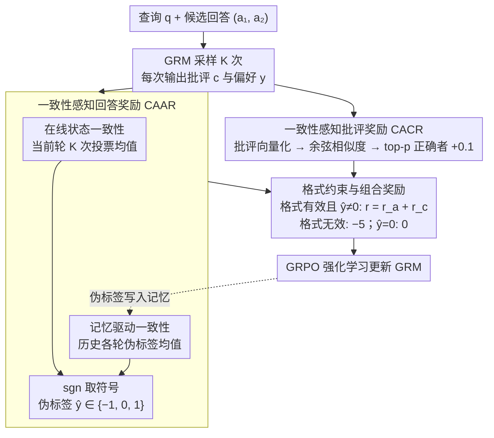

# ConsistRM: Improving Generative Reward Models via Consistency-Aware Self-Training

**会议**: ACL 2026  
**arXiv**: [2604.07484](https://arxiv.org/abs/2604.07484)  
**代码**: [GitHub](https://github.com/yuliangCarmelo/ConsistRM)  
**领域**: 对齐RLHF / 奖励模型  
**关键词**: 生成式奖励模型, 自训练, 一致性感知, 伪标签, 位置偏差

## 一句话总结

ConsistRM 提出基于一致性感知的自训练框架，通过时序一致性伪标签（融合在线状态和历史记忆的偏好一致性）和语义一致性批评奖励（衡量多次生成批评的语义相似度）两个模块，在无需人工标注的条件下将生成式奖励模型的五个基准平均性能提升 1.5%，同时显著缓解了位置偏差问题。

## 研究背景与动机

**领域现状**：生成式奖励模型（GRM）通过生成文本批评和偏好标签来替代传统标量奖励模型，具有更强的表达能力和泛化性。代表性工作包括 DeepSeek-GRM（生成批评+自推导规则）和 RM-R1（蒸馏推理轨迹+强化学习）。

**现有痛点**：GRM 训练面临两大挑战：(1) 依赖昂贵的人工标注数据，限制了可扩展性；(2) 自训练方法（如 TTRL 的多数投票伪标签）容易导致 reward hacking 和对噪声伪标签的早期过拟合，因为奖励信号与策略模型高度耦合。

**核心矛盾**：自训练需要可靠的伪标签，但模型生成的伪标签本身就不稳定——单次投票容易受采样随机性影响，训练后期伪标签偏差累积。

**本文目标**：设计一个无需人工标注、稳定且有效的 GRM 自训练框架。

**切入角度**：利用模型内在的"一致性"信号作为自监督来源——如果模型在多次采样和多轮训练中对同一样本给出一致的偏好判断，那么这个判断更可能是正确的。

**核心 idea**：用时间一致性（当前轮次 + 历史记忆）构建可靠伪标签，用语义一致性（多次批评文本的相似度）提供细粒度奖励，实现无标注的稳定 GRM 自训练。

## 方法详解

### 整体框架
ConsistRM 把生成式奖励模型的自训练建立在「一致性即可靠性」之上。给定查询 $q$ 和两个候选回答 $(a_1, a_2)$，GRM 生成结构化输出 $o = (c, y)$，其中 $c$ 是文本批评、$y \in \{-1, 1\}$ 是偏好标签。框架不依赖任何人工标注，而是从模型自身的两路一致性信号里提炼监督：一路是一致性感知回答奖励（CAAR），用当前轮投票与历史记忆共同投票出可靠伪标签；另一路是一致性感知批评奖励（CACR），用多次批评文本的语义相似度衡量过程质量。两路信号在格式约束下组合成最终奖励，交给 GRPO 做强化学习。

### 关键设计

**1. 一致性感知回答奖励（CAAR）：在线投票与历史记忆共同定标**

自训练最大的隐患是伪标签本身不稳定——单轮投票受采样随机性影响，到训练后期偏差还会累积。CAAR 因此融合两层一致性信号：在线状态一致性 $s_{\text{online}}^{(n)} = \frac{1}{K}\sum_{j=1}^{K} y_j$ 聚合当前轮 $K$ 次 rollout 的偏好预测，记忆驱动一致性 $s_{\text{memory}}^{(n)} = \frac{1}{n-1}\sum_{i=0}^{n-1} \hat{y}^{(i)}$ 则聚合历史所有轮次的伪标签，为当前判断提供一个稳定锚点。

两者相加取符号得到最终伪标签 $\hat{y}^{(n)} = \text{sgn}(s_{\text{online}}^{(n)} + s_{\text{memory}}^{(n)})$；当在线与记忆方向不一致时输出 0，即对这些低置信度样本不提供监督。这种 +1/-1/0 的三元设计显式地把不确定样本挡在优化之外，比二元强制分类更能避免噪声伪标签主导训练。

**2. 一致性感知批评奖励（CACR）：用批评的语义收敛补充过程监督**

CAAR 只看偏好结果，无法约束批评文本本身的质量，CACR 正是来补这块过程监督的。它用 Qwen3-4B-Embedding 把每次生成的批评 $c_j$ 编码为向量，计算余弦相似度矩阵后按语义一致性排序，对排名前 $p$ 且偏好正确的批评额外给奖励 $r_j^{(c)} = 0.1$。其直觉是：若多次生成的批评在语义上高度一致，说明模型对该样本的评估已经收敛到稳定区域，这样的批评更可能反映可靠判断。

由此 CAAR 看结果、CACR 看过程，两者在不同粒度上互补，让奖励既奖励「判对」又奖励「判得稳」。

**3. 格式约束与组合奖励：保证可解析并统一优化方向**

为确保 GRM 输出能被解析、且多层奖励朝同一方向发力，ConsistRM 把回答奖励与批评奖励组合成 $r^{(n)} = r_j^{(a,n)} + r_j^{(c,n)}$，仅在格式有效且 $\hat{y} \neq 0$ 时生效；格式无效时直接给 $r = -5$ 的重罚，$\hat{y} = 0$（不确定样本）时给 $r = 0$。优化用 GRPO 算法，全局 batch size 64、学习率 1e-6、8 次 rollout、KL 系数 0.001。

格式约束保证输出可被下游解析，而把不同粒度的一致性奖励叠加后，CAAR 与 CACR 在结果与过程两端给出一致的梯度信号，避免单一奖励被钻空子。

### 损失函数 / 训练策略
训练使用 GRPO，4 个 epoch，最大生成长度 1024（训练）/ 2048（推理），温度 1.0（训练）/ 0（推理）。整体先在 HelpSteer3 上做 SFT，再做 RFT（强化微调），ConsistRM 的两路一致性奖励正是在 RFT 阶段替换掉原有奖励信号。

## 实验关键数据

### 主实验

**Qwen3-8B 上的五基准性能**

| 方法 | RewardBench | PPE Pref | RM-Bench | RMB | JudgeBench | 平均 | Δ |
|------|------------|----------|----------|-----|------------|------|---|
| Qwen3-8B (Base) | 81.6 | 63.8 | 75.8 | 78.8 | 54.3 | 70.9 | - |
| + SFT | 82.7 | 65.0 | 77.1 | 76.9 | 51.7 | 70.7 | -0.2 |
| + RFT | 85.4 | 65.4 | 78.2 | 78.2 | 55.4 | 72.5 | +1.6 |
| + TTRL | 85.3 | 65.0 | 77.4 | 74.2 | 56.8 | 71.7 | +0.8 |
| + ConsistRM | **85.6** | **67.7** | **78.3** | **79.1** | **56.9** | **73.5** | **+2.6** |

### 消融实验

| 配置 | RewardBench | PPE | RM-Bench | RMB | JudgeBench | 平均 | Δ |
|------|------------|-----|----------|-----|------------|------|---|
| ConsistRM | 85.6 | 67.7 | 78.3 | 79.1 | 56.9 | 73.5 | - |
| w/o CACR | 84.9 | 64.8 | 77.3 | 78.1 | 56.0 | 72.2 | -1.3 |
| w/o Online-State | 85.5 | 64.1 | 78.6 | 76.7 | 56.7 | 72.3 | -1.2 |
| w/o Memory-Driven | 84.3 | 63.1 | 75.4 | 74.2 | 54.8 | 70.4 | **-3.2** |

### 关键发现

- Memory-Driven 一致性偏好是最关键组件（去掉后下降 3.2 分），说明历史信息对伪标签质量至关重要
- ConsistRM 在位置偏差缓解上提升显著（+5.3 vs RFT 的 +1.4），因为一致性奖励鼓励模型关注内容而非位置
- ConsistRM 使 4B 模型通过多轮投票可达到 8B 模型的性能水平
- 用 token 级置信度（DeepConfidence）替代 CACR 会导致 reward hacking 和性能下降

## 亮点与洞察

- "一致性即可靠性"的核心假设简洁有力——利用模型内在的一致性信号替代外部标注
- 时间维度的记忆机制（历史伪标签聚合）是关键创新，提供了跨训练轮次的稳定锚点
- 三元标签设计（+1/-1/0）优雅地处理了不确定样本，避免噪声标签污染
- 在生成效率上也有改进——ConsistRM 生成更简洁的批评（1717 vs 1924 token）

## 局限与展望

- 语义一致性评估仅在整体批评级别，未能细粒度对齐批评的各个语义片段
- 仅在 Qwen3 和 LLaMA-3.1 上验证，跨更多模型家族的泛化性待验证
- 一致性奖励的超参数（top-p 比例、CACR 奖励值 0.1）可能需要针对不同任务调整

## 相关工作与启发

- **vs TTRL**: TTRL 用多数投票作为伪标签，但缺乏跨轮次的时间一致性，后期容易偏差累积；ConsistRM 引入历史记忆显著缓解此问题
- **vs DeepSeek-GRM**: 后者需要人工标注的奖励信号，ConsistRM 完全无标注
- **启发**：一致性信号可能是自训练场景中一种通用的、低成本的质量信号

## 评分

- 新颖性: ⭐⭐⭐⭐ 一致性感知的自训练范式设计巧妙，尤其是时间一致性记忆机制
- 实验充分度: ⭐⭐⭐⭐⭐ 五基准、四模型、完整消融、位置偏差和多轮投票分析
- 写作质量: ⭐⭐⭐⭐ 方法描述清晰，实验分析详尽
- 价值: ⭐⭐⭐⭐ 为无标注 GRM 训练提供了实用且有效的方案

<!-- RELATED:START -->

## 相关论文

- [\[AAAI 2026\] GRAM-R²: Self-Training Generative Foundation Reward Models for Reward Reasoning](../../AAAI2026/llm_alignment/gram-r2_self-training_generative_foundation_reward_models_for_reward_reasoning.md)
- [\[ICML 2026\] Consistency Training Can Entrench Misalignment](../../ICML2026/llm_alignment/consistency_training_can_entrench_misalignment.md)
- [\[ACL 2026\] Mitigating Selection Bias in Large Language Models via Permutation-Aware GRPO](mitigating_selection_bias_in_large_language_models_via_permutation-aware_grpo.md)
- [\[ACL 2026\] Debiasing Reward Models via Causally Motivated Inference-Time Intervention](debiasing_reward_models_via_causally_motivated_inference-time_intervention.md)
- [\[ACL 2026\] Team-Based Self-Play With Dual Adaptive Weighting for Fine-Tuning LLMs](team-based_self-play_with_dual_adaptive_weighting_for_fine-tuning_llms.md)

<!-- RELATED:END -->
