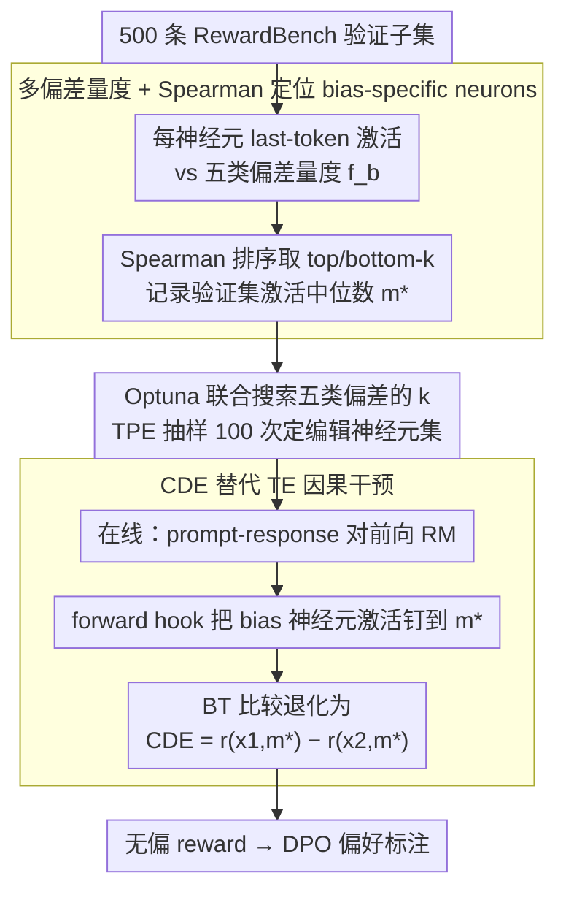

# Debiasing Reward Models via Causally Motivated Inference-Time Intervention

**会议**: ACL 2026  
**arXiv**: [2604.27495](https://arxiv.org/abs/2604.27495)  
**代码**: 论文未公开仓库链接（缓存中未给出）  
**领域**: LLM 对齐 / RLHF / 因果干预 / 可解释性  
**关键词**: reward model, 因果干预, 神经元编辑, 长度偏差, 格式偏差

## 一句话总结
作者把 Bradley-Terry reward model 视作估计 total effect 的因果图，识别出与五类风格性偏差（长度 / 段落 / 词重叠 / 感叹号 / 粗体）激活高度相关的 bias-specific neurons（占总神经元 < 2%），在推理时把这些神经元激活替换为验证集中位数（估计 controlled direct effect），在 RewardBench / RM-Bench 上既不掉点又消除偏差，DPO 下游使用后让 8B 模型的对齐分数追平 70B SOTA reward model。

## 研究背景与动机
**领域现状**：RLHF 中的 reward model（RM）是给 LLM 偏好打分的核心，普遍用 BT 模型 $p(y_1\succ y_2\mid q)=\sigma(r_\theta(x_1)-r_\theta(x_2))$ 实现。然而越来越多研究发现 RM 对响应长度（length bias）、列表 / 粗体 / 段落 / 表情等格式有系统性偏好（Singhal et al. 2024, Zhang et al. 2025）。

**现有痛点**：(i) 训练时纠偏（ensemble、weight averaging、infoBN、ODIN 加 head、数据增广）都需重训 RM，每出现一种新偏差就要重做一遍数据 / 架构，成本高。(ii) 推理时纠偏只有两种 —— length penalty（按字符数减 reward）和 LWR（locally weighted regression 估 length-only 偏置项），都只能处理长度，且会引入「偏 / 无偏数据子集」之间的性能权衡（unbiased 子集涨、biased 子集大幅掉）。(iii) RM 如何在内部「编码」这些偏差几乎是黑盒。

**核心矛盾**：训练时纠偏贵且不可外推到新偏差类型；现有推理时方法只是「在 reward 上做粗粒度减法」，没有触碰 RM 内部表征，因此天然在 biased / unbiased 之间存在 trade-off。

**本文目标**：(i) 给一种**无需重训** 的推理时纠偏方法，能同时处理多种风格偏差；(ii) 揭示 RM 在哪些神经元 / 哪些层编码这些偏差，给可解释性留下证据；(iii) 把该方法用在 DPO 偏好标注上，看是否能提升下游 LLM 的 alignment。

**切入角度**：把 RM 看作因果图：输入 $x$ → mediator $m$（bias 神经元激活） → 输出 $r$。BT 模型隐式估计 total effect $\hat{\mathrm{TE}}$，无法分离「内容质量」和「偏差信号」。改为估计 controlled direct effect $\hat{\mathrm{CDE}}$ ——把 $m$ 固定为 $m^*$（验证集 median）后再做差，就相当于「假设两条回答的偏差程度一样」时再比较内容质量。

**核心 idea**：先用 Spearman 相关找出与 5 类偏差最相关的 top/bottom-$k$ 神经元，再在推理时把它们的激活替换成验证集中位数，等价于做 CDE 估计，从而做到「不重训、跨偏差类型、不引入 trade-off」。

## 方法详解

### 整体框架
CIRM（Causally motivated Inference-time intervention for Reward Models）把「给 RM 纠偏」拆成离线定位、在线干预两步，全程不碰 RM 权重（图 2）。离线时它在 500 条 RewardBench 验证子集上，对每个神经元收集「last-token 激活」与五类风格偏差量 $f_b(x)$ 的成对样本，用 Spearman 相关挑出真正编码偏差的少数神经元，并记下它们在验证集上的激活中位数；每类偏差到底编辑多少个神经元，则交给 Optuna 在验证集准确率上做一次五维联合搜索来确定。在线推理时，每来一对 prompt-response 就正常前向，但把这些 bias-specific neurons 的激活强行钉到中位数 $m^*$ 再输出 reward——这样 BT 比较从估计 total effect 退化成估计 controlled direct effect $\hat{\mathrm{CDE}} = r_\theta(x_1, m^*) - r_\theta(x_2, m^*)$，即「假设两条回答的偏差程度一样」时再比内容质量。

### 关键设计

**1. 用多偏差量度 + Spearman 排序定位 bias-specific neurons：把纠偏从 reward 层下沉到神经元层**

之前的 LP / LWR 只在 reward 标量上做减法，颗粒度太粗，本文则要先找出 RM 内部到底哪些神经元在为风格偏差买单。为此对每类偏差 $b\in\{\text{len, para, over, excl, bold}\}$ 定义一个可量化的 surface feature：长度取字符数，段落取 `\n\n` 出现次数，overlap 取 response 与 query 的共词比，感叹号 / 粗体取 `!` / `**` 出现次数。然后对每个神经元 $n$ 在验证集上算 Spearman $\rho(a_n, f_b)$，把 top-$k$ 与 bottom-$k$ 一并取为 $b$ 的 bias-specific neurons——同时取两端是因为偏差既可能被正相关也可能被负相关地编码。

之所以用 Spearman 而非 Pearson，是因为它只要求单调相关、对异常激活更鲁棒。这套定位足够精准，五类偏差合并后实际只需编辑 GRM 1.7%、FsfairX 0.085% 的神经元，却能覆盖全部风格偏差。

**2. 用 Optuna 联合搜索多偏差的 $k$：让五类偏差的神经元数互相协调**

上一步只圈出了候选神经元，但每类偏差该编辑多少个（$k$）不能各调各的，否则会忽略不同偏差神经元集合之间的重叠与干涉，出现「调好长度反而把段落搞坏」。CIRM 把五类偏差的 $k$ 当作 5 维超参联合搜索，候选值 $k\in\{50,100,200,500,1000,2000,5000\}$ 共 $7^5 \approx 16{,}807$ 种组合，用 TPE 抽样 100 次，目标函数是 500 条验证集上的整体 reward accuracy。

联合搜索的好处是 TPE 能感知到「编辑过多 paragraph 神经元会拖垮 length 准确率」这类耦合。最终 GRM 选到 len=5000, para=5000, over=500, excl=200, bold=50，FsfairX 选到 len=500, para=100, over=100, excl=50, bold=200，两者差异也印证了不同 RM 对各偏差的编码冗余度很不一样。

**3. 用 CDE 替代 TE 做因果干预：把 mediator 钉死，系统性扣掉风格贡献**

定位好神经元、定好 $k$ 后，真正的纠偏发生在在线推理。把 RM 看成因果图（图 3）：输入 $x$ 到 reward $r$ 有两条路——$x \to r$ 的直接内容路径，和 $x \to m \to r$ 的间接偏差路径（$m$ 是 bias 神经元激活）。原始 BT 估计的 $\hat{\mathrm{TE}} = r_\theta(x_1, m(x_1)) - r_\theta(x_2, m(x_2))$ 把两条路混在一起，分不开内容好坏与风格强弱。CIRM 改成估计 $\hat{\mathrm{CDE}} = r_\theta(x_1, m^*) - r_\theta(x_2, m^*)$，即用 forward hook 把 mediator 固定为同一个 $m^*$ 后再做差，概念上正对应「当 $x_1, x_2$ 在偏差维度完全一样时谁的内容更好」，这恰是 reward model 真正想要的无偏比较。

$m^*$ 取验证集激活中位数：作者实测过 0、swap、median 三种选择，median 最稳——用中位数而非均值是为了对异常激活鲁棒，用单一固定值而非 swap 则避免 $x_1, x_2$ 的内容差异通过 mediator 互相传染。

### 损失函数 / 训练策略
**完全无训练**。所有编辑通过推理时的 forward hook 把命中神经元的激活替换为 $m^*$。下游 DPO 训练用标准 hyperparam（$\beta=0.1$，lr 5e-7，batch 64，1 epoch）。

## 实验关键数据

### 主实验
RewardBench 各偏差子集 + 整体（节选 Table 2，$B_b$ 偏 biased 子集 / $\overline{B_b}$ 无偏子集，准确率%）：

| RM / 方法 | $B_{\text{len}}$ | $\overline{B_{\text{len}}}$ | $\overline{B_{\text{para}}}$ | $\overline{B_{\text{over}}}$ | $\overline{B_{\text{excl}}}$ | ALL |
|-----------|-----:|-----:|-----:|-----:|-----:|----:|
| FsfairX (7B base) | 95.14 | 77.93 | 75.63 | 82.49 | 71.13 | 86.68 |
| FsfairX + LP | 93.45 | 85.12 | 86.57 | 85.99 | 77.32 | 89.67 |
| FsfairX + LWR | 93.45 | 85.95 | 87.04 | 86.38 | 78.35 | 90.08 |
| **FsfairX + CIRM** | **95.25** | 78.02 | 74.91 | 83.27 | 72.16 | 86.80 |
| INF-ORM-70B (SOTA) | 96.72 | 95.70 | 93.91 | 95.72 | 90.72 | 96.60 |

虽然 LP / LWR 在 $\overline{B_{\text{len}}}$ 上看似涨更多，但代价是 $B_{\text{len}}$ 掉点（FsfairX 95.14→93.45）；CIRM 同时维持 / 略升两个子集，且在 GRM 上 $\overline{B_{\text{para}}}$ 从 90.68 升 / 维持，$B_{\text{para}}$ 也升到 93.69。RM-Bench 同样表现（表 3）：LP/LWR 把 Easy 拉低、Hard 拉高，明显 trade-off；CIRM 保持 Easy 不掉的同时 Hard 也持平。

下游 DPO + AlpacaEval 2.0 / MT-Bench（节选 Table 4，Llama-3-8B-Instruct）：

| Reward model | LCWR | WR | length | MT-Bench |
|---|---:|---:|---:|---:|
| GRM (2B) | 37.53 | 47.47 | 2193 | 7.45 |
| GRM + LP | 44.49 | 40.18 | 1571 | 7.29 |
| GRM + LWR | 39.77 | 47.59 | 2119 | 7.58 |
| **GRM + CIRM** | 41.89 | 50.13 | 2201 | 7.53 |
| FsfairX (7B) | 37.78 | 49.74 | 2368 | 7.64 |
| FsfairX + LP | 44.03 | 46.88 | 1881 | 7.60 |
| FsfairX + LWR | 43.11 | 47.07 | 1929 | 7.44 |
| **FsfairX + CIRM** | 39.49 | **51.19** | 2345 | 7.62 |
| INF (70B SOTA) | 40.63 | 49.61 | 2201 | 7.42 |

7B + CIRM 的 WR 51.19 已经超过 70B INF 的 49.61，MT-Bench 也持平。

### 消融实验
表 5：依次去掉对某类偏差的干预（FsfairX + Llama3-8B）：

| 配置 | LCWR | WR | MT-Bench |
|------|-----:|---:|---------:|
| CIRM（全 5 类） | 39.49 | **51.19** | 7.62 |
| −len | 37.10 | 49.83 | 7.81 |
| −para | 38.20 | 50.89 | 7.53 |
| −over | 40.02 | 50.24 | 7.54 |
| −excl | 37.06 | 50.21 | 7.56 |
| −bold | 38.38 | 50.06 | 7.29 |

去掉任何一类偏差干预都会破坏 LCWR / WR / MT-Bench 的整体平衡，证明 5 类必须联合处理。表 6 验证 CIRM 把 GRM 标注里的 biased 比例 len 54.85→51.71、para 55.88→52.14 等微降，而 LP/LWR 是「猛降」（len 25.65），这种「适度抑制」正是不破坏 MT-Bench 的原因。

### 关键发现
- **bias-specific neurons 集中在浅层**（图 4-5）：5 类偏差对应的神经元主要分布在 RM 的早期 transformer 层，且大多在 query / up / gate projection 里 —— 与 Meng et al. 2022 关于 up-projection 检索知识的假说一致。这暗示 RM 把「表面风格」放进了浅层快速通路，便于做局部编辑。
- **CIRM 避免了 biased / unbiased trade-off**：LP 在 RM-Bench Easy 上从 88.43 跌到 82.39，Hard 上涨到 59.55；CIRM Easy 维持 88.95，Hard 49.04 几乎不动 —— 因为它只关掉 RM 对偏差的依赖，不动正确比较时的语义信号。
- **2B / 7B + CIRM ≈ 70B INF**：在 AlpacaEval LCWR、MT-Bench 上小 RM 加 CIRM 与 70B SOTA reward model 同档，意味着「无偏化」对下游 DPO 的价值可能比单纯加大 RM 规模更高。
- **下游 LLM 偏差也被压住**（表 7）：DPO 后 Gemma2 用 vanilla GRM 标注会放大 length（1323→1538）和 bold（14.82→21.22），用 CIRM 标注只温和变化（1323→1511），且不像 LP/LWR 反而把 excl 从 0.5 推到 0.6。
- **TruthfulQA 提升**（表 8）：四组中三组在 CIRM 后 truthful 度上升，说明剔除风格偏差让 RM 更看重内容真伪，副带提升下游事实性。

## 亮点与洞察
- **把 BT reward 视作 TE 估计、用 CDE 替换是干净的因果叙事**：这是首次把因果中介分析正式接到 RLHF reward modeling 上，给「reward 中风格 vs 内容」的分解提供了形式化语言。
- **「median 替换激活」比 zero / swap 都好**：作者实测三种 $m^*$ 选择，median 胜出，可能因为它是对异常激活更鲁棒的 controlled value；这一小经验对所有神经元干预工作（Vig 2020、Kojima 2024）都有借鉴价值。
- **联合搜索 $k$ 揭示偏差之间的相互作用**：发现 paragraph bias 在 $\overline{B_{\text{para}}}$ 上反而被 CIRM 略损，但去掉它 DPO 下游会掉 —— 提示「RM benchmark 的子集准确率」并非下游 alignment 的可靠 proxy。

## 局限与展望
- 只覆盖 5 类预定义偏差（length / paragraph / overlap / exclamation / bold），列表 / 链接 / emoji 等其他风格偏差以及任务相关偏差需手工再加 surface feature。
- bias-specific neuron 识别依赖 500 条验证集 + 超参搜索，存在过拟合风险；不同 RM 选到的 $k$ 数量差异大（GRM 21k vs FsfairX 1.9k）。
- 因果图过于简化为 $x\to m\to r$，当偏差信号在多个 hidden state 之间广泛分布时干预效率会下降。
- 下游 alignment 全靠 LLM-as-judge（GPT-4o / GPT-4-turbo），评测本身可能继承类似偏差。
- 方法依赖 RM 的「最后 token 激活」做相关性分析，对 encoder-only 或非自回归 RM 需重新设计。

## 相关工作与启发
- **vs LP (Dong et al. 2024) / LWR (Huang et al. 2024)**: 同样不重训，但只处理 length 且基于 reward-level 减法；CIRM 是 neuron-level 因果干预，能同时处理 5 类偏差且无 trade-off。
- **vs ODIN / InfoRM / Park et al. 2024a**: 都需重训 RM（加 head、信息瓶颈、数据增广）；CIRM 完全在推理时完成。
- **vs Vig et al. 2020 / Meng et al. 2022 / Kojima et al. 2024**: 前者用 causal mediation 研究单类 attribute（性别 / 知识 / 语言），本文首次扩展到 RLHF 的 reward modeling 并联合处理多偏差。
- **vs RM Ensemble (Eisenstein 2024) / WARM (Rame 2024)**: 走 robustness via averaging 路线，需要多 RM；CIRM 单 RM 即可，部署简单。

## 评分
- 新颖性: ⭐⭐⭐⭐⭐ 把 BT 解读为 TE、用 CDE 干预 RM 神经元，思想很新且落地很轻。
- 实验充分度: ⭐⭐⭐⭐ RM benchmark + 下游 DPO + 偏差残留 + TruthfulQA 多维度验证；缺更多 RM 架构。
- 写作质量: ⭐⭐⭐⭐ 因果图与公式清晰，case study 直观。
- 价值: ⭐⭐⭐⭐⭐ 让 7B RM 达到 70B SOTA 的下游对齐效果，工业 RLHF pipeline 直接受益。

<!-- RELATED:START -->

## 相关论文

- [\[NeurIPS 2025\] Inference-time Alignment in Continuous Space](../../NeurIPS2025/llm_alignment/inference-time_alignment_in_continuous_space.md)
- [\[AAAI 2026\] W2S-AlignTree: Weak-to-Strong Inference-Time Alignment for Large Language Models via Monte Carlo Tree Search](../../AAAI2026/llm_alignment/w2s-aligntree_weak-to-strong_inference-time_alignment_for_large_language_models_.md)
- [\[ACL 2026\] Student Guides Teacher: Weak-to-Strong Inference via Spectral Orthogonal Exploration](student_guides_teacher_weak-to-strong_inference_via_spectral_orthogonal_explorat.md)
- [\[ACL 2026\] ConsistRM: Improving Generative Reward Models via Consistency-Aware Self-Training](consistrm_improving_generative_reward_models_via_consistency-aware_self-training.md)
- [\[ACL 2026\] On the Rejection Criterion for Proxy-Based Test-Time Alignment](on_the_rejection_criterion_for_proxy-based_test-time_alignment.md)

<!-- RELATED:END -->
