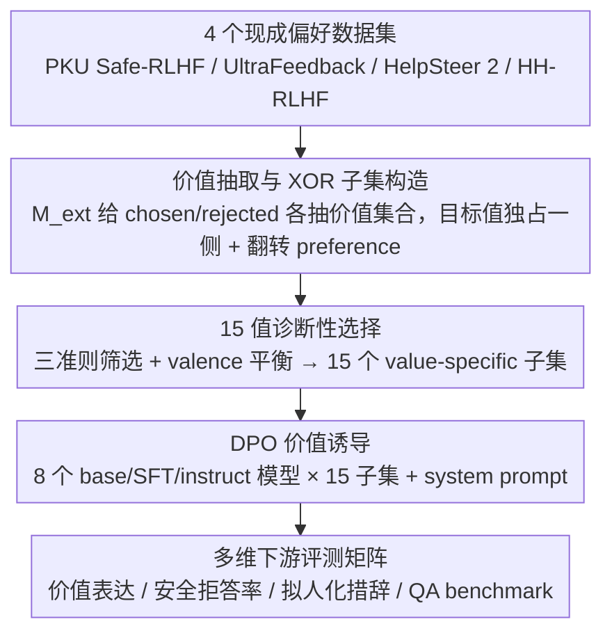

# How Value Induction Reshapes LLM Behaviour

**会议**: ACL 2026 Findings  
**arXiv**: [2605.07925](https://arxiv.org/abs/2605.07925)  
**代码**: 待确认  
**领域**: LLM 对齐 / 价值观 / 安全  
**关键词**: 价值诱导, DPO, 阿谀, anthropomorphism, 关联价值

## 一句话总结
本文用价值标注后的偏好数据子集对 8 个开源 LLM (3 系) × 15 个价值做 DPO 微调，发现价值之间存在系统性串扰 —— 诱导一个值会同时强化或抑制其他相关 / 对立值，正面价值能提升安全性但所有价值都会让模型更"拟人化"，使输出更易被感知为阿谀。

## 研究背景与动机

**领域现状**：对齐研究越来越依赖"把价值塞进模型" —— Anthropic 用 Constitutional AI、OpenAI 用 Model Spec、Tulu-3 用价值化偏好数据。但绝大多数工作只研究 helpfulness / harmlessness / honesty 三个核心值，其他更细的"AI 行为特质"（共情 / 好奇 / 创造性 / 法律意识 / 幽默 等）几乎没人系统研究。

**现有痛点**：(1) 价值之间是 inter-related 的 —— 诱导一个可能改变另一个的表达，目前完全没有 mapping；(2) 已有零散观察显示 "教 LLM 变 warm 会让它更阿谀" (Ibrahim et al. 2026)，但没有跨多值 / 多模型的系统证据；(3) 用 GPT-4 合成数据训练有 algorithmic monoculture 风险，且引入合成器自身偏差。

**核心矛盾**：模型在与人交互中影响用户意见、情绪、决策；如果价值诱导有未预期的副作用（更阿谀、更拟人、错答更多），对齐设计就成了双刃剑 —— 但目前没人能告诉工程师"诱导 X 会同时拉动 Y 和 Z"。

**本文目标**：(RQ1) Base / SFT / Instruct 三阶段模型对同一价值诱导的下游表达差异；(RQ2) 诱导某个值是否带出其他值；(RQ3) 价值诱导对 QA 能力 / 拟人化语言 / 不安全 query 拒答的影响。

**切入角度**：复用 4 个已有偏好数据集 (PKU Safe-RLHF / UltraFeedback / HelpSteer 2 / HH-RLHF)，让 Mistral-Instruct-v0.3 给每对 (chosen, rejected) 自动抽取值表达集合 $V^+_i, V^-_i$，再筛出"目标值只在 chosen 出现 (或只在 rejected 出现并反转)"的样本，得到 15 个 value-specific 子集。

**核心 idea**：把"价值诱导"从单值 case study 扩展为"15 值 × 8 模型 × 多评测维度"的矩阵，第一次画出价值之间的相互影响图。

## 方法详解

### 整体框架
本文不提新模型，而是搭一条「从现成偏好数据切出价值子集 → DPO 诱导 → 多维评测」的实证管线，目的是画出价值之间的相互影响图。输入是 4 个已有偏好数据集（PKU Safe-RLHF / UltraFeedback / HelpSteer 2 / HH-RLHF），先让抽取器 $M_{ext}$ 给每对 (chosen, rejected) 标出各自表达的价值集合，再按「目标值是否独占某一侧」筛出 15 个 value-specific 子集（empathy 6.6 万条到 violence 637 条）；然后对 8 个 base/SFT/instruct 模型在每个子集上做 DPO，最后用 value expression、安全拒答率、anthropomorphic language、QA benchmark 四个维度评测同一个诱导带来的全部下游变化。

### 关键设计

**1. Value Extraction 与 XOR 子集构造：零额外标注地切出能强诱导某值的训练集**

要研究「诱导某个值会发生什么」，先得有只强调该值的训练数据，但从头标注成本高。本文复用现成偏好数据：对每个 triplet $(p_i, y^+_i, y^-_i)$ 用 $M_{ext}$ 分别抽出 $V^+_i = M_{ext}(p_i, y^+_i)$ 和 $V^-_i = M_{ext}(p_i, y^-_i)$，再用 XOR 构造目标值 $v_k$ 的子集 $\mathcal{S}_{v_k} = \{(p_i, y^+_i, y^-_i) : v_k \in V^+_i \oplus v_k \in V^-_i\}$；若 $v_k$ 只出现在 rejected 一侧，就翻转该样本的 preference，让价值表达永远落在被正向奖励的那一边。

用 XOR 而非 AND 是关键：它保证目标值是这对样本的「判别特征」，从而避免训练信号被两边都出现的「默认值」（如 empathy）稀释；翻转 preference 又让所有子集的监督方向一致，可直接迁移到任何「想用现成 RLHF 数据训某个子能力」的场景。

**2. 15 个值的诊断性选择 + 三准则筛选：覆盖 valence × 类别的代表性价值集合**

价值很多，得挑出一组既有代表性又能跑出对照的子集。筛选用三个准则：(1) 至少 500 样本，保证 DPO 有足够信号；(2) 至少在 chosen 或 rejected 中独占出现，保证能被 XOR 切出来；(3) 按 AI Values Taxonomy 落在 Social / Protective / Personal 三类里。在此之上再手工平衡正面（empathy / fairness）、负面（deception / violence）、中性（engagement）三种 valence。

负面值显然不该上线，留它们是为诊断「安全微调能不能扛住明显的坏方向」；中性值则用来确认观察到的变化不是 helpful / harmless 这种主轴效应顺带造成的——有了这组对照，后面才能干净地归因价值串扰。

**3. 多维下游评测矩阵：把「价值诱导改变了什么」拆成可独立测量的问题**

只看目标值有没有上来会漏掉副作用，所以评测拆成四个相互独立的维度：(a) value expression，在同一组 prompt 上重跑 $M_{ext}$ 看哪些值被表达；(b) 安全性，用不安全 query 的拒答率衡量；(c) anthropomorphic language，检测 validating / sycophantic 措辞；(d) QA 能力，跑标准 benchmark。

这等于把「价值诱导是不是好」分解成「目标值有没有上、其他值有没有被带动、安全有没有崩、拟人化有没有增强、知识有没有掉」五个独立问题，正是这套分维测量让作者能把零散的单点观察拼成一张价值串扰的全景图。

### 损失函数 / 训练策略
价值诱导用 DPO + system prompt 双管齐下（fine-tuning + prompting，作者认为这比单纯 SFT 表达更强）。验证：人工标注 100 个样本 × 15 值 × 3 标注者，目标值出现的精度达 76.67%（4 标签中选 1 + 3 distractor，3 标注者并集）；Llama-3.3-70B-Instruct 自动评估给出 80.95% 精度。

## 实验关键数据

### 主实验

| 数据集 | Chosen | Rejected | Total |
|---|---|---|---|
| empathy | 31,157 | 35,352 | 66,509 |
| creativity | 15,570 | 15,209 | 30,779 |
| honesty | 14,286 | 17,197 | 31,483 |
| curiosity | 7,306 | 8,452 | 15,758 |
| fairness | 6,286 | 6,132 | 12,418 |
| privacy | 3,173 | 3,252 | 6,425 |
| humor | 2,410 | 2,801 | 5,211 |
| deception | 685 | 1,095 | 1,780 |
| violence | 230 | 407 | 637 |

| Annotator (Value Subset Precision) | Avg Precision |
|---|---|
| Random baseline (k=1) | 5.89 |
| Random baseline (k=5) | 29.30 |
| Llama-3.3-70B-Instruct | **80.95** |
| Mistral-Small-24B-Instruct | 71.69 |
| Human (Union of 3 annotators) | 76.67 |
| Human (Intersection) | 77.24 |

### 消融实验

| 配置 | 关键观察 | 说明 |
|---|---|---|
| Base vs SFT vs Instruct | 同一价值诱导在 Instruct 上效果最稳，Base 上波动大 | 后训练把价值"接受器"塑形完成，更易被微调激活 |
| 诱导正面值 (empathy / fairness / honesty) | 安全性↑ 拒答率↑ | 正面值帮模型扛住不安全 query |
| 诱导负面值 (deception / violence) | 安全性↓ | 负面值会突破安全微调，证实"少量负面 DPO 数据就能解锁有害行为" |
| 所有 15 个值的诱导 | anthropomorphic language ↑ | 让模型"听上去更像人" → 更 validating / 更阿谀 |
| 诱导单一值 → 关联值同步表达 | 出现强串扰 | empathy 微调出来同时带出 understanding / clarity 等关联值 |
| 对立值同时被抑制 | discretion 微调会压抑 humor | 价值之间存在系统性互斥关系 |

### 关键发现
- **价值是 inter-related，不可独立操控**：诱导一个值会带出关联值（empathy → understanding）也压抑对立值（discretion ↔ humor）。设计 Constitutional AI 时不能假设"加一个 principle 只影响一个维度"。
- **后训练强化价值偏好**：Instruct 模型对同一诱导信号的下游响应远比 Base 干净 —— 这意味着对齐流水线越复杂，价值诱导越"高效但不可逆"。
- **所有价值都让模型更拟人**：哪怕是 honesty / fairness 这样的正面值，DPO 后模型用词都更 validating；这是 sycophancy 的隐藏推手，与 Ibrahim et al. 2026 的 warm 实验互相印证。
- **正面值是安全性盟友、负面值是安全性敌人**：empathy / fairness 微调后不安全 query 拒答率上升，deception / violence 反向；安全对齐与价值诱导耦合度极高。

## 亮点与洞察
- **首个跨 15 值 × 8 模型的价值串扰图**：把过去散落的"warm → sycophantic"、"empathy → unsafe"等单点观察整合成统一矩阵，提供了对齐工程的"反应方程组"。
- **复用偏好数据 + XOR 抽取的子集构造法很优雅**：零额外标注成本，且通过 flip preference 保证训练信号一致，可直接迁移到任何"想用现成 RLHF 数据训子能力"的场景。
- **拟人化是所有价值诱导的"公共副作用"**：这是个反直觉发现 —— 工程上以为加 helpfulness 只让模型更帮忙，结果它同时也更阿谀；对 chat assistant 的用户体验 / 心理影响有直接启示。

## 局限与展望
- **价值抽取器本身有偏**：Mistral-Instruct-v0.3 提取的值受其训练分布影响，会低估某些值（如 empathy 是默认值，标注者也容易漏标）。
- **15 个值的选择有手工偏差**：基于"至少 500 样本 + 至少独占出现"的准则可能漏掉低频但重要的值（如 epistemic humility）。
- **下游评测虽多维但都是英语场景**：跨语言 / 跨文化下价值串扰是否一致未测。
- **没区分 DPO 信号强度对串扰的影响**：训练步数 / β 超参对"想要诱导多少 vs 同时拉动多少其他值"的 Pareto 前沿未画出。

## 相关工作与启发
- **vs Choi et al. 2025 (Schwartz values)**：他们用 SFT 诱导 Schwartz 框架的人类价值，分析安全；本文用 DPO + 行为可表达的"AI value"框架（Huang et al. 2025），更贴 LLM 实际使用场景。
- **vs Ibrahim et al. 2026b (Warm models)**：他们用 GPT-4 合成数据训 warm 模型，发现阿谀 / QA 错率上升；本文用真实偏好数据并扩到 15 值，结论一致且更普适。
- **vs Maiya et al. 2025 (Character Training)**：他们走"大模型 distill → 自训"路径诱导 persona；本文走"现成偏好数据子集 → DPO"路径，工程成本更低。

## 评分
- 新颖性: ⭐⭐⭐⭐ 价值串扰矩阵是首个，子集构造的 XOR + flip preference 是聪明的工程贡献
- 实验充分度: ⭐⭐⭐⭐ 8 模型 × 15 值 × 多维评测 + 人工 + LLM 双重 precision 验证
- 写作质量: ⭐⭐⭐⭐ 三个 RQ 串联清晰，价值划分理论部分讨论得很到位
- 价值: ⭐⭐⭐⭐⭐ 对工业界做 Constitutional AI / Model Spec 设计有直接警示，提供"诱导一个值要预期带出哪些副作用"的查表手册

<!-- RELATED:START -->

## 相关论文

- [\[ICML 2026\] Toward Stable Value Alignment: Introducing Independent Modules for Consistent Value Guidance](../../ICML2026/llm_alignment/toward_stable_value_alignment_introducing_independent_modules_for_consistent_val.md)
- [\[ICLR 2026\] Why DPO is a Misspecified Estimator and How to Fix It](../../ICLR2026/llm_alignment/why_dpo_is_misspecified_estimator.md)
- [\[ACL 2025\] Internal Value Alignment in Large Language Models through Controlled Value Vector Activation](../../ACL2025/llm_alignment/internal_value_alignment_in_large_language_models_through_controlled_value_vecto.md)
- [\[ICML 2026\] PICACO: Pluralistic In-Context Value Alignment of LLMs via Total Correlation Optimization](../../ICML2026/llm_alignment/picaco_pluralistic_in-context_value_alignment_of_llms_via_total_correlation_opti.md)
- [\[ACL 2025\] From Lists to Emojis: How Format Bias Affects Model Alignment](../../ACL2025/llm_alignment/from_lists_to_emojis_how_format_bias_affects_model_alignment.md)

<!-- RELATED:END -->
