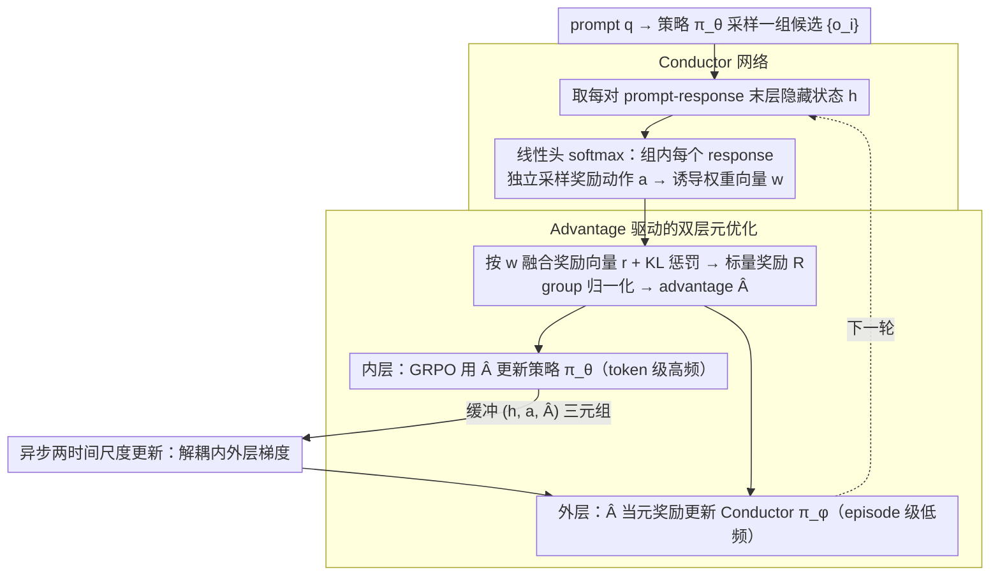

# MAESTRO: Meta-learning Adaptive Estimation of Scalarization Trade-offs for Reward Optimization

**会议**: ACL 2026  
**arXiv**: [2601.07208](https://arxiv.org/abs/2601.07208)  
**代码**: [https://github.com/zy125413/MAESTRO](https://github.com/zy125413/MAESTRO)  
**领域**: 模型压缩/LLM对齐  
**关键词**: 开放域对齐, 多目标优化, 奖励编排, 元学习, GRPO

## 一句话总结

本文提出 MAESTRO，将 GRPO 中的奖励标量化重新定义为上下文老虎机问题，通过轻量级 Conductor 网络利用模型末层隐藏状态自适应地为每个 prompt-response 对选择奖励权重，在七个开放域基准上一致超越静态奖励和单一奖励基线。

## 研究背景与动机

**领域现状**：GRPO 已成为 LLM 对齐的主流范式，在数学和代码等具有可验证真值的任务上表现出色。然而，将 GRPO 扩展到开放域生成（如创意写作、社交智能）仍是关键挑战，因为这些任务缺乏客观的验证规则。

**现有痛点**：当前开放域对齐主要依赖两条路线：（1）LLM-as-a-Judge 计算开销大且引入风格偏差（如偏好更长回复）；（2）基于困惑度、熵等启发式代理信号的方法与人类效用相关性差，且使用静态、上下文无关的标量化权重。这两种方案都无法捕捉开放域生成中细粒度的多目标权衡。

**核心矛盾**：开放域对齐本质上是一个多目标优化问题——创意性与事实性、简洁性与丰富性之间存在矛盾——但现有方法用一组固定权重将高维 Pareto 前沿坍缩为单个点，对数学推理和创意写作施加相同的奖励偏好显然不合理。

**本文目标**：设计一个能根据 prompt-response 的语义内容动态调整奖励权重的框架，使 GRPO 能自适应地在不同任务和上下文之间切换奖励偏好。

**切入角度**：观察到 Transformer 末层隐藏状态作为语义瓶颈，编码了任务意图和生成特征的高层信息。用这些隐表示作为上下文，训练一个轻量级元策略来选择奖励标量化策略。

**核心 idea**：将奖励编排建模为上下文老虎机问题，用 GRPO 的 group-relative advantage 作为元奖励信号，在双层优化框架中让 Conductor 网络与策略模型共同进化。

## 方法详解

### 整体框架

MAESTRO 在标准 GRPO 之上接了一个轻量 Conductor 层，把「奖励标量化用哪组权重」从固定常数变成依赖语义的决策。给定 prompt $q$，策略模型 $\pi_\theta$ 先采样一组候选输出 $\{o_i\}$；Conductor $\pi_\phi$ 读取每个 prompt-response 对的末层隐藏状态，采样一个奖励侧重动作并诱导出权重向量 $\mathbf{w}^{(a)}$，把原始奖励向量 $\mathbf{r}$ 与 KL 惩罚融合成标量奖励 $R$，再经 group 归一化得到 advantage $\hat{A}$。整个训练是一个双层优化：内层用 GRPO 拿 $\hat{A}$ 更新策略 $\pi_\theta$，外层把同一个 $\hat{A}$ 当作元奖励反过来更新 Conductor $\pi_\phi$，让两者协同进化。

### 关键设计

**1. Conductor 网络：用末层隐藏状态做上下文，按语义动态选奖励权重**

开放域对齐本是多目标问题，但固定权重会把高维 Pareto 前沿坍缩成一个点，对数学推理和创意写作施加同样的奖励偏好并不合理。MAESTRO 注意到 Transformer 末层隐藏状态 $h \in \mathbb{R}^{d_{\text{model}}}$ 是个语义瓶颈，已编码任务意图与生成特征，于是把 Conductor 实现成一个线性投影头 $\pi_\phi(\cdot|h) = \text{softmax}((W_\phi h + b_\phi)/\tau)$：训练时从该分类分布采样离散动作 $a$，每个动作对应一种奖励侧重模式；推理时直接输出连续分布作为确定性权重。

之所以只用一个线性头，是因为末层表示本身已经线性可分，仅靠线性投影就能区分推理 vs 创意这类任务语义，无需复杂网络，额外开销极低——这也是后文「效率不降反升」的前提。

**2. Advantage 驱动的双层元优化：用组内异构采样喂出有效元梯度**

Conductor 该往哪个方向更新，需要一个稳定的训练信号。MAESTRO 的元目标 $J(\phi) = \mathbb{E}[\hat{A}(x,y;w(h,a))]$ 最大化「在 Conductor 所选奖励配置下的 GRPO advantage 期望」，更新公式为 $\nabla_\phi J(\phi) = \frac{1}{NG}\sum_{i,j}[\hat{A}_{i,j}\nabla_\phi\log\pi_\phi(a_{i,j}|h_{i,j}) + \lambda_{\text{ent}}\nabla_\phi\mathcal{H}(\pi_\phi)]$。

这里的关键麻烦是：在 group-relative normalization 下，如果对同一 prompt 的所有 response 用统一权重，advantage 均值恒为零，元梯度会直接消失。解决办法是组内异构采样——对同一 prompt 的每个 response 独立采样奖励动作 $a_{i,j}$，打破 group baseline 的对称性，制造出组内的「元竞争」，从而暴露出有信息量的方差，让元梯度不再退化。

**3. 异步两时间尺度更新：把 Conductor 优化和策略训练解耦**

元梯度和策略梯度若紧耦合，容易让训练不稳定甚至退化。MAESTRO 在 GRPO 训练时把 $(h_{i,j}, a_{i,j}, \hat{A}_{i,j})$ 三元组缓冲起来，周期性地用 Policy Gradient Theorem 更新 $\phi$，于是策略模型在 token 级高频更新（内层），Conductor 在 episode 级低频更新（外层），形成两个时间尺度。

这种异步设计把元优化从 token 级策略训练里抽离出来，避免两套梯度互相干扰，是保证 Conductor 能稳定学到有意义权衡的工程前提。

### 损失函数 / 训练策略

奖励空间包含 $K=5$ 个分量：困惑度奖励 $r_{\text{ppl}}$（推理一致性代理）、格式有效性奖励 $r_{\text{fmt}}$、熵奖励 $r_{\text{ent}}$（探索与冗余平衡）、长度惩罚 $r_{\text{len}}$、语义偏好奖励 $r_{\text{pref}}$（来自预训练奖励模型 Skywork-Reward）。内层使用标准 GRPO 损失更新策略模型，外层使用 REINFORCE 梯度（含熵正则化）更新 Conductor。

## 实验关键数据

### 主实验（Qwen3-8B）

| 数据集 | Base | SFT | NOVER | EM-GRPO | MAESTRO | 提升vs最强基线 |
|--------|------|-----|-------|---------|---------|------------|
| Natural Reasoning | 39.6 | 26.0 | 46.9 | 52.0 | **53.2** | +1.2 |
| SS-GEN | 33.1 | 68.7 | 77.8 | 88.8 | **92.5** | +1.9 |
| WebInstruct | 7.8 | 34.6 | 42.7 | 43.4 | **43.5** | +0.1 |
| ToMBench | 5.7 | 46.9 | 56.2 | 63.8 | **71.9** | +8.1 |
| GeneralThoughts | 34.0 | 34.7 | 64.6 | 68.0 | **68.1** | +0.1 |
| OPUS-Books | 5.1 | 5.5 | 10.1 | 11.7 | **12.6** | +0.9 |
| EmoBench | 36.7 | 46.1 | 42.2 | 41.4 | **47.7** | +1.6 |

### 消融实验

| 配置 | 说明 | 效果 |
|------|------|------|
| Equal-Weights (Eq) | 固定均匀权重 | 中等增益但不稳定，如 ToMBench 仅 38.27% |
| Random-Weights (Rand) | 随机权重 | 有时反而降低（GeneralThoughts 35.7%） |
| MAESTRO (Ours) | Conductor 动态权重 | 几乎所有任务最优 |
| 训练时间 SS-GEN | w/ Conductor vs w/o | **加速 20.1%**（减少冗余生成） |
| 训练时间 WebInstruct | w/ Conductor vs w/o | 开销仅 +4.0% |

### 关键发现

- **ToMBench 提升最大（+8.1%）**：社交智能任务需要灵活的表达和情感理解，动态奖励编排的优势最为显著。EM-GRPO 在此任务上也表现强劲（63.8%），但 MAESTRO 仍大幅领先。
- **EM-GRPO 在推理任务上接近 MAESTRO**：低熵解码有利于确定性推理，但在开放域任务（SS-GEN、ToMBench）上严重退化，说明单一归纳偏置无法跨域泛化。
- **动态权重可减少生成冗余**：在 SS-GEN 上 Conductor 学会早期抑制冗长输出，平均序列长度缩短，训练吞吐提升 20.1%。
- **Conductor 学到的权重模式有明确语义**：创意写作任务侧重熵奖励，结构化推理任务侧重困惑度奖励，模式在训练早期即快速收敛并稳定。

## 亮点与洞察

- **上下文老虎机 + GRPO 的巧妙融合**：将奖励权重选择建模为依赖 prompt-response 语义的决策问题，Conductor 仅需一个线性头即可实现，优雅而高效。这个范式可推广到任何需要多奖励权衡的 RL 对齐场景。
- **组内异构采样解决元信号消失**：利用 group-relative advantage 的均值为零特性，通过让同组内不同 response 使用不同奖励配置来引入方差，是解决双层优化中元信用分配问题的精妙方案。
- **效率不降反升**：动态奖励编排不仅不增加训练开销，在长文本生成场景下还能通过减少冗余输出显著加速，打破了"方法越复杂越慢"的直觉。

## 局限与展望

- 仅在 7-8B 规模模型上验证，更大模型上的效果待探索。
- Conductor 使用简单的线性投影头，更复杂的架构可能捕获更细粒度的权衡。
- 奖励分量固定为 5 个预定义信号，如何自动发现和组合奖励信号是开放问题。
- 评估依赖外部 LLM Judge（Qwen3-235B、Gemini-2.5-Flash），评估本身可能引入偏差。

## 相关工作与启发

- **vs NOVER (Liu et al., 2025b)**: NOVER 使用条件困惑度作为唯一奖励信号在 GRPO 中训练，在推理任务上强但在开放域退化。MAESTRO 通过多奖励动态编排全面超越。
- **vs EM-GRPO**: 熵最小化方法在推理任务上与 MAESTRO 接近，但在创意和社交任务上严重退化（如 SS-GEN 88.8% vs 92.5%），证明单一归纳偏置的局限。
- **vs DYNAOPT (Pérez-Rosas et al., 2024)**: DYNAOPT 在全局训练阶段级别调整奖励权重，而 MAESTRO 在实例级别进行语义条件化的编排，粒度更细、适用性更广。
- **vs Pareto-based MORL**: 多策略 Pareto 方法需要训练和维护多个大模型，开销巨大。MAESTRO 用单策略 + 轻量 Conductor 实现动态 Pareto 前沿探索。

## 评分

- 新颖性: ⭐⭐⭐⭐⭐ 上下文老虎机 + GRPO 双层优化的组合首次提出，元信用分配问题的解法优雅
- 实验充分度: ⭐⭐⭐⭐ 七个基准、两个骨干模型、多种基线，但缺少更大模型的验证
- 写作质量: ⭐⭐⭐⭐⭐ 问题动机清晰，方法描述严谨，分析深入（奖励权重演化可视化尤佳）
- 价值: ⭐⭐⭐⭐⭐ 为开放域 LLM 对齐提供了实用且高效的新范式，Conductor 设计可即插即用

<!-- RELATED:START -->

## 相关论文

- [\[ACL 2026\] ARES: Adaptive Red-Teaming and End-to-End Repair of Policy-Reward System](ares_adaptive_red-teaming_and_end-to-end_repair_of_policy-reward_system.md)
- [\[ACL 2025\] AMoPO: Adaptive Multi-objective Preference Optimization without Reward Models and Reference Models](../../ACL2025/llm_alignment/amopo_adaptive_multi-objective_preference_optimization_without_reward_models_and.md)
- [\[ACL 2026\] P-Check: Advancing Personalized Reward Model via Learning to Generate Dynamic Checklist](p-check_advancing_personalized_reward_model_via_learning_to_generate_dynamic_che.md)
- [\[ACL 2026\] Team-Based Self-Play With Dual Adaptive Weighting for Fine-Tuning LLMs](team-based_self-play_with_dual_adaptive_weighting_for_fine-tuning_llms.md)
- [\[AAAI 2026\] AMaPO: Adaptive Margin-attached Preference Optimization for Language Model Alignment](../../AAAI2026/llm_alignment/amapo_adaptive_margin-attached_preference_optimization_for_l.md)

<!-- RELATED:END -->
