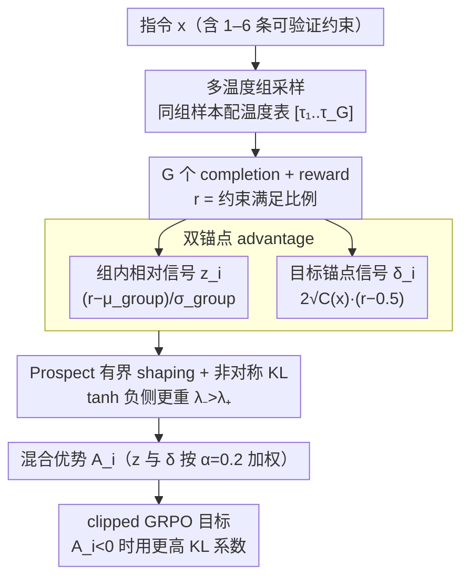

# MDP-GRPO: Stabilized Group Relative Policy Optimization for Multi-Constraint Instruction Following

**会议**: ACL2026  
**arXiv**: [2606.06058](https://arxiv.org/abs/2606.06058)  
**代码**: https://github.com/m-salmani78/MDP-GRPO  
**领域**: LLM 对齐 / RLVR / 多约束指令遵循  
**关键词**: GRPO, 可验证奖励, 多约束指令, Advantage 稳定化, Prospect Theory

## 一句话总结
MDP-GRPO 针对多约束指令遵循中 GRPO 在离散低方差奖励下的不稳定问题，结合多温度采样、双锚点 advantage、prospect-theoretic shaping 和非对称 KL，使小模型在 IFEval、FollowBench 和自建多约束测试集上获得更稳的软/硬约束满足率。

## 研究背景与动机
**领域现状**：LLM 已能遵循很多自然语言指令，但当一个请求同时包含格式、词汇、大小写、结束短语、结构化输出等多条显式约束时，模型仍然容易漏掉其中一条。现实部署中，这类多约束提示很常见：法律模板、产品文案、开发工具输出和安全策略都可能要求“少一条都不可用”。

**现有痛点**：RL with Verifiable Rewards（RLVR）很适合这类任务，因为每条约束可以由规则验证器确定性检查，避免 learned reward model 或 LLM-as-a-judge 的偏差。但这些 reward 通常离散、稀疏且低方差。GRPO 依赖同一 prompt 的多样本组内 z-score normalization，当组内 reward 分布过于同质时，advantage 会出现三类病症。

**核心矛盾**：GRPO 的组内相对归一化只看“组内谁更好”，却容易忽略绝对 reward 水平。在多约束任务早期，所有 samples 可能都错得一样或对得一样，组内方差为零；即使方差非零，也可能把微小差别放大成过激梯度。模型需要既保留组内比较信号，又知道“距离全约束满足还有多远”。

**本文目标**：作者希望在不引入 critic 的前提下稳定 GRPO，使其适用于 deterministic multi-constraint rewards。目标包括减少 homogeneous groups、恢复零方差组中的学习信号、控制 advantage 更新幅度、在惩罚约束违反时更保守地约束策略漂移。

**切入角度**：论文没有改 reward 本身，而是从采样和 advantage 估计入手。多温度采样负责预防同质组；dual-anchor advantage 负责把绝对目标水平注入优势估计；prospect shaping 用行为经济学中的损失厌恶思想限制更新幅度；asymmetric KL 则在负 advantage 时更强地约束策略偏离。

**核心 idea**：把 GRPO 的单一组内 z-score advantage 扩展成“组内相对信号 + 目标锚点信号”的混合 advantage，并在进入 policy update 前做有界、非对称 shaping，从而同时缓解低方差放大、均值中心化盲区和零方差塌缩。

## 方法详解

### 整体框架
MDP-GRPO 仍然沿用 GRPO 的 critic-free、组内相对的策略优化，但要解决 GRPO 在离散低方差奖励下的三类失稳。给定指令 $x$，模型生成 $G$ 个 completion，每个 completion 的 reward 是约束满足比例 $r(x,y)=\frac{1}{C(x)}\sum_t c_t(x,y)$。标准 GRPO 用组内 mean 和 std 算 advantage，而 MDP-GRPO 在这条流程里插三块稳定化模块：先用多温度采样生成更分散的一组 responses，再同时算 group-relative 信号 $z_i$ 和 goal-aware 信号 $\delta_i$，经 prospect-theoretic shaping 变成有界信号后混成最终 advantage $A_i$ 进入标准 clipped GRPO 目标，并按 $A_i$ 正负设不同 KL 系数。

数据上，作者构造了 3,000 个训练 prompt，约三分之一 seed 来自既有数据、其余人工策划，覆盖 general Q&A、creative writing 和 material assistance；每条指令注入 1–6 个约束，taxonomy 含 9 个高层类别、26 种 constraint type，全部由正则、解析器等 deterministic validator 验证。

### 关键设计

**1. 多温度组采样：从数据生成端防止整组 reward 一模一样**

零方差塌缩的病根是组内 reward 没差异——所有样本同对或同错，advantage 给不出方向。标准 GRPO 用固定 temperature 采整组，MDP-GRPO 改成给组内不同样本配一张温度表 $\mathbf{T}=[\tau_1,...,\tau_G]$，例如 $[0.1,0.4,0.7,1.0]$：低温样本负责高质量 exploitation、高温样本增加 exploration，更可能产出不同的约束满足模式。它不动目标函数，只在采样端把 reward 的离散度提上来，对 $G=4$ 这种小组尤其管用。

**2. 双锚点 advantage：组内相对比较之外，再注入一个“离全满足还差多远”的绝对信号**

GRPO 只看组内谁更好，会犯均值中心化盲区——“全错组”和“全对组”归一化后长得一样。标准组内信号是 $z_i=(r_i-\mu_{group})/(\sigma_{group}+\epsilon)$。MDP-GRPO 另加一个 goal-aware 锚点：假设中性基线下每条约束以 $p=0.5$ 独立满足，则 reward 目标中心 $\mu_{goal}=0.5$、标准差 $\sigma_{goal}=1/(2\sqrt{C(x)})$，绝对 advantage 写成 $\delta_i=2\sqrt{C(x)}(r_i-0.5)$，最终 advantage 由 shaping 后的 $z_i$ 和 $\delta_i$ 混合（默认 mixing weight $\alpha=0.2$）。这样即便组内样本全一样，模型也知道当前 completion 是高于还是低于中性满足水平，恢复了部分方向信号。

**3. Prospect-theoretic shaping + 非对称 KL：给更新加上界，并让违反约束更“痛”**

低方差会把微小差别放大成过激梯度，而多约束任务里单条约束回退就可能让输出整体不可用，所以负更新得更保守。作者对原始 advantage 做缩放 tanh 变换、且负侧上界更大（$\lambda_->\lambda_+>0$），实验取 $(\lambda_+,\lambda_-)=(1.25,2.0)$、$\beta_{PT}=0.8$，让正向收益边际递减、负向违反更重。配套的非对称 KL 在 $A_i<0$ 时用更高系数 $\beta^{high}_{KL}=0.025$、在 $A_i\ge 0$ 时用 $\beta^{low}_{KL}=0.01$。tanh 有界化防 advantage 爆炸，loss aversion 则把修正力度压向违反约束的样本。

### 损失函数 / 训练策略
训练用标准 GRPO clipped surrogate，只替换 advantage 并可启用非对称 KL。实验模型为 Gemma-2-2B-Instruct 和 Llama-3.2-3B-Instruct：单张 NVIDIA A100，学习率 $1\times10^{-5}$，batch size 32，PPO clip $\epsilon_{clip}=0.2$，base KL 系数 0.01，最大生成长度 1024，top_p=0.9，训练 1 个 epoch。主组大小 $G=8$，另用 $G=4$ 分析小组下多温度采样的作用；dual-anchor mixing weight 默认 $\alpha=0.2$，目标中心 $\mu_{goal}=0.5$。

## 实验关键数据

### 主实验
| 模型 / 组大小 | 方法 | IFEval SSR/HSR | Custom SSR/HSR | FollowBench SSR/HSR | 关键观察 |
|---------------|------|----------------|----------------|---------------------|----------|
| Gemma-2-2B, G=8 | Baseline | 56.7 / 45.1 | 54.8 / 18.8 | 63.7 / 52.9 | 零样本指令模型 |
| Gemma-2-2B, G=8 | GRPO | 73.7 / 62.4 | 68.4 / 29.0 | 64.0 / 53.2 | 标准 GRPO 已大幅提升 |
| Gemma-2-2B, G=8 | MDP-GRPO | 75.3 / 64.1 | 70.3 / 32.8 | 66.9 / 57.4 | 全流程更稳，Custom HSR +3.8 vs GRPO |
| Llama-3.2-3B, G=8 | Baseline | 54.2 / 46.8 | 60.3 / 20.8 | 69.7 / 59.8 | Llama 初始 FollowBench 较强 |
| Llama-3.2-3B, G=8 | GRPO | 66.1 / 58.5 | 65.1 / 24.8 | 68.4 / 58.9 | Custom 有提升，FollowBench 略降 |
| Llama-3.2-3B, G=8 | MDP-GRPO | 71.3 / 59.8 | 65.8 / 25.2 | 69.4 / 59.1 | IFEval SSR +5.2 vs GRPO |

论文也指出单个组件不总是全局最优。例如 Gemma-2-2B 在 IFEval 上 PT-GRPO 的 HSR 最高，为 65.8%，高于 GRPO 的 62.4%；Llama-3.2-3B 在 IFEval 上 DA-PT-GRPO 的 SSR 为 71.5%，略高于 MDP-GRPO 的 71.3%。作者因此强调 full pipeline 是更稳定的整体 profile，而不是每个指标都第一。

### 消融实验
| 设置 | 关键数字 | 说明 |
|------|----------|------|
| Gemma, G=8, Custom HSR | GRPO 29.0，DA-GRPO 32.6，DA-PT-GRPO 33.4，MDP-GRPO 32.8 | 目标锚点对复杂约束组合最有帮助 |
| Gemma, G=4, IFEval | GRPO 69.7 / 58.2，MT-GRPO 71.1 / 59.4，MDP-GRPO 71.2 / 59.5 | 小组大小下 MT 恢复 reward dispersion |
| Gemma, G=4, Custom HSR | GRPO 28.6，MT-GRPO 30.6，MDP-GRPO 30.4 | MT 在低多样性设置下效果放大 |
| Llama, G=4, IFEval | GRPO 67.2 / 55.0，MT-GRPO 70.5 / 58.4 | 多温度采样对 Llama 的小组设置也有效 |
| Difficulty 分析 | baseline 到 Difficulty 4 HSR 低于 10%；DA-PT-GRPO 在 Difficulty 5 约 20%，GRPO 约 12% | 稳定化方法在高约束数更抗退化 |

### 关键发现
- 标准 GRPO 已能显著提高可验证指令遵循，但在困难多约束 prompt 上会受同质组和均值中心化影响。
- Dual-anchor 对 Custom Test Set 的 HSR 提升最稳定，符合其修复 zero-variance / absolute blindness 的设计目标。
- Prospect shaping 能控制 KL drift，同时保留 reward gains；DA-PT-GRPO 进一步抑制 KL 漂移。
- MT-GRPO 在当前 schedule 下可能提高 KL、降低 entropy，因此需要谨慎调温；但在 $G=4$ 小组下，它对恢复性能很关键。

## 亮点与洞察
- **问题诊断比方法本身更重要**：低方差放大、均值中心化盲区、零方差塌缩三个 failure modes 把 GRPO 在离散 reward 下的不稳定说清楚了。
- **不改 reward，先改 advantage**：多约束 reward 本身由 deterministic checker 给出，可信且便宜。MDP-GRPO 避免引入 learned reward model，而是在 advantage 估计和采样上补信号。
- **把绝对目标水平放回 critic-free RL**：GRPO 的吸引力是不用 value model，但代价是只看组内相对好坏。Dual-anchor 是一个轻量折中，给 critic-free 方法加了一点目标感。
- **Prospect Theory 的使用比较克制**：它不是重新定义人类偏好目标，而只是作为 advantage shaping 的有界非对称变换，工程上更容易接受。

## 局限与展望
- 方法依赖明确、可自动验证的约束。对主观、风格化或欠规范的约束，可能需要 learned reward 或偏好反馈，又会带回 reward misspecification 和 judge bias。
- MDP-GRPO 引入多组超参：anchor mixing weight、shaping 参数、temperature schedule、非对称 KL 等。迁移到不同 reward 尺度或任务域时需要重新校准并监控 KL。
- 实验只覆盖 2B/3B 两个 instruction-tuned 模型、标准指令遵循 benchmark 和自建多约束集。大模型、多语言、工具调用、代码生成等结构化领域还未验证。
- 方法优化的是 reward specification 中编码的约束满足，不自动保证 broader safety，如事实性、无害性或价值对齐。
- 多温度采样虽能提高 dispersion，但也可能增加 KL 或降低 entropy，实际训练需要配合解码控制。

## 相关工作与启发
- **vs 标准 GRPO**: 标准 GRPO 用组内 z-score advantage，简单但在离散低方差 reward 下脆弱；MDP-GRPO 通过采样、锚点和 shaping 稳定更新。
- **vs MAPO / NGRPO**: 相关工作也试图修复 group-relative advantage 分配问题或 all-negative groups；MDP-GRPO 的区别是同时减少同质组、恢复目标锚点，并做 prospect-style bounded shaping。
- **vs KTO**: KTO 在目标函数层面使用 prospect-theoretic utility 处理二元偏好；MDP-GRPO 只在 advantage 层面做 prospect-inspired shaping，reward 定义保持不变。
- **启发**: 对任何 rule-based verifier 强、reward 离散的任务，如格式化输出、工具 API schema、代码风格检查、合规文档生成，都可以尝试目标锚点 advantage，而不是直接套标准 GRPO。

## 评分
- 新颖性: ⭐⭐⭐⭐☆ 对 GRPO failure modes 的拆解和 dual-anchor/prospect shaping 组合有清晰贡献。
- 实验充分度: ⭐⭐⭐⭐☆ 覆盖两个模型、两个组大小、三类 benchmark、消融和训练诊断；不足是模型规模较小。
- 写作质量: ⭐⭐⭐⭐☆ 动机和公式比较清楚，表格完整；部分符号在缓存文本中显示略乱，但整体逻辑可读。
- 价值: ⭐⭐⭐⭐☆ 对 RLVR、多约束指令遵循和 critic-free policy optimization 很实用，适合后续扩展到更大模型。

<!-- RELATED:START -->

## 相关论文

- [\[ICLR 2026\] Group-Relative REINFORCE Is Secretly an Off-Policy Algorithm: Demystifying Some Myths About GRPO and Its Friends](../../ICLR2026/llm_alignment/group-relative_reinforce_is_secretly_an_off-policy_algorithm_demystifying_some_m.md)
- [\[ACL 2026\] Taming Extreme Tokens: Covariance-Aware GRPO with Gaussian-Kernel Advantage Reweighting](taming_extreme_tokens_covariance-aware_grpo_with_gaussian-kernel_advantage_rewei.md)
- [\[ACL 2025\] Reverse Preference Optimization for Complex Instruction Following](../../ACL2025/llm_alignment/reverse_preference_optimization_for_complex_instruction_following.md)
- [\[AAAI 2026\] LaF-GRPO: In-Situ Navigation Instruction Generation for the Visually Impaired via GRPO with LLM-as-Follower Reward](../../AAAI2026/llm_alignment/laf-grpo_in-situ_navigation_instruction_generation_for_the_visually_impaired_via.md)
- [\[NeurIPS 2025\] GVPO: Group Variance Policy Optimization for Large Language Model Post-Training](../../NeurIPS2025/llm_alignment/gvpo_group_variance_policy_optimization_for_large_language_model_post-training.md)

<!-- RELATED:END -->
