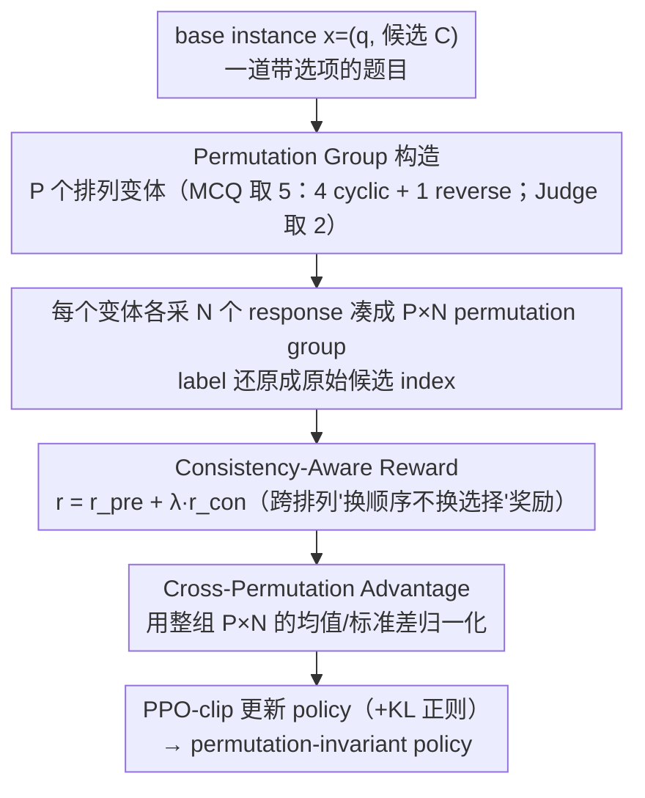

# Mitigating Selection Bias in Large Language Models via Permutation-Aware GRPO

**会议**: ACL 2026  
**arXiv**: [2603.21016](https://arxiv.org/abs/2603.21016)  
**代码**: GitHub（论文中提及，链接未在 abstract 显式给出）  
**领域**: LLM 对齐 / 强化学习 / 选择偏差 / LLM-as-a-Judge  
**关键词**: GRPO、permutation invariance、selection bias、cross-permutation advantage、consistency reward

## 一句话总结
作者发现标准 GRPO 把同一题目的不同选项顺序当成独立 prompt 训练，导致模型在"换顺序"后选择会变化（permutation-blindness），于是提出 PA-GRPO：把同一语义实例的多种排列组成 permutation group，用跨排列的 advantage baseline + 一致性 reward 显式优化"换顺序不换选择"，在 7 个 MCQ/Judge benchmark 上把 selection bias 大幅压低同时保持准确率。

## 研究背景与动机

**领域现状**：LLM 越来越多被用作 MCQ 答题器和 LLM-as-a-Judge 评测器，输出空间被限定到 A/B/C/D 这种离散符号。理论上选项的位置和字母标签都是 non-semantic 的，但实证上 LLM 经常因为选项被交换就改答案——这就是 selection bias，包含 position bias 和 label bias 两个子类，直接威胁 alignment、leaderboard、数据合成等所有依赖离散选择的下游任务。

**现有痛点**：现有去偏方法分两类——(1) **inference-time 校准**（PriDe、CalibraEval）只调表面概率不改模型，开销大且不修内在；以及内部干预（UniBias、BNP）会通过 mask attention 或 prune 参数副作用大；(2) **training-time SFT**（PIF、LLM 蒸馏方法）把不同排列当成独立静态样本喂进去 cross-entropy，模型只是被动模仿数据分布，没有主动探索"排列不变"的策略空间。

**核心矛盾**：selection bias 的本质是 robust reasoning 失败——同样语义、不同表面应该出同样选择；这件事根本上是 RL 风格的策略学习问题，不是 supervised label-fitting 的问题。但即便 GRPO 这种强 RL 方法，也把同一实例的不同排列当独立 prompt 看，没有 cross-permutation 一致性约束，作者把这个新失败模式命名为 **permutation-blindness**：模型在"好顺序"上拿高奖励，"坏顺序"上失败也不会被惩罚。

**本文目标**：把 permutation invariance 写进 RL 目标本身，让模型主动学到"换顺序不换选择"。

**切入角度**：既然 GRPO 用组内 mean 当 baseline 计算相对优势，那把"组"从"同 prompt 的多个采样"扩展到"同语义实例的多个排列 × 多个采样"，自然就能在 advantage 层面比较不同排列。

**核心 idea**：Permutation Group + Cross-Permutation Advantage + Consistency-Aware Reward，三者一起让 RL 优化目标内置一致性。

## 方法详解

### 整体框架
PA-GRPO 想解决的是标准 GRPO 的 permutation-blindness：它把同一题目的不同选项顺序当成毫不相干的 prompt，模型在"好顺序"上拿高分、"坏顺序"上失败也无人惩罚。PA-GRPO 的做法是把 RL 的"组"边界从"同一 prompt 的多个采样"扩展到"同一语义实例的多个排列 × 多个采样"：对每条 base instance $x=(q,\mathcal{C})$ 先用一组排列映射生成 $P$ 个 prompt 变体（MCQ 取 5 种，Judge 取 2 种），每个变体各采 $N$ 个 response 凑成一个 permutation group，再把 label 还原成原始候选 index、算上一致性奖励，最后用跨排列的 advantage baseline 替掉原版的组内 baseline 跑 PPO-clip。输入是一道带选项的题目，中间是一整组打散顺序后的采样，输出则是一个"换顺序也不换选择"的 policy。整套训练基于 verl 框架 + LoRA。

### 关键设计

**1. Permutation Group 构造：用 5 个代表排列近似 24 个全排列**

这一步要回答"什么样的样本才算同一语义实例的不同表面"，同时不能让算力爆炸。MCQ 的全排列是 $4!=24$，逐个跑太贵；作者挑出 5 个代表排列 $\Pi_\text{MCQ}=\{\text{ABCD},\text{BCDA},\text{CDAB},\text{DABC},\text{DCBA}\}$——前 4 个是 cyclic shift，保证每个候选在每个位置上恰好出现一次，从而消除 position 和 label 的绑定；最后加一个 reverse 顺序，专门打破 cyclic 模式下"A 永远排在 B 之前"的固定 adjacency。Judge 任务只有两个候选，直接用全集 $\{\text{AB},\text{BA}\}$（$P=2$）。

这个选择本质上是在对称群里挑代表元做近似：$P=5$ 相比 $P=24$ 省下约 5 倍算力，而实验显示二者在 TinyMMLU CA 上只差 2 个点（75.0 vs 77.0），是明显的性价比甜点。

**2. Consistency-Aware Reward：用绝对信号直接奖励"换顺序不换选择"**

标准 GRPO 的奖励只看单条 response 答得对不对，给不了"这一组排列彼此一致吗"的信号。作者在准确度奖励之外再加一个跨排列的一致性奖励 $r_\text{con}$，用绝对信号告诉模型"内部分歧 = 坏"。组合 reward 写成 $r^{(t,i)}=r_\text{pre}^{(t,i)}+\lambda r_\text{con}^{(t,i)}$，其中 $r_\text{pre}$ 是准确度部分（$r_\text{acc}\in\{+1,-1\}$ 加长度 $\pm0.1$、格式 $\pm0.3$），$\lambda=1.0$ 为消融最优。

$r_\text{con}$ 的算法随任务而变。Judge 做 index-aligned pairwise：把同一索引 $i$ 在两个排列下的 response 配对，$z^{(1,i)}=z^{(2,i)}$ 则 $+1$，否则 $-1$。MCQ 做 unique-mode agreement：统计整组里每个语义候选的票数 $n_k$，只有当 mode 唯一（$|\mathcal{M}|=1$）且 $z^{(t,i)}=z^\star$ 时才给 $+1$，平票或不匹配一律 $-1$——刻意"惩罚 ties"是为了防止模型把分歧均摊到几个选项上来骗一致性。

**3. Cross-Permutation Advantage：把 baseline 从单 prompt 升级到整组排列**

拿到每条样本的组合 reward 后还要算 advantage——标准 GRPO 在单个 prompt 内部做归一化，于是模型只要在"顺手的那个顺序"上做好就能拿高 advantage，正好放过了 permutation-blindness。PA-GRPO 把整组 $P\times N$ 个样本当成同一个 comparison set，用组内均值 $\mu_{\mathcal{G}}=\frac{1}{PN}\sum_{t,i} r^{(t,i)}$ 和标准差 $\sigma_{\mathcal{G}}$ 计算 $A_\text{PA}^{(t,i)}=(r^{(t,i)}-\mu_{\mathcal{G}})/(\sigma_{\mathcal{G}}+\epsilon)$。

这样一来，只有"在所有排列下都好"的样本才能拿到正 advantage，模型再也无法靠"对 ABCD 顺序敏感的捷径"获利。为了避免在同组奖励几乎一致时放大噪声，作者额外加了一道闸门：当 $\sigma_{\mathcal{G}}<\delta$ 时直接令 advantage 为 0。

### 损失函数 / 训练策略
最终 PPO-clip 目标为 $\mathcal{L}_\text{clip}(\theta)=\mathbb{E}[\min(\rho^{(t,i)} A_\text{PA}^{(t,i)},\,\text{clip}(\rho^{(t,i)},1-\eta,1+\eta)A_\text{PA}^{(t,i)})]$，并对 reference policy 加 KL 正则。三个 policy model：Llama-3.1-8B-Instruct、Qwen3-8B、Qwen3-32B；训练数据用 Chatbot Arena（pairwise）+ MMLU train set（MCQ），统一用 LoRA fine-tune。

## 实验关键数据

### 主实验（Llama-3.1-8B，accuracy/consistency/CA 三指标）

| 方法 | MT-Bench Acc/Con/CA | JudgeBench Acc/Con/CA | RewardBench Acc/Con/CA |
|------|---------------------|------------------------|------------------------|
| Base | 59.6 / 25.2 / 22.2 | 35.0 / 34.8 / 6.1 | 60.5 / 31.5 / 26.2 |
| GRPO | 75.7 / 80.6 / 65.4 | 48.2 / 56.1 / 28.2 | 70.9 / 76.9 / 61.5 |
| PIF (SFT) | 76.1 / 84.6 / 70.4 | 53.3 / 59.2 / 30.4 | 73.7 / 76.7 / 62.0 |
| CalibraEval (inference) | 62.3 / 42.1 / 33.4 | 49.3 / 15.7 / 7.1 | 60.7 / 34.4 / 27.8 |
| **PA-GRPO** | **77.6 / 88.0 / 71.7** | **57.1 / 58.3 / 32.4** | **71.0 / 82.7 / 62.3** |

对 Qwen3-8B 提升更显著：JudgeBench Acc 50.4→60.1 (+9.7)、CA 34.8→45.3 (+10.5)；GPQA CA 43.8→56.7 (+12.9)。Qwen3-32B 已接近天花板但 MT-Bench Consistency 仍从 90.6 升到 91.6。

### 消融实验（Llama-3.1-8B，PreferenceBench）

| 配置 | Acc | Con | CA |
|------|-----|-----|-----|
| Base | 60.8 | 22.6 | 22.1 |
| GRPO | 82.2 | 85.1 | 76.3 |
| GRPO + $r_\text{con}$ only | 82.6 | 85.9 | 76.9 |
| GRPO + $A_\text{PA}$ only | 83.4 | 86.4 | 77.8 |
| **PA-GRPO (both)** | **86.2** | **87.2** | **79.8** |

### 关键发现
- **两件套互补不可替代**：$r_\text{con}$ 单独加只能提 consistency；$A_\text{PA}$ 单独加 advantage 计算更稳但 consistency 不显著；两者合起来才能同时提 accuracy + consistency + CA。
- **PA-GRPO 不依赖 CoT**：Direct decoding 下 PA-GRPO MT-Bench CA 仍达 69.3%，比 Base+CoT 的 58.0% 高 11.3 个点；说明 invariance 是真的"内化"进 policy 而非靠推理弥补。
- **残余偏差以 position 为主**：JudgeBench 在 label-only 扰动下 consistency 仍有 79.0%，但在 order-only 下只有 45.5%——大模型 Position bias 比 Label bias 更顽固，未来 PA-GRPO 改进应加权 position 项。
- **$P=5$ 是性价比甜点**：cyclic+reverse 已经覆盖大部分 adjacency 模式，加到 $P=24$ 边际收益仅 2 个 CA 点而算力涨 ~5x。
- **$\lambda = 1.0$ 平衡最佳**：$\lambda=0.5$ 牺牲一致性换点 acc，$\lambda=2.0$ 强正则反伤 acc。

## 亮点与洞察
- **"permutation-blindness"是个干净的 negative 概念**：用 1 句话指出 GRPO 在 group 内归一化的天然漏洞，并给出极简修复（baseline 升级 + reward 增项），是典型"找对问题就胜利一半"的工作。
- **5 排列覆盖 24 排列**：4 cyclic + 1 reverse 这个组合非常优雅——cyclic 保证位置均匀覆盖，reverse 打破 adjacency 模式，本质上是把"对称群的代表元"挑出来当近似；这套 trick 直接可迁移到任何离散选择 RL 任务（多 turn dialogue、ranking 任务）。
- **Consistency reward 用 mode 而非 majority**：MCQ 上用 unique mode + 平票即罚 $-1$，比简单 majority vote 更严格——避免模型把分歧均摊到几个选项上骗一致性，这种"惩罚 ties"的细节体现了对 RL reward hacking 的警觉。

## 局限与展望
- 作者承认：只针对离散选择任务（MCQ/Judge），开放生成里"语义等价"难以量化，permutation 没法定义。
- 个人观察：实验只在英文 + 8B/32B 中等规模上做，对超长选项（如代码题）或多语言场景的偏差能否泛化未知；MCQ 全排列评测虽严格但成本高，部署侧若每条都跑 24 次推理代价太大。
- 改进思路：把 $A_\text{PA}$ 改成 hierarchical——先在 permutation 间排序、再在 sample 间排序，可能避免 $\sigma_{\mathcal{G}} < \delta$ 时整组失活；或者把 position-only consistency 加权，针对性解决残余 position bias。

## 相关工作与启发
- **vs PriDe / CalibraEval（inference 校准）**：他们只在推理时调 softmax，不改模型；PA-GRPO 把 invariance 训进 policy，部署时单次推理即可，并且 CA 在 MT-Bench 上比 CalibraEval 高 38 个点。
- **vs PIF（SFT 去偏）**：PIF 用 point-wise 负样本做 cross-entropy，模型只是"被动学到"哪些是错的；PA-GRPO 用 RL 主动探索 + cross-group baseline，让模型在策略空间里自己发现"不依赖位置的策略"才稳定拿高 reward。
- **vs 标准 GRPO**：差别就在 baseline 的"组"边界——原版是 $N$ 个采样组内，PA-GRPO 是 $P \times N$ 跨排列。这一个改动带来 +6.4 CA on PreferenceBench (Qwen3-8B)，说明 GRPO 的"组"定义本身就是个值得深挖的 hyperparameter。
- **启发**：所有用 RL 做 alignment 的工作都应该问一句"我的 group 是不是真正语义等价的样本集合？"——这个观点可以推广到 chain-of-thought RL（同一题不同思路）、tool-use RL（同一任务不同 tool 顺序）等。

## 评分
- 新颖性: ⭐⭐⭐⭐ permutation-blindness 是新概念，但解法上 cross-permutation baseline + consistency reward 是合乎直觉的组合，单点不算激进。
- 实验充分度: ⭐⭐⭐⭐⭐ 3 个 backbone × 7 个 benchmark × 5 个 baseline，bias decomposition / CoT / 超参 / 排列大小都做了消融。
- 写作质量: ⭐⭐⭐⭐⭐ 概念定义清晰（permutation-blindness / cross-permutation advantage），公式简洁完整，对比图直观。
- 价值: ⭐⭐⭐⭐⭐ 直接可用的 RL 配方，对所有用 LLM-as-Judge 做 alignment / 排行榜的工作都有立竿见影的去偏作用。

<!-- RELATED:START -->

## 相关论文

- [\[AAAI 2026\] Exploring the Effects of Alignment on Numerical Bias in Large Language Models](../../AAAI2026/llm_alignment/exploring_the_effects_of_alignment_on_numerical_bias_in_large_language_models.md)
- [\[ACL 2026\] Taming Extreme Tokens: Covariance-Aware GRPO with Gaussian-Kernel Advantage Reweighting](taming_extreme_tokens_covariance-aware_grpo_with_gaussian-kernel_advantage_rewei.md)
- [\[CVPR 2026\] Uncertainty-Aware Exploratory Direct Preference Optimization for Multimodal Large Language Models](../../CVPR2026/llm_alignment/uncertainty-aware_exploratory_direct_preference_optimization_for_multimodal_larg.md)
- [\[ACL 2026\] BACH-V: Bridging Abstract and Concrete Human-Values in Large Language Models](bach-v_bridging_abstract_and_concrete_human-values_in_large_language_models.md)
- [\[ACL 2026\] S2H-DPO: Hardness-Aware Preference Optimization for Vision-Language Models](s2h-dpo_hardness-aware_preference_optimization_for_vision-language_models.md)

<!-- RELATED:END -->
