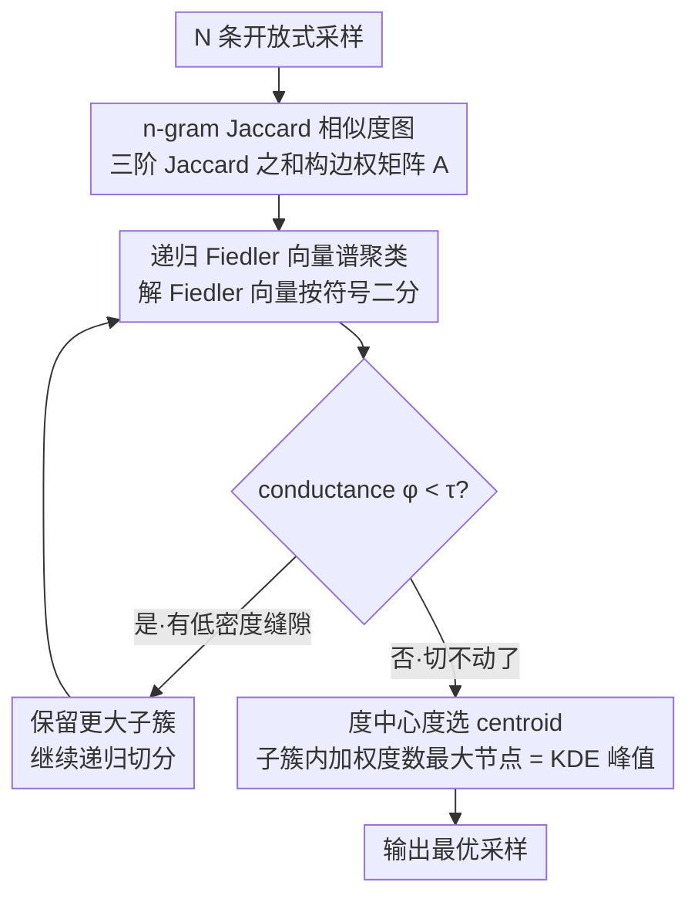

# ModeX: Evaluator-Free Best-of-N Selection for Open-Ended Generation

**会议**: ACL 2026  
**arXiv**: [2601.02535](https://arxiv.org/abs/2601.02535)  
**代码**: https://github.com/deeplearning-wisc/ModeX  
**领域**: LLM 推理 / 测试时计算 / Best-of-N 选样  
**关键词**: Best-of-N, Self-consistency, 谱聚类, 模式提取, 评估器无关

## 一句话总结
把开放式文本生成的 Best-of-N 选样建模为「在生成文本的相似度图上找模态簇」的问题——用 n-gram Jaccard 构图 + 递归 Fiedler 向量谱聚类 + 中心度选 centroid，不需要任何 reward model / LLM-judge 就把 self-consistency 推广到摘要 / 代码 / 数学等无标准答案的任务。

## 研究背景与动机

**领域现状**：LLM 单路径生成对采样噪声敏感，单个不利 token 就会引发幻觉传播；Best-of-N (BoN) 与 self-consistency 通过采多条路径+选最优来缓解，已在数学/选择题上验证有效。

**现有痛点**：现有 BoN/self-consistency 严重依赖两类外部组件——（1）外部 reward model / process reward model（贵且需要专门数据训练），（2）字符串精确匹配的投票（只适用于有限答案空间）。对于摘要、代码、开放问答这种**输出空间无限大**的任务，两者都用不上：reward model 在该任务上往往没有现成的；exact-match 投票则因为同一语义可以有无数种表面表达而失效。

**核心矛盾**：开放式生成里既无法 enumerate 答案做 majority voting，又难以拿到便宜可靠的外部 evaluator。"哪条采样最好"这个问题陷入两难。

**本文目标**：设计一个**evaluator-free** 的 BoN 选样方法，把 majority voting 自然推广到无答案集合的开放式生成。

**切入角度**：作者注意到——高质量生成在语义空间里往往**聚成簇**，而幻觉 / 异常输出则更像稀疏外点；那么"哪个采样最可能正确"就转化成"哪个采样位于最致密的语义簇中心"。这正是统计学里的**模态估计**(mode estimation) 问题。

**核心 idea**：把 N 条生成视为一张相似度图（边权 = n-gram Jaccard），用谱聚类递归提取最大的"语义模态簇"，再选簇内度数最高的节点作为 centroid——本质是用**核密度估计 (KDE)** 替代 exact-match 投票，把 majority voting 推广到连续语义流形。

## 方法详解

### 整体框架
ModeX 要在没有 reward model、也没有 exact-match 投票的前提下，从 N 条开放式采样里挑出"最可能正确"的一条。它的核心假设是：高质量生成在语义空间里会聚成致密簇，幻觉/异常输出则像稀疏外点，于是选样问题等价于"找最致密语义簇的中心"。具体走三步：先把 N 条采样两两算 n-gram Jaccard 相似度，构成边权矩阵 $A\in\mathbb{R}^{N\times N}$；再对这张图做递归谱聚类，沿 Fiedler 向量反复二分、用 conductance 判断是否真有缝可切，逐层剥离出主模态簇；最后在簇内选加权度数最高的节点作为 centroid 输出。输入是一组采样文本，中间是一张相似度图及其主模态簇，输出是簇心那一条答案。全程零神经网络重评估，复杂度 $\mathcal{O}(N^2)$ 远小于生成本身的 $\mathcal{O}(NL)$；作者另给一个轻量变体 ModeX-Lite，把谱聚类下沉到生成中途做剪枝。

### 关键设计

**1. n-gram Jaccard 相似度图：给开放文本的"像不像"一个数学定义**

在无限输出空间里，exact-match 投票失效，必须先把"两条文本有多像"量化成图的边权。ModeX 用三阶 n-gram 的 Jaccard 之和 $A_{i,j}=s_1(v_i,v_j)+s_2(v_i,v_j)+s_3(v_i,v_j)$，其中 $s_k$ 是 $k$-gram 集合的 Jaccard：unigram 抓词汇覆盖、bigram 抓短语流畅度、trigram 抓结构信息，Appendix F 显示去掉 trigram 掉点最多，印证高阶 n-gram 信息量更大。

作者对比过 LastTokenEmb 和 SentenceBERT 两种嵌入相似度（Table 3），n-gram 在三项任务上全面更优——代码/数学这类强结构任务里，嵌入抓不到关键 token，而 Jaccard 能直接对齐到具体 token 和句法片段。

**2. 递归 Fiedler 向量谱聚类：不预设簇数，自适应切出主模态**

不同任务、不同输入下的模态数会变，固定 $K$ 的 K-means 并不合适。ModeX 改用谱聚类做参数最少的自适应聚类：解 $f=\arg\min_{u^\top\mathbf{1}=0,\|u\|=1} u^\top L u$ 得到 Fiedler 向量（图 Laplacian $L=D-A$ 的第二小特征向量），按 $f_i\ge 0$ 把图二分，再用 conductance $\phi(\mathcal{G}_1,\mathcal{G}_2)=\mathrm{cut}/\min(\mathrm{vol}_1,\mathrm{vol}_2)$ 判断这一刀切得是否干净。若 $\phi<\tau$（$\tau=0.8$）说明确有低密度缝隙，保留更大的子簇继续递归，否则停止。

这套递归对应 Cheeger 不等式 $\lambda_2/2\le\phi^\ast\le\sqrt{2\lambda_2}$：在大 $N$ 极限下，Fiedler 切等价于沿两个模态之间的"低密度山谷"下刀；用 conductance 当阈值也比 normalized cut 更稳定（Figure 5 消融）。

**3. 度中心度选 centroid：把 majority voting 严格化成 KDE 峰值**

主模态簇定下来后，还要从中挑一条最具代表性的输出。ModeX 在子簇邻接矩阵 $\tilde{A}$ 上选加权度数最大的节点 $v_c=\arg\max_i\sum_j\tilde{A}_{ij}$。这个看似朴素的"选连接最多的点"其实有严格意义：把 Jaccard 视为 kernel，则加权度 $d(v_i)=\sum_j S(v_i,v_j)\propto\hat{p}(v_i)$ 正是该点的核密度估计，选最大度就等于选单峰簇内的 mode。

由此，开放式选样从"离散数票"被翻译成"连续 KDE 峰值估计"，Theorem 2 给出了这一对应的形式化证明。

### 损失函数 / 训练策略
完全 training-free，只在 inference 时跑：N 条采样并行生成 → 构图 → 递归聚类 → 选 centroid。超参数仅有 conductance 阈值 $\tau=0.8$ 和 ModeX-Lite 的剪枝间隔 $T=100$ tokens；敏感性实验显示二者在合理范围内（$\tau\in[0.5,0.8]$、$T\in[100,500]$）性能稳定。

## 实验关键数据

### 主实验
在 Qwen2.5-7B-Instruct 和 LLaMA3.1-8B-Instruct 上跑三个开放式任务（CNN/DailyMail 摘要 / HumanEval 代码 / Math-500 数学）：

| 模型 / 方法 | CNN/DM ROUGE-L | HumanEval Pass@1 | Math-500 Acc |
|------------|---------------|------------------|--------------|
| Qwen Single Path（均值±std） | 20.17 ± 0.28 | 69.89 ± 3.59 | 70.98 ± 1.74 |
| Qwen + Self-Refine（k=4） | 18.22 | 26.22 | 68.67 |
| Qwen + LLM Judge (N=16) | 19.72 | 65.24 | 74.67 |
| Qwen + Perplexity BoN (N=16) | 21.06 | 73.17 | 78.00 |
| Qwen + Self-Certainty BoN (N=16) | 19.32 | 55.49 | 67.00 |
| **Qwen + ModeX (N=16)** | 21.06 | **75.61** | **78.00** |
| **Qwen + ModeX-Lite (N=16)** | **21.89** | **78.66** | 75.33 |
| Qwen + Gold-Standard BoN (RM, N=16) | 20.49 | – | 82.00 |
| LLaMA Single Path | 21.30 ± 0.34 | 18.29 ± 15.22 | 38.75 ± 1.98 |
| **LLaMA + ModeX (N=16)** | 22.70 | **32.32** | **49.33** |
| **LLaMA + ModeX-Lite (N=16)** | **22.80** | 29.88 | 45.33 |

Qwen 代码任务从 69.89% → 78.66% Pass@1（+8.8 点），逼近甚至持平/超过用 reward model 的 gold-standard BoN；摘要任务全面超 LLM-Judge 与 Self-Refine。

### 消融实验
对相似度函数 / n-gram 组合 / 大模型扩展性做消融：

| 配置 | CNN/DM ROUGE-L | HumanEval Pass@1 | Math-500 Acc |
|------|---------------|------------------|--------------|
| Single Path | 20.17 | 69.89 | 70.98 |
| ModeX-LastTokenEmb (N=16) | 20.26 | 75.00 | 71.33 |
| ModeX-SentenceBERT (N=16) | 20.92 | 72.56 | 70.67 |
| **ModeX-n-gram (N=16)** | **21.06** | **75.61** | **78.00** |
| ModeX (N=8) full n-gram | 21.08 | – | – |
| (-) Unigram | 20.91 | – | – |
| (-) Bigram | 20.78 | – | – |
| (-) Trigram | 20.78 | – | – |
| Qwen2.5-14B Single | 19.90 | 30.41 | 72.62 |
| Qwen2.5-14B + ModeX (N=8) | 20.66 | **39.02** | **77.67** |
| Qwen2.5-32B + ModeX (N=8) | 20.87 | **35.37** | **78.67** |
| GPT-4 + ModeX (N=16, AIME2025) | – | – | 30.00 (vs 20.42 baseline) |

复杂度对比（单条 CNN/DM 样本，Qwen-7B 实测）：Single Path 5.5s / Self-Refine 31.7s / LLM Judge 10.7s / **ModeX-Lite N=16 仅 9.1s**，比 Self-Refine 快 3.5×。

### 关键发现
- **结构感知选样 > 暴力增多采样**：把 N 从 4 加到 16，LLM-Judge 仅 +1.34 点（LLaMA 数学），ModeX-Lite 直接 +7.33 点——说明"光是多采样而无主原则的选样"无效。
- **早期剪枝可行**：Math 任务上图 4 显示 < 50% trajectory 已能识别高质量路径，支撑 ModeX-Lite 在生成中途剪枝的合理性。
- **甚至超过 reward model**：Qwen 数学上 ModeX-Lite 75.33% vs gold-standard RM-BoN 82%，还有 gap；但代码任务上 ModeX 已无 reward model 可用且 evaluator-free 直接 SOTA。
- **Self-Refine 反而掉点**：纯靠迭代自我修正在 LLaMA 摘要上从 21.30 → 15.28，验证"无选样机制的更多算力会放大错误传播"。

## 亮点与洞察
- **从「数票」到「估密度」的范式跳跃**：把 majority voting 翻译成 KDE，背后是连续语义空间上的 mode estimation——这套数学映射既给了方法解释力，也直接推广到任何能定义相似度核的开放式生成。
- **谱聚类做"自适应模态切片"**：Fiedler 向量 + Cheeger 不等式 + 递归 conductance 阈值，三件套合起来等价于"在多模态分布上沿低密度山谷一刀切"——把图论工具完美套到 NLP 选样问题上。
- **n-gram Jaccard 击败嵌入**：在 code/math 上表现尤其稳——提醒大家"嵌入不是万能"，强结构任务里 token/句法级 overlap 反而更准。这个观察对其他 ensemble 任务也有启发意义。
- **ModeX-Lite 的早期剪枝**：发现"高质量路径在 50% 长度时就能区分"，把谱聚类下沉到 token 流，把 BoN 从"采完再选"变成"边采边删"，给推理时计算优化提供了新思路。

## 局限与展望
- **作者承认**：（1）n-gram Jaccard 抓不到深层语义释义，遇到合法但表面差异大的 paraphrase 会被误判为外点；（2）建立在"多数 = 正确"假设上，若模型本身**mode collapse 到一个幻觉**，ModeX 会强化这个错误。
- **自己发现**：（1）方法本质是"集体投票"，对所有需要长尾、低概率正确答案的任务（如开放性创造、reverse engineering）反而有害；（2）conductance 阈值 $\tau$ 固定 0.8 在不同任务和模型下未必最优，文中只在 Math 上 sweep；（3）N=16 仍较小，对于 GPT-4 这种模型采 100 条以上的 ModeX 行为未知；（4）三阶 n-gram 在中文 / 代码 tokenization 下的表现没单独测，可能需要语言/模态特定调整。
- **改进思路**：把 Jaccard 换成 token-level edit 距离 + 嵌入相似度的 hybrid kernel；针对低概率创造性任务，可改为"找最远离主簇的高度数 outlier"；conductance 阈值用 learn-to-tune 自适应预测。

## 相关工作与启发
- **vs Self-Consistency (Wang et al. 2023)**: SC 只能 exact-match 投票，限制在选择题/算式答案；ModeX 推广到开放文本 + 不需要答案抽取后处理。
- **vs LLM-as-Judge (Zheng et al. 2023)**: LLM Judge 需要二次推理且引入额外评分模型偏差；ModeX 在 Qwen 代码上比 LLM-Judge (N=16) 还高 10+ 点 Pass@1，且 9.1s vs 10.7s 更快。
- **vs Reward-Model BoN**: gold-standard 但需要专门训练的 RM，且 RM 在开放式任务（如 code）上常常缺失；ModeX 完全 RM-free，是 RM 缺失场景下唯一通用解。
- **vs Self-Certainty / Perplexity BoN (Kang et al. 2025)**: 依赖内部信号，但 perplexity 在 long-form 上不忠诚（最短回答常被选）；ModeX 用外部结构（生成间共识）做选样，更鲁棒。
- **vs Self-Refine (Madaan et al. 2023)**: serial refine 会传播错误且 31.7s/sample；ModeX-Lite 并行采样 + 选模态 9.1s 还更准。

## 评分
- 新颖性: ⭐⭐⭐⭐ "用谱聚类把 majority voting 推广到开放式生成"非常干净的概念跳跃，理论与算法对应漂亮。
- 实验充分度: ⭐⭐⭐⭐ 三任务 × 两模型 × 五 baseline，外加大模型扩展（14B/32B/GPT-4）+ 相似度/n-gram 消融，覆盖到位。
- 写作质量: ⭐⭐⭐⭐ 动机—算法—理论—实验四段递进，Theorem 1/2 与 Cheeger 不等式给方法做了清晰的概率解释。
- 价值: ⭐⭐⭐⭐⭐ training-free + evaluator-free + 复杂度仅 $\mathcal{O}(N^2)$，对所有需要在 inference 时提升可靠性的 LLM 系统都直接可用；尤其对 code/写作这种"没有现成 RM"的任务非常实用。

<!-- RELATED:START -->

## 相关论文

- [\[NeurIPS 2025\] Artificial Hivemind: The Open-Ended Homogeneity of Language Models (and Beyond)](../../NeurIPS2025/llm_alignment/artificial_hivemind_the_open-ended_homogeneity_of_language_models_and_beyond.md)
- [\[ACL 2026\] Mitigating Selection Bias in Large Language Models via Permutation-Aware GRPO](mitigating_selection_bias_in_large_language_models_via_permutation-aware_grpo.md)
- [\[CVPR 2026\] Unlocking Token Rewards via Training-Free Reward Attribution](../../CVPR2026/llm_alignment/unlocking_token_rewards_via_training-free_reward_attribution.md)
- [\[ACL 2026\] Alignment Data Map for Efficient Preference Data Selection and Diagnosis](alignment_data_map_for_efficient_preference_data_selection_and_diagnosis.md)
- [\[ICLR 2026\] Is On-Policy Data always the Best Choice for Direct Preference Optimization-based LM Alignment?](../../ICLR2026/llm_alignment/is_on-policy_data_always_the_best_choice_for_direct_preference_optimization-base.md)

<!-- RELATED:END -->
