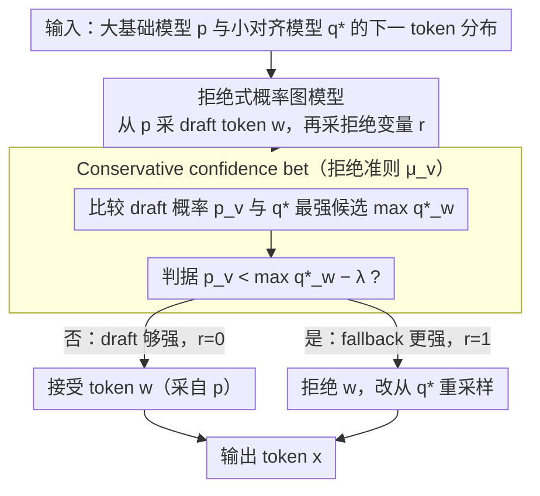

# On the Rejection Criterion for Proxy-Based Test-Time Alignment

**会议**: ACL2026  
**arXiv**: [2604.16146](https://arxiv.org/abs/2604.16146)  
**代码**: https://github.com/ayoubhammal/knapsack-approximation-deferral  
**领域**: LLM对齐 / 测试时对齐  
**关键词**: 测试时对齐, 代理模型, 拒绝准则, guided decoding, LLM推理

## 一句话总结
这篇论文把隐式奖励、Nudging 和 KAD 等 proxy-based test-time alignment 方法统一成一个“先采样再决定是否拒绝”的概率图模型，并提出用小对齐模型的最佳置信度作为参照的 conservative confidence bet，在多个数学与常识推理数据集上提升了混合解码精度。

## 研究背景与动机
**领域现状**：大模型对齐通常依赖 SFT、RLHF、DPO、RLVR 等训练阶段，把基础模型的输出分布推向更符合人类偏好、任务格式或推理要求的方向。这类训练式对齐效果强，但成本随模型规模迅速上升；当目标模型已经很大、但缺少完整后训练资源时，重新对齐一遍并不现实。

**现有痛点**：测试时对齐试图在生成阶段直接改变基础大模型的分布，避免重新训练大模型。显式 reward-guided decoding 可以逐 token 使用奖励筛选候选，但常常需要对每个候选做额外 forward，或者只能处理表达力有限的局部奖励；基于完整回答 reranking 或 MCMC 的方法又要采样很多条输出，速度很慢。

**核心矛盾**：proxy-based test-time alignment 用一个较小的对齐模型 $q^\ast$ 去引导较大的基础模型 $p$，看起来是折中的好方案：既保留大模型能力，又借用小模型的对齐偏好。但已有方法对“什么时候相信大模型、什么时候交给小模型”缺少统一理解。隐式奖励方法把 $q^\ast/q$ 当作对齐信号去扭转 $p$ 的分布；Nudging 和 KAD 则基于 $p$ 的置信度做 deferral。二者表面机制不同，实际都在围绕一个问题转：拒绝大模型样本的准则应该怎么定义。

**本文目标**：作者首先想给这些方法一个共同的概率解释，说明它们不是互不相干的 trick，而是同一个 rejection-based 生成过程的不同参数化。其次，作者要指出“低置信度就拒绝”这个直觉并不稳健，因为自然语言中常有多个同样正确的 token 共享概率质量。最后，作者希望设计一个更保守的拒绝准则：只有当小对齐模型确实可能给出更强选择时，才把生成权从大基础模型切走。

**切入角度**：论文抓住了 proxy 方法的关键动作：大模型先给出一个 draft token，小模型只在 draft 被拒绝时接管。因此，与其把不同方法分别看成 reward shaping、guided decoding 或 cascade，不如把它们都写成一个带 latent rejection variable 的概率图模型。这样一来，方法差异就集中到 $\pi(r=1\mid \bar{x}=v)$ 这个拒绝分布上。

**核心 idea**：用“拒绝准则”统一 proxy-based test-time alignment，并把准则从只看大模型自身置信度，改成比较大模型 draft token 的概率 $p_v$ 与小对齐模型最强候选的概率 $\max_w q^\ast_w$。

## 方法详解

### 整体框架
这篇论文不提新训练流程，而是重写测试时解码的概率结构：在没有大对齐模型 $p^\ast$ 的情况下，用小对齐模型 $q^\ast$ 的信息去改善大基础模型 $p$ 的生成。每生成一个 token，先从 $p$ 采一个 draft token $w$ 作为候选；再用拒绝变量 $r$ 决定它的去留——$r=0$ 就接受 $w$，$r=1$ 就拒绝 $w$ 并从 $q^\ast$ 重新采样；最终输出分布因此拆成"保留大模型样本"和"拒绝后由小模型接管"两部分。框架里大部分结构是固定的（latent draft 分布设为 $\pi(\bar{x}=w)=p_w$、fallback 分布设为 $q^\ast$），真正可设计的只剩每个 token 的拒绝概率 $\mu_v=\pi(r=1\mid\bar{x}=v)$，也就是标题里的 rejection criterion。这样改写之后，输入是 $p$ 与 $q^\ast$ 的下一 token 分布，中间是一个带 latent rejection variable 的概率图模型，输出是组合后的 token 分布；许多看似不同的测试时对齐方法都被压成同一个问题——该怎样设 $\mu_v$，才能既不轻易放弃大模型能力，又能在小对齐模型更可靠时切过去。

### 关键设计

**1. 拒绝式概率图模型：把 proxy 对齐拆成"先提候选、再决定拒绝"两件事**

已有方法常被实现细节遮住本质，作者用一个带 latent draft token 和 rejection variable 的生成模型把它们统一起来：先从 $p$ 采 $\bar{x}=w$，再采拒绝变量 $r$；$r=0$ 时最终 token 直接复制 $w$，$r=1$ 时从 $q^\ast$ 采样。整条输出分布可概括为 $\pi(x=v)=p_v(1-\mu_v)+q^\ast_v\sum_w p_w\mu_w$。

这张图的价值在于把"用小对齐模型引导大基础模型"明确拆成两个可解释步骤——大模型先提出候选，再定义什么时候拒绝候选——于是 Nudging、KAD、隐式奖励都能被放进同一张图里直接比较。

**2. 把已有 proxy 方法还原成不同的拒绝准则**

统一框架后，旧方法只是 $\mu_v$ 的不同取法。Nudging 是分布级准则：$\max_w p_w<\lambda$ 时整步交给 $q^\ast$，拒绝的是 $p$ 整个分布而非某个 token。dual KAD 是 token 级准则：采到的 token 概率 $p_v<\lambda$ 时拒绝该 token。隐式奖励方法先构造 $s_v=p_v(q^\ast_v/q_v)/Z$，论文用 Proposition 1 证明在满足 enclosing 条件时，它同样能由某个 rejection distribution 产生。

这层还原不只是归类，更暴露了旧方法的共同弱点：Nudging 和 KAD 都只依赖 $p$ 的绝对置信度，从不询问 fallback 的 $q^\ast$ 能否做得更好；隐式奖励虽用了 $q^\ast/q$，却要同时访问小模型的 base 与 aligned 两个版本，部署条件更重。

**3. Conservative confidence bet：拒绝与否取决于 fallback 有没有更强候选**

新准则把决策从"看大模型自身是否自信"改成"看小对齐模型有没有更有把握的替代选择"。对从 $p$ 采到的 token $v$，比较 $p_v$ 与小对齐模型当前最自信的 token 概率 $\max_w q^\ast_w$：若 $p_v<\max_w q^\ast_w-\lambda$，说明 $q^\ast$ 至少有一个候选比当前 draft 更可靠，于是拒绝 draft；否则保留。margin $\lambda$ 越大越保守，越不容易触发 deferral。

这么设计是因为"低置信度"并不等于"错"。比如 "frameworks like Pytorch" 和 "frameworks such as Pytorch" 都合理时，概率质量被 like 和 such 分掉，单 token 概率看起来就不高。引入 $q^\ast$ 最佳候选作基线后，只有 fallback 真有更强选择时才拒绝，从而避开自然语言歧义带来的过度切换。

### 损失函数 / 训练策略
这篇论文不训练新模型、不引入额外 loss，只关心 decoding-time 的分布组合策略：每个生成 step 同时取 $p$ 与 $q^\ast$ 的下一 token 分布，再按拒绝准则决定最终 token 来源。实验用温度 0.7 以隔离解码规则本身的收益；margin $\lambda$ 在小开发子集上从 $\{0,0.1,0.2\}$ 里选，作者强调即使 $\lambda=0$ 性能也已相当有竞争力。

## 实验关键数据

### 主实验
实验沿用 Hammal et al. (2026) 的设置，评估三类数学推理数据集 GSM8K、MATH500、SVAMP，以及两个常识推理数据集 ARC-Challenge、CommonsenseQA。模型族包括 OLMo 2 和 Qwen 3，每个模型族选择一个小对齐模型和一个大基础模型组成 proxy setting。指标是答案抽取后的准确率。

| 模型族 | 方法 | GSM8K | MATH | SVAMP | ARC | CSQA | Avg. |
|--------|------|------:|-----:|------:|----:|-----:|-----:|
| OLMo 2 | 大基础模型 $p$ | 54.5 | 9.4 | 57.6 | 29.6 | 19.4 | 34.1 |
| OLMo 2 | 小对齐模型 $q^\ast$ | 62.5 | 16.4 | 70.3 | 43.8 | 48.4 | 48.2 |
| OLMo 2 | Implicit reward | 58.4 | 18.2 | 73.0 | 63.3 | 55.8 | 53.7 |
| OLMo 2 | Dual KAD, $\lambda=0.4$ | 72.3 | 23.4 | 75.3 | 61.9 | 55.6 | 57.7 |
| OLMo 2 | Confidence bet, $\lambda=0.2$ | 71.7 | 26.4 | 79.0 | 62.6 | 54.9 | 58.9 |
| OLMo 2 | 目标大对齐模型 $p^\ast$ | 84.3 | 39.6 | 87.6 | 82.5 | 76.9 | 74.1 |
| Qwen 3 | 大基础模型 $p$ | 75.5 | 51.8 | 80.0 | 86.6 | 76.9 | 74.1 |
| Qwen 3 | 小对齐模型 $q^\ast$ | 75.3 | 53.0 | 86.6 | 82.9 | 68.7 | 73.3 |
| Qwen 3 | Implicit reward | 80.7 | 60.6 | 89.0 | 88.9 | 78.1 | 79.4 |
| Qwen 3 | Dual KAD, $\lambda=0.4$ | 81.7 | 60.6 | 87.3 | 91.5 | 80.7 | 80.3 |
| Qwen 3 | Confidence bet, $\lambda=0.2$ | 82.1 | 61.6 | 89.3 | 90.5 | 79.3 | 80.5 |
| Qwen 3 | 目标大对齐模型 $p^\ast$ | 82.4 | 64.0 | 88.3 | 93.8 | 83.1 | 82.3 |

这个主表的核心现象很清楚。对于 OLMo 2，confidence bet 的平均准确率达到 58.9，高于 dual KAD 的 57.7 和 implicit reward 的 53.7；尤其 MATH 从 dual KAD 的 23.4 提到 26.4，说明新准则在难数学任务上更能避免错误 deferral。对于 Qwen 3，confidence bet 的平均值 80.5 与 dual KAD 的 80.3 非常接近，并略高于 implicit reward 的 79.4；数学任务上更强，但在常识任务上不总是领先。

### 消融实验
论文没有做模块删除式 ablation，因为方法本身是一个拒绝准则；最接近消融的是 margin $\lambda$ 的敏感性分析。下面只列平均准确率，便于看保守程度如何影响效果。

| 配置 | OLMo 2 Avg. | Qwen 3 Avg. | 说明 |
|------|------------:|------------:|------|
| Confidence bet, $\lambda=0$ | 56.0 | 78.4 | 最激进，任何 $p_v$ 低于 $q^\ast$ 最强候选时就可能切换 |
| Confidence bet, $\lambda=0.1$ | 58.4 | 79.9 | 中等 margin，OLMo 2 和 Qwen 3 都比 $\lambda=0$ 更稳 |
| Confidence bet, $\lambda=0.2$ | 58.9 | 80.5 | 本文最佳平均设置，说明更保守的拒绝能减少无谓 deferral |
| Nudging, $\lambda=0.4$ | 50.2 | 78.7 | 分布级置信度阈值，OLMo 2 上明显弱于 token-level 规则 |
| Dual KAD, $\lambda=0.4$ | 57.7 | 80.3 | 强基线，只看 $p_v$，但不显式比较 $q^\ast$ 的最佳候选 |

### 关键发现
- 新准则最稳定的收益来自 OLMo 2：基础模型 $p$ 与目标对齐大模型 $p^\ast$ 的平均差距有 37.4 个准确率点，说明大模型确实有很大对齐缺口，小对齐模型的 proxy 信号更有价值。
- Qwen 3 上提升较小，是因为基础模型和对齐大模型本来就接近：作者报告 $p$ 平均 71.4、$p^\ast$ 平均 80.2，缺口远小于 OLMo 2。此时任何 deferral 方法的上升空间都被压缩。
- $\lambda=0.2$ 在两个模型族上平均最好，说明“保守一点”是合理的：不是看到大模型概率低就切换，而是给 $p$ 留出 margin，避免语言歧义导致的过度拒绝。
- 新准则在数学推理上尤其有吸引力。Qwen 3 的 MATH 达到 61.6，高于 dual KAD 的 60.6；OLMo 2 的 MATH 达到 26.4，也明显高于 dual KAD 的 23.4。
- 常识任务上并非全面胜出。Qwen 3 的 ARC/CSQA 上 dual KAD 分别为 91.5/80.7，而 confidence bet 为 90.5/79.3，说明小模型置信度基线在不同任务类型上的校准质量仍会影响决策。

## 亮点与洞察
- 最重要的亮点是“统一视角”。论文没有把 Nudging、KAD、implicit reward 当成三条孤立路线，而是指出它们都可以被看成 rejection distribution 的不同实例，这让后续设计可以直接围绕 $\mu_v$ 展开。
- Conservative confidence bet 的巧妙之处在于，它没有再问“大模型是不是自信”，而是问“小对齐模型有没有更有把握的替代选择”。这个问题更接近 deferral 的本质，因为 deferral 不是惩罚低置信度，而是选择两个生成源中当前更值得信任的一方。
- 作者对语言歧义的批评很到位。自然语言中多个 token 同时正确是常态，单 token 概率下降未必意味着模型犯错；把这种现象误判为不确定性，会让解码器频繁切到更小的模型，反而损失大模型能力。
- 这套思想可以迁移到其他 cascade 或 speculative decoding 场景。只要系统中存在“主模型先出候选、辅助模型可接管”的结构，就可以把决策从固定阈值改成候选源与 fallback 源的相对比较。
- 论文也提醒我们，proxy model 不是天然专家。旧的 reject option 直觉常假设 fallback 错误可忽略，但小对齐模型 $q^\ast$ 可能比大基础模型 $p$ 弱；因此，拒绝准则必须显式考虑 fallback 的质量，而不是只看主模型的不确定性。

## 局限与展望
- 论文仍需要在开发集上选择 margin $\lambda$。虽然 $\lambda=0$ 已经有竞争力，但最佳结果来自 $\lambda=0.2$，这说明不同模型族、任务和温度下可能还要重新调参。
- 实验集中在数学和常识问答，主要指标是答案准确率。对开放式写作、安全拒答、多轮对话等更接近对齐目标的任务，这个准则是否仍能稳定工作，还需要更多验证。
- 方法每步需要同时查看 $p$ 与 $q^\ast$ 的分布，推理开销高于只跑一个模型。论文关注准确率，对吞吐、延迟和显存占用的分析相对有限；实际部署中这些成本可能决定方法是否可用。
- Confidence bet 依赖概率校准。如果 $q^\ast$ 的最大概率经常过高或过低，$\max_w q^\ast_w$ 这个基线会误导 deferral。后续可以考虑温度校准、任务自适应 margin，或者用 entropy/rank 等更鲁棒的相对信号。
- 目前准则只比较单步 token 置信度，没有直接建模长期收益。有些 token 当下概率不高，但会导向更好的完整推理链；未来可以把 rejection criterion 扩展到短 horizon、value estimate 或 verifier signal。

## 相关工作与启发
- **vs Implicit reward / proxy tuning**: 隐式奖励方法用 $q^\ast/q$ 抽取小模型学到的对齐偏移，再乘到大基础模型分布 $p$ 上形成 $s$。本文的区别是把这种分布变换也解释为 rejection-based sampling 的一个特例，同时避免必须访问小模型 base 版本 $q$ 的要求。
- **vs Nudging**: Nudging 根据 $\max_w p_w$ 做分布级 deferral，只要大模型整体看起来不够自信，就整步交给 $q^\ast$。本文认为这会混淆语言歧义与真实不确定性，因此改成 token-level 且引入 $q^\ast$ 的相对参照。
- **vs Dual KAD**: Dual KAD 已经从分布级决策推进到 token 级决策，但它的规则仍是 $p_v<\lambda$ 这种绝对阈值。本文的优势是阈值不再只由 $p$ 自身决定，而是和 $q^\ast$ 当前最强候选比较，更贴近“是否值得交给 proxy”的问题。
- **vs Cascade / speculative decoding**: 相关 cascade 方法也会在多个模型之间做接管决策。本文给 NLP 对齐场景的启发是，接管规则最好使用两个模型的相对证据，而不是把小模型当作总是正确的兜底专家。

## 评分
- 新颖性: ⭐⭐⭐⭐ 统一 PGM 视角很清晰，新准则也抓住了 deferral 的相对比较本质；形式上不复杂，但问题切得准。
- 实验充分度: ⭐⭐⭐⭐ 覆盖两个模型族和五个推理数据集，并给出 margin 分析；不足是任务类型仍偏 answer accuracy，缺少开放式对齐评估和效率分析。
- 写作质量: ⭐⭐⭐⭐ 论文短小直接，公式和直觉对应得很好；Table 1 信息密度较高，但对吞吐和失败案例展开不多。
- 价值: ⭐⭐⭐⭐ 对做测试时对齐、模型级联和 guided decoding 的人很有参考价值，尤其适合作为设计 rejection / deferral rule 的基础框架。

<!-- RELATED:START -->

## 相关论文

- [\[ICLR 2026\] GuardAlign: Test-time Safety Alignment in Multimodal Large Language Models](../../ICLR2026/llm_alignment/guardalign_test-time_safety_alignment_in_multimodal_large_language_models.md)
- [\[CVPR 2025\] Jailbreaking the Non-Transferable Barrier via Test-Time Data Disguising](../../CVPR2025/llm_alignment/jailbreaking_the_non-transferable_barrier_via_test-time_data_disguising.md)
- [\[ACL 2026\] Pref-CTRL: Preference Driven LLM Alignment using Representation Editing](pref-ctrl_preference_driven_llm_alignment_using_representation_editing.md)
- [\[ACL 2026\] Debiasing Reward Models via Causally Motivated Inference-Time Intervention](debiasing_reward_models_via_causally_motivated_inference-time_intervention.md)
- [\[NeurIPS 2025\] Inference-time Alignment in Continuous Space](../../NeurIPS2025/llm_alignment/inference-time_alignment_in_continuous_space.md)

<!-- RELATED:END -->
