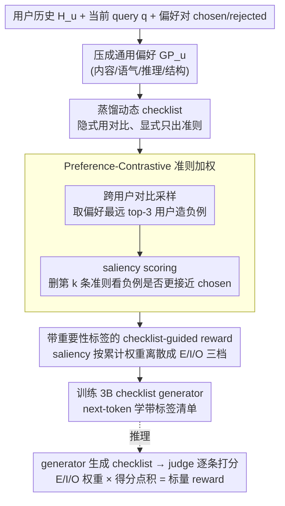

# P-Check: Advancing Personalized Reward Model via Learning to Generate Dynamic Checklist

**会议**: ACL2026  
**arXiv**: [2601.02986](https://arxiv.org/abs/2601.02986)  
**代码**: 论文页标注 CODE，缓存中未解析到具体 URL  
**领域**: 可解释性 / 个性化奖励模型  
**关键词**: 个性化奖励模型, 动态检查清单, LLM-as-a-Judge, 偏好对比学习, 可解释对齐

## 一句话总结
P-Check 把个性化奖励建模从“给用户历史塞进 judge”改成“先为当前用户和当前问题生成带权重的动态评价 checklist，再用它指导奖励打分”，在 PRISM、Arena、BESPOKE 的个性化偏好预测和下游生成任务上都显著优于 persona、记忆检索和微调奖励模型基线。

## 研究背景与动机
**领域现状**：RLHF 和偏好优化通常依赖奖励模型把人类反馈压缩成一个标量分数。随着 LLM 被用作个人助手，奖励模型不只要判断“普遍好不好”，还要判断“是否符合这个用户的口味、语气、信息密度、价值取向和任务习惯”。现有 personalized reward modeling 通常把用户历史作为上下文、检索记忆、用户 embedding、persona 或少量示例提供给奖励模型。

**现有痛点**：这些方法的用户信号多半是静态且隐式的。静态 persona 可以描述用户“喜欢具体、结构化、分析性强的回答”，但它不一定告诉 judge 在当前 query 下到底要检查哪些条件；隐式用户 embedding 更难解释，也很难在 OOD 查询中明确约束 judge。论文的预实验显示，即便给 LLM 用户历史，它也很难在 oracle checklist 与 counter-preference checklist 之间选出真正解释用户偏好的那个；但如果直接提供显式 checklist，LLM 的个性化判断会明显变好。

**核心矛盾**：个性化判断同时包含用户长期偏好和当前任务语境。长期偏好提供稳定倾向，当前 query 决定哪些倾向真正相关。把用户历史当成一个固定 profile，会忽略同一用户在不同任务之间的偏好重心漂移；只做自由文本 rationale，又容易把客观质量错误和主观偏好混在一起。

**本文目标**：作者希望训练一个 plug-and-play 的 checklist generator：输入用户历史摘要和当前 query，输出当前判断所需的个性化评价准则；再用这些准则指导任意 LLM-as-a-Judge 预测 reward。这个目标包含三个子问题：如何从偏好对里构造 checklist 监督信号，如何区分真正决定用户选择的准则和表面准则，如何让生成的 checklist 在推理时稳定转化为标量 reward。

**切入角度**：作者把“人类评价”理解为临时构造评价标准的过程。人在面对新问题时，不一定显式回忆全部历史偏好，而是会根据问题现场形成几条可执行标准，例如“要给我具体事实”“要兼顾历史背景”“语气不要太保守”。这类标准比 persona 更接近 judge 能执行的接口。

**核心 idea**：用动态生成且带重要性标签的 personalized checklist，替代静态 persona 或隐式用户向量，作为奖励模型判断个性化偏好的中间表示。

## 方法详解
P-Check 的核心是把个性化奖励建模拆成两步：先离线学一个小型 checklist generator，让它根据用户画像和当前问题写出带重要性标签的评价准则；再让任意 LLM judge 按这些准则逐条打分、加权聚合成标量 reward。难点不在生成 checklist 本身，而在如何从偏好对里挖出真正区分用户口味的准则、并给每条准则一个可信的权重。

### 整体框架
输入是一名用户的历史偏好 $H_u$、当前 query $q$ 和候选回答 $y$。传统 reward model 直接估计 $r(y \mid H_u, q)$，把用户信号压成一个隐式上下文；P-Check 在中间插入一个显式 checklist $C_{u,q}$，把奖励改写成由候选回答、query、用户历史和 checklist 共同决定的判断 $r \sim P_\theta(\cdot \mid y, q, H_u, C_{u,q})$，相当于在 judge 面前摆出一份“此处该看哪几条”的明细。训练时离线从偏好数据中蒸馏 checklist 并标注每条准则的重要性，用来教一个 3B 小模型当 generator；推理时则只剩下 generator 生成 checklist、judge 逐条打分两件事，因此训练复杂但测试开销只比裸 judge 多一次清单生成和准则级评分。

### 关键设计

**1. 从偏好对蒸馏动态 checklist：把静态 persona 换成可执行准则**

静态 persona 能描述用户“喜欢具体、结构化的回答”，却不告诉 judge 在当前 query 下究竟要核对哪几条，预实验也显示 LLM 仅凭用户历史很难推出正确准则。P-Check 先把历史偏好压成强调内容、语气、推理方式和结构的 general preference $GP_u$，再用 $GP_u$、query、chosen/rejected pair 让强 LLM 生成 checklist $C_{u,q}=LLM(GP_u,q,y^+,y^-)$。关键的取舍是 prompt 明确要求最终 checklist 不能提到这对答案本身，只能呈现为从用户画像和当前 query 推出的 criteria——因为 chosen/rejected pair 虽然最能揭示当前任务下区分用户喜好的因素，但若把 pair 痕迹写进清单，generator 会学到实例级解释而非可泛化准则。这种“隐式用对比、显式出准则”的方式，让 checklist 同时具备判别性和可迁移性。

**2. Preference-Contrastive Criterion Weighting：用删准则后的边际影响给每条准则定权**

原始 rejected response 往往只是质量差，并不代表“别的用户会喜欢、但目标用户不喜欢”的个性化对照，因此直接信任 LLM 写的 checklist 容易把泛泛的质量标准当成核心信号。P-Check 先做 inter-user contrastive sampling：把用户按 $GP$ 聚类，对目标用户选最远 cluster，再结合 query-conditioned embedding $Enc(GP_x,q)$ 取 top-3 偏好距离最大的用户，为他们生成同一 query 下的负例回答，把对比轴从通用好坏扭转到个性化差异。随后做 personalized saliency scoring：LLM 对 chosen 和负例池在每条准则上打分，计算移除第 $k$ 条准则后负例池相对 chosen 的归一化得分比值增加量

$$Saliency(c_k)=\frac{s(C^{-k},Y^-)}{s(C^{-k},y^+)+\epsilon}-\frac{s(C,Y^-)}{s(C,y^+)+\epsilon}$$

越能拉开 chosen 与负例的准则 saliency 越高，那些无关紧要、或所有答案都容易满足的条目则被压低。这一步用“删掉它负例是否更接近 chosen”来估价，比让 LLM 自报哪条重要更可控，也更贴近 reward prediction 的目标。

**3. 带重要性标签的 checklist-guided reward：让清单真正参与打分聚合**

纯 checklist 只告诉 judge “看什么”，不告诉它“哪几条更重要”。P-Check 训练时把 saliency 排序后按累计权重阈值 $\tau_1=0.4,\ \tau_2=0.9$ 离散成 Essential、Important、Optional 三档自然语言标签；推理时 judge 对候选回答输出 criterion-wise score vector，E/I/O 再映射回数值权重（主实验取 Essential=1.0、Important=0.7、Optional=0.3），最终 reward 为权重与逐条得分的点积 $r_{u,q}(y)=\mathbf{w}_{u,q}^\top\theta(GP_u,q,y,\hat{C}_{u,q})$。连续权重便于计算却难生成、难解释，离散的 E/I/O 标签则提供了一个轻量、可读、可被小模型学习的权重接口，让同一套 checklist 既提升可解释性，又能稳定聚合成标量奖励。

### 损失函数 / 训练策略
checklist generator 使用标准 next-token prediction 训练，目标是最大化带标签 checklist $\tilde{C}_{u,q}$ 在 $GP_u,q$ 条件下的概率，损失为 $\mathcal{L}_\phi=-\sum \log p_\phi(\tilde{C}_{u,q}\mid GP_u,q)$。论文使用 Llama-3.2-3B-Instruct 作为 generator backbone，训练 3 个 epoch，8 张 A6000，per-device batch size 为 2，gradient accumulation 为 16，学习率 $2\times10^{-4}$。

训练数据构造上，作者用 GPT-4o-mini 生成 $GP_u$ 和初始 checklist，并用 rejection sampling 过滤低质量样本：如果 checklist 作为额外上下文不能让 Llama-3.1-8B judge 给 chosen response 更高 reward，就重新生成。对比采样使用 Qwen3-Embedding-0.6B 做用户表示，先用 K-Means 找远距离 cluster，再取 top-3 query-conditioned distant users。saliency scoring 使用 Llama-3.1-8B，对每条 criterion 输出 1-10 分。

推理时不需要重新做对比采样或 saliency 计算，只生成 checklist 并打 criterion-wise score，因此训练流程较复杂，但测试时只是比普通 LLM judge 多一次 checklist 生成和准则级评分。

## 实验关键数据

### 主实验
作者在三个个性化奖励 benchmark 上评估：PRISM-Personalized 作为 ID，ChatbotArena-Personalized 和 BESPOKE-MetaEval 作为 OOD。所有数据都采用严格 user-level split，测试用户在训练中不可见。评价指标是 binary preference prediction accuracy，reward judge 分别使用 Llama-3-8B-Instruct 和 Llama-3-3B-Instruct。

| 方法 | PRISM-P 8B | ARENA-P 8B | BESPOKE-M 8B | 平均 |
|------|------------|-------------|--------------|------|
| GPO | 56.48 | 52.01 | 51.49 | 53.20 |
| VPL | 58.23 | 53.36 | 53.54 | 54.77 |
| PAL | 54.23 | 53.89 | 51.33 | 53.36 |
| BT + SynthMe | 62.74 | 56.42 | 50.47 | 55.86 |
| Default LLM judge | 52.80 | 53.56 | 55.46 | 53.19 |
| + Memory | 54.17 | 58.15 | 57.75 | 54.58 |
| + CoT distill | 55.47 | 55.84 | 61.35 | 55.84 |
| + SynthMe | 55.24 | 58.83 | 54.67 | 54.16 |
| + P-Check | 65.11 | 61.56 | 75.48 | 63.62 |

P-Check 在平均准确率上达到 63.62，较 Default LLM judge 提升 10.43 个百分点，按相对提升约为 19.61%。更关键的是，它在两个 OOD 数据集上也明显领先：Arena 里优于 Memory / SynthMe，BESPOKE 里从 Default 的 55.46 提到 75.48，说明 checklist 学到的不是某个训练用户分布里的静态模板，而是能迁移到新用户和新场景的评价逻辑。

作者还测试 P-Check 是否能迁移到不同 judge。结果显示，无论 judge 是 Qwen3-8B、Qwen3-13B、GPT-4o-mini 还是 GPT-4o，加入 P-Check 后三个数据集准确率均提升。比如 GPT-4o 在 BESPOKE-M 上从 63.27 提到 77.66，Qwen3-13B 从 64.14 提到 79.16。这说明瓶颈不只是 judge 模型能力不足，而是缺少明确告诉 judge “此处该看什么”的中间评价接口。

| Judge | PRISM-P 原始 | PRISM-P + P-Check | ARENA-P 原始 | ARENA-P + P-Check | BESPOKE-M 原始 | BESPOKE-M + P-Check |
|-------|--------------|-------------------|--------------|-------------------|-----------------|----------------------|
| Qwen3-8B | 55.14 | 63.71 | 57.41 | 59.98 | 59.23 | 70.36 |
| Qwen3-13B | 59.76 | 63.23 | 58.89 | 63.62 | 64.14 | 79.16 |
| GPT-4o-mini | 56.07 | 63.40 | 59.86 | 62.31 | 60.23 | 76.51 |
| GPT-4o | 58.94 | 64.83 | 60.06 | 69.36 | 63.27 | 77.66 |

### 消融实验
消融集中在 Preference-Contrastive Criterion Weighting 的两个组成部分：跨用户对比采样和 saliency scoring。完整 P-Check 在三个 reward benchmark 上都最强；去掉 saliency scoring 掉点最大，尤其 BESPOKE-M 从 75.48 降到 66.68。

| 配置 | PRISM-P | ARENA-P | BESPOKE-M | 说明 |
|------|---------|---------|-----------|------|
| P-Check (full) | 65.11 | 61.56 | 75.48 | 完整模型 |
| 去掉 inter-user sampling | 63.46 | 59.56 | 72.23 | 负例只剩原始 rejected，对个性化差异刻画变弱 |
| 去掉 saliency scoring | 59.98 | 58.46 | 66.68 | checklist 项没有判别性权重，泛化和聚合都受损 |

下游个性化生成实验用 BESPOKE 评估 P-Check 作为 reward 的实用性。作者比较 Best-of-N selection 和 DPO 两种使用方式，指标包括 ROUGE-L、METEOR 与 BESPOKE-EVAL。无论 policy 是 Llama3-8B 还是 GPT-4o-mini，P-Check 都取得最高分，且与最强 baseline 的差异通过 paired t-test 显著。

| 对齐方式 | Policy | Reward / 方法 | ROUGE-L | METEOR | BESPOKE-EVAL |
|----------|--------|---------------|---------|--------|--------------|
| BoN | Llama3-8B | Default policy | 7.92 | 6.09 | 51.55 |
| BoN | Llama3-8B | strongest baseline: CoT distill | 8.24 | 7.14 | 54.90 |
| BoN | Llama3-8B | P-Check | 9.43 | 8.22 | 59.76 |
| BoN | GPT-4o-mini | strongest baseline: CoT distill | 8.24 | 7.62 | 54.76 |
| BoN | GPT-4o-mini | P-Check | 9.61 | 8.47 | 57.32 |
| DPO | Llama3-8B | strongest baseline: CoT distill | 8.41 | 7.63 | 56.64 |
| DPO | Llama3-8B | P-Check | 9.94 | 9.67 | 61.21 |

### 关键发现
- 显式 checklist 比静态 persona 更有效。预实验中，LLM 很难仅从用户历史推断正确评价准则；但一旦提供 oracle checklist，偏好选择明显改善，说明个性化 reward 的关键不是“更多上下文”，而是“把上下文变成可执行评价标准”。
- saliency scoring 是最关键的训练信号。去掉跨用户采样会掉点，但去掉准则加权掉得更明显，说明 checklist 里的每条准则不能等权处理；模型必须知道哪些条目真正决定用户选择。
- P-Check 在稀疏历史和 OOD 用户上更稳。论文按测试用户交互数量分桶后发现，基线会随可观察历史变少而退化，而 P-Check 的 user-macro accuracy 更平稳。原因可能是它只需从有限历史中提炼当前 query 需要的少数准则，而不是恢复完整用户偏好分布。
- checklist 还能作为 verbal feedback 用于轻量个性化。作者让 policy 先生成初稿，再用 P-Check checklist 改写，效果优于 Self-Refine 和 SynthMe；这说明 checklist 不只是 reward 内部特征，也能直接反馈给生成模型。
- 成本上，P-Check 在 PRISM 测试集上把 Llama-3-8B judge 的推理时间从 19:30 增加到 28:37，但准确率从 52.8 提到 65.11。与 Qwen3-13B 相比，它时间接近但准确率更高；与 BT+SynthMe 相比，它更快且更准。

## 亮点与洞察
- 这篇论文最有价值的地方，是把个性化奖励的中间层从“用户表示”换成了“评价接口”。persona 和 embedding 都在描述用户，而 checklist 直接描述 judge 应该检查什么，因此更适合接入 LLM-as-a-Judge。
- Preference-Contrastive Criterion Weighting 很巧妙：它没有简单相信 LLM 生成的 checklist，而是用“去掉某条准则后负例是否更接近 chosen”来估计准则价值。这比让 LLM 自己声明哪条重要更可控，也更贴近 reward prediction 的目标。
- 跨用户负例的设计抓住了 personalization 的本质。一个回答可能不是低质量，只是不符合目标用户；从偏好距离远的用户那里构造负例，能让 checklist 学到“对这个用户而言重要、对别人未必重要”的差异轴。
- E/I/O 标签是一个很实用的工程折中。连续权重适合计算，但不好生成和解释；自然语言标签可被小模型学习，也能让最终 checklist 对人类可读。
- 这个思路可以迁移到很多偏好高度主观的任务，例如个性化写作助手、代码 review 风格建模、医疗咨询中的沟通偏好、教育场景中的讲解深度控制。核心做法都是先把用户偏好转成任务局部 rubric，再让 judge 或 generator 使用它。

## 局限与展望
- checklist 假设用户偏好能被离散自然语言准则表达，但有些偏好是细腻的风格感、节奏感或语气舒适度，未必能完整外化成几条规则。未来可以探索显式准则与隐式偏好向量的混合表示。
- 生成的 checklist 一旦错了，后续 reward 会系统性偏移。论文 case study 中，模型把一个关于动物是否上天堂的主观问题误判为需要“科学共识”和“实证证据”，说明小型 generator 可能过度套用用户历史中的事实偏好，而没有充分理解当前 query 的语境转换。
- 训练流水线比较重，需要生成用户摘要、构造 checklist、跨用户聚类与采样、生成额外负例、做准则级评分和 saliency 标注。虽然这些可以离线缓存，但在真实产品中维护成本不低。
- 实验主要基于公开 personalized reward benchmark，离真实长期用户系统仍有距离。实际部署还需要处理隐私、用户偏好变化、恶意或有害偏好、安全策略与个性化目标冲突等问题。
- P-Check 提升了 preference fidelity，但不能替代安全对齐。若用户偏好本身有害，个性化 reward 可能把模型推向不安全输出，因此需要与全局 safety policy 联合使用。

## 相关工作与启发
- **vs SynthMe / persona-based personalization**: SynthMe 用自然语言 persona 和示例优化 judge prompt，描述“用户是什么样的人”；P-Check 生成 query-specific checklist，描述“当前回答应该满足哪些标准”。前者信息更宽泛，后者更可执行。
- **vs VPL / PAL / GPO 等 latent preference model**: 这些方法学习用户 embedding、原型混合或 group-level preference，优势是端到端建模；P-Check 的优势是中间表示可解释、可编辑，并且能 plug-and-play 接到不同 LLM judge 上。
- **vs rubric / checklist-based evaluation**: 既有 rubric reward 多关注任务级或通用质量准则，P-Check 把 rubric 个性化到用户历史和当前 query，并进一步给准则加 saliency 权重。
- **vs generative reward modeling / CoT distill**: CoT rationale 解释为什么一个答案好，但不一定形成可复用的评分维度；P-Check 把 reasoning 结构化成 criterion-wise checklist，使它能被打分、加权和复用到生成改写中。
- **启发**: 个性化系统不一定要把所有偏好都塞进 policy 参数。把“用户偏好解释器”和“基础 judge / generator”解耦，可能是更便宜、更透明、也更容易 debug 的路线。

## 评分
- 新颖性: ⭐⭐⭐⭐☆ 把动态 checklist 和 criterion saliency 用于 personalized reward modeling，问题定义和训练信号都比较新颖。
- 实验充分度: ⭐⭐⭐⭐⭐ 覆盖 ID/OOD reward accuracy、不同 judge、稀疏历史、下游 BoN/DPO、verbal feedback、消融、成本和 case study，证据链完整。
- 写作质量: ⭐⭐⭐⭐☆ 主线清晰，方法和实验组织扎实；但部分表格来自正文前置排版，阅读时需要在正文和附录之间来回对照。
- 价值: ⭐⭐⭐⭐⭐ 对个性化对齐、可解释 reward、LLM-as-a-Judge 都有直接启发，尤其适合作为“显式评价准则接口”的基础框架继续扩展。

<!-- RELATED:START -->

## 相关论文

- [\[ACL 2026\] PERSA: Reinforcement Learning for Professor-Style Personalized Feedback with LLMs](persa_reinforcement_learning_for_professor-style_personalized_feedback_with_llms.md)
- [\[ICLR 2026\] Swap-guided Preference Learning for Personalized RLHF (SPL)](../../ICLR2026/llm_alignment/swap-guided_preference_learning_for_personalized_reinforcement_learning_from_hum.md)
- [\[ACL 2025\] Dynamic Scaling of Unit Tests for Code Reward Modeling](../../ACL2025/llm_alignment/dynamic_scaling_of_unit_tests_for_code_reward_modeling.md)
- [\[ACL 2025\] SynthesizeMe! Inducing Persona-Guided Prompts for Personalized Reward Models in LLMs](../../ACL2025/llm_alignment/synthesizeme_persona_prompts.md)
- [\[ICLR 2026\] Learning More with Less: A Dynamic Dual-Level Down-Sampling Framework for Efficient Policy Optimization](../../ICLR2026/llm_alignment/learning_more_with_less_a_dynamic_dual-level_down-sampling_framework_for_efficie.md)

<!-- RELATED:END -->
