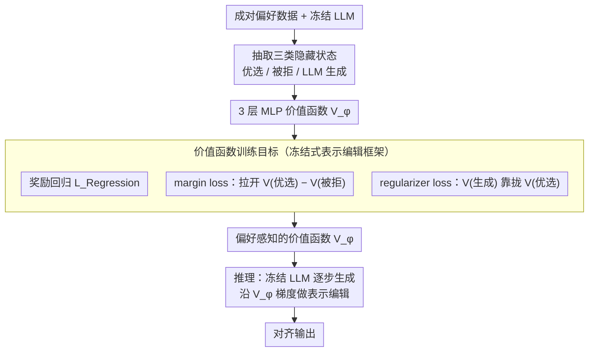

# Pref-CTRL: Preference Driven LLM Alignment using Representation Editing

**会议**: ACL2026  
**arXiv**: [2604.23543](https://arxiv.org/abs/2604.23543)  
**代码**: https://github.com/UTS-nlPUG/pref-ctrl  
**领域**: 模型压缩 / 测试时对齐 / LLM对齐  
**关键词**: 表示编辑、偏好学习、测试时对齐、价值函数、RLHF

## 一句话总结
Pref-CTRL 在不更新大模型参数的测试时对齐框架 RE-Control 上，引入面向成对偏好数据的 margin loss 和 regularizer loss 来训练轻量价值函数，使表示编辑更符合人类偏好并在 SHP、HH-RLHF 与跨域数据上稳定优于 RE-Control。

## 研究背景与动机
**领域现状**：LLM 对齐通常依赖 RLHF、PPO、DPO 或其变体，通过偏好数据让模型更符合人类对有用性、无害性和回答风格的期待。这类训练时方法效果强，但往往需要重新训练或微调模型参数，面对不同模型、不同偏好属性和频繁变化的需求时，计算成本与维护成本都偏高。

**现有痛点**：测试时对齐试图绕过完整微调，在推理阶段通过奖励模型、候选重排、activation steering 或 representation editing 来调整输出。RE-Control 是其中比较代表性的表示编辑方法：它冻结 LLM，用一个小型价值函数评估隐藏状态，然后在生成时沿着价值函数梯度轻量调整内部表示。问题在于，RE-Control 的价值函数主要学习单个回答的标量奖励，没有显式利用很多对齐数据集天然包含的“偏好回答 vs 被拒回答”成对结构。

**核心矛盾**：对齐任务的监督信号通常不是孤立分数，而是相对偏好。人类标注更常表达“回答 A 比回答 B 更好”，DPO 等训练时方法也正是因为直接建模这种相对关系而有效。如果测试时表示编辑仍只把偏好数据压成单点奖励，价值函数就可能知道“这个状态分数高不高”，却不够清楚“优选回答和被拒回答应该拉开多大差距”。

**本文目标**：作者希望保留 RE-Control 的优势，即冻结 LLM、只训练轻量外部价值函数、推理时通过表示编辑完成对齐；同时让价值函数训练更贴合偏好数据的结构，提升对齐效果、降低过度优化风险，并考察这种改动是否能泛化到训练分布之外的数据集。

**切入角度**：论文的观察很直接：如果训练数据已经提供 preferred / rejected 两个候选，那么价值函数不仅应回归奖励，还应学会给 preferred 终止状态更高分，并让生成状态不要偏离 preferred 状态过远。因此，改进点不在于换一个更大的 LLM，也不在于重写推理控制框架，而是在价值函数训练目标上加入偏好排序和保守约束。

**核心 idea**：用“奖励回归 + 偏好间隔 + 生成-优选正则”的多目标价值函数训练，替代 RE-Control 中更单一的奖励回归目标，从而让测试时表示编辑更像偏好学习而不是单点奖励追逐。

## 方法详解
Pref-CTRL 是对测试时对齐框架 RE-Control 的一次目标函数升级：基础 LLM 始终冻结，对齐知识不写进模型权重，而是交给一个外部小型价值函数。它读取 LLM 最后一层隐藏状态、输出标量，用来估计当前生成状态在对齐目标上的价值；推理时系统沿价值函数的梯度方向对隐藏状态做表示编辑，把后续生成推向高价值区域。本文的关键改动是让价值函数同时看见三类表示——优选回答、被拒回答、以及 LLM 自己生成回答的隐藏状态，从而把“优选应高于被拒”和“生成不应偏离优选太远”两个约束显式写进训练目标。

### 整体框架
整个流程分训练和推理两阶段。训练阶段，作者先用冻结 LLM 对偏好数据做前向计算，抽取 preferred text、rejected text 和 LLM-generated text 三套隐藏状态；随后一个 3 层 MLP 价值函数在这些状态上训练，既回归外部 reward model 给出的奖励，又学习 preferred 与 rejected 的相对排序，还用正则项约束生成状态与 preferred 状态的价值接近。推理阶段基础 LLM 仍冻结，生成每一步把当前状态看成隐藏表示与 logits 的组合，用训练好的价值函数打分，并沿提升价值的方向对内部表示做测试时编辑。本文只讨论论文层面的高层机制，它是一种面向安全与偏好对齐的研究方法，不涉及任何规避、安全绕过或实际部署操作细节。

### 关键设计

**1. 沿用 RE-Control 的冻结式表示编辑框架：在不动 LLM 权重的前提下校正输出**

为每个偏好目标重训大模型代价高昂，RE-Control 把生成过程看成一个动态系统：状态 $s_t$ 包含隐藏表示 $h_t$ 和 pre-softmax logits $o_t$，价值函数 $V_\phi(s_t)$ 估计当前状态的未来奖励，推理时通过梯度上升调整控制信号，使后续状态更接近高价值区域。Pref-CTRL 完整继承了这套机制，因为它保留了测试时方法的灵活性——一个冻结 LLM 可以配合外部价值函数做行为调节，而不必为每个偏好目标重训整模。正因如此，本文的创新被刻意约束在“如何训练价值函数”这一层，而不去改 LLM 本身。

**2. 用 margin loss 显式建模成对偏好：把相对比较写进价值函数**

对齐数据的真正监督信号往往不是孤立分数，而是“回答 A 比 B 更符合偏好”，但 RE-Control 的价值函数主要回归单点奖励，只知道某状态分数高不高，不清楚优选与被拒该拉开多大差距。Pref-CTRL 取一组成对样本的优选终止状态 $s^{pref}$ 与被拒终止状态 $s^{rej}$，加入 $L_{Margin}=-\log \sigma(V_\phi(s^{pref})-V_\phi(s^{rej}))$：若价值函数给 rejected 打得太高损失就上升，若 preferred 与 rejected 拉开足够差距损失就下降。这一项把 DPO 式的相对偏好直接灌进价值函数训练，使测试时表示编辑继承了偏好学习方法的核心信号，而不再是单点奖励追逐。

**3. 用 regularizer loss 抑制过度优化：给编辑方向加一个保守锚点**

只有 margin 约束时，价值函数可能被训练成“过度区分器”，一味拉大 preferred/rejected 间隔，把生成状态推离自然语言流畅性或任务相关性，带来 reward hacking 式副作用。Pref-CTRL 因此把 LLM 生成回答的最终状态 $s_N$ 与优选终止状态 $s^{pref}$ 的价值分数拉近，形式上类似 $L_{Regularizer}=(V_\phi(s_N)-V_\phi(s^{pref}))^2$，总目标为 $L_{Total}=L_{Regression}+L_{Margin}+L_{Regularizer}$。这相当于告诉编辑方向：生成状态应朝优选状态靠拢，而不是只要分高就无限外推。消融中正是这一项让 margin 带来的偏好分离不至于走偏。

### 损失函数 / 训练策略
价值函数采用与 RE-Control 相同的轻量 MLP 架构，输入维度等于 LLM hidden size，论文实验中 hidden size 为 4096，结构为 Linear(4096→4096)+ReLU、Linear(4096→4096)+ReLU、Linear(4096→1)。训练时使用 Adam，学习率 $1\times10^{-5}$，batch size 为 64，训练 50 个 epoch，并在验证集上选择最佳 epoch 用于推理。

实验使用 UltraRM 作为奖励模型来训练价值函数。基础模型包括 Vicuna-7B 与 Hermes-3-Llama-3.1-8B。作者在 SHP 和 HH-RLHF 上训练与测试，并在 PKU-SafeRLHF、Nectar 上做零样本跨域评估。推理分析中，HH-RLHF、PKU-SafeRLHF 和 Nectar 默认步长为 $\alpha=0.5$、步数 $k=100$；SHP 因更复杂使用 $\alpha=1$、$k=100$。这些数字用于理解论文实验设置，不构成实际系统部署建议。

## 实验关键数据

### 主实验
主实验比较 RE-Control、Pref-CTRL 变体与一个训练时 DPO 参考基线。评价指标包括三种 LLM-as-a-judge 的 win rate、UltraRM average reward，以及多样性和连贯性。下面只摘出最能说明本文贡献的 RE-Control 与 Pref-CTRL(Margin+Regularizer) 对比。

| 数据集 / 基础模型 | 方法 | Llama Judge Win Rate | DeepSeek Judge Win Rate | GPT Judge Win Rate | Avg. Reward | 结论 |
|--------|------|------:|------:|------:|------:|------|
| SHP / Vicuna-7B | RE-Control | 66.80 | 66.70 | 53.50 | -2.652 | 原始表示编辑基线 |
| SHP / Vicuna-7B | Pref-CTRL(M+R) | 73.50 | 70.00 | 53.70 | -2.454 | 三个 judge 与 reward 均提升 |
| SHP / Hermes3-8B | RE-Control | 79.80 | 74.80 | 60.90 | -2.303 | 强基础模型上的基线 |
| SHP / Hermes3-8B | Pref-CTRL(M+R) | 80.40 | 76.40 | 61.40 | -2.166 | 提升较小但方向一致 |
| HH-RLHF / Vicuna-7B | RE-Control | 81.90 | 85.40 | 73.30 | -5.408 | 安全/有用性场景基线 |
| HH-RLHF / Vicuna-7B | Pref-CTRL(M+R) | 82.90 | 85.60 | 74.60 | -5.288 | win rate 与 reward 同时改善 |
| HH-RLHF / Hermes3-8B | RE-Control | 85.50 | 84.00 | 73.10 | -4.321 | 强基础模型上的基线 |
| HH-RLHF / Hermes3-8B | Pref-CTRL(M+R) | 85.70 | 84.30 | 73.60 | -4.268 | 保持 diversity/coherence 的同时小幅提升 |

从主表可以看出，Pref-CTRL 的优势不是单一指标上的偶然波动，而是在两个数据集、两个基础模型、三个 judge 和 reward metric 上总体一致。尤其是 SHP / Vicuna-7B，从 RE-Control 到 Pref-CTRL(M+R)，Llama judge win rate 提升 6.70 个点，DeepSeek judge 提升 3.30 个点，Avg. Reward 从 -2.652 改善到 -2.454。

作者还将 Pref-CTRL 与额外测试时对齐方法比较。在 HH-RLHF / Hermes3-8B 上，Pref-CTRL 对 Best-of-N 的优势比较明显；相对 CAST，它在 DeepSeek judge 上明显更高，在 Llama 与 GPT judge 上接近但不总是最高。

| 方法 | Llama Judge Win Rate | DeepSeek Judge Win Rate | GPT Judge Win Rate | 解读 |
|------|------:|------:|------:|------|
| Best-of-N | 85.30 | 78.90 | 72.10 | 需要从多个候选中筛选 |
| CAST | 86.00 | 79.90 | 74.70 | activation steering 基线表现强 |
| Pref-CTRL | 85.70 | 84.30 | 73.60 | DeepSeek judge 明显领先，整体具竞争力 |

### 消融实验
消融最有价值的结论是：margin loss 单独使用并不总是稳健，regularizer 的作用是把偏好分离和生成保守性重新平衡起来。

| 数据集 / 模型 | 配置 | Llama Win Rate | DeepSeek Win Rate | GPT Win Rate | Avg. Reward | 说明 |
|------|------|------:|------:|------:|------:|------|
| SHP / Vicuna-7B | RE-Control | 66.80 | 66.70 | 53.50 | -2.652 | 只有奖励回归式价值函数 |
| SHP / Vicuna-7B | Pref-CTRL(Margin) | 72.20 | 67.60 | 50.20 | -2.612 | Llama/DeepSeek 提升，但 GPT judge 下降 |
| SHP / Vicuna-7B | Pref-CTRL(Regularizer) | 68.07 | 64.56 | 51.70 | -2.884 | 单独正则化收益有限 |
| SHP / Vicuna-7B | Pref-CTRL(M+R) | 73.50 | 70.00 | 53.70 | -2.454 | 两项结合最稳 |
| HH-RLHF / Vicuna-7B | RE-Control | 81.90 | 85.40 | 73.30 | -5.408 | 安全/有用性基线 |
| HH-RLHF / Vicuna-7B | Pref-CTRL(Margin) | 80.70 | 82.50 | 72.40 | -5.358 | reward 改善但 win rate 下降 |
| HH-RLHF / Vicuna-7B | Pref-CTRL(M+R) | 82.90 | 85.60 | 74.60 | -5.288 | 正则项缓解 margin 过度优化 |

跨域评估也支持本文论点：价值函数如果学习了偏好比较而非只记住训练集奖励，迁移到新数据分布时更稳。

| 训练数据 | 测试数据 | 方法 | Llama Win Rate | DeepSeek Win Rate | 提升 |
|------|------|------|------:|------:|------|
| SHP | PKU-SafeRLHF | RE-Control | 81.00 | 73.00 | 基线 |
| SHP | PKU-SafeRLHF | Pref-CTRL | 83.00 | 75.00 | 两个 judge 均 +2.00 |
| HH-RLHF | PKU-SafeRLHF | RE-Control | 78.00 | 65.00 | 基线 |
| HH-RLHF | PKU-SafeRLHF | Pref-CTRL | 80.00 | 67.00 | 两个 judge 均 +2.00 |
| HH-RLHF | Nectar | RE-Control | 30.67 | 33.67 | 基线 |
| HH-RLHF | Nectar | Pref-CTRL | 32.33 | 35.67 | Nectar 上也有小幅提升 |

### 关键发现
- 价值函数训练目标的结构很关键。把成对偏好关系显式加入训练后，测试时表示编辑的方向更可靠，尤其在 SHP / Vicuna-7B 上改善明显。
- margin loss 是主要的偏好区分信号，但单独使用可能过度强调 preferred 与 rejected 的间隔；regularizer 不一定单独带来收益，却能在与 margin loss 结合时稳定结果。
- Pref-CTRL 接近训练时 DPO 的部分结果，但两者成本和定位不同：DPO 修改模型参数，Pref-CTRL 冻结 LLM 并训练外部价值函数。论文把 DPO 称为远距离参考，而不是完全同类方法。
- 敏感性分析显示，HH-RLHF / Hermes3 上 reward 在 $\alpha=0.5$、$k=100$ 附近达到峰值，继续增大步长或步数反而下降，说明测试时梯度编辑仍有过度优化边界。
- diversity 与 coherence 基本没有明显劣化，说明本文提升不是简单牺牲文本质量换取 judge 偏好分。

## 亮点与洞察
- **把偏好学习思想移植到测试时对齐**：论文没有重新发明一个复杂推理系统，而是识别出 RE-Control 的训练目标和偏好数据结构不匹配，然后用最直接的 pairwise margin 修补。这种“小改目标函数，大保留框架”的思路很实用。
- **regularizer 的意义比单独指标更大**：从消融看，regularizer-only 不强，但它与 margin loss 结合后能避免偏好间隔被过度放大。这提醒我们，对齐中的正则项不一定是单独提升器，更可能是防止另一个目标走偏的稳定器。
- **测试时方法也需要关心训练信号形态**：很多测试时对齐工作强调推理阶段如何控制，但 Pref-CTRL 表明，外部价值函数的训练监督同样决定了控制方向是否可信。即使 LLM 冻结，训练数据如何组织仍然重要。
- **跨域结果增强了“相对偏好”假设的说服力**：PKU-SafeRLHF 和 Nectar 上的提升不大，但方向一致，说明 margin + regularizer 学到的不是纯粹数据集内 reward calibration，而是某种更可迁移的偏好排序信号。
- **适合迁移到多属性控制问题**：如果未来希望同时控制有用性、无害性、风格、简洁度等属性，Pref-CTRL 的多目标价值函数框架可能自然扩展为多头或多属性价值函数，而不必每次微调整模。

## 局限与展望
- 作者明确指出，梯度式测试时干预依赖步长和步数等超参数，不同领域可能需要重新验证；敏感性分析中也能看到过大的 $\alpha$ 或 $k$ 会降低效果。
- 价值函数依赖固定 reward model 与成对偏好标签，因此它能表达的偏好边界受训练数据和奖励模型覆盖范围限制。对于训练集中没有出现的细粒度属性，价值函数未必能正确泛化。
- 实验集中在单轮 prompt，尚未证明多轮对话、长上下文任务或复杂工具使用场景下仍能保持同样稳定。
- 评价主要依赖 LLM-as-a-judge 与 UltraRM，虽然使用了多个 judge 和显著性检验，但缺少更大规模的人类评估；对齐论文尤其需要警惕 judge 偏差和 reward model 偏差。
- 论文没有把测试时计算开销作为主表指标详细展开。虽然价值函数本身轻量，但每步梯度编辑仍会带来额外推理成本，实际应用中需要在质量、延迟和成本之间权衡。
- 未来可以探索作者提到的 attention-based value function、多属性对齐目标和自适应测试时干预；其中最值得期待的是让系统根据输入风险和不确定性自动决定是否需要强干预。

## 相关工作与启发
- **vs RLHF / PPO**: RLHF 通过奖励模型和强化学习更新 LLM 参数，适合训练强对齐模型，但代价高且流程复杂。Pref-CTRL 不更新 LLM，只训练外部价值函数，更像轻量的测试时校正层。
- **vs DPO**: DPO 直接用成对偏好优化模型参数，是训练时偏好学习的代表。Pref-CTRL 借鉴了“偏好是相对比较”的思想，但把它放到价值函数训练中，而不是放到 LLM 微调中。
- **vs RE-Control**: RE-Control 是本文最直接的基线，二者共享冻结 LLM、价值函数和表示编辑的总体框架。区别在于 Pref-CTRL 的价值函数看见 preferred/rejected/generated 三类状态，并使用 margin 与 regularizer 让控制信号更偏好感知。
- **vs Best-of-N**: Best-of-N 通过生成多个候选再选择更优回答来提升对齐，简单但推理开销随候选数增加。Pref-CTRL 在内部表示层面调整单次生成方向，不依赖候选池筛选。
- **vs CAST / activation steering**: CAST 等方法用激活方向控制模型行为，适合特定属性 steering。Pref-CTRL 的特点是控制方向来自成对偏好训练出的价值函数，因此更贴近 RLHF 数据结构。
- **启发**: 对很多“冻结大模型 + 小模块控制”的方法来说，小模块的监督目标往往比模块容量更重要。若数据本身是排序、偏好或比较关系，就不应把它粗暴压成单个标量标签。

## 评分
- 新颖性: ⭐⭐⭐⭐☆ 在 RE-Control 框架上的改动不复杂，但把成对偏好显式引入测试时表示编辑价值函数，切入点清晰且有效。
- 实验充分度: ⭐⭐⭐⭐☆ 覆盖两个主数据集、两个基础模型、多个 judge、OOD 测试和敏感性分析；不足是人类评估与计算成本分析仍偏少。
- 写作质量: ⭐⭐⭐⭐☆ 动机和方法关系讲得直接，表格结果清楚；但主表排版受限，部分变体与结论之间需要读者仔细对照。
- 价值: ⭐⭐⭐⭐☆ 对想降低对齐微调成本、研究测试时控制和偏好建模的人很有参考价值，尤其适合作为 RE-Control 类方法的目标函数改进基线。

<!-- RELATED:START -->

## 相关论文

- [\[ACL 2026\] Teaching LLM to be Persuasive: Reward-Enhanced Policy Optimization for Alignment from Heterogeneous Rewards](teaching_llm_to_be_persuasive_reward-enhanced_policy_optimization_for_alignment_.md)
- [\[ACL 2026\] Alignment Data Map for Efficient Preference Data Selection and Diagnosis](alignment_data_map_for_efficient_preference_data_selection_and_diagnosis.md)
- [\[ACL 2025\] RISE: Subtle Errors in Reasoning: Preference Learning via Error-injected Self-editing](../../ACL2025/llm_alignment/rise_error_inject_preference.md)
- [\[ACL 2025\] Curiosity-Driven Reinforcement Learning from Human Feedback](../../ACL2025/llm_alignment/curiosity_driven_rlhf.md)
- [\[ACL 2026\] On the Rejection Criterion for Proxy-Based Test-Time Alignment](on_the_rejection_criterion_for_proxy-based_test-time_alignment.md)

<!-- RELATED:END -->
