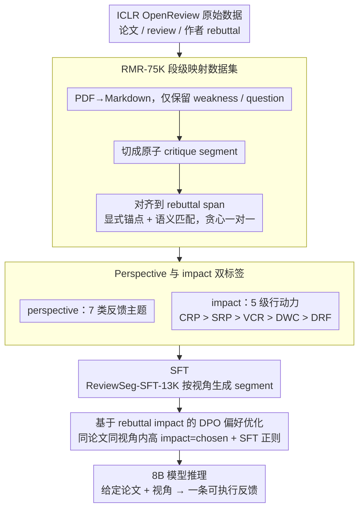

# RbtAct: Rebuttal as Supervision for Actionable Review Feedback Generation

**会议**: ACL 2026 Findings  
**arXiv**: [2603.09723](https://arxiv.org/abs/2603.09723)  
**代码**: arXiv 页面标注 RbtAct，缓存中未解析出公开仓库 URL  
**领域**: LLM对齐 / 学术同行评审 / 反馈生成  
**关键词**: 作者 rebuttal、可执行评审反馈、偏好优化、DPO、同行评审数据集

## 一句话总结
RbtAct 把作者 rebuttal 视为“哪些评审意见真的促成修改”的隐式监督，构建 7.5 万条 review-rebuttal 段级映射，并用 SFT+DPO 训练 8B 模型生成更具体、更可执行的论文评审反馈。

## 研究背景与动机
**领域现状**：LLM 已经开始介入科研写作和同行评审，既可以根据论文草稿生成完整 review，也可以通过多 agent 或微调模型提升反馈覆盖面。已有工作更多关注“像不像一份 review”：语言是否流畅、是否提到优缺点、是否能覆盖论文主要模块。

**现有痛点**：真正有用的评审不只是指出“实验不足”或“写作不清楚”，而是要让作者知道具体应该改什么、补什么、怎样改。LLM 生成的 review 往往形式完整但内容泛化，容易给出模板化建议，作者很难据此行动。

**核心矛盾**：评审反馈的价值来自作者后续行为，但普通 review 数据只给出评审文本本身，并不知道这条评论是否促成了实际修改。也就是说，模型能模仿 reviewer 的话，却缺少“哪些话会被作者采纳”的监督信号。

**本文目标**：论文希望把 rebuttal 中的作者反应转化为训练信号，学习生成单条、聚焦、面向具体视角的评审意见。任务输入是完整论文和指定 perspective，输出是一条 weakness/question 风格的 review segment。

**切入角度**：作者观察到 rebuttal 天然记录了作者如何回应 reviewer：有些意见导致已经完成的修改，有些只得到未来计划，有些被作者防守或转移。这个“作者 uptake”虽然有噪声，但在大规模公开 review 中可以作为 actionability 的近似标签。

**核心 idea**：用 review segment 与 rebuttal segment 的映射把作者回应转成偏好排序，让模型偏向生成更可能触发具体修改的反馈。

## 方法详解
RbtAct 的方法可以分成两层：先构建 review-rebuttal 段级数据集，再把 rebuttal impact 转成偏好数据训练生成模型。它不是让模型生成整篇长 review，而是把任务收窄为“给定论文和一个评审视角，生成一条 focused comment”。这个设定降低了评估模糊性，也让每条反馈都能和 rebuttal 中的具体回应对齐。

### 整体框架
输入是一篇论文全文和一个目标视角，例如 Experiments、Novelty、Writing 或 Reproducibility。系统先从 ICLR 2024 的 OpenReview 数据中抽取论文、review、作者 rebuttal，并把 PDF 转成 Markdown。随后，它只关注 review 中 weakness 和 question 部分，将它们切成原子 critique segment，再和 rebuttal span 做一对一映射。

完成映射后，每个 review segment 会获得两个标签：一个是 review perspective，描述这条评论关注论文的哪个方面；另一个是 rebuttal impact，描述作者回应这条评论时的行动程度。训练阶段先用 ReviewSeg-SFT-13K 做监督微调，让 Llama-3.1-8B-Instruct 学会按 perspective 生成 review segment；再用 ReviewPref-DPO-22K 做 DPO，把“导致更强作者行动”的 segment 作为 preferred output。

### 关键设计

**1. RMR-75K 段级映射数据集：把每条评审意见和作者在 rebuttal 里的对应回应一对一对齐**

评审反馈的真正价值来自作者后续是否买账，但普通 review 数据只有评审文本，整篇 review 对整篇 rebuttal 的粒度太粗，根本看不出「哪条评论引出了哪种回应」。RbtAct 从 ICLR 2024 的 OpenReview 抽取论文、review、rebuttal 并把 PDF 转成 Markdown，只保留 review 的 weakness/question 部分，先用结构化线索或 GPT-5 把它们切成单一关注点的原子 critique segment，再借助显式锚点（reviewer 编号、引用语）和语义匹配把每个 segment 对齐到对应的 rebuttal span，最后按匹配置信度贪心地做一对一选择。这样得到 75,542 条段级映射、覆盖 4,825 篇论文，自动映射与人工标注的 span overlap 达到 F1 0.91、标注一致性 κ=0.80——「作者采纳了哪一条建议」从此成为可观测、可训练的信号。

> ⚠️ 此处「GPT-5」为原文所述模型名，以原文为准。

**2. Perspective 与 impact 双标签：一个管反馈主题，一个量化可执行性**

同一篇论文可能在实验、理论、写作上各有问题，如果跨主题直接比较反馈好坏，偏好排序就会被主题差异污染。为此每个 review segment 被打上两个标签：perspective 描述这条评论关注哪个方面，分为 Experiments、Evaluation、Reproducibility、Novelty、Theory、Writing、Presentation 七类；impact 描述作者回应时的行动程度，分为 CRP、SRP、VCR、DWC、DRF 五类，依次对应已完成修改、具体修改计划、模糊承诺、防守不改、转移问题。perspective 让后续偏好对只在「同一论文、同一视角」内构造，impact 则把抽象的「可执行性」落成作者真实行为的离散等级，两个标签的自动判定准确率分别约 92% 和 89%。

**3. 基于 rebuttal impact 的 DPO 偏好优化：让模型偏向生成更可能引发真实修改的反馈**

有了双标签后，「好反馈」不再是主观印象，而是「作者是否真的去改」。RbtAct 在同一论文、同一 perspective 内构造偏好对，按行动力排序 $\mathrm{CRP}>\mathrm{SRP}>\mathrm{VCR}>\mathrm{DWC}>\mathrm{DRF}$，把高 impact 的 segment 当作 chosen、低 impact 的当作 rejected，用 DPO 提升 $\log\pi_\theta(y_w|x)-\log\pi_\theta(y_l|x)$ 相对参考模型的差值。相比直接回归一个粗糙的 actionability 分数，pairwise 偏好对 rebuttal 这种带噪声的隐式信号更稳健；同时混入 $\lambda=0.1$ 的正样本 SFT 正则，防止长上下文下 perspective 控制发生漂移。

### 损失函数 / 训练策略
模型以 Llama-3.1-8B-Instruct 为基础。SFT 阶段使用 ReviewSeg-SFT-13K，包含 13,300 条样本、4,637 篇论文，每个 perspective 约 1,900 条。DPO 阶段使用 ReviewPref-DPO-22K，包含 21,822 个偏好 pair、4,825 篇论文。DPO 使用标准 Bradley-Terry 形式，核心是提高 `$\log \pi_\theta(y_w|x)-\log \pi_\theta(y_l|x)$` 相对参考模型的差值。论文还加入 `$\lambda=0.1$` 的正样本 SFT 正则，降低偏好训练导致的输出漂移。

## 实验关键数据

### 主实验
作者在 ICLR 2025 子集上评估，人工评估使用 50 篇论文，LLM-as-a-judge 点评估使用 105 篇论文。RbtAct 的主要优势集中在 Actionability 和 Specificity，同时在 Groundedness、Relevance 上基本不输强模型。

| 系统 | Human Action. | Human Spec. | Human Ground. | Human Rel. | LLM Action. | LLM Spec. |
|------|---------------|-------------|---------------|------------|-------------|-----------|
| RbtAct | 3.46 | 4.08 | 4.30 | 4.76 | 3.38 | 3.70 |
| RbtAct-SFT | 3.28 | 4.01 | 4.16 | 4.70 | 3.18 | 3.59 |
| GPT-5-chat | 3.38 | 4.04 | 4.35 | 4.98 | 3.28 | 3.66 |
| DeepSeek-V3.2 | 3.15 | 3.98 | 4.22 | 4.88 | 3.13 | 3.56 |
| Llama-3.1-70B | 3.22 | 3.95 | 4.18 | 4.65 | 3.11 | 3.54 |
| DeepReviewer-14B | 3.27 | 3.96 | 4.28 | 4.75 | 3.23 | 3.48 |

RbtAct 在 pairwise actionability 比较中也领先强基线。下面的 win rate 表示“行模型胜过列模型”的比例。

| 对手 | RbtAct 胜率 | GPT-5-chat 胜率 | DeepSeek-V3.2 胜率 |
|------|-------------|-----------------|--------------------|
| GPT-5-chat | 57.1% | - | 44.8% |
| DeepSeek-V3.2 | 63.8% | 55.2% | - |
| Llama-3.1-70B | 61.9% | 57.1% | 54.3% |
| MARG | 68.6% | 62.9% | 59.0% |
| LimGen | 76.2% | 71.4% | 68.6% |

### 消融实验
最直接的消融是比较 SFT-only 与 SFT+DPO。DPO 带来的增益不大但稳定，尤其集中在 actionability 和 specificity，而不是牺牲 groundedness 换取更尖锐的评论。

| 配置 | Human Action. | LLM Action. | Human Spec. | LLM Spec. | 说明 |
|------|---------------|-------------|-------------|-----------|------|
| RbtAct-SFT | 3.28 | 3.18 | 4.01 | 3.59 | 只学习真实 review segment 分布 |
| RbtAct | 3.46 | 3.38 | 4.08 | 3.70 | 加入 rebuttal impact DPO |
| 提升 | +0.18 | +0.20 | +0.07 | +0.11 | 偏好优化主要提升可执行性 |

数据构造本身也做了质量控制，说明训练信号不是简单抓取的粗粒度文本。

| 数据/验证项 | 数值 | 含义 |
|-------------|------|------|
| RMR-75K mappings | 75,542 | review segment 到 rebuttal span 的映射数 |
| 覆盖论文 | 4,825 | 来自 ICLR 2024 OpenReview |
| 自动映射验证 F1 | 0.91 | 与人工标注 span overlap 对齐 |
| 映射 IAA | κ=0.80 | 标注者间一致性较高 |
| Perspective label accuracy | 约 92% | 自动标签与人工判断匹配 |
| Impact label accuracy | 89% | rebuttal impact 标签可靠性 |

### 关键发现
- Rebuttal-derived DPO 的收益虽然不像换大模型那样夸张，但它让 8B 模型在 actionability 上超过 GPT-5-chat、DeepSeek-V3.2 和 Llama-3.1-70B 等强基线。
- Actionability 和 specificity 提升的同时，groundedness 与 relevance 没有明显下降，说明模型不是靠编造更“强硬”的建议获得高分。
- Pairwise 结果比 pointwise 更能体现优势：RbtAct 对 LimGen、MARG、DeepReviewer 等 review 生成方法的胜率都超过 65%。
- 该任务的关键不只是生成 review，而是学习“哪种反馈会被作者认真回应”。这让 peer review 数据从模仿对象变成了偏好监督来源。

## 亮点与洞察
- 论文把 rebuttal 重新定义为训练信号，而不是只把它当作对话记录或分析对象。这个视角很有启发：很多学术流程中的“后续反应”都可以成为隐式偏好标签。
- Segment-level generation 是一个务实设计。让模型生成整篇 review 很难评估，也容易混合多个问题；单条 perspective-conditioned feedback 更利于对齐、训练和人工评估。
- Impact category 的排序把 actionability 具体化了。它不再是主观印象，而是“作者是否已经改、是否计划改、是否防守”的行为信号。
- 这套方法可以迁移到 proposal review、代码审查、教学反馈等场景：只要有“评论-回应-后续行动”的日志，就可以构造类似偏好数据。

## 局限与展望
- Rebuttal 只能反映短期作者回应，不等于最终论文真的完成了修改；有些作者可能策略性承诺，有些高质量意见也可能因为时间限制没有被采纳。
- 数据主要来自 OpenReview 风格的 CS 会议，推广到期刊、非英语社区或没有公开 rebuttal 的领域需要重新验证。
- 模型生成的建议可能很具体但不可行，当前评估没有严格检查建议是否能由论文、代码和数据共同支撑。
- 偏好排序假设 CRP 一定比 SRP 或 VCR 更好，但某些防守型回应也可能是因为 reviewer 误解，而不是反馈质量差。
- 后续可以把 rebuttal 与 camera-ready diff、实验补充、作者修改记录结合，构建更接近真实修改结果的 actionability 信号。

## 相关工作与启发
- **vs ARIES**: ARIES 关注 review comment 与论文编辑之间的联系，本文则把 review-rebuttal 段级映射转成可训练的生成偏好。前者更像行为分析，后者更面向模型优化。
- **vs DISAPERE / JitsuPeer**: 这些工作有 review-rebuttal 句级关系标注，但规模小、标签目标不同。RbtAct 的 RMR-75K 更大，并显式加入 perspective 与 impact category。
- **vs MARG / DeepReviewer / LimGen**: 这些方法主要从 prompting、多 agent 或 review 生成模型角度改善反馈质量；RbtAct 的差异在于用作者反应来定义“好反馈”。
- **启发**: 对齐研究不一定只依赖人工偏好打分，真实工作流中的后续行为日志也能提供低成本偏好信号。

## 评分
- 新颖性: ⭐⭐⭐⭐☆ 把 rebuttal 作为 actionability 偏好监督很有新意，任务设定也比普通 review generation 更聚焦。
- 实验充分度: ⭐⭐⭐⭐☆ 有人工评估、LLM judge、pairwise、自动指标和数据质量验证，但真实修改结果仍未纳入。
- 写作质量: ⭐⭐⭐⭐☆ 动机清楚、数据流程完整，实验表格支持主要结论；部分附录依赖较重。
- 价值: ⭐⭐⭐⭐⭐ 对学术评审辅助、反馈生成和工作流偏好学习都有较强复用价值。

<!-- RELATED:START -->

## 相关论文

- [\[ACL 2026\] WildFeedback: Aligning LLMs With In-situ User Interactions And Feedback](wildfeedback_aligning_llms_with_in-situ_user_interactions_and_feedback.md)
- [\[CVPR 2025\] Continual SFT Matches Multimodal RLHF with Negative Supervision](../../CVPR2025/llm_alignment/continual_sft_matches_multimodal_rlhf_with_negative_supervision.md)
- [\[ACL 2026\] Towards Bridging the Reward-Generation Gap in Direct Alignment Algorithms](towards_bridging_the_reward-generation_gap_in_direct_alignment_algorithms.md)
- [\[ACL 2026\] PERSA: Reinforcement Learning for Professor-Style Personalized Feedback with LLMs](persa_reinforcement_learning_for_professor-style_personalized_feedback_with_llms.md)
- [\[ACL 2026\] Better Literary Translation: A Multi-Aspect Data Generation and LLM Training Approach](better_literary_translation_a_multi-aspect_data_generation_and_llm_training_appr.md)

<!-- RELATED:END -->
