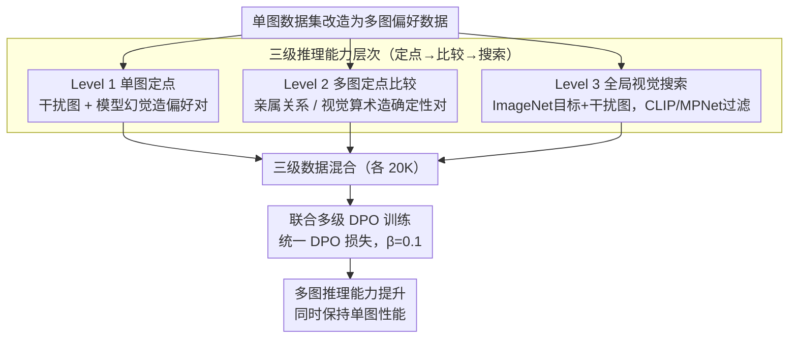

# S2H-DPO: Hardness-Aware Preference Optimization for Vision-Language Models

**会议**: ACL 2026  
**arXiv**: [2604.18512](https://arxiv.org/abs/2604.18512)  
**代码**: 无  
**领域**: 多模态VLM / 偏好对齐  
**关键词**: 多图推理, DPO偏好优化, 视觉搜索, 难度分级, VLM对齐

## 一句话总结

提出 Simple-to-Hard（S2H）DPO 框架，通过构建三个递进难度级别的多图偏好数据（定点推理→跨图比较→全局视觉搜索），系统性地提升 VLM 的多图推理能力，同时保持单图性能。

## 研究背景与动机

**领域现状**：VLM 在单图理解上取得了显著进步，但跨多张图片的有效推理仍具挑战。多图推理需要定位相关图像、比较和整合来自多个视觉源的信息。

**现有痛点**：现有多图对齐方法（如 MIA-DPO）主要关注"定点推理"——问题中预先指定了要看哪张图（如"看图3中的..."），绕开了全局视觉搜索和自主跨图比较这两个关键能力。这导致模型在更复杂的多图场景中表现不佳。

**核心矛盾**：MIA-DPO 仅用 Level 1 数据训练（单图定点问题），忽略了 Level 2（多图定点比较）和 Level 3（全局视觉搜索）的更高阶推理能力。不同级别的问题诱导质上不同的推理模式，低级别训练无法泛化到高级别。

**本文目标**：明确定义多图推理所需的能力层级，并构建覆盖所有级别的偏好数据来全面提升 VLM 的多图推理。

**切入角度**：定义三级能力层次——Level 1（对预指定的单张图推理）、Level 2（对预指定的多张图比较）、Level 3（自主搜索所有图并定位满足条件的图），构建对应的 chosen/rejected 对进行 DPO 训练。

**核心 idea**：通过提示驱动的复杂度（而非模型特定的幻觉）来创建 chosen/rejected 对，使数据集跨模型通用，且覆盖从简单到困难的完整推理能力谱。

## 方法详解

### 整体框架

S2H-DPO 的出发点是：多图推理不是单一能力，而是一条从“看指定图”到“自主搜遍所有图”的能力谱，而 MIA-DPO 只覆盖了最低一级。为此作者把现有单图数据改造成三个递进难度级别的多图偏好数据（每级各 20K 样本）——Level 1 用干扰图加模型幻觉造偏好对，Level 2 用亲属关系识别和视觉算术任务考查跨图比较，Level 3 用全局视觉搜索任务要求模型先搜遍所有图再定位目标——再把三级数据混在一起做标准 DPO 联合训练，让低阶到高阶的推理能力相互促进。

### 关键设计

**1. 三级推理能力层次定义：把多图推理拆成可覆盖的完整能力谱**

MIA-DPO 仅训练 Level 1 的问题之所以不够，是因为不同级别诱导的是质上不同的推理模式，低级别训练无法泛化到高级别。S2H-DPO 把多图推理显式切成三层，且每层严格要求比前一层更多的能力：Level 1（单图定点）如“图2中车是什么颜色？”，只需看指定图；Level 2（多图定点比较）如“图1和图3中的车颜色相同吗？”，需要跨图关联比较；Level 3（全局搜索）如“哪张图包含白色的车？”，需要检查所有图才能找到目标。有了这条层级，偏好数据才能成体系地覆盖从简单到困难的全部推理需求，而不是只在最容易的一档上反复优化。

**2. 通用的 Chosen/Rejected 构造方法：用任务难度而非模型缺陷制造对比**

MIA-DPO 依赖模型特定的幻觉来生成 rejected 样本，每换一个模型就得重新生成数据。S2H-DPO 改用提示驱动的复杂度，让对比来自任务设计本身：Level 1 仍用干扰图触发幻觉（与 MIA-DPO 一致）；Level 2 利用预有标签的数据集（亲属关系数据集、合成视觉算术）确定性地生成正确/错误对；Level 3 从 ImageNet 选目标概念图配上随机干扰图，chosen 是对目标图的准确描述，rejected 则是不指定目标的泛化描述，并用 CLIP/MPNet 的语义相似度过滤掉低质量对。这样产生的偏好对不挂靠任何具体模型的弱点，因此跨模型通用，也不会随模型能力提升而失效。

**3. 联合多级训练：让三级推理能力在同一目标下相互促进**

把三个级别的数据混合后，S2H-DPO 用标准 DPO 损失统一优化

$$L_{\text{DPO}} = -\mathbb{E}\Big[\log \sigma\big(\beta \log \tfrac{\pi_\theta(y_w|x)}{\pi_{\text{ref}}(y_w|x)} - \beta \log \tfrac{\pi_\theta(y_l|x)}{\pi_{\text{ref}}(y_l|x)}\big)\Big]$$

并在 LLaVA-v1.5-7B、Qwen2.5-VL-7B、Qwen3-VL-2B 上评估。消融实验表明联合训练优于只训练单一级别——不同级别的推理能力并非孤立，定点、比较、搜索之间存在互相增益，因此把它们放进同一个偏好优化目标比分别训练更划算。

### 损失函数 / 训练策略

标准 DPO 损失，温度 $\beta=0.1$，学习率 $5 \times 10^{-5}$，训练3个 epoch。每个级别20K样本。

## 实验关键数据

### 主实验

| 方法 | BLINK | MANTIS | NLVR2 | 多图平均 |
|------|-------|--------|-------|---------|
| LLaVA-v1.5 基线 | 37.1 | 41.9 | 52.1 | 43.7 |
| MIA-DPO | 42.9 | 44.2 | 54.2 | 47.1 |
| S2H-DPO | **43.4** | **47.9** | **55.6** | **49.0** |
| 提升 vs 基线 | +6.3 | +6.0 | +3.5 | +5.3 |

### 消融实验

| 配置 | 多图平均 | 单图平均 | 说明 |
|------|---------|---------|------|
| 仅 Level 1 | 47.1 | 保持 | 等同 MIA-DPO |
| 仅 Level 2 | 提升 | 保持 | 跨图比较有帮助 |
| 仅 Level 3 | 提升 | 保持 | 全局搜索最具挑战 |
| Level 1+2+3 | **49.0** | **保持** | 联合最优 |

### 关键发现

- S2H-DPO 在所有多图基准上均超越 MIA-DPO，尤其在更难的 Level 3 任务上优势更明显
- 联合训练三个级别优于仅训练任一级别，不同推理层次相互促进
- 关键优势：提升多图推理的同时完全保持单图推理性能（MMStar 和 POPE 无下降）
- 与 MIA-DPO 不同，S2H-DPO 的数据构造不依赖特定模型的幻觉，跨模型通用

## 亮点与洞察

- **"能力层级"的定义清晰且有说服力**：从定点→比较→搜索的递进层次，每个级别严格要求更多能力。这种系统化的任务分析框架可迁移到其他多模态推理场景
- **提示驱动 vs 幻觉驱动的对比设计**：前者通过任务难度产生自然对比，后者依赖模型特定缺陷。前者更通用且不会随模型改进而失效
- **保持单图性能的实际重要性**：多图提升不能以单图退化为代价，S2H-DPO 成功实现了两者兼顾

## 局限与展望

- 每个级别的特定任务设计（亲属识别、视觉算术）可能不够多样化
- Level 3 的 rejected 样本通过"不指定目标"产生，质量可能不稳定
- 仅在7B和2B模型上验证，更大模型效果未知
- 未考虑更多图像（>4张）的场景

## 相关工作与启发

- **vs MIA-DPO**: MIA-DPO 仅用 Level 1 数据且依赖模型幻觉，S2H-DPO 覆盖全部三个级别且数据构造模型无关
- **vs LLaVA-RLHF/HA-DPO**: 这些方法关注单图偏好对齐，S2H-DPO 专注于多图推理的层级式提升

## 评分

- 新颖性: ⭐⭐⭐⭐ 三级能力层次的定义有洞察力，但方法本身（DPO + 合成数据）不算新
- 实验充分度: ⭐⭐⭐⭐ 3个多图+2个单图基准，3个模型，消融充分
- 写作质量: ⭐⭐⭐⭐ 动机清晰，能力层次可视化好，但部分描述冗长

<!-- RELATED:START -->

## 相关论文

- [\[ACL 2026\] Mitigating Selection Bias in Large Language Models via Permutation-Aware GRPO](mitigating_selection_bias_in_large_language_models_via_permutation-aware_grpo.md)
- [\[ACL 2025\] LPOI: Listwise Preference Optimization for Vision Language Models](../../ACL2025/llm_alignment/lpoi_listwise_preference_optimization_for_vision_language_models.md)
- [\[ACL 2026\] ConsistRM: Improving Generative Reward Models via Consistency-Aware Self-Training](consistrm_improving_generative_reward_models_via_consistency-aware_self-training.md)
- [\[ICLR 2026\] Token-Importance Guided Direct Preference Optimization (TI-DPO)](../../ICLR2026/llm_alignment/token-importance_guided_direct_preference_optimization.md)
- [\[ICLR 2026\] Toward Universal and Transferable Jailbreak Attacks on Vision-Language Models (UltraBreak)](../../ICLR2026/llm_alignment/toward_universal_and_transferable_jailbreak_attacks_on_vision-language_models.md)

<!-- RELATED:END -->
