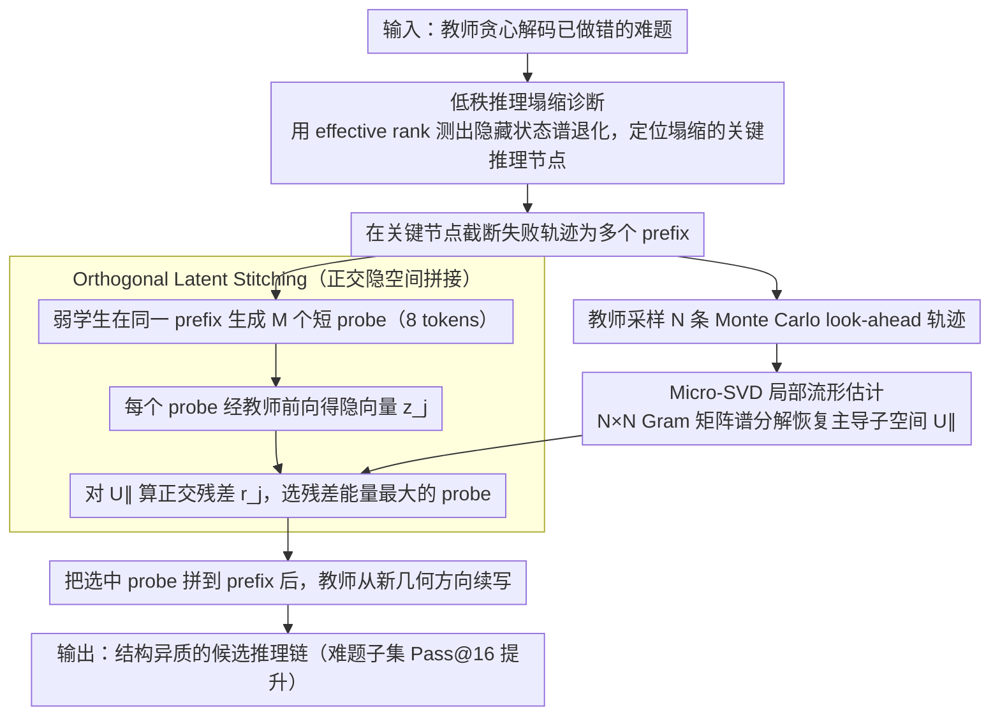

# Student Guides Teacher: Weak-to-Strong Inference via Spectral Orthogonal Exploration

**会议**: ACL 2026  
**arXiv**: [2601.06160](https://arxiv.org/abs/2601.06160)  
**代码**: https://github.com/dayuwang401/spectral-orthogonal-exploration  
**领域**: LLM 对齐 / 推理时搜索 / 数学推理  
**关键词**: Reasoning Collapse, Spectral Orthogonal Exploration, Weak-to-Strong, Micro-SVD, 推理时干预

## 一句话总结
本文把 LLM 在难题上反复沿同一错误逻辑采样的现象解释为隐藏状态低秩塌缩，并提出 Spectral Orthogonal Exploration (SOE)：用弱学生模型提供与教师当前 dominant subspace 正交的短 probe，迫使教师跳出原有 bias manifold，在 AIME/MATH/Olympiad 等难题子集上把 Pass@16 平均从 26.7% 提升到 45.9%。

## 研究背景与动机
**领域现状**：复杂数学、逻辑和代码生成任务通常依赖 self-consistency、高温采样、Best-of-N 或 PRM reranking 来提升推理成功率。这些方法的共同假设是：只要多采样，就能覆盖足够多不同推理路径。

**现有痛点**：难题上常出现 Reasoning Collapse：模型输出的文本看似不同，底层推理却高度同质，反复围绕同一个错误假设展开。此时提高 temperature 往往只增加词面扰动，不能真正探索到纠错方向。

**核心矛盾**：如果教师模型的隐藏状态已经集中到一个低维 bias manifold，那么标准采样只是在这个低维空间内随机游走；真正需要的是向正交补空间注入一个能改变后续注意力路由的信号。

**本文目标**：在不训练新模型、不改教师参数的前提下，设计一个推理时几何干预，让教师从已经塌缩的推理轨迹中跳出来，探索更异质的候选解。

**切入角度**：作者反转了 weak-to-strong 的常见用法。弱学生不是给教师提供正确答案或监督标签，而是作为结构异质的 orthogonal probe；它的价值来自和教师错误轨迹“不共线”，而不是绝对能力更强。

**核心 idea**：先用 Monte Carlo look-ahead + Micro-SVD 估计教师当前推理的主导子空间，再从学生生成的短 probe 中选出正交残差能量最大的候选，拼接到教师上下文中，让教师从新的几何方向继续采样。

## 方法详解

### 整体框架
SOE 要解决的是：教师模型在难题上反复沿同一错误逻辑采样，提高 temperature 只能换换词面、换不掉推理方向。它是一个纯推理时框架：输入一道教师 greedy decoding 已经做错的难题，把这条失败轨迹在关键推理节点截断成多个 prefix；对每个 prefix，教师生成若干条 Monte Carlo look-ahead 轨迹来估计当前的局部 bias manifold，同时让弱学生模型在同一 prefix 下生成固定 8 tokens 的短 candidate probe；系统把每个 probe 映射回教师隐藏空间，选出相对教师 dominant subspace 最正交的一个拼接到 prefix 后，输出是教师从一个全新几何方向续写出来的推理链。整个过程不训练、不改参数。

### 关键设计
**1. 低秩推理塌缩诊断：把"模型一直绕错路"变成可测量的谱退化**

Reasoning collapse 以往只能靠输出重复或过长来主观判断，SOE 把它落到隐藏空间的谱指标上。把推理链隐藏状态写成 $H_t=[h_1,h_2,\ldots,h_t]$，在滑动窗口内计算局部协方差 $\Sigma_t$，再用 effective rank $\mathrm{EffRank}(\Sigma_t)=\exp(-\sum_j \tilde{\sigma}_j\log \tilde{\sigma}_j)$ 衡量轨迹的有效维度。错误且冗长的推理链随生成推进会出现明显的 rank decay，说明状态越来越集中到低维 bias manifold。

这个诊断是后续干预的几何靶：reasoning collapse 不只是文本重复或长度超标，而是对应更底层的表示空间收缩。有了谱指标，"让教师跳出原轨迹"才有一个明确的几何目标。

**2. Micro-SVD 局部流形估计：用小矩阵谱分解换出 dominant subspace**

推理时方法必须足够轻量。在截断点 $t$，教师采样 $N$ 条 look-ahead 轨迹，聚合每条轨迹的隐藏状态 $h_i$ 并中心化组成矩阵 $H$。直接分解 $d\times d$ 协方差太贵，因此先构造 $N\times N$ Gram matrix $G=H^T H$，求其特征向量，再恢复出 top-$k$ principal components $U_{\parallel}$。

这里利用的是 look-ahead 样本数 $N$ 远小于隐藏维度 $d$ 这一事实，把原本庞大的高维谱分解转化成一个小矩阵问题，让推理时的几何诊断变得可操作。

**3. Orthogonal Latent Stitching：从弱学生候选中挑出最能推动教师的短探针**

弱学生生成候选集合 $\mathcal{C}_{Student}=\{s_1,\ldots,s_M\}$，每个候选经教师前向传播得到 latent vector $z_j$。用投影矩阵 $P_{\parallel}=U_{\parallel}U_{\parallel}^T$ 计算正交残差 $r_j=(I-P_{\parallel})(z_j-\hat{\mu})$，选择归一化残差能量 $\|r_j\|_2/(\|z_j-\hat{\mu}\|_2+\epsilon)$ 最大的候选拼到 prefix 后。

这里的克制之处在于：弱学生的短 probe 从不被当成最终答案，只作为几何扰动，负责把教师推出当前 bias manifold。这样既能利用弱学生结构上的异质性，又避免了弱学生本身的知识错误污染最终答案——它的价值来自和教师错误轨迹"不共线"，而不是绝对能力更强。

### 损失函数 / 训练策略
SOE 不训练教师或学生，也没有新的损失函数。实验中教师默认为 Qwen3-4B-Instruct-2507，学生默认为 Gemma-3-4B-IT；baseline 是教师在同一 prompt 下以 $T=0.7$ 做 self-consistency 采样。SOE 让学生以 $T=1.0$ 生成 8 个短 probe，教师后续采样仍使用 $T=0.7$，最大上下文长度为 8192 tokens。答案通过正则归一化和 MathEvaluator 抽取核验。

## 实验关键数据

### 主实验
主结果统计 difficult subset 上的 Pass@16，即教师 greedy decoding 已经失败的题目。

| 数据集 | Self-Consistency | SOE | 相对提升 |
|--------|------------------|-----|----------|
| AIME 2024 | 38.5% | 76.9% | +99.7% |
| AIME 2025 | 35.3% | 70.6% | +100.0% |
| MATH-500 | 33.7% | 45.9% | +36.2% |
| Olympiad Bench | 11.7% | 15.5% | +32.5% |
| Omni-Math (Hard) | 14.5% | 20.8% | +43.4% |
| Average | 26.7% | 45.9% | +62.4% |

与强 step-level Best-of-N + PRM baseline 对比，在采样位置和后续轨迹数匹配时 SOE 仍更强。

| 数据集 | PRM Best-of-N | SOE | 提升 |
|--------|---------------|-----|------|
| AIME 2024 | 69.23% | 76.90% | +11.08% |
| AIME 2025 | 58.82% | 70.60% | +20.03% |
| MATH-500 | 40.98% | 45.90% | +12.01% |

### 消融实验
论文通过 matched-control、随机 probe 和跨模型组合验证几何机制。

| 配置 / 现象 | 指标 | 说明 |
|-------------|------|------|
| Short & Correct traces | Effective-rank drop 4.82% | 正确短链谱退化最弱 |
| Short & Wrong traces | Effective-rank drop 19.65% | 错误本身就伴随明显 rank decay |
| Long & Correct traces | Effective-rank drop 13.14% | 长链有退化，但不如错误长链严重 |
| Long & Wrong traces | Effective-rank drop 27.04% | rank decay 与推理失败关系最强 |
| Random student probe | AIME 2025 58.82% | 外部异质信号已经有帮助 |
| SOE orthogonal probe | AIME 2025 70.59% | Micro-SVD 选择正交方向进一步提升 |

考虑 vLLM 下约 12.8% runtime overhead 后，SOE 在时间归一化采样效率上仍优于 self-consistency：AIME 2024 为 68.39% vs 42.86%，AIME 2025 为 63.83% vs 36.00%，MATH-500 为 39.57% vs 35.12%。跨模型实验中，Qwen3-4B 教师搭配 DeepSeek-R1-Distill-Qwen-7B 或 Mistral-7B 学生仍有效；Qwen3-8B/32B 作为教师时也继续提升。

### 关键发现
- Reasoning collapse 不只是输出冗长或重复，而是和隐藏状态 effective rank 下降高度相关；短错误轨迹也会明显 rank decay，说明它不是单纯 verbosity artifact。
- 随机学生 probe 已经能打断一部分错误轨迹，但按正交残差选择 probe 明显更强，证明几何选择不是装饰性模块。
- SOE 的收益不只是“多采几条然后挑最好”，因为在 matched PRM reranking 设置下仍有 11%-20% 相对提升。
- SOE 的平均采样效率提升明显，尤其适合生成语义多样的正确 reasoning traces，而不是得到大量同质 paraphrase。
- 初步逻辑和代码实验也有增益：ZebraLogic 从 56.23% 到 58.72%，HumanEvalPlus 从 10.00% 到 16.67%，但规模仍偏 preliminary。

## 亮点与洞察
- 这篇论文最巧妙的地方是重新定义“弱模型”的作用。弱学生不需要比教师聪明，它只需要和教师不一样；这种异质性在低秩塌缩场景中反而是资源。
- SOE 把 self-consistency 的弱点说清楚了：多样 token 不等于多样 reasoning manifold。这个洞察对代码生成也重要，因为许多错误程序只是同一种错误算法的变量名变体。
- Micro-SVD 是很实用的工程折中。直接做隐藏维度谱分解会很重，而从少量 look-ahead 样本恢复主方向，让推理时几何诊断变得可操作。
- Orthogonal Latent Stitching 的“短 probe + 教师续写”设计很克制：它不让弱学生主导答案，只用弱学生改变探索方向。

## 局限与展望
- 方法需要访问教师模型 hidden states，因此主要适用于 open-weight 模型，不能直接用于只有 API 的闭源 LLM。
- SOE 有额外推理开销，包括 look-ahead、embedding extraction、Micro-SVD 和 probe scoring；虽然单步约 12.8% overhead，但大规模部署仍需优化。
- 主实验以数学推理为中心，逻辑和代码生成只是初步验证，代码任务的规模和难度还不够充分。
- 论文把 collapse 和低秩谱退化联系起来，但因果关系仍需要更强的干预实验，例如控制 rank 而不改语义，或注入非学生来源的结构化正交向量。
- 学生 probe 的语言片段可能引入语义偏移，尤其在严格证明格式、代码语法或工具调用任务中，拼接边界需要更细控制。

## 相关工作与启发
- **vs Self-Consistency**: Self-consistency 依赖重复采样和投票，适合概率分布中已有正确路径的情况；SOE 针对正确路径被低秩 bias manifold 遮蔽的情况，用外部正交信号主动扩展探索空间。
- **vs Best-of-N / PRM**: PRM reranking 更像“在已有候选中挑好答案”，而 SOE 改变候选生成过程本身，所以能在 matched sampling 下超过 PRM。
- **vs weak-to-strong imitation**: 传统 weak-to-strong 让强模型学习弱监督标签，本文让弱模型作为结构异质 probe，价值来自 orthogonality 而不是 correctness。
- **对代码生成的启发**: 许多代码错误并非语法错误，而是陷入错误算法模板。SOE 可以用于在函数实现中途注入不同算法方向，例如从贪心转向 DP、从暴力枚举转向数学化推导。

## 评分
- 新颖性: ⭐⭐⭐⭐⭐ 用弱模型作为正交几何 probe 的设定很有辨识度，和常规推理时采样明显不同。
- 实验充分度: ⭐⭐⭐⭐ 数学实验扎实，跨模型和消融充分；代码智能部分仍偏 preliminary。
- 写作质量: ⭐⭐⭐⭐ 几何故事讲得清楚，图示直观，但部分理论论证还带假设性语言。
- 价值: ⭐⭐⭐⭐ 对 open-weight 推理时搜索很有启发，若扩展到代码和 agent 任务会更有应用价值。

<!-- RELATED:START -->

## 相关论文

- [\[AAAI 2026\] W2S-AlignTree: Weak-to-Strong Inference-Time Alignment for Large Language Models via Monte Carlo Tree Search](../../AAAI2026/llm_alignment/w2s-aligntree_weak-to-strong_inference-time_alignment_for_large_language_models_.md)
- [\[ACL 2026\] Debiasing Reward Models via Causally Motivated Inference-Time Intervention](debiasing_reward_models_via_causally_motivated_inference-time_intervention.md)
- [\[ICLR 2026\] General Exploratory Bonus for Optimistic Exploration in RLHF](../../ICLR2026/llm_alignment/general_exploratory_bonus_for_optimistic_exploration_in_rlhf.md)
- [\[NeurIPS 2025\] Inference-time Alignment in Continuous Space](../../NeurIPS2025/llm_alignment/inference-time_alignment_in_continuous_space.md)
- [\[NeurIPS 2025\] What Makes a Reward Model a Good Teacher? An Optimization Perspective](../../NeurIPS2025/llm_alignment/what_makes_a_reward_model_a_good_teacher_an_optimization_perspective.md)

<!-- RELATED:END -->
