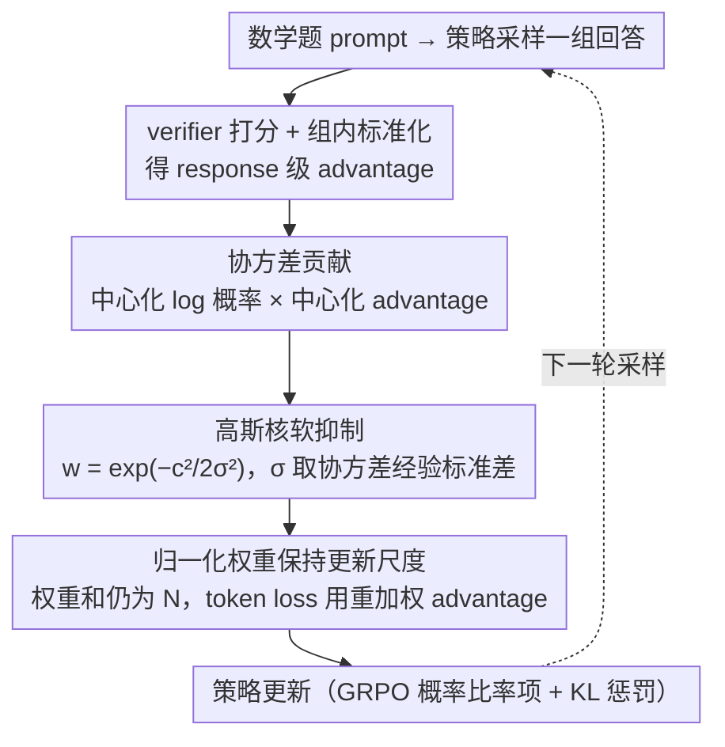

# Taming Extreme Tokens: Covariance-Aware GRPO with Gaussian-Kernel Advantage Reweighting

**会议**: ACL2026  
**arXiv**: [2605.11538](https://arxiv.org/abs/2605.11538)  
**代码**: 未公开  
**领域**: LLM对齐 / 强化学习后训练  
**关键词**: GRPO, 协方差重加权, 熵稳定, 数学推理, RLVR

## 一句话总结
这篇论文把 GRPO 训练中的熵不稳定归因于少量极端 token 的“log 概率-优势”协方差贡献，并用无额外超参的高斯核对这些 token 的 advantage 做软抑制，从而在 1.5B 和 7B 数学推理模型上稳定提升性能。

## 研究背景与动机
**领域现状**：在可验证奖励的推理训练中，GRPO 因为不需要额外 value model，已经成为 DeepSeek-R1 类模型后训练的常用方案。它通过同一 prompt 下多条回答的相对奖励来估计 advantage，再用 PPO 风格的概率比率更新策略。

**现有痛点**：GRPO 的问题不在于没有奖励，而在于更新时很容易在探索和利用之间摆动。利用过强会让模型过早确信某些次优推理模板，探索过强又会让训练熵剧烈波动，最终表现为后期 checkpoint 反而掉点。

**核心矛盾**：作者抓住了一个更细的机制：策略熵的变化与 token log 概率和 advantage 的协方差有关。也就是说，并不是所有 token 都同等影响探索-利用平衡，少数协方差绝对值很大的 token 会放大梯度方向，拖着整体策略熵走向不稳定。

**本文目标**：第一，量化 GRPO 训练中极端协方差 token 是否真实存在；第二，在不引入额外手调阈值的情况下抑制它们；第三，保持中等协方差 token 的有效学习信号，让模型既不熵塌缩也不过度发散。

**切入角度**：相比直接 clip advantage 或调 KL 系数，本文从 token 级协方差入手。这个角度的好处是它直接对应熵动力学，并且可以把“危险更新”定位到 token 级别，而不是粗暴地削弱整条 response 的奖励。

**核心 idea**：用经验协方差的标准差作为高斯核带宽，把协方差绝对值异常大的 token 更新软降权，同时保持 GRPO 原有目标和训练流程基本不变。

## 方法详解

### 整体框架
本文方法可以看成是在 GRPO 的 token 级 loss 中插入一个协方差感知的 advantage 重加权层。给定 prompt，策略模型采样一组回答，外部 verifier 给每条回答打分，GRPO 先按组内均值和标准差得到 response 级 advantage。随后，CW-GRPO 不直接把同一个 advantage 复制到每个 token，而是计算每个 token 的中心化 log 概率与中心化 advantage 的乘积，把它作为该 token 对熵变化的协方差贡献。协方差贡献越极端，说明这个 token 越可能把策略推向不稳定的探索或利用状态，于是用高斯核降低它的 advantage 权重；权重再归一化后保持整体更新尺度。最后，重加权后的 advantage 进入原来的概率比率项，KL 惩罚和整体训练框架保持兼容。

### 关键设计

**1. 用协方差解释 GRPO 的熵不稳定：把「忽高忽低的策略熵」落成一个可测的 token 级诊断量**

GRPO 的痛点不是没有奖励，而是训练后期策略熵剧烈摆动、checkpoint 反而掉点，但 vanilla GRPO 只看整条回答的相对好坏，分不清「有用的推理 token」和「把熵拽偏的极端 token」。作者借用自然策略梯度下的熵变化关系，近似得到 $\Delta H \approx -\eta\cdot \mathrm{Cov}_t(\log\pi_\theta(o_t), A_i)$：一个 token 的 log 概率越偏离均值、它所在 response 的 advantage 也越偏离均值，它对熵变化的拉动就越强。于是「探索-利用是否失衡」被翻译成每个 token 的协方差贡献——这比笼统地怪 KL 系数或学习率更贴近熵的真实动力学，也把「危险更新」精确定位到了 token 级别。

**2. 高斯核软抑制极端 token：自动给大协方差 token 降权，不让少数 outlier 主导更新**

诊断出极端 token 后，关键是怎么抑制它们又不误伤有用梯度。对每个 token 计算中心化乘积 $c_{i,t}=(\log\pi_\theta(o_{i,t})-\overline{\log\pi})(A_i-\overline{A})$ 作为协方差贡献，再用高斯核 $w_{i,t}=\exp(-c_{i,t}^2/(2\sigma^2))$ 算权重，其中带宽 $\sigma$ 直接取当前 batch 全体 token 协方差集合的经验标准差。中等协方差的 token 权重接近 1、几乎不受影响，而正负两端的极端 token 都被平滑压低。相比硬阈值或 clipping，高斯核是连续的、对正负极端对称的，并且因为带宽用经验标准差自适应，方法**不引入任何新的手调超参**，天然贴合不同 batch 的协方差尺度。

**3. 归一化权重保持 GRPO 更新尺度：改变 token 间的相对贡献，但不让整体 loss 被系统性缩小**

直接乘高斯权重会让平均权重小于 1，相当于偷偷调低了学习率，破坏 GRPO 原有的训练节奏。作者因此把权重归一化为 $\tilde{w}_{i,t}=w_{i,t}\cdot N/\sum_{j,k}w_{j,k}$（$N$ 为组内总 token 数），再把 token loss 里的 advantage 替换成 $\tilde{w}_{i,t}A_i$。这样所有 token 的权重之和仍为 $N$，方法的语义就从「整体降低学习率」变成「重新分配同一份梯度预算」——把预算从危险的 outlier 挪向更稳定的中等协方差 token，既稳住了熵又保住了 GRPO 的更新幅度和收敛速度。

### 损失函数 / 训练策略
训练仍然遵循 GRPO/RLVR 的基本流程：模型对每个数学题生成 12 条回答，用 verifier 给答案正确性打 0/1，并额外检查 `<think>` 标签格式；reward 经组内标准化后形成 advantage。实验使用 Open-RS 的 7000 道高质量数学题作为训练集，评测覆盖 AIME24、MATH-500、AMC23、Minerva 和 OlympiadBench。实现上使用 HuggingFace TRL 训练、Lighteval 评测，主要超参包括学习率 $1e-6$、batch size 12、gradient accumulation 4、训练 100 step、temperature 0.7、最大 completion 长度 4096。方法本身不额外引入阈值、clip 范围或温度类超参。

## 实验关键数据

### 主实验

| 模型与方法 | AIME24 | MATH-500 | AMC23 | Minerva | OlympiadBench | 平均 |
|------------|--------|----------|-------|---------|---------------|------|
| 1.5B Base | 28.8 | 82.8 | 62.9 | 26.5 | 43.3 | 48.9 |
| 1.5B GRPO | 33.3 | 85.0 | 67.5 | 27.2 | 49.9 | 52.6 |
| 1.5B Clip-Cov | 33.3 | 85.5 | 70.0 | 29.0 | 50.0 | 53.6 |
| 1.5B CW-GRPO | 30.0 | 87.0 | 77.5 | 29.8 | 52.0 | 55.3 |
| 7B Base | 3.3 | 82.6 | 47.5 | 33.1 | 40.4 | 41.4 |
| 7B GRPO | 10.0 | 82.2 | 55.0 | 33.1 | 40.3 | 44.1 |
| 7B Clip-Cov | 10.0 | 82.4 | 57.5 | 32.4 | 41.3 | 44.7 |
| 7B CW-GRPO | 13.3 | 82.8 | 62.5 | 32.0 | 42.7 | 46.7 |

CW-GRPO 在 1.5B 模型上平均分达到 55.3，比 vanilla GRPO 高 2.7 点，比 Clip-Cov 高 1.7 点；在 7B 模型上平均 46.7，比 GRPO 高 2.6 点。最明显的收益集中在 AMC23 和 OlympiadBench 这类对推理稳定性要求更高的集合上。

### 消融实验

| 方法 | 训练 step | MATH-500 | OlympiadBench | 现象 |
|------|-----------|----------|---------------|------|
| GRPO | 100 | 85.0 | 49.9 | 早期较好 |
| GRPO | 150（低熵） | 82.0 | 49.9 | 熵下降后 MATH 掉点 |
| GRPO | 200（高熵） | 79.8 | 47.8 | 熵反弹后继续退化 |
| CW-GRPO | 100 | 87.0 | 52.0 | 起点更高 |
| CW-GRPO | 150（低熵） | 86.2 | 53.9 | 熵波动时仍稳定 |
| CW-GRPO | 200（高熵） | 86.4 | 53.5 | 后期不崩 |

### 协方差分布分析

| 分位点 | 正协方差阈值 | 负协方差阈值 | 解读 |
|--------|--------------|--------------|------|
| 0.01% | 11.52 | -13.62 | 极少数 token 的贡献远超主体分布 |
| 1.00% | 3.32 | -3.34 | 前 1% 已经明显偏离 |
| 20.00% | 0.58 | -0.36 | 多数 token 处在温和区间 |
| 40.00% | 0.33 | -0.22 | 主体协方差很小 |
| 100.00% | 0.06 | -0.04 | 尾部主导整体协方差 |

### 关键发现
- 极端协方差确实存在，而且不是平均意义上的小噪声：前 0.01% token 的协方差量级比主体分布高一个数量级，足以解释为什么 vanilla GRPO 的熵曲线会被少量 token 拉偏。
- 稳定熵和下游性能高度相关：GRPO 在 step 100 后 MATH-500 从 85.0 掉到 79.8，而 CW-GRPO 基本维持在 86.2 到 87.0 区间。
- 该方法对 1.5B 和 7B 都有效，说明它不是某个小模型的偶然调参收益，而是更一般的 token 级更新稳定化技巧。

## 亮点与洞察
- 最大亮点是把 GRPO 的训练不稳定解释为 token 级协方差 outlier，而不是简单归因于 KL 系数、学习率或 reward 噪声。这个诊断更接近策略熵的实际动力学，也更容易设计局部修正。
- 高斯核重加权很克制：它不改变 reward model、不额外训练 value network，也不需要人工阈值。对工程实践来说，这种“插在 loss 里的稳定器”比重写 RL 流程更容易落地。
- 论文也提醒我们，response-level advantage 在长推理链里其实过于粗糙。即便奖励只在答案级别可验证，token 级统计仍然能帮助识别哪些更新会伤害探索-利用平衡。

## 局限与展望
- 实验规模只到 7B，且主要集中在数学推理。该机制在更大模型、更长上下文、多轮对话和偏开放式任务上的效果仍需要验证。
- 高斯核默认“协方差越极端越危险”，但在某些任务中，极端 token 也可能对应真正关键的突破性推理步骤。未来可以考虑把 correctness、position、reasoning step 类型结合进权重设计。
- 训练只评估了 100 到 200 step 左右的短程行为。更长训练中权重分布是否会出现新的退化模式，比如模型主动规避高协方差 token，还需要进一步监控。

## 相关工作与启发
- **vs GRPO**: GRPO 用组内相对奖励替代 value model，简单高效但缺乏 token 级稳定控制；本文保留 GRPO 框架，只在 advantage 进入 token loss 前做协方差感知重加权。
- **vs Clip-Cov**: Clip-Cov 同样关注协方差，但更接近硬限制极端值；CW-GRPO 用高斯核软衰减并以经验标准差自适应尺度，避免手动设定 clipping 边界。
- **vs KL/entropy regularization**: 常规做法从全局约束熵或 KL，容易同时压制有用探索；本文定位到具体 token 更新，提供了更细粒度的稳定化路径。
- **启发**: 这个思路可以迁移到偏好优化、代码生成 RL、工具调用 RL 中，尤其适合 reward 稀疏但 token 序列很长的场景：先找出哪些 token 统计量主导训练动态，再只对这些 outlier 做软调节。

## 评分
- 新颖性: ⭐⭐⭐⭐☆ 从熵-协方差关系推导 token 级重加权，想法清晰且比常规 GRPO 调参更有机制解释。
- 实验充分度: ⭐⭐⭐⭐☆ 两个模型规模、五个数学基准和熵/协方差分析都比较扎实，但任务域仍偏窄。
- 写作质量: ⭐⭐⭐⭐☆ 方法动机、公式和结果链条顺畅，表格也直接支撑核心论点。
- 价值: ⭐⭐⭐⭐☆ 对 RLVR 后训练很实用，尤其适合作为 GRPO 的低成本稳定增强模块。

<!-- RELATED:START -->

## 相关论文

- [\[ACL 2026\] Mitigating Selection Bias in Large Language Models via Permutation-Aware GRPO](mitigating_selection_bias_in_large_language_models_via_permutation-aware_grpo.md)
- [\[ICML 2026\] UDM-GRPO: 统一离散扩散模型的稳定高效 GRPO](../../ICML2026/llm_alignment/udm-grpo_stable_and_efficient_group_relative_policy_optimization_for_uniform_dis.md)
- [\[NeurIPS 2025\] DeepVideo-R1: Video Reinforcement Fine-Tuning via Difficulty-aware Regressive GRPO](../../NeurIPS2025/llm_alignment/deepvideor1_video_reinforcement_finetuning_via_difficultyawa.md)
- [\[ACL 2026\] MDP-GRPO: Stabilized Group Relative Policy Optimization for Multi-Constraint Instruction Following](mdp-grpo_stabilized_group_relative_policy_optimization_for_multi-constraint_inst.md)
- [\[ICLR 2026\] No Prompt Left Behind: Exploiting Zero-Variance Prompts in LLM Reinforcement Learning via Entropy-Guided Advantage Shaping](../../ICLR2026/llm_alignment/no_prompt_left_behind_exploiting_zero-variance_prompts_in_llm_reinforcement_lear.md)

<!-- RELATED:END -->
