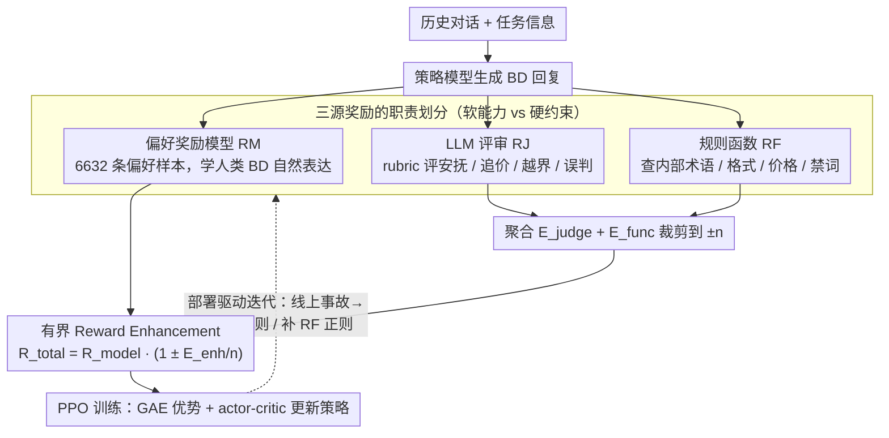

# Teaching LLM to be Persuasive: Reward-Enhanced Policy Optimization for Alignment from Heterogeneous Rewards

**会议**: ACL2026  
**arXiv**: [2510.04214](https://arxiv.org/abs/2510.04214)  
**代码**: 无  
**领域**: 任务型对话 / 对齐RLHF / 工业智能体  
**关键词**: 说服式对话, 多源奖励, PPO, 商务谈判, 规则约束

## 一句话总结
这篇论文面向在线旅游平台的酒店降价谈判场景，提出 REPO 用偏好奖励模型、LLM 评审和规则函数三类奖励共同训练 Qwen3-32B，使模型在专家评价和 9653 场真实 A/B 对话中同时提升说服力、SOP 合规和坏例修复质量。

## 研究背景与动机
**领域现状**：任务型对话系统已经从传统意图识别和槽位填充走向 LLM 驱动的多轮智能体。对于客服、订票、运营外呼等业务，LLM 的自然语言能力能显著改善流畅度和泛化性，但真实上线时仍要遵守 SOP、边界规则和业务指标。

**现有痛点**：本文场景是在线旅游平台 OTA 的价格追价外呼。BD agent 需要说服酒店管理者降低房价，同时不能夸大承诺、不能泄露内部工单术语、不能混淆售价和到手价，还要按多阶段 SOP 推进。单一 SFT 容易学成僵硬脚本，DPO 受偏好数据覆盖面限制，普通 PPO / GRPO 如果 reward 设计单薄，则可能 reward hacking 或破坏合规性。

**核心矛盾**：说服式商务对话既有可验证约束，也有难以形式化的软能力。数字、格式、禁词可以用规则检查，但“安抚情绪”“顺滑接话”“把降价和曝光/转化联系起来”很难靠正则表达；反过来，只有 LLM judge 或 preference RM 又很难稳定处理价格数值和内部术语泄露。

**本文目标**：作者希望构造一个能快速上线迭代的 RL post-training 框架，让 reward 既保留人类偏好的主方向，又能通过 prompt rubric 和规则快速注入业务专家发现的新问题。

**切入角度**：论文把 reward 分成三种互补来源：RM 提供密集的人类偏好信号，RJ 用 LLM-as-a-judge 评价情绪价值、SOP 和谈判策略，RF 用规则函数检查数值、格式和 guardrail。REPO 的关键不是简单相加，而是让 RJ/RF 作为有界增强项去调制 RM。

**核心 idea**：以偏好奖励模型为主信号，把 LLM judge 与规则函数聚合裁剪后作为有界 multiplier，对 RM 奖励进行符号敏感的放大或削弱，从而在稳定 RL 训练中注入业务约束和说服式行为偏好。

## 方法详解
REPO 面向的是一个非常具体但很有代表性的工业对话任务：平台 BD 主动联系酒店，围绕一个或多个 chase ticket 进行降价谈判。模型必须根据对方回复判断当前 SOP 阶段，报价时区分售价和到手价，在对方给出可接受价格时停止纠缠，在对方沉默时不能误判为同意，还要避免“工单”“目标价”等内部术语。

### 整体框架
给定一段历史对话和任务信息，policy model 生成下一句 BD 回复。该回复同时送入三类 reward 组件。Reward Model 根据偏好数据给出人类偏好对齐分数；Reward Judge 按任务 rubric 评价情绪价值、对话风格、SOP 合规、谈判推进和越界行为；Reward Function 用正则或确定性规则检查格式、混合语言、链路泄露、禁词、重复话术、输出过长和价格约束。

三类信号被整合成总 reward 后用于 RL 训练。论文图中沿用 PPO 式 actor-critic 流程：policy model 生成输出，value model 估计状态价值，reward 通过 GAE 形成 advantage，再更新策略。作者强调所有 RL baseline 使用相同 LoRA 配置、训练预算和超参数，因此收益主要来自 reward 设计。

### 关键设计

**1. 三源奖励的职责划分：把软能力和硬约束拆给最擅长的奖励源**

酒店价格谈判里，“像优秀 BD 一样安抚情绪、顺滑接话”这种软能力和“不泄露内部术语、不混淆售价与到手价”这种硬约束是混在一起的；如果全交给一个奖励模型，软的会受偏好数据覆盖面拖累，硬的又很难被偏好信号稳定捕捉。REPO 因此把奖励拆成互补的三路：RM 由 6632 条高质量偏好样本训练（覆盖线上 case、语言专家标注、人类 BD 标注和 SOP 路径样本），负责学人类 BD 的自然表达与整体偏好；RJ 是 LLM 评审器，按一份可编辑 rubric 扣分，专门盯安抚、继续追价、越界承诺、重复确认、无响应误判这些难以正则化的复杂行为；RF 是规则函数，用确定性检查快速抓内部术语、格式破坏、CoT 泄露、混合语言、输出过长等硬错误。这样分工的好处是各取所长——RM 学“怎么说得像人”，RJ/RF 守“别犯业务硬错”，而且任何一路出问题都能单独修，不会牵连其他两路。

**2. 有界的 Reward Enhancement：让 RJ/RF 调制 RM，而不是和它线性相加**

多源奖励最常见的翻车方式是简单相加：某条规则分数尺度一大，就会把偏好模型的主方向压垮，训练随之震荡甚至 reward hacking。REPO 的做法是让 RM 当主信号、RJ/RF 当有界乘子。它先把 judge 分数和规则分数聚合为 $E_{judge}+E_{func}$，裁剪到 $[-n,n]$ 得到 $E_{enh}$（实验取 $n=100$），再写成

$$R_{total}=R_{model}\left(1 \pm \frac{E_{enh}}{n}\right)$$

符号敏感地放大或削弱 RM：RM 为正且辅助信号也正则奖励被放大，RM 为正但辅助信号负则奖励被削弱，RM 为负且辅助信号负则惩罚被放大，RM 为负但辅助信号正则惩罚被缓和。因为辅助项被限定在 $\pm 1$ 倍的调制范围内，业务补丁只能“微调”而不能“改写”策略主方向，既保住了 RM 的主导地位，又让规则和 judge 在尺度、更新频率都不同的情况下稳定生效。

**3. 部署驱动的快速迭代闭环：把线上事故直接变成可审计的奖励补丁**

工业对话的约束会随业务流程变化，而重新收集大规模偏好数据通常跟不上节奏。REPO 把 reward engineering 做成一个工程接口：线上一旦发现模型在多工单对话里只处理一个房型、或泄露“work-order”等内部词，团队不必重标数据，只要在 RJ prompt 里加一条扣分规则、或补一条 RF 正则，就能继续 RL 训练。RM 始终提供人类偏好的底座，RJ/RF 负责针对新错误类型打补丁，使得每一次线上修复都是可审计、可快速回滚的代码改动，而不是一轮漫长的数据采集。

### 损失函数 / 训练策略
主模型是 Qwen3-32B-Instruct，最大回复长度 512，batch size 128。LoRA rank 为 64，LoRA alpha 为 64，学习率 $10^{-6}$，warmup steps 为 2。SFT 和 DPO 训练 10 个 epoch，PPO、GRPO 和 REPO 训练 2 个 epoch，并报告最佳 checkpoint。

训练数据共 6632 条偏好样本，其中 252 条来自线上生产并由业务专家收集，3178 条由语言专家标注，1211 条由任务专家即人类 BD 标注，1991 条原本是覆盖完整 SOP 路径的 SFT 样本后续被 BD 扩展为偏好数据。评测包含 30 段线上完整对话约 240 轮，以及 45 段业务专家整理的坏例约 360 轮。

## 实验关键数据

### 主实验
专家共识评测由任务专家、语言学专家和计算机科学专家三方完成。在线测试集关注整体对话评分和是否出现至少一个优秀回复，坏例集关注修复率和干净修复比例。

| 方法 | 在线对话评分 | 至少一个优秀回复占比 | 坏例修复率 | 干净修复占比 | 主要结论 |
|------|--------------|----------------------|------------|--------------|----------|
| Base | 3.43 | 13.33% | 未作为主坏例修复对照 | 未报告 | 原始模型说服能力弱 |
| SFT | 未在摘要中给出 | 未在摘要中给出 | 93.33% | 31.11% | 覆盖很多坏例，但修复质量较粗糙 |
| DPO | 3.80 | 33.33% | 93.33% | 40.00% | 比 SFT 稳，但优秀回复比例不高 |
| PPO | 低于有效基线 | 低于有效基线 | 86.66% | 33.33% | vanilla PPO 会退化在线指标 |
| GRPO | 4.30 | 43.33% | 71.10% | 44.44% | 对话质量不错，但坏例覆盖不足 |
| REPO | 4.63 | 66.67% | 93.33% | 75.56% | 评分、优秀回复和干净修复同时最好 |

生产 A/B 测试只比较 REPO 与已上线的意图驱动对话系统，因为其他端到端 post-trained 模型未满足上线稳定性和合规要求。

| 线上指标 | 生产意图系统 | REPO | 提升 | 显著性 | 解释 |
|----------|--------------|------|------|--------|------|
| 样本规模 | 9653 场真实对话 | 9653 场真实对话 | - | - | 真实客户/酒店对话流量 |
| 回复率 | 46.72% | 58.86% | +12.14 pp | p < 0.001 | 代理首句后酒店愿意回应，反映自然度和接受度 |
| 任务成功率 | 19.32% | 25.26% | +5.94 pp | p < 0.001 | 工单级成功谈成降价，反映说服效果 |
| 人类 BD 可比性 | 未说明 | 约 25% 成功率接近人类 BD | - | - | 说明收益不是离线指标幻觉 |

### 消融实验
论文没有给传统 ablation 表逐项拆除 RM/RJ/RF，但通过坏例分布、训练过程和细粒度技能评估展示了 REPO 的收益来源。

| 分析项目 | 结果 | 说明 |
|----------|------|------|
| 坏例严重未解决 | REPO、PPO、SFT 为 0；GRPO 为 4.44%，DPO 为 2.22% | REPO 在保持高修复率的同时避免严重残留错误 |
| 重大问题修复 | REPO 4.44%，GRPO 13.33%，DPO/PPO 31.11%，SFT 42.22% | REPO 的修复更干净，不只是把错误从一种换成另一种 |
| 训练中谈判能力 | DeepSeek-R1 评估 20 个 held-out 对话，后期 checkpoint 提升约 +14 分，约 30% | 多源奖励推动了超出训练 gold 的谈判策略 |
| 细粒度技能 | REPO 在在线集和坏例集上谈判有效性领先，坏例集领先约 16 pp | reward 不只是提高流畅度，也提升了业务目标达成 |

### 关键发现
- REPO 的突出优势不是单纯“修更多坏例”，因为 SFT 和 DPO 的坏例修复率也到 93.33%；真正差异在干净修复率，REPO 达 75.56%，说明它更少引入新问题。
- PPO 在该任务上出现退化，说明强化学习本身不是保证收益的按钮。没有稳定、可控的 reward 组合，RL 可能破坏对话质量。
- GRPO 在线评分较高但坏例修复率只有 71.10%，表明 group reward 或相对优化不一定适合强业务约束场景，尤其当错例分布和线上分布不同。
- 线上 A/B 是论文最有说服力的部分：REPO 不是只在 LLM judge 上更高，而是在真实 9653 场对话中提高回复率和工单成功率。

## 亮点与洞察
- 这篇论文最大的价值在于把 reward engineering 写得很工业化。很多 RLHF 论文只比较离线 benchmark，而这里清楚展示了真实业务中“人类偏好、LLM rubric、规则补丁”如何一起工作。
- REPO 的乘法式增强比简单加权求和更稳。它保留 RM 的主导地位，又允许 RJ/RF 对正负奖励做符号敏感修正，适合多源奖励尺度不同、更新频率不同的场景。
- 任务定义很具体，却揭示了对话 agent 的普遍难点：既要会说服，又要守规则；既要处理软性情绪，又要不犯数字和流程硬错。
- 附录里的 prompt 和奖励映射非常实用。它把“酒店无响应不能当同意”“商家报价低于目标价应立即接受”“不能泄露内部工单词”等规则写成可检查项，为其他企业级 agent 提供了模板。

## 局限与展望
- 实验集中在 OTA 酒店价格谈判，任务窄但很真实；REPO 是否能直接迁移到售后、金融、医疗咨询或跨语言商务谈判，还需要更大范围验证。
- 论文没有完整公开逐项去掉 RM / RJ / RF 的数值消融，因此三源奖励各自贡献的精确比例不够清楚。
- RJ 依赖 LLM-as-a-judge，本身可能有偏差，也可能受 prompt 改写影响。虽然线上 A/B 支撑了最终效果，但 reward judge 的稳定性仍需长期监控。
- 线上数据和原始业务 prompt 做了脱敏，外部研究者较难复现实验。未来可以构建公开的约束型谈判 benchmark，降低验证门槛。

## 相关工作与启发
- **vs SFT**: SFT 稳定但只能模仿已有脚本，容易学到固定话术。REPO 能在 reward 引导下产生比 gold 更丰富的情绪价值和竞品对比论证。
- **vs DPO**: DPO 依赖偏好对，计算高效但上限受数据覆盖限制。REPO 通过 RJ/RF 把专家规则和上线事故直接变成 reward，迭代速度更快。
- **vs PPO / GRPO**: PPO 和 GRPO 是优化算法，REPO 的核心贡献在 reward 组合。实验说明在强约束对话中，reward 设计比换一种 RL 算法更关键。
- **vs 传统意图驱动对话系统**: 意图系统稳定可控，但难以做自然说服和长程适应。REPO 保留 LLM 的灵活语言能力，同时用规则和 judge 补上合规控制。

## 评分
- 新颖性: ⭐⭐⭐⭐☆ 三源奖励并非每个组件都新，但有界增强机制和部署驱动迭代闭环很贴近工业痛点。
- 实验充分度: ⭐⭐⭐⭐☆ 有专家评测、坏例集和真实 A/B；缺少逐项移除奖励源的精确消融。
- 写作质量: ⭐⭐⭐⭐☆ 任务背景和实验结果清楚，附录 prompt 丰富；部分图表数值没有完整表格化呈现。
- 价值: ⭐⭐⭐⭐⭐ 对企业级任务型对话、销售 agent 和约束型 RLHF 很有参考价值，尤其是 reward 设计流程。

<!-- RELATED:START -->

## 相关论文

- [\[ACL 2026\] Topology-Enhanced Alignment for Large Language Models: Trajectory Topology Loss and Topological Preference Optimization](topology-enhanced_alignment_for_large_language_models_trajectory_topology_loss_a.md)
- [\[ACL 2025\] Probability-Consistent Preference Optimization for Enhanced LLM Reasoning](../../ACL2025/llm_alignment/probability-consistent_preference_optimization_for_enhanced_llm_reasoning.md)
- [\[ACL 2025\] Teaching an Old LLM Secure Coding: Localized Preference Optimization on Distilled Preferences](../../ACL2025/llm_alignment/teaching_an_old_llm_secure_coding.md)
- [\[ACL 2026\] MDP-GRPO: Stabilized Group Relative Policy Optimization for Multi-Constraint Instruction Following](mdp-grpo_stabilized_group_relative_policy_optimization_for_multi-constraint_inst.md)
- [\[ACL 2026\] Pref-CTRL: Preference Driven LLM Alignment using Representation Editing](pref-ctrl_preference_driven_llm_alignment_using_representation_editing.md)

<!-- RELATED:END -->
