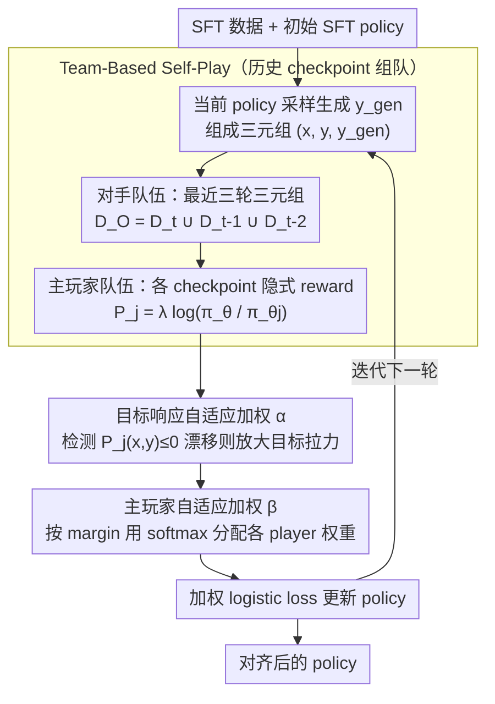

# Team-Based Self-Play With Dual Adaptive Weighting for Fine-Tuning LLMs

**会议**: ACL 2026  
**arXiv**: [2605.09922](https://arxiv.org/abs/2605.09922)  
**代码**: https://github.com/lab-klc/TPAW  
**领域**: 自监督 / LLM 对齐  
**关键词**: 自博弈微调、历史 checkpoint、偏好优化、自适应加权、LLM 对齐

## 一句话总结
TPAW 将 LLM 自训练改造成“当前模型与历史模型组队博弈”的对齐过程，并用目标响应权重与主玩家权重两套自适应机制稳定偏好优化，在不额外引入人工偏好标注的情况下提升 Open LLM Leaderboard 与 GSM8K 表现。

## 研究背景与动机
**领域现状**：LLM 对齐通常依赖 SFT、RLHF 或 DPO。SFT 需要高质量示范数据，RLHF 需要奖励模型和人工偏好，DPO 虽然省掉显式奖励模型，但仍然需要偏好对。为了降低人工标注成本，SPIN 等 self-play / self-training 方法开始利用已有 SFT 数据，让模型把人类答案视为正样本、把自己生成的答案视为负样本，迭代提升对齐质量。

**现有痛点**：这类自训练方法主要看“当前模型”的生成质量，历史训练轨迹利用不足。一旦某一轮生成样本有偏差，后续迭代容易继续放大错误。另一个更隐蔽的问题是，DPO 式目标同时推正样本、压负样本，但在自训练后期，模型生成答案和目标答案越来越接近，正负样本间隔变小，训练信号变噪；论文还观察到目标响应概率本身会下降，导致模型偏离 SFT 目标分布。

**核心矛盾**：自训练想用模型自身生成的数据替代人工偏好，但又必须避免“只和当前自己比较”带来的不稳定、偏差累积和目标分布漂移。换句话说，模型既要从历史版本中获得更丰富的对手，又不能让早期较弱 checkpoint 的噪声压过当前学习。

**本文目标**：作者希望在完全自监督的设定下，用同一份 SFT 数据继续挖掘对齐收益；具体要解决三个子问题：如何利用历史 checkpoint，如何防止目标响应 reward 下降，如何让不同历史玩家在每个样本上贡献合适的训练权重。

**切入角度**：论文把 self-play 改写成两个队伍之间的竞争：opponent team 负责生成越来越像人类答案的负样本，main player team 负责区分 SFT 目标响应和模型生成响应。历史 checkpoint 同时进入对手队伍和主玩家队伍，使训练过程不再只依赖当前模型的一次判断。

**核心 idea**：用“历史 checkpoint 组队 + 双重自适应加权”替代单模型自博弈，让 LLM 在同一份 SFT 数据上进行更稳定的数据高效对齐。

## 方法详解
TPAW 的直觉很像把单人训练赛变成队伍赛。普通 SPIN 只让当前模型生成负样本，再训练当前模型区分人类答案和自己答案；TPAW 则保留最近几轮模型，让它们共同构成对手和裁判。这样做有两个好处：第一，负样本来自训练轨迹中的多个阶段，不会只反映当前模型的一种错误模式；第二，隐式 reward 由当前模型和历史模型的相对概率给出，可以衡量“当前策略相对某个历史策略是否更偏向目标答案”。

### 整体框架
输入是一份 SFT 数据集 $D_{SFT}=\{(x_i,y_i)\}$ 和一个初始 SFT policy $\pi_{\theta_0}$。在第 $t+1$ 轮，当前 policy $\pi_{\theta_t}$ 先对 SFT prompt $x_i$ 采样生成 $y_i^{gen}$，并和原始目标答案 $y_i$ 组成三元组 $(x_i,y_i,y_i^{gen})$。论文只保留最近三轮三元组，构成 opponent dataset $D_O=D_t\cup D_{t-1}\cup D_{t-2}$。

接着，TPAW 为最近三个 checkpoint 构造 main players。每个 player $P_j$ 使用当前模型与历史模型 $\pi_{\theta_j}$ 的 log 概率比作为隐式 reward：$P_j(x,y)=\lambda\log \frac{\pi_\theta(y|x)}{\pi_{\theta_j}(y|x)}$。如果一个目标答案更接近当前模型的目标分布，player 应该给它更高分；如果一个模型生成答案更像偏离目标的响应，player 应该给它更低分。训练目标就是让每个 player 拉大 $P_j(x,y)-P_j(x,y^{gen})$ 的间隔。

最后，TPAW 不直接平均所有 player 的 loss，而是先对目标响应做权重 $\alpha$，再对不同 player 做权重 $\beta$，用加权 logistic loss 更新 policy。迭代若干轮后得到最终 aligned policy。

### 关键设计

**1. Team-Based Self-Play 框架：用历史 checkpoint 组队，替代只和当前自己比较**

普通 SPIN 只让当前模型生成负样本、再训练当前模型去区分人类答案和自己答案，问题是一旦某一轮合成数据有偏差，后续迭代会顺着同一种错误模式越滚越大。TPAW 把单人训练赛改成队伍赛：保留最近三个历史 checkpoint，让它们既组成 opponent team（在 SFT prompt 上生成负样本），又组成 main player team（判断目标答案与生成答案的相对优劣），训练数据则取最近三轮三元组 $D_O=D_t\cup D_{t-1}\cup D_{t-2}$。这样负样本来自训练轨迹的多个阶段，不会被当前模型的单一错误模式主导；而历史 checkpoint 记录的“从弱到强”轨迹本身就是一份廉价监督，能给优化提供比单模型更丰富的对比分布，缓解自训练里常见的偏差累积。

**2. Adaptive Target Response Weighting：发现目标分布漂移时，把训练重心拉回真实答案**

DPO 式自训练有个隐蔽副作用——它同时推正样本、压负样本，到后期连目标答案的概率也一起下降，模型悄悄偏离 SFT 目标分布。TPAW 用一个按样本触发的权重 $\alpha$ 来纠偏：如果某个 player 给出 $P_j(x,y)\le 0$，意味着当前模型相对历史模型并没有更偏好目标答案（即出现了漂移迹象），就把该目标响应的权重设为 $\eta>1$（实用值 $\eta=6$），否则保持为 1。于是这一项的比较从 $P_j(x,y)$ 对 $P_j(x,y^{gen})$ 变成 $\alpha_j P_j(x,y)$ 对 $P_j(x,y^{gen})$——只在检测到目标 reward 走低时才额外放大对真实答案的拉力，相当于给训练装了一个“偏离即回正”的负反馈。

**3. Adaptive Main Player Weighting：按判别难度动态分配各 checkpoint 的训练贡献**

最近的 checkpoint 可能还没训够、判别力弱，较早的 checkpoint 又可能在对应分布上过拟合，简单平均所有 player 的 loss 会把学习预算浪费在那些已经分得很开的样本上。TPAW 先对每个 player 算出 margin $m_j=P_j(x,y)-P_j(x,y^{gen})$，再用 softmax 形式分配权重

$$\beta_j=\frac{e^{-\gamma m_j}}{\sum_k e^{-\gamma m_k}}$$

（实用值 $\gamma=0.5$）。margin 越小说明这个 player 越分不清正负样本，对应权重就越大，于是优化会自动把注意力压到那些“当前最薄弱的判断”上。比起静态平均，这种按样本、按 player 的动态加权能让多 checkpoint 的收益真正落到刀刃上，而不是被强 player 稀释。

### 损失函数 / 训练策略
TPAW 使用 logistic loss $\ell(t)=\log(1+\exp(-t))$，对每个 player 优化 $\ell(\alpha_j P_j(x,y)-P_j(x,y^{gen}))$，再用 $\beta_j$ 汇总成队伍级目标。实验中 opponent/main player 默认使用最近三轮 checkpoint；超参数分析给出的实用设置是 $\eta=6$、$\gamma=0.5$。第 0 轮没有历史模型时跳过缺失项，第 1 轮只使用可用的两个 checkpoint，之后进入完整三玩家队伍训练。

## 实验关键数据

### 主实验
论文在 Qwen2.5-1.5B 和 Llama3.1-8B 上实验。SFT 使用 Ultrachat200k，TPAW/SPIN 使用其中 50k 子集；评测覆盖 Open LLM Leaderboard V1/V2 的 12 个 benchmark。下表摘取各方法在平均分上的代表性最好迭代。

| 基座模型 | 方法 | V1 Avg. | V2 Avg. | 备注 |
|----------|------|---------|---------|------|
| Qwen2.5-1.5B | SFT | 56.28 | 13.40 | 全量 Ultrachat200k SFT |
| Qwen2.5-1.5B | DPO | 58.55 | 13.50 | 使用 UltraFeedback 偏好数据 |
| Qwen2.5-1.5B | SPIN best | 57.61 | 14.34 | V1 最好为 iter-4，V2 最好为 iter-3 |
| Qwen2.5-1.5B | TPAW best | 57.76 | 14.82 | V1 最好为 iter-4，V2 最好为 iter-3 |
| Llama3.1-8B | SFT | 63.93 | 17.69 | 初始对齐模型 |
| Llama3.1-8B | DPO | 64.79 | 17.91 | 额外偏好数据基线 |
| Llama3.1-8B | SPIN best | 64.88 | 19.68 | V1 最好为 iter-4，V2 最好为 iter-1 |
| Llama3.1-8B | TPAW best | 66.14 | 20.84 | V1 最好为 iter-3，V2 最好为 iter-4 |

在具体 benchmark 上，TPAW 的收益不只来自平均分。论文报告 Qwen 上 IFEval 最高提升 4.37、Math 提升 3.55、GSM8K 提升 3.79；Llama 上 Arc 提升 4.79、IFEval 提升 8.78、MUSR 提升 4.45。考虑到 TPAW 没有使用额外人工偏好数据，这个结果主要说明它更充分地榨出了已有 SFT 数据的训练信号。

| GSM8K 训练设置 | Accuracy | 相对 Qwen2.5-1.5B-SFT 提升 | 趋势 |
|----------------|----------|-----------------------------|------|
| Qwen2.5-1.5B-SFT | 51.25 | - | 初始模型 |
| SPIN-gsm8k iter-1 | 53.75 | +2.50 | 有明显收益 |
| SPIN-gsm8k iter-2 | 54.36 | +3.11 | 继续提升 |
| SPIN-gsm8k iter-4 | 54.59 | +3.34 | 后期接近平台 |
| TPAW-gsm8k iter-1 | 54.21 | +2.96 | 起步略优于 SPIN iter-1 |
| TPAW-gsm8k iter-3 | 56.56 | +5.31 | 第三轮拉开差距 |
| TPAW-gsm8k iter-4 | 56.94 | +5.69 | 最终最佳 |

### 消融实验
论文在 GSM8K 上去掉三个关键组件：目标响应权重、主玩家权重、队伍机制。图 3 给出四轮曲线，正文未列出逐点数值，但定性结论很清楚：去掉 team-based mechanism 掉点最大，去掉两类 adaptive weighting 都会阻止模型收敛到完整 TPAW 的最优表现。

| 消融配置 | 被移除的部分 | 观察到的影响 | 解释 |
|----------|--------------|--------------|------|
| w/o TRW | 目标响应自适应权重 $\alpha$ | 目标 reward 更容易持续为负，最终低于完整 TPAW | 模型没有被显式拉回 SFT 目标分布 |
| w/o MPW | 主玩家自适应权重 $\beta$ | 多 checkpoint 的收益下降 | 静态平均无法把权重放到判别困难的 player 上 |
| w/o Team | 历史 checkpoint 队伍 | 掉点最明显 | 训练退化为接近单模型 self-play，历史轨迹利用不足 |

### 关键发现
- Team-based 设计是主要增益来源。它不仅带来更丰富的负样本，还把历史模型作为隐式 reward 参照，避免当前模型在自训练循环里自我确认。
- Adaptive Target Response Weighting 直接针对“正样本概率也下降”的 DPO 式副作用。图 2 显示，不使用该机制时目标响应 reward 会持续处在负区间，而 TPAW 能让 reward 上升并收敛到正值。
- 单纯增加 SFT epoch 并不能替代 TPAW。论文的 SFT 多 epoch 分析显示继续训练更像记忆数据，不能带来相同泛化收益；TPAW 则能在同一数据上突破 SFT 的性能上限。

## 亮点与洞察
- 把历史 checkpoint 变成“队伍成员”很自然，也很可复用。许多迭代式自训练方法都只保留最终模型，但这篇论文说明训练轨迹本身是一种廉价监督信号。
- 双重加权的设计分别对应两个故障模式：$\alpha$ 防止目标分布漂移，$\beta$ 防止多玩家平均稀释薄弱环节。它不是简单调 loss 权重，而是把自训练过程中“哪里不稳”显式编码进优化目标。
- 这篇文章对 SFT 数据再利用的讨论很有启发：同一份示范数据不只能做一次 imitation，还可以通过模型自身生成的 contrastive response 反复形成偏好信号。

## 局限与展望
- TPAW 的上限仍然受 SFT 数据质量约束。如果 SFT 数据本身有偏见或答案质量参差，team-based self-play 只能更充分地拟合它，不能自动纠正目标分布。
- 实验主要覆盖通用 leaderboard 和 GSM8K，专门领域任务只做了数学推理一个案例；安全对齐、多轮工具使用、代码生成等场景还需要验证。
- 历史队伍大小存在 trade-off。论文提到 $N_{max}>3$ 会引入更早、更弱 checkpoint，可能带来低质量偏好信号；未来可以考虑基于样本质量或 checkpoint 能力动态选择队员，而不是固定最近三轮。
- 当前生成负样本仍来自同一模型族，探索性有限。若能混入外部弱模型、检索增强回答或反事实扰动，可能得到更强的对比信号。

## 相关工作与启发
- **vs SPIN**: SPIN 用当前模型生成负样本并和 SFT 目标答案做区分，TPAW 在此基础上引入历史 checkpoint 队伍，并针对目标响应和主玩家分别自适应加权，因此更稳定地利用多轮训练轨迹。
- **vs DPO**: DPO 直接优化人工偏好对，TPAW 使用 SFT 目标答案和模型生成答案构造偏好信号，不需要额外偏好标注；代价是偏好质量依赖生成样本和 SFT 数据本身。
- **vs Self-Rewarding / AutoIF**: 这些方法强调自动生成或验证训练数据，TPAW 更关注自训练目标的稳定性，尤其是如何避免 target response reward 下降。
- **启发**: 对任何迭代式 LLM 训练流程，都可以尝试把历史 checkpoint 作为对照模型、奖励模型或数据生成器，而不是只保存最终权重。

## 评分
- 新颖性: ⭐⭐⭐⭐ 历史 checkpoint 队伍化与双重自适应加权组合得很完整，虽然仍建立在 SPIN/DPO 目标之上。
- 实验充分度: ⭐⭐⭐⭐ 覆盖两个基座、两个 Leaderboard、GSM8K 和多组消融，但专门领域和安全场景还不够多。
- 写作质量: ⭐⭐⭐⭐ 方法动机清楚，公式和算法完整；部分表格较大，读者需要自己提炼关键趋势。
- 价值: ⭐⭐⭐⭐ 对低标注成本对齐和 SFT 数据再利用很有实践价值，尤其适合已有高质量 SFT 集但缺少偏好标注的团队。

<!-- RELATED:START -->

## 相关论文

- [\[ICML 2025\] AMPO: Active Multi-Preference Optimization for Self-play Preference Selection](../../ICML2025/llm_alignment/ampo_active_multi-preference_optimization_for_self-play_preference_selection.md)
- [\[ACL 2026\] Why Supervised Fine-Tuning Fails to Learn: A Systematic Study of Incomplete Learning in Large Language Models](why_supervised_fine-tuning_fails_to_learn_a_systematic_study_of_incomplete_learn.md)
- [\[NeurIPS 2025\] Attack via Overfitting: 10-shot Benign Fine-tuning to Jailbreak LLMs](../../NeurIPS2025/llm_alignment/attack_via_overfitting_10-shot_benign_fine-tuning_to_jailbreak_llms.md)
- [\[ACL 2026\] ConsistRM: Improving Generative Reward Models via Consistency-Aware Self-Training](consistrm_improving_generative_reward_models_via_consistency-aware_self-training.md)
- [\[ACL 2025\] Intuitive Fine-Tuning: Towards Simplifying Alignment into a Single Process](../../ACL2025/llm_alignment/intuitive_fine_tuning_simplifying_alignment_into_single_process.md)

<!-- RELATED:END -->
