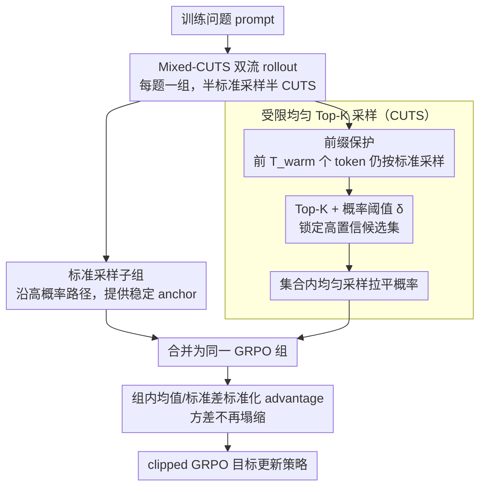

# Too Correct to Learn: Reinforcement Learning on Saturated Reasoning Data

**会议**: ACL2026  
**arXiv**: [2604.18493](https://arxiv.org/abs/2604.18493)  
**代码**: 待确认  
**领域**: llm_alignment / LLM推理强化学习  
**关键词**: 饱和推理数据, GRPO, CUTS, 探索多样性, 模式坍缩

## 一句话总结
这篇论文指出强推理模型在“太容易、几乎全对”的训练集上做 GRPO 会因为组内奖励方差消失而停止学习，并提出 Mixed-CUTS 用受限 Top-K 均匀采样混合标准 rollout，重新制造有意义的探索差异，在 Qwen3-4B 上把 AIME25 Pass@1 相比标准 GRPO 提高 15.1%。

## 研究背景与动机
**领域现状**：面向数学和复杂推理任务的 LLM 后训练，越来越依赖基于结果奖励的强化学习。GRPO 这类方法不需要额外训练 value network，而是用同一 prompt 下多条 rollout 的组内均值和标准差来估计相对优势，因此很适合大规模推理 RL。

**现有痛点**：随着 Qwen3、DeepSeek-R1 系列等基础模型变强，很多标准训练集已经接近饱和：模型在 MATH 这类数据上原本就能答对大多数题，并且生成路径高度同质。对 GRPO 来说，这反而是坏消息，因为一组 rollout 全部正确时，奖励标准差趋近于 0，相对优势信号消失，策略没有足够梯度去探索更强的泛化推理路径。

**核心矛盾**：传统直觉认为 RL 失败是因为模型“不够会”，需要更多正确样本或更强奖励；本文强调另一个相反现象：模型在训练数据上“太会了”，导致错误样本和对比信号不够。单纯加熵正则又会无差别打散分布，可能破坏严谨推理链，而不是产生有语义的探索。

**本文目标**：作者希望在不改 GRPO 目标、不引入新模型参数的情况下，通过生成策略本身恢复组内奖励差异，让饱和数据重新产生可学习信号，并观察这种探索能否迁移到 AIME、AMC、GPQA 等更难或跨域 benchmark。

**切入角度**：论文把干预点放在 decoding，而不是奖励函数。标准采样会按照模型已有偏好“强者愈强”地采到同一类高概率路径；如果能在高置信局部集合内把概率拉平，就可能采到仍然合理、但原本被主模式压制的候选 token。

**核心 idea**：在每个 prompt 的 rollout 组里混合标准采样和 Constrained Uniform Top-K Sampling，让 exploitative 轨迹保持当前策略稳定，让 exploratory 轨迹提供结构化扰动，从而恢复 GRPO 的组内 advantage variance。

## 方法详解

### 整体框架
方法由两个层次组成。底层是 CUTS 解码算子：在每个 token 位置先取模型分布的 Top-K 候选，再用概率阈值过滤掉低置信尾部 token，最后在剩余高置信集合内做均匀采样。这样它不会像高温采样那样把概率质量撒到无意义尾部，也不会像 greedy/标准采样那样一直沿着最高概率路径走。

上层是 Mixed-CUTS 训练框架：对每个训练问题生成一组 rollout，其中一半来自标准采样，另一半来自 CUTS。之后仍然按 GRPO 的方式在合并组内计算奖励均值、标准差和标准化 advantage。若标准采样部分在饱和题目上全部正确，CUTS 部分仍可能因为探索到不同分支而产生正确/错误混合，或者在难题上找到标准路径错过的正确分支，于是组内方差不再塌缩。

### 关键设计

**1. Constrained Uniform Top-K Sampling：只在高置信局部邻域里拉平概率，注入“结构保持”的多样性**

推理 RL 需要探索，但探索一旦破坏推理链的局部连贯性就会变成噪声。标准采样会“强者愈强”地沿最高概率路径走，高温采样又会把概率质量撒到无意义的尾部 token，两者都不合适。CUTS 的做法是：给定当前位置分布 $P_\theta(v|q,x_{<t})$，先取 Top-K 候选，再只保留概率大于阈值 $\delta$ 的 token 得到集合 $\mathcal{S}_t$，最后在 $\mathcal{S}_t$ 上均匀采样——即每个候选的概率都被拉平为 $1/|\mathcal{S}_t|$（集合为空时退回 Top-K，只剩一个候选时退化为确定性选择）。因为均匀化只发生在“模型自己认为高置信”的局部邻域内，它打破的是过度尖峰、保留的是合理候选，因此比全局熵正则或高温采样更不容易产生不连贯的推理。

**2. Mixed-CUTS 双流 rollout：把稳定利用和受控探索放进同一个 GRPO 组，恢复 advantage 信号**

GRPO 在饱和数据上的死穴是：一组 rollout 全对时，组内奖励标准差趋近 0，相对优势消失，策略再也学不动。Mixed-CUTS 把每个 prompt 的 rollout 组 $\mathcal{G}$ 拆成标准采样子组 $\mathcal{G}_{std}$ 和 CUTS 子组 $\mathcal{G}_{CUTS}$，优势仍在合并组上照常计算。它用总方差分解说明混合组的方差由组内方差和两个子组的组间均值差共同构成：

$$\sigma^2_{mixed}=\underbrace{\text{组内方差}}_{}+\underbrace{\text{组间均值差}}_{}$$

只要 CUTS 子组的平均奖励或内部方差和标准子组不同，$\sigma^2_{mixed}$ 就不会塌成 0。设计上两条流缺一不可：只用 CUTS 会让行为策略偏离当前模型、训练失稳，只用标准采样又会在饱和题上方差归零——标准轨迹提供 anchor，CUTS 轨迹提供 contrast，组内对比信号才被重新激活。

**3. 前缀保护与受控 off-policy 偏差：把探索推迟到该分叉的位置，并三层约束行为策略的偏离**

数学推理早期的决策（题意理解、推理格式）一旦走错就满盘皆输，所以不能从第一个 token 就随机探索。CUTS 因此在前 $T_{warm}$ 个 token 仍用标准采样，等问题理解和推理框架稳定后再启用局部均匀化，让多样性表现为“换一条合理解法”而不是“从第一步乱走”。同时，CUTS 是一种偏离当前策略的行为采样，论文用三层叠加把这种 off-policy 偏差控制住：Top-K 保证候选来自模型高概率区，阈值 $\delta$ 砍掉尾部，外层仍套标准 GRPO 的 clipped objective 限制单步更新幅度。三层一起作用，使探索既足够大到能恢复方差，又不至于把策略推到训练无法收敛的区域。

### 损失函数 / 训练策略
训练目标沿用 GRPO。给定同一问题下的 $G$ 条输出，先计算每条输出的结果奖励，再用组内均值和标准差标准化得到 $\hat{A}_i=(r_i-mean(r))/ (std(r)+\epsilon)$，并把该 trajectory-level advantage 应用于每个 token。本文的核心不是修改这个目标，而是通过 Mixed-CUTS 保证 $std(r)$ 在饱和场景下仍有信息量。

实验使用 Qwen3-1.7B 和 Qwen3-4B 的 non-thinking mode，在 MATH 训练集上做 RL；评估覆盖 MATH、AIME24、AIME25、AMC、GPQA，并额外测试只在数学数据训练后的跨域泛化到 MMLU-Pro 与 SuperGPQA。4B 模型最大生成长度设为 12,000 token，1.7B 设为 5,000 token，以避免长推理链被截断。

## 实验关键数据

### 主实验
下表摘取 Pass@1 结果，展示 Mixed-CUTS 相比标准 GRPO 在不同 benchmark 上的收益。训练都只使用 MATH 数据，AIME/AMC/GPQA 主要体现 out-of-domain 或更难题目的泛化。

| 模型 | 方法 | MATH | AIME24 | AIME25 | AMC | GPQA |
|------|------|------|--------|--------|-----|------|
| Qwen3-1.7B | GRPO | 83.6 | 29.5 | 22.8 | 59.8 | 34.2 |
| Qwen3-1.7B | Mixed-CUTS | 85.1 | 32.3 | 28.1 | 62.7 | 36.0 |
| Qwen3-1.7B | 提升 | +1.5 | +2.8 | +5.3 | +2.9 | +1.8 |
| Qwen3-4B | GRPO | 86.4 | 32.5 | 26.6 | 68.9 | 48.1 |
| Qwen3-4B | Mixed-CUTS | 90.8 | 46.0 | 41.7 | 76.7 | 50.1 |
| Qwen3-4B | 提升 | +4.4 | +13.5 | +15.1 | +7.8 | +2.0 |

最核心的结果是 Qwen3-4B 在 AIME25 上从 26.6 提升到 41.7，说明 Mixed-CUTS 的收益并不是在 MATH 上记住更多训练模式，而是把探索能力转化为更难题目的泛化。1.7B 模型也有稳定提升，但 4B 上收益更大，符合作者“更强模型有更多潜在推理分支可被解锁”的解释。

### 消融实验
论文还测试了只在 MATH 上训练的 Qwen3-4B checkpoint 在非数学 benchmark 上的 zero-shot 准确率。

| 训练方法 | MMLU-Pro | SuperGPQA | 说明 |
|----------|----------|-----------|------|
| Base Model | 63.80% | 33.05% | 未经过该轮 RL 训练 |
| Standard GRPO | 68.59% | 40.03% | 数学 RL 已提升泛化 |
| Mixed-CUTS | 69.65% | 41.28% | 相比 GRPO 继续提升 +1.06 / +1.25 |

训练动态分析也支持机制假设：标准 GRPO 的 policy entropy 长期停在约 0.20-0.25，响应长度约 1200 token 后趋于平台；Mixed-CUTS 则保持更高熵，并把推理长度推到超过 1800 token。AIME25 reward 在约第 30 步之后明显拉开，maj@16 consistency 的最终提升达到 23.2%，说明它不是靠偶然采样覆盖，而是在训练中逐步把正确推理路径推到更高概率。

### 关键发现
- 饱和数据不是“没用”，但需要重新激活对比信号。Mixed-CUTS 的作用不是降低训练题难度，而是让同一道题产生有意义的成功/失败或路径差异。
- 提升集中在更难的 out-of-domain benchmark 上，尤其是 AIME24/25。这说明探索不是噪声，而是在强模型已有能力附近挖出被标准采样压制的推理分支。
- Pass@1 提升大于 Pass@16 提升，尤其 Qwen3-4B 在 MATH 上 +4.4 vs +0.7，说明方法在改变单次生成的主概率质量，而不只是扩大随机覆盖面。

## 亮点与洞察
- 论文把“高正确率导致 RL 学不动”这个现象讲得很清楚。它提醒我们，结果奖励 RL 的有效样本不是正确样本本身，而是同组 rollout 之间的差异。
- CUTS 的探索边界很克制：只在 Top-K 且过阈值的局部集合内均匀化。这个设计比单纯提高 temperature 更符合推理任务，因为它承认模型的高置信分布仍然有价值，只是需要打破过度尖峰。
- Mixed-CUTS 可以看作一种 rollout 级的数据增强。它没有改奖励函数，却改变了 RL 看到的“同题多解”分布，这种思路可以迁移到代码生成、工具调用、agent planning 等同样存在早熟收敛的问题。

## 局限与展望
- 作者没有给出严格收敛或最优性分析。CUTS 引入的是混合行为策略，虽然 Top-K、阈值和 clipping 让偏差受控，但长期 policy improvement 的理论性质仍未证明。
- 多样性被近似为“Top-K 内局部均匀化”，这是一种实用代理指标，并不等价于语义层面的解法多样性。未来可以结合过程奖励、错误定位或 hidden-state novelty 来定义更有针对性的探索准则。
- 实验主要围绕 Qwen3 和数学训练集展开，虽然有跨域测试，但还不足以说明该策略在代码、工具调用、多轮 agent 等结构化任务上同样稳定。
- CUTS 的超参数如 $K$、$\delta$、$T_{warm}$ 对不同模型和任务可能敏感。一个自然改进是根据当前 prompt 难度或 rollout 早期不确定性动态调整探索强度。

## 相关工作与启发
- **vs 标准 GRPO**: GRPO 用组内 reward statistics 替代 critic，训练简单高效；Mixed-CUTS 保留 GRPO 目标，只改变 rollout 采样，使组内统计在饱和数据上不至于退化。
- **vs 熵正则 / 高温采样**: 熵正则从目标层面鼓励分布变平，高温采样从全局 token 分布增加随机性；CUTS 只在高置信 Top-K 集合内均匀化，更强调“合理候选之间的探索”。
- **vs curiosity / novelty exploration**: 很多探索方法需要额外奖励模型、状态距离或历史记忆；Mixed-CUTS 是参数无关的 decoding-time 操作，工程上更轻，但表达能力也更有限。

## 评分
- 新颖性: ⭐⭐⭐⭐☆ “饱和正确率导致 advantage 消失”的问题诊断很有启发，CUTS 本身简单但位置选得准。
- 实验充分度: ⭐⭐⭐⭐☆ 主实验、跨域泛化和训练动态都支持结论，但模型族和任务类型还可扩展。
- 写作质量: ⭐⭐⭐⭐☆ 叙事清楚，机制解释和方差分解易懂；部分理论表述仍偏直觉化。
- 价值: ⭐⭐⭐⭐⭐ 对当前强模型推理 RL 很实用，尤其适合数据越来越饱和后的持续训练问题。

<!-- RELATED:START -->

## 相关论文

- [\[ICML 2026\] Decoupling Reasoning and Confidence: Resurrecting Calibration in Reinforcement Learning from Verifiable Rewards](../../ICML2026/llm_alignment/decoupling_reasoning_and_confidence_resurrecting_calibration_in_reinforcement_le.md)
- [\[ACL 2026\] PERSA: Reinforcement Learning for Professor-Style Personalized Feedback with LLMs](persa_reinforcement_learning_for_professor-style_personalized_feedback_with_llms.md)
- [\[ACL 2026\] What Makes Good Instruction-Tuning Data? An In-Context Learning Perspective](what_makes_good_instruction-tuning_data_an_in-context_learning_perspective.md)
- [\[ACL 2026\] Why Supervised Fine-Tuning Fails to Learn: A Systematic Study of Incomplete Learning in Large Language Models](why_supervised_fine-tuning_fails_to_learn_a_systematic_study_of_incomplete_learn.md)
- [\[ACL 2026\] Better Literary Translation: A Multi-Aspect Data Generation and LLM Training Approach](better_literary_translation_a_multi-aspect_data_generation_and_llm_training_appr.md)

<!-- RELATED:END -->
