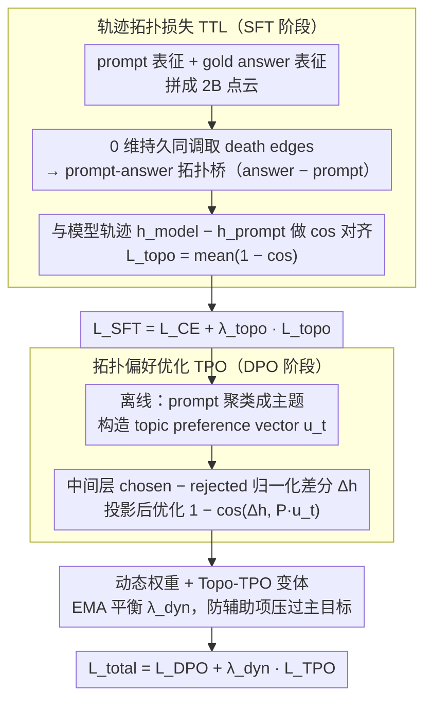

# Topology-Enhanced Alignment for Large Language Models: Trajectory Topology Loss and Topological Preference Optimization

**会议**: ACL2026  
**arXiv**: [2605.07172](https://arxiv.org/abs/2605.07172)  
**代码**: 待确认  
**领域**: LLM对齐  
**关键词**: 拓扑数据分析, 持久同调, SFT, DPO, 表征轨迹

## 一句话总结
这篇论文把 LLM 对齐看成隐藏空间中的“语义轨迹”塑形问题，在 SFT 阶段用 0 维持久同调抽取 prompt-answer 拓扑桥并加入 TTL，在 DPO 阶段用主题偏好方向加入 TPO，使 UltraChat 和 HH-RLHF 上的奖励、胜率和无害性指标都稳定优于非拓扑基线。

## 研究背景与动机
**领域现状**：当前 LLM 对齐通常先做监督微调，再接 RLHF 或 DPO。SFT 主要优化 token-level likelihood，DPO/RLHF 主要优化偏好分数或成对排序，这套范式在实践中很强，但训练信号大多停留在局部样本或标量层面。

**现有痛点**：这些目标函数很少直接约束模型内部表征怎样从用户 prompt 移动到答案，也很少关心 chosen response 与 rejected response 在隐藏空间中的“改进方向”。模型可以在输出层面变得更像偏好数据，却不一定学到稳定、可迁移的隐藏空间路径。

**核心矛盾**：对齐本质上希望模型沿着“更有帮助、更安全、更符合指令”的方向生成，但标准目标只告诉模型每个 token 或每对答案的局部偏好，没有显式利用一批样本在表征空间中的整体几何结构。局部 likelihood 与全局语义流形之间存在断层。

**本文目标**：作者想回答一个具体问题：能否把 prompt、答案、chosen、rejected 的隐藏状态看成点云，并用拓扑数据分析抽出更稳定的跨簇连接，从而正则化模型的语义轨迹？

**切入角度**：0 维持久同调会记录点云中连通分量随距离阈值扩大而合并的过程，其中跨标签的 death edge 类似最小生成森林里的关键桥边。作者认为这些桥边比随机配对、逐样本 gold 配对或 kNN 配对更能反映 prompt manifold 与 answer manifold 在全局结构上的接触方式。

**核心 idea**：用拓扑桥替代任意局部配对，把“输出要对”进一步变成“隐藏状态要沿着拓扑上合理的方向移动”。

## 方法详解

### 整体框架
方法分成两个训练阶段。第一阶段是 SFT + Trajectory Topology Loss (TTL)：对每个 batch，模型分别得到 prompt token 的 mean-pooled last-layer hidden state、teacher-forced answer token 的 mean-pooled hidden state，以及 gold answer token 的输入嵌入均值。作者把 prompt 表征和 gold answer 表征混成一个 $2B$ 个点的点云，运行 0 维持久同调，取出连接 prompt 点和 answer 点的 death edges，形成 prompt-answer bridge。模型真实的 prompt-to-answer 隐藏轨迹要和这些 bridge 方向对齐。

第二阶段是 DPO + Topological Preference Optimization (TPO)：作者先离线把 HH-RLHF prompt 聚类成主题，为每个主题构造正向和负向模板，用 sentence transformer 得到 topic-specific preference vector。训练 DPO 时，在模型中间层计算 chosen response 与 rejected response 的 mean-pooled hidden state 差分，并通过一个小投影矩阵把主题向量映射到模型 hidden space，再用 cosine loss 对齐“rejected 到 chosen”的语义改进方向。最终损失是 DPO loss 加动态加权的 TPO loss。

### 关键设计

**1. SFT 阶段的 Trajectory Topology Loss：用持久同调桥替代任意配对，给隐藏轨迹一个全局结构监督**

逐样本 gold 配对只盯着当前样本，kNN 只看局部邻居，随机配对噪声又大——这些配对方式都无法告诉模型隐藏状态该往哪个"全局合理"的方向移动。作者的做法是把每个 batch 内的 prompt 表征和 gold answer 表征拼成一个 $2B$ 点的点云，计算两两欧氏距离后用 Union-Find 按距离从小到大合并连通分量，记录每条让一个分量"死亡"的边；只保留两端标签不同（一端 prompt、一端 gold answer）的边作为 prompt-answer bridge，方向统一成 answer 减 prompt。模型侧真实轨迹是 $h_i^{model}-h_i^{prompt}$，TTL 就是这些轨迹与拓扑桥方向之间的 cosine loss，可概括为 $L_{topo}=mean(1-cos(v_{topo}, v_{model}))$。

这些 bridge 类似最小生成森林里的关键桥边，来自点云的全局连通结构，能筛掉大量局部偶然连接，因此比逐样本、kNN、随机配对都更稳定——消融里 PH Bridge 也确实强于其它三种配对。

**2. DPO 阶段的 Topological Preference Optimization：把"chosen 胜过 rejected"细化成"在隐藏空间沿主题相关方向移动"**

标准 DPO 只在输出概率上让 chosen 压过 rejected，并不关心模型中间层是否真的朝"更好答案"挪动；而且偏好并非全局同一个方向，安全建议、知识问答、对话安抚各自的"好答案"方向并不一样。作者先用 sentence transformer 嵌入 prompt、做 MiniBatch KMeans 聚类，再用强模型给每个簇打主题标签，并为每个主题用"helpful/harmless/high-quality"与"harmful/unhelpful/low-quality"等正负模板构造一个 topic-specific preference vector。训练时取中间层 chosen 与 rejected 的归一化 hidden 差分 $\Delta h=LN(h^{ch})-LN(h^{rj})$，通过一个可学习投影矩阵 $P$ 把主题向量映射到模型 hidden space，再优化 $1-cos(\Delta h, Pu_t)$。

这样一来，"rejected 到 chosen"的改进方向被约束到与该主题真实偏好对齐的方向上；消融显示主题化向量明显优于单一手工或学习得到的 global preference vector。

**3. 动态权重与 fully topological 变体：防辅助项压过主目标，并检验拓扑结构在偏好阶段是否独立有效**

辅助项一旦权重失衡就可能盖过 DPO 主目标，而固定权重又容易受训练阶段和 batch 组成影响。默认 TPO 因此用 EMA 追踪 DPO loss 与 TPO loss 的量级，动态设置 $\lambda_{dyn}$ 让两个目标在训练中保持平衡。作者还设计了一个 Topo-TPO 变体：把 chosen/rejected 的 hidden state 也组成点云，直接用 0 维持久同调抽取 rejected-chosen bridge，再与主题偏好向量对齐。这个变体说明 TPO 的收益不只来自 topic vectors，也可能来自 chosen/rejected 批内的全局结构——实验里 Topo-TPO 在无害性上还略高于默认 TPO，只是默认版本更轻量。

### 损失函数 / 训练策略
SFT 阶段总目标是 $L_{SFT}=L_{CE}+lambda_{topo}L_{topo}$，默认较优的 $lambda_{topo}$ 约为 0.2。DPO 阶段总目标是 $L_{total}=L_{DPO}+lambda_{dyn}L_{TPO}$，其中 $lambda_{dyn}$ 由 EMA 平衡两个 loss 的尺度。实验主干使用 Qwen2.5-7B-Instruct，SFT 使用 LoRA rank 16，持久同调在 CPU 上用 Union-Find 和 pairwise distance 实现；作者还在 Llama-3-8B-Instruct 上做了跨 backbone 验证。

## 实验关键数据

### 主实验

| 阶段 / 数据集 | 方法 | 关键指标 | 基线 | 本文 | 提升 |
|--------|------|------|------|------|------|
| SFT / UltraChat | Base SFT vs SFT + TTL | RM / IFEval / Toxicity | 64.2 / 68.5 / 0.45 | 67.8 / 71.8 / 0.38 | RM +3.6, IFEval +3.3, 毒性下降 |
| SFT zero-shot / HH-RLHF prompts | Base SFT vs SFT + TTL | RM / Help / Toxicity | 62.1 / 45.2 / 0.48 | 65.4 / 49.8 / 0.41 | 跨数据集帮助性 +4.6 |
| DPO / HH-RLHF | DPO vs DPO + TPO | RewardBench / AlpacaEval / MT-Bench / Harmless | 84.5 / 52.1% / 8.65 / 90.2% | 87.2 / 55.4% / 8.81 / 93.5% | 胜率和无害性同步提升 |
| DPO / HH-RLHF | DPO vs DPO + Topo-TPO | RewardBench / AlpacaEval / MT-Bench / Harmless | 84.5 / 52.1% / 8.65 / 90.2% | 87.4 / 55.6% / 8.80 / 94.1% | 无害性提升最大 |

### 消融实验

| 配置 | RM | Win | IFEval | Toxicity | 说明 |
|------|------|------|------|------|------|
| No TTL | 64.2 | - | 68.5 | 0.45 | 纯 CE SFT |
| Random Pair | 64.6 | 50.8% | 68.9 | 0.44 | 随机 answer 方向，收益很小 |
| All Pairs (no PH) | 66.1 | 53.2% | 69.8 | 0.41 | 逐样本对齐，有效但不够稳定 |
| kNN Bridge | 66.8 | 55.6% | 70.5 | 0.40 | 局部几何桥优于逐样本 |
| PH Bridge (ours) | 67.8 | 58.4% | 71.8 | 0.38 | 持久同调桥效果最好 |

| TPO 配置 | RewardBench | AlpacaEval | Harmless | 结论 |
|------|------|------|------|------|
| DPO | 84.5 | 52.1% | 90.2% | 标准偏好优化 |
| + Global Cosine | 85.1 | 52.8% | 90.5% | 单个手工方向只带来小幅收益 |
| + Learned Global Vec. | 85.8 | 53.5% | 91.2% | 学到的全局方向仍偏粗糙 |
| + TPO (no dyn) | 86.3 | 54.2% | 91.8% | 主题向量明显更好 |
| + TPO (ours) | 87.2 | 55.4% | 93.5% | 动态权重进一步稳定训练 |

| $lambda_{topo}$ | RM | Win | IFEval | Toxicity | 现象 |
|------|------|------|------|------|------|
| 0.0 | 64.2 | - | 68.5 | 0.45 | 无拓扑正则 |
| 0.1 | 66.5 | 55.3% | 70.4 | 0.40 | 已有明显收益 |
| 0.2 | 67.8 | 58.4% | 71.8 | 0.38 | 默认最优 |
| 0.4 | 66.9 | 56.1% | 71.0 | 0.42 | 过强正则开始伤害主目标 |

### 关键发现
- TTL 的收益不是来自“多一个 cosine loss”这么简单，而是来自持久同调 bridge 的全局连通结构；PH Bridge 比 Random、All Pairs 和 kNN 都更强。
- TPO 的核心是 topic-aware。单个全局 preference vector 无论手工构造还是学习得到，都不如按 prompt 主题细分出的偏好方向。
- Topo-TPO 在 harmlessness 上略高于默认 TPO，说明偏好阶段也可能受益于 chosen/rejected 点云的全局结构，但默认 TPO 更轻量。
- 拓扑权重不能无限加大，$lambda_{topo}=0.4$ 时 RM 和毒性都变差，说明轨迹正则应服务于对齐目标，而不是取代语言建模。

## 亮点与洞察
- 这篇论文最有意思的地方，是把对齐从“输出是否符合偏好”推进到“隐藏状态如何移动”。这让 SFT 和 DPO 能共享一个统一视角：prompt 到 answer、rejected 到 chosen 都是语义轨迹。
- 0 维持久同调用得很克制，只需要 Union-Find 和 batch 内 pairwise distance，不需要复杂的高维拓扑特征。工程上它更像一个全局结构感知的配对器，而不是昂贵的拓扑黑盒。
- TPO 的 topic-aware 偏好向量值得迁移到其他 alignment 任务。例如安全、事实性、礼貌性、代码可执行性都可以构造成不同主题或属性方向，再在 hidden space 中约束改进轨迹。
- 实验把“拓扑 vs 非拓扑”“主题化 vs 全局化”“固定权重 vs 动态权重”拆得比较清楚，能让读者看到每个设计点的实际贡献。

## 局限与展望
- 论文主要在 Qwen2.5-7B 和 Llama-3-8B、UltraChat 与 HH-RLHF 上验证，尚不清楚在更大模型、长链推理、多轮 agent 或代码对齐场景中是否同样稳定。
- 0 维持久同调基于 batch 内点云，batch 组成、embedding 层选择、距离度量都会影响 bridge。后续可以研究跨 batch memory bank 或更稳定的全局拓扑图。
- TPO 的 topic vectors 依赖离线聚类和模板构造，主题标签质量会影响偏好方向。更强的做法可能是从真实人类偏好解释、reward model residual 或自动 discovered concept 中学习方向。
- 实验指标仍以 reward model、LLM judge 和常规对齐 benchmark 为主，缺少对隐藏轨迹可解释性的人工验证，也缺少安全红队场景下的深入压力测试。

## 相关工作与启发
- **vs 标准 SFT / RLHF / DPO**: 标准方法优化 token likelihood 或偏好排序，本文额外约束 hidden-space trajectory；优势是能利用表征几何，劣势是增加了层选择、权重和点云构造等超参。
- **vs 表征几何分析工作**: 过去很多工作用几何或探针分析模型内部结构，本文进一步把几何结构变成训练信号，用于实际对齐。
- **vs TDA 正则化**: 传统 TDA 正则常用于分类边界或鲁棒性，本文把 0 维 persistent homology 放入 LLM alignment 的 SFT 与 DPO 两个阶段，应用场景更新。
- **启发**: 对齐数据中往往存在“从坏到好”的隐式方向。把这些方向显式化，并在 hidden space 里做约束，可能比只在输出概率上优化更可控。

## 评分
- 新颖性: ⭐⭐⭐⭐☆ 把持久同调和隐藏轨迹正则引入 LLM 对齐很新颖，尤其是 SFT 与 DPO 的统一表述。
- 实验充分度: ⭐⭐⭐⭐☆ 主实验、跨 backbone、TTL/TPO 消融都较完整，但模型规模和真实安全场景还可以继续扩大。
- 写作质量: ⭐⭐⭐⭐☆ 方法逻辑清楚，表格能支撑主要结论；缓存中的结论和限制信息较少，部分实现细节依赖附录。
- 价值: ⭐⭐⭐⭐☆ 为 alignment 提供了“轨迹塑形”这个可复用视角，适合启发后续 hidden-space control 与可解释对齐研究。

<!-- RELATED:START -->

## 相关论文

- [\[CVPR 2026\] Uncertainty-Aware Exploratory Direct Preference Optimization for Multimodal Large Language Models](../../CVPR2026/llm_alignment/uncertainty-aware_exploratory_direct_preference_optimization_for_multimodal_larg.md)
- [\[ACL 2026\] Teaching LLM to be Persuasive: Reward-Enhanced Policy Optimization for Alignment from Heterogeneous Rewards](teaching_llm_to_be_persuasive_reward-enhanced_policy_optimization_for_alignment_.md)
- [\[ICLR 2026\] SafeDPO: A Simple Approach to Direct Preference Optimization with Enhanced Safety](../../ICLR2026/llm_alignment/safedpo_preference_optimization_safety.md)
- [\[ICLR 2026\] Towards Understanding Valuable Preference Data for Large Language Model Alignment](../../ICLR2026/llm_alignment/towards_understanding_valuable_preference_data_for_large_language_model_alignmen.md)
- [\[ACL 2025\] Optimal Transport-Based Token Weighting for Enhanced Preference Optimization](../../ACL2025/llm_alignment/otpo_token_weighting.md)

<!-- RELATED:END -->
