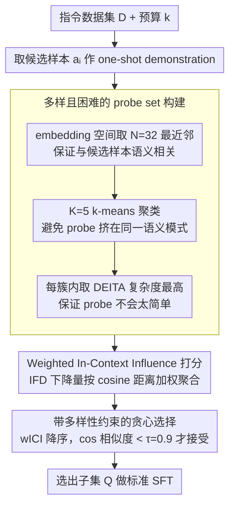

# What Makes Good Instruction-Tuning Data? An In-Context Learning Perspective

**会议**: ACL2026  
**arXiv**: [2604.25132](https://arxiv.org/abs/2604.25132)  
**代码**: https://github.com/trust-nlp/SyntheticData-Curator  
**领域**: llm_alignment  
**关键词**: 指令微调、数据选择、上下文学习、样本影响力、多样性约束

## 一句话总结
本文提出 weighted In-Context Influence (wICI)，用候选样本作为 one-shot demonstration 后能否降低相关困难 probe 的 instruction-following difficulty 来衡量指令数据价值，在 10% 数据预算下优于或匹配 IFD、DEITA、NUGGETS、SelectIT 等选择方法。

## 研究背景与动机
**领域现状**：指令微调通常依赖大规模 instruction-response 数据集，例如 Alpaca-GPT4、WizardLM 等。大量研究已经发现这些数据中存在冗余、噪声和质量不均，因此用少量高价值样本训练出接近甚至超过全量数据的模型，成为高效对齐和低成本微调的重要问题。

**现有痛点**：已有数据选择方法各有侧重。IFD/Superfiltering 用困惑度或 instruction-following difficulty 衡量样本难度；DEITA 结合复杂度、质量和多样性 reward；NUGGETS 把候选样本当 one-shot demonstration，在固定 anchor set 上测提升。但固定全局 anchor 会忽略语义相关性，二元打分也难以体现提升幅度，还会带来很高计算成本。

**核心矛盾**：一个样本“难”不等于它“会教”。困难样本可能只是模型本来就不擅长或标注复杂，不一定能作为示例帮助相关任务；反过来，一个好 demonstration 的价值在于它能让模型更容易完成语义相近但不完全相同的 probe。现有方法没有充分区分“自身难度”和“对同伴样本的教学影响力”。

**本文目标**：作者围绕三个问题展开：从 ICL 角度看什么样的数据适合指令微调；高 IFD 的难样本是否也是强 demonstration；高 ICL 影响力样本在真正微调后是否也带来更好的 instruction-following performance。

**切入角度**：论文把 instruction-tuning data selection 重新解释成“寻找能在上下文中帮助相关困难任务的示例”。如果一个样本作为 one-shot demonstration 能显著降低多个语义相关 probe 的生成难度，那么它不仅是好的 ICL example，也可能是好的微调样本。

**核心 idea**：为每个候选样本构造语义相关、多样且困难的 probe set，测量候选样本作为 demonstration 对这些 probe 的 IFD 降低量，再按语义距离加权聚合成 wICI 分数，并用多样性约束选择最终 coreset。

## 方法详解
方法可以分成四步：先为每个候选样本找 probe，再计算它对 probe 的 in-context influence，然后按 wICI 排序并加多样性约束选数据，最后用选出的子集做普通 SFT。整个框架不需要训练 reward model，也不依赖外部知识库。

### 整体框架
输入是指令数据集 $D=\{(x_i,y_i)\}_{i=1}^n$ 和预算 $k$，输出是大小为 $k$ 的训练子集 $Q$。每个候选样本 $a_i=(x_i,y_i)$ 都被当成一个 one-shot demonstration 来测试：它能否降低相关 probe $b=(x_b,y_b)$ 的 instruction-following difficulty。若能显著降低，说明这个样本对相邻任务有“教学作用”。

作者先定义 IFD 作为样本难度指标：$IFD(y|x)=PPL(y|x)/PPL(y)$，数值越大表示模型从 instruction 中获益越少、生成越困难。接着定义 ICI：$ICI_{i\rightarrow b}=IFD(y_b|x_b)-IFD(y_b|a_i,x_b)$。如果加入候选样本后 probe 的 IFD 下降，ICI 为正。

### 关键设计

**1. 多样且困难的 probe set 构建：给每个候选样本配一组真正能检验其"教学价值"的 probe**

probe 选不好，影响力评估就会失真——随机 probe 噪声大，纯最近邻 probe 太冗余、几乎是重复样本，过于简单的 probe 又看不出 demonstration 到底有没有帮上忙。作者用三阶段检索同时控制相关性、多样性和挑战性：先在 embedding 空间取 $N=32$ 个最近邻保证 probe 与候选样本语义相关，再对这些邻居做 $K=5$ 个 k-means 聚类避免 probe 全挤在同一语义模式里，最后在每个 cluster 内用 DEITA complexity scorer 挑复杂度最高的样本，确保 probe 不会太简单。这样得到的 probe set 才能让后续的影响力打分既贴近候选样本的任务、又有足够区分度。

**2. Weighted In-Context Influence 打分：用 IFD 的下降量、并按语义距离加权，衡量一个样本作为 demonstration 的迁移性帮助**

如果只看平均影响力，模型会偏好那些只帮到近乎重复邻居的样本，而真正有价值的是能泛化到稍远相关任务的 demonstration。基于前面定义的难度指标 $IFD(y|x)=PPL(y|x)/PPL(y)$ 和影响力 $ICI_{i\rightarrow b}=IFD(y_b|x_b)-IFD(y_b|a_i,x_b)$（候选样本作 one-shot demonstration 后 probe 的 IFD 下降则 ICI 为正），wICI 把每个 probe 的 ICI 按归一化 cosine distance 加权聚合：

$$wICI(a_i)=\sum_{b\in B_i}\frac{1-cos(f(x_i),f(x_b))}{2|B_i|}\cdot ICI_{i\rightarrow b}$$

距离权重鼓励候选样本不只帮助近重复邻居、也对稍远但相关的 probe 起作用，从而选出具有 transferable teaching effect 的 instruction。

**3. 带多样性约束的贪心选择：避免最终训练集被高分但雷同的样本占满**

高影响力样本往往集中在少数任务模式上，全选进来会让模型在某些 benchmark 上很强、在另一些场景上偏弱，而微调数据需要覆盖多种指令结构。作者因此按 wICI 从高到低排序后做贪心选择：只有当一个候选样本与已选集合中任何样本的 cosine similarity 都小于阈值 $\tau=0.9$ 时才接受它，直到选满预算 $k$。被选子集不再额外加权，直接送入标准 SFT。

### 损失函数 / 训练策略
选择阶段使用 IFD、ICI 和 wICI 作为打分，不做梯度反传；训练阶段就是标准 supervised fine-tuning。实验中使用 LlamaFactory 全参数微调 Llama3.1-8B 和 Mistral-7B-v0.3，DeepSpeed ZeRO-3、bf16、序列截断 2048，训练 3 个 epoch，AdamW 学习率 $1\times10^{-5}$，总 batch size 64。

## 实验关键数据

### 主实验
主实验在 Alpaca-GPT4 和 WizardLM 两个数据集上进行，所有方法都只选择 10% 数据。Pairwise evaluation 用 GPT-4.1-mini judge 比较子集微调模型和全量数据模型，分数大于 1 表示优于全量基线。

| 数据集 | 方法 | Llama3.1-8B | Mistral-7B-v0.3 |
|--------|------|-------------|-----------------|
| Alpaca-GPT4 | Full | 1.000 | 1.000 |
| Alpaca-GPT4 | IFD | 1.198 | 1.248 |
| Alpaca-GPT4 | DEITA | 1.076 | 1.099 |
| Alpaca-GPT4 | NUGGETS | 1.133 | 1.201 |
| Alpaca-GPT4 | SelectIT | 1.146 | 1.227 |
| Alpaca-GPT4 | Ours | 1.215 | 1.261 |
| WizardLM | Full | 1.000 | 1.000 |
| WizardLM | IFD | 1.186 | 1.294 |
| WizardLM | DEITA | 1.114 | 1.140 |
| WizardLM | NUGGETS | 1.133 | 1.249 |
| WizardLM | SelectIT | 1.176 | 1.281 |
| WizardLM | Ours | 1.169 | 1.308 |

可以看到，10% 高质量数据经常优于全量数据，说明原始 instruction corpus 中确实有明显冗余和噪声。作者方法在 Alpaca-GPT4 上两个模型都最好，在 WizardLM 上 Mistral 最好、Llama3.1-8B 略低于 IFD 但仍强于全量。

| 模型 / 数据 | 方法 | ARC-C | HellaSwag | MMLU | GSM8K | MT-Bench | AlpacaEval LC |
|-------------|------|-------|-----------|------|-------|----------|---------------|
| Llama3.1 / Alpaca-GPT4 | Full | 52.99 | 79.78 | 61.81 | 47.46 | 4.30 | 13.19 |
| Llama3.1 / Alpaca-GPT4 | Ours | 58.98 | 81.52 | 63.45 | 55.17 | 4.88 | 14.42 |
| Llama3.1 / WizardLM | Full | 54.61 | 78.36 | 61.32 | 55.42 | 4.75 | 14.75 |
| Llama3.1 / WizardLM | Ours | 57.79 | 81.02 | 64.90 | 52.84 | 5.28 | 13.13 |
| Mistral / Alpaca-GPT4 | Full | 44.03 | 73.01 | 51.40 | 18.73 | 3.80 | 13.19 |
| Mistral / Alpaca-GPT4 | Ours | 49.43 | 81.14 | 54.73 | 28.53 | 4.18 | 11.35 |
| Mistral / WizardLM | Full | 46.25 | 73.57 | 51.15 | 32.37 | 3.97 | 10.77 |
| Mistral / WizardLM | Ours | 51.27 | 78.51 | 56.31 | 29.44 | 4.40 | 11.36 |

### 消融实验
消融集中检验两个多样性模块：w/o DA 去掉 probe 构建中的 semantic clustering，w/o DS 去掉最终选择时的 cosine-similarity diversity constraint。

| 数据集 | 配置 | Llama3.1-8B | Mistral-7B-v0.3 | 说明 |
|--------|------|-------------|-----------------|------|
| Alpaca-GPT4 | w/o DA | 1.140 | 1.181 | probe 不够多样，影响力估计变窄 |
| Alpaca-GPT4 | w/o DS | 1.155 | 1.198 | 训练集容易相似样本扎堆 |
| Alpaca-GPT4 | Ours | 1.215 | 1.261 | 两侧多样性都保留 |
| WizardLM | w/o DA | 1.132 | 1.204 | 仍优于全量，但低于完整方法 |
| WizardLM | w/o DS | 1.154 | 1.239 | demonstration 质量有用，但覆盖不足 |
| WizardLM | Ours | 1.169 | 1.308 | 完整方法最稳 |

作者还分析了“难样本”和“高 ICI 样本”是否一致，结果显示二者只部分重合。

| 数据集 | Top 10% overlap | Top 30% overlap | Top 50% overlap | Spearman |
|--------|------------------|------------------|------------------|----------|
| Alpaca-GPT4 | 0.1006 | 0.3874 | 0.6476 | 0.3947 |
| WizardLM | 0.1442 | 0.3650 | 0.5942 | 0.2568 |

### 关键发现
- 困难样本不等于好 demonstration。Top 10% IFD 和 Top 10% ICI 的重合只有 10%-14%，说明“模型觉得难”与“能教会模型相关任务”是不同信号。
- 好 ICL demonstration 确实可转化为好 instruction-tuning data。即使去掉多样性模块，wICI 的变体仍普遍优于 full-data baseline；加上 probe diversity 和 selection diversity 后效果最好。
- 数据选择对 IFEval 这种严格指令遵循 benchmark 的帮助不如对知识/答案质量类 benchmark 明显。附录中全量数据在 IFEval 上常最好，说明格式遵循可能更依赖覆盖规模。
- 医疗领域迁移实验显示方法有一定跨域能力。用 30% MedQuAD 训练时，Mistral 上 Ours 在 MedMCQA、MedQA、MMLU-med 分别为 37.05、39.54、50.00，整体优于 random，部分指标接近或超过 full。

## 亮点与洞察
- 论文把数据选择从“样本本身是否高质量”转向“样本能否帮助相关样本”，这是一个很有启发的视角。微调本质上需要可迁移的训练信号，而不是孤立的高难题。
- probe set 的三阶段构造很扎实：相关性、多样性、复杂度各解决一个偏差来源，避免 NUGGETS 式固定 anchor set 的低效和不匹配。
- wICI 用语义距离加权这一点很巧妙。它不鼓励只帮助近重复样本，而是奖励能推广到稍远语义区域的 demonstration。
- 结果也提醒我们，数据选择没有单一万能指标。IFD、DEITA、NUGGETS、wICI 会偏向不同能力，benchmark 维度不同，最优方法也可能变化。

## 局限与展望
- 实验只覆盖 7B/8B 级别模型，没有评估 Llama3-70B、Tulu3 等更大模型和更大规模 corpus。wICI 在大模型上是否仍有同等边际收益，需要进一步验证。
- 方法聚焦 supervised instruction tuning，没有测试 DPO、PPO 或其他 preference optimization 阶段。ICL 影响力是否能预测偏好优化样本价值还是开放问题。
- 每个样本约需 16 次 forward pass，虽然远低于 NUGGETS 的 2,000 次，但在百万级数据选择上仍有成本压力。
- wICI 的效果依赖 embedding 近邻、复杂度 scorer 和 IFD 估计质量。如果 embedding 对领域语义不敏感，probe set 就可能偏离真正相关任务。

## 相关工作与启发
- **vs IFD / Superfiltering**: IFD 关注样本自身难度，本文证明难度和教学影响力只中度相关，因此仅按难度筛选会漏掉真正有迁移价值的样本。
- **vs DEITA**: DEITA 用复杂度、质量和多样性 reward 排序，本文也借用复杂度 scorer，但复杂度只用于挑 probe，不直接等同于数据价值。
- **vs NUGGETS**: NUGGETS 最接近本文，都是把 instruction 样本当 one-shot demonstration。区别是 NUGGETS 使用固定全局 anchor 和较粗打分，wICI 使用局部语义相关 probe、提升幅度和距离加权，计算也更省。
- **vs SelectIT**: SelectIT 依赖不确定性和多轮自反思，本文不需要 teacher LLM 或多 prompt 复杂评估，而是把影响力定义在 IFD 的变化上。

## 评分
- 新颖性: ⭐⭐⭐⭐☆ 用 ICL 影响力解释 instruction-tuning data quality，问题切入清楚，和 NUGGETS 有连续性但推进明显。
- 实验充分度: ⭐⭐⭐⭐☆ 主实验、消融、难度一致性、预算和医疗迁移都覆盖到；大模型和偏好优化缺失。
- 写作质量: ⭐⭐⭐⭐☆ 方法公式和研究问题组织清晰，实验表很多但结论线索明确。
- 价值: ⭐⭐⭐⭐☆ 对低预算 SFT 数据筛选很实用，也给“ICL 与微调关系”提供了可操作指标。

<!-- RELATED:START -->

## 相关论文

- [\[NeurIPS 2025\] What Makes a Reward Model a Good Teacher? An Optimization Perspective](../../NeurIPS2025/llm_alignment/what_makes_a_reward_model_a_good_teacher_an_optimization_perspective.md)
- [\[AAAI 2026\] Importance-Aware Data Selection for Efficient LLM Instruction Tuning](../../AAAI2026/llm_alignment/importance-aware_data_selection_for_efficient_llm_instruction_tuning.md)
- [\[NeurIPS 2025\] T-SHIRT: Token-Selective Hierarchical Data Selection for Instruction Tuning](../../NeurIPS2025/llm_alignment/t-shirt_token-selective_hierarchical_data_selection_for_instruction_tuning.md)
- [\[ACL 2026\] SFTMix: Elevating Language Model Instruction Tuning with Mixup Recipe](sftmix_elevating_language_model_instruction_tuning_with_mixup_recipe.md)
- [\[ACL 2026\] Too Correct to Learn: Reinforcement Learning on Saturated Reasoning Data](too_correct_to_learn_reinforcement_learning_on_saturated_reasoning_data.md)

<!-- RELATED:END -->
