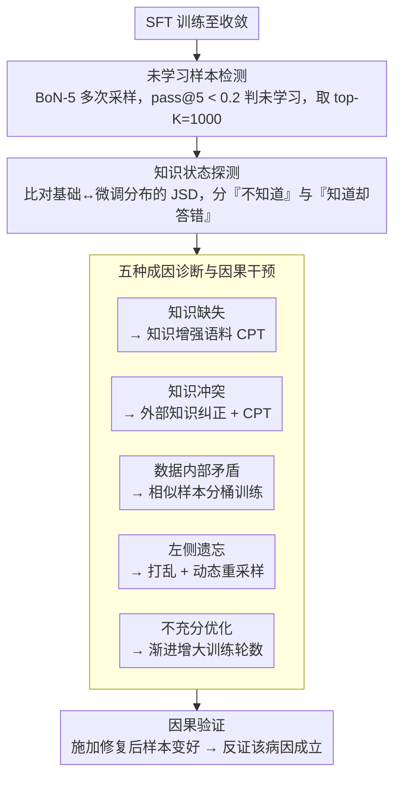

# Why Supervised Fine-Tuning Fails to Learn: A Systematic Study of Incomplete Learning in Large Language Models

**会议**: ACL 2026  
**arXiv**: [2604.10079](https://arxiv.org/abs/2604.10079)  
**代码**: 无  
**领域**: LLM安全  
**关键词**: 不完全学习, SFT诊断, 知识冲突, 遗忘, 微调失败模式

## 一句话总结

本文首次系统研究了 SFT 中的"不完全学习现象"（ILP）——即模型收敛后仍无法正确复现部分训练数据，识别了五种反复出现的原因（知识缺失、知识冲突、数据内部矛盾、左侧遗忘、不充分优化），并提出诊断框架和针对性缓解策略。

## 研究背景与动机

**领域现状**：SFT 是 LLM 适应下游任务的标准方法，被广泛认为是可靠且高效的专业化机制。

**现有痛点**：(1) 即使训练损失完全收敛，模型仍频繁无法正确回答部分训练样本——这不是过拟合或泛化问题，而是在训练集本身上的失败；(2) 未学会的样本往往不是随机的，而是对应罕见案例、组合模式或知识密集型实例；(3) 聚合指标的提升可能掩盖持续存在的未学习子集。

**核心矛盾**：SFT 数据集（尤其在法律、医疗等专业领域）构建成本高昂，但 15.3%±2.1% 的样本在训练后仍未被学会——这直接降低了数据的利用率。

**本文目标**：不是提出新的微调算法，而是系统刻画、诊断和验证 SFT 中不完全学习的来源。

**切入角度**：将未学习的样本视为诊断信号而非噪声——通过分析为什么这些特定样本未被学会来理解 SFT 的局限性。

**核心 idea**：五种 ILP 来源各需不同的缓解策略——没有"一刀切"的解决方案，需要细粒度的样本级诊断。

## 方法详解

### 整体框架

本文不提新的微调算法，而是搭一条"先检测、再归因、后干预"的诊断流水线，把 SFT 中"训练损失收敛了但样本还是答不对"的失败当成可分析的信号。具体而言：先把模型 SFT 到收敛，然后把每条训练样本转成选择题用多次采样检测出"未学习子集"；再用分布级信号探测每条顽固样本的知识状态、判断它是"压根不知道"还是"知道却被覆盖"，据此把它逐条归到五种成因之一；最后针对每种病因施加对应的修复手段，并用"修了是否变好"来反验归因是否正确。

### 关键设计

**1. 未学习样本检测：用 BoN-5 把解码噪声和真学习失败分开**

聚合准确率会掩盖一个事实——同一条样本多次采样有时对有时错，单次失败既可能是真没学会、也可能只是随机解码抖动。为此把每条 SFT 样本改写成选择题，做 $N$ 次独立推理算 pass@N，把 $\text{pass@5} < 0.2$ 且跨随机种子稳定失败的样本判为"未学习"，再取其中最严重的 top-$K=1000$ 条进入后续深入分析。只有反复采样都失败才算数，这样筛出来的才是模型确实没内化的知识，而非偶发噪声。

**2. 知识状态探测：用 JSD 把"不知道"和"知道却答错"区分开**

筛出未学习样本后，第一件事是判断它到底卡在哪——光看最终准确率无法分辨缺知识与知识冲突，两者表面都是答错。本文转而比较基础模型与微调模型预测分布之间的 Jensen-Shannon 散度 $\mathrm{JSD}$：高 $\mathrm{JSD}$ 且基础模型本就答错，说明 SFT 想覆盖一个根深蒂固的错误先验，属于知识冲突；低 $\mathrm{JSD}$ 而微调后仍错，说明分布几乎没动、模型压根没接收到这部分知识，属于知识缺失。这个分布级信号正是区分两类病因、决定走哪条修复路径的依据。

**3. 五种 ILP 来源的诊断与因果干预：每种病因配一套定位手段和对应修复**

拿到知识状态信号后，本文把未学习样本归到五条互不相同的成因，并为每条设计专门的探测与干预：**预训练知识缺失**——用 OpenIE 抽出事实三元组、对基础模型做 BoN 探测，确认缺知识后用知识增强语料做持续预训练（CPT）；**知识冲突**——检测基础模型以高置信度给出、却与 SFT 标签矛盾的答案，用外部知识纠正后再 CPT；**SFT 数据内部矛盾**——找语义相似但标签不一致的样本对，用 GPT 评估后分桶训练，避免同一 mini-batch 里出现互相打架的监督信号；**左侧遗忘**——顺序训练中靠前的样本被靠后的覆盖，用随机打乱加动态重采样缓解；**不充分优化**——罕见或组合复杂的模式训练信号太弱，靠渐进增大训练轮数补偿。关键在于这些修复不是泛用补丁而是因果干预：如果施加针对原因 $Y$ 的策略 $X$ 后样本被学会，就反过来验证了 $Y$ 确实是病因。

### 损失函数 / 训练策略

全程沿用标准 SFT 交叉熵损失，在 Qwen、LLaMA、OLMo2 三个模型族上评估。针对知识缺失/冲突类的 CPT 干预使用混合语料 $\mathcal{C}_{\text{mix}} = 0.8\,\mathcal{C}_{\text{general}} + 0.2\,\mathcal{C}_{\text{aug}}$，以八二比例掺入知识增强语料，既补上缺失/纠偏冲突知识，又避免通用能力被冲淡。

## 实验关键数据

### 主实验

**ILP 普遍性（10 个基准 SFT 数据集平均）**

| 指标 | 数值 |
|------|------|
| 平均未学习比例 | 15.3% ± 2.1% |
| 跨模型一致性 | Qwen/LLaMA/OLMo2 均观察到 |
| 跨领域一致性 | 医疗/法律/金融均存在 |

### 消融实验

**CPT 干预效果（知识缺失+冲突类）**

| 领域 | SFT only Acc | +CPT Acc | 提升 |
|------|-------------|---------|------|
| 医疗 (MedQA) | baseline | 显著提升 | 验证知识缺失假说 |
| 法律 (LegalBench) | baseline | 显著提升 | 验证知识冲突假说 |
| 金融 (FinanceBench) | baseline | 显著提升 | — |

### 关键发现

- ILP 普遍存在且异质——没有单一干预能解决所有失败
- 知识缺失和知识冲突是最常见的两大原因，CPT 对这两类有效
- 左侧遗忘在多任务 SFT 中尤为严重——简单打乱数据顺序即可缓解大部分
- SFT 数据内部矛盾（标注不一致）导致的 ILP 通过分桶训练可部分解决
- 聚合指标的提升可以掩盖未学习子集的持续存在——需要样本级监控

## 亮点与洞察

- "ILP"的概念化本身是重要贡献——将一个广泛存在但未被系统研究的现象形式化
- 五种来源的分类学对 SFT 实践者有直接指导价值——可以对照检查自己的数据和模型
- 诊断优先于治疗的哲学——先理解为什么失败，再设计针对性修复

## 局限与展望

- 选择题格式的样本级评估可能引入评估偏差
- 缓解策略（CPT、分桶训练等）的计算成本未详细报告
- 五种来源的分类可能不完备——可能存在其他未识别的 ILP 原因
- 未分析 RLHF/DPO 等后续训练阶段是否会加剧或缓解 ILP

## 相关工作与启发

- **vs 灾难性遗忘**: 后者关注丢失已学能力，ILP 关注未能获取新知识——方向相反
- **vs 数据质量研究**: 后者通常关注提升整体性能，ILP 关注为什么特定样本学不会
- **vs 课程学习 (Bengio et al., 2009)**: 课程学习按复杂度排序训练，ILP 诊断表明排序本身不够——需要识别并处理五种不同的失败模式

## 评分

- 新颖性: ⭐⭐⭐⭐⭐ 首次系统研究 SFT 不完全学习，概念和分类学都有原创性
- 实验充分度: ⭐⭐⭐⭐ 多模型 × 多领域 + 因果干预验证 + 10 个基准
- 写作质量: ⭐⭐⭐⭐ 问题定义清晰，诊断框架逻辑严密
- 价值: ⭐⭐⭐⭐⭐ 对 SFT 实践和理论都有深远影响

<!-- RELATED:START -->

## 相关论文

- [\[ICLR 2026\] Safety Subspaces are Not Linearly Distinct: A Fine-Tuning Case Study](../../ICLR2026/llm_alignment/safety_subspaces_are_not_linearly_distinct_a_fine-tuning_case_study.md)
- [\[ACL 2026\] Too Correct to Learn: Reinforcement Learning on Saturated Reasoning Data](too_correct_to_learn_reinforcement_learning_on_saturated_reasoning_data.md)
- [\[ACL 2026\] Team-Based Self-Play With Dual Adaptive Weighting for Fine-Tuning LLMs](team-based_self-play_with_dual_adaptive_weighting_for_fine-tuning_llms.md)
- [\[ACL 2026\] BACH-V: Bridging Abstract and Concrete Human-Values in Large Language Models](bach-v_bridging_abstract_and_concrete_human-values_in_large_language_models.md)
- [\[ACL 2026\] Mitigating Selection Bias in Large Language Models via Permutation-Aware GRPO](mitigating_selection_bias_in_large_language_models_via_permutation-aware_grpo.md)

<!-- RELATED:END -->
