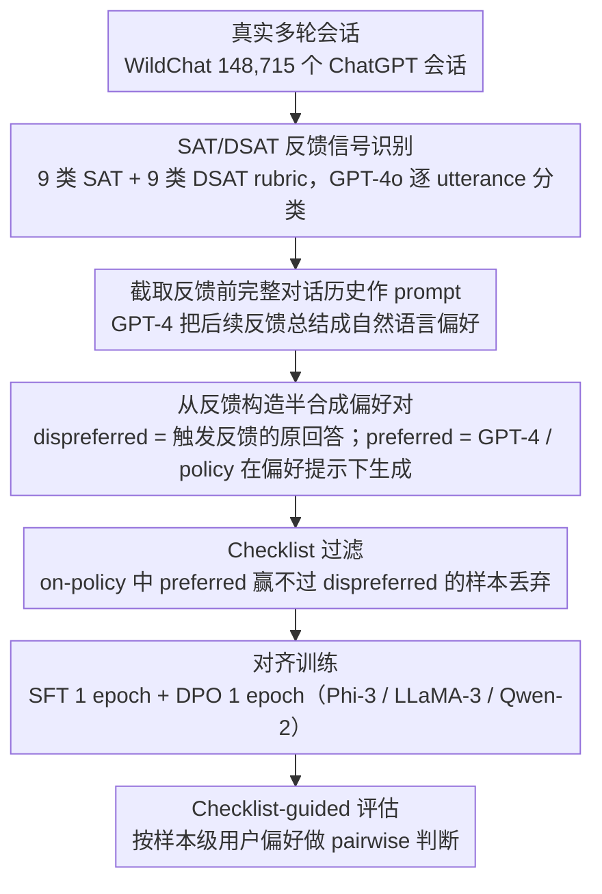

# WildFeedback: Aligning LLMs With In-situ User Interactions And Feedback

**会议**: ACL2026  
**arXiv**: [2408.15549](https://arxiv.org/abs/2408.15549)  
**代码**: 无公开训练代码；数据集: https://huggingface.co/datasets/microsoft/WildFeedback  
**领域**: LLM对齐 / 用户反馈 / 偏好学习  
**关键词**: 原位用户反馈, 偏好数据构造, SAT/DSAT, DPO, checklist评估

## 一句话总结
WildFeedback 从真实用户与 ChatGPT 的多轮对话中自动识别满意/不满意反馈，把自然发生的用户偏好转成偏好训练样本和逐例 checklist 评估标准，使小型开源指令模型在通用 benchmark 与真实用户偏好测试上都比 UltraFeedback 训练更贴近用户需求。

## 研究背景与动机
**领域现状**：LLM 对齐通常依赖两类数据：人工标注的偏好数据，或由 GPT-4 等强模型生成/裁判的合成偏好数据。前者成本高、主观性强、规模受限；后者便宜可扩展，但容易把强模型自身偏好和偏差循环灌入待训练模型。

**现有痛点**：真实用户在产品中经常会自然表达反馈，例如“谢谢，这正是我要的”“不对，请重写”“你忽略了我的要求”。这些信号比离线标注更接近实际使用场景，但它们并不是结构化的 thumbs-up/down，且常散落在多轮上下文里。直接把触发反馈的回答拿来训练也不够，因为负反馈只说明旧回答不好，还需要构造一个符合该用户偏好的更好回答。

**核心矛盾**：对齐需要真实用户偏好，但真实用户偏好天然嘈杂、隐式、上下文相关；如果只依赖静态标注集，规模和真实性不足，如果只依赖模型自评，又会弱化人类偏好的多样性。

**本文目标**：作者希望解决三个子问题：第一，从真实多轮会话中检测哪些用户话语包含满意或不满意信号；第二，把这些信号转成可用于 SFT/DPO 的 preferred-dispreferred 响应对；第三，构造一个评价方式，让自动评测不只是问 GPT-4 “哪个回答更好”，而是按真实用户在该样本里表达过的偏好来评判。

**切入角度**：论文的关键观察是，用户反馈虽然没有显式标注，但在会话中常以可解释的语言模式出现。只要先把这些模式归纳成 SAT/DSAT rubric，再让 GPT-4 按 rubric 检测并总结偏好，就能把“野生反馈”转成结构化偏好数据。

**核心 idea**：用真实多轮会话中的原位用户反馈替代离线人工/模型偏好标注，并用样本级用户偏好 checklist 同时指导偏好样本构造和模型评测。

## 方法详解
WildFeedback 不是提出一个新的对齐损失，而是提出一条从真实用户交互到偏好训练、再到偏好评测的数据流水线。输入是一批多轮 user-LLM conversation，输出是包含 prompt、用户偏好描述、preferred response、dispreferred response 的偏好数据集，以及一个用用户偏好 checklist 评估模型的 held-out benchmark。

### 整体框架
整体流程分为四步。第一步，在 WildChat 的 148,715 个多轮 ChatGPT 会话中逐轮识别用户满意信号 SAT 和不满意信号 DSAT。第二步，对包含反馈的会话抽取触发反馈之前的完整对话历史作为 prompt，并把用户后续反馈总结成自然语言偏好。第三步，基于这些偏好构造响应对：DSAT 触发的原始回答可作为 dispreferred response，preferred response 由 GPT-4 或当前 policy model 在用户偏好提示下生成。第四步，使用生成的 WildFeedback 数据对 Phi-3、LLaMA-3、Qwen-2 等指令模型做一轮 SFT 加一轮 DPO，并在通用 benchmark 和用户偏好 checklist benchmark 上评估。

论文还把评测本身纳入框架。传统 AlpacaEval/MT-Bench 让 GPT-4 按通用质量判断，但这里每个样本都有从真实反馈中总结出的偏好，例如“更简洁”“需要事实修正”“不要忽略格式要求”。因此，评测时把这些偏好作为 checklist 交给 GPT-4，让它做 pairwise 比较，减少 judge 与真实用户偏好不一致的问题。

### 关键设计

**1. SAT/DSAT 反馈信号识别：把"野生"的隐式用户反应归纳成可解释的满意/不满意 rubric，再逐轮定位**

真实用户的反馈几乎从不是显式的 thumbs-up/down，而是散落在下一轮语言里——"谢谢，这正是我要的""不对，请重写""你忽略了我的要求"。作者继承并改造 SPUR 的用户满意度估计思想，用 9 类 SAT rubric 和 9 类 DSAT rubric 把这些反应结构化：SAT 涵盖感谢、学习、遵从、表扬、个人细节、幽默、确认、正向结束、逐渐接近目标；DSAT 涵盖负面反馈、要求修改、事实错误、不现实预期、无继续互动、被忽略、质量低、细节不足、风格问题。由 GPT-4o 按这些 rubric 在 utterance 级别做分类。先把反馈归入可解释 rubric，既避免直接拿模糊情绪词当训练信号，也让后续能分析用户究竟为什么满意或不满意。

**2. 从反馈构造半合成偏好对：把"用户说不满意"这种弱监督，落成 DPO 可直接训练的 `(prompt, preferred, dispreferred)`**

负反馈只说明旧回答不好，并不自带一个更好的答案，所以光把触发反馈的回答拿来训练还不够。对出现 SAT/DSAT 的会话，系统先让 GPT-4 总结用户偏好，再截取触发反馈之前的完整对话历史作为 prompt。GPT-4 expert 版本里，DSAT 触发的原始回答直接作 dispreferred response，preferred response 由 GPT-4 在用户偏好和安全提示下生成；on-policy 版本则让 Phi-3、Qwen-2、LLaMA-3 各自生成 preferred/dispreferred，其中 preferred 受用户偏好系统提示引导。相比 UltraFeedback 那种由 GPT-4 统一打分的离线数据，这里的 prompt 和偏好都来自真实人机交互，并保留了多轮上下文。

**3. Checklist-guided 评估与过滤：用样本级用户偏好约束 judge 和数据质量，而不是让 GPT-4 按自己的通用审美打分**

LLM-as-a-judge 容易偏爱长回答或自身风格，与真实用户偏好脱节。WildFeedback 把每个样本从真实反馈里总结出的偏好（如"更简洁""需要事实修正""不要忽略格式要求"）做成 checklist，要求 judge 按 checklist 做 pairwise 判断；构造 on-policy 数据时，若生成的 preferred response 在 checklist 评估下都赢不过 dispreferred response，就直接过滤掉该样本，而更稳定的 GPT-4 expert 版本整体保留。加入 checklist 后，评测标准从"泛化的好回答"变成"这个用户在这个任务里到底想要什么"，让自动 judge 重新对齐到样本级真实需求。

### 损失函数 / 训练策略
训练并没有改写 DPO 目标，而是把 WildFeedback 数据放入常规对齐流程：每个基础模型先在 preferred responses 上做 1 epoch SFT，再在完整偏好对上做 1 epoch DPO。实验覆盖三类开源指令模型 Phi-3-mini-4k-instruct、Meta-Llama-3-8B-Instruct、Qwen2-7B-Instruct，并比较五种设置：原始指令模型、WF GPT-4、WF On-policy、UF GPT-4、UF On-policy。

测试集构造也做了防过拟合处理。作者用 FAISS 对用户 prompt 和总结偏好聚类成 70 组，每组取 10 个偏好最接近组内中心的样本，再去重和过滤无意义任务，得到 540 个 held-out 样本。这样评测不是追逐少数怪异个人偏好，而更接近“多数用户在相似任务中的主流偏好”。

## 实验关键数据

### 主实验
WildFeedback 首先证明它确实能从真实会话中挖出规模可用的反馈数据。WildChat 共 148,715 个多轮会话，其中约 12.8% 含反馈信号；最终构造出 20,281 个 GPT-4 版本偏好样本，以及多个 on-policy 版本。

| 数据/指标 | SAT | DSAT | 总量 |
|--------|------|------|------|
| 含反馈会话数 | 5,447 | 13,582 | 148,715 |
| 含反馈 utterance 数 | 8,186 | 27,711 | 628,467 |
| GPT-4 与人工一致性 | κ=0.69 | κ=0.50 | 接近人工水平 |

与现有偏好数据相比，WildFeedback 的特点是多轮、来自真实原位用户反馈，且 prompt 更长，更接近实际产品会话。

| 数据集 | 样本数 | Prompt长度 | Response长度 | 多轮? | 反馈来源 |
|--------|------:|-----------:|-------------:|------|----------|
| WebGPT | 38,925 | 51 | 188 | 否 | 人工标注 |
| Anthropic HH | 118,263 | 186 | 95 | 否 | 人工标注 |
| OASST1 | 35,905 | 168 | 221 | 是 | 人工撰写 |
| UltraFeedback | 61,135 | 159 | 256 | 否 | GPT-4 |
| WildFeedback GPT-4 | 20,281 | 929 | 440 | 是 | 原位用户反馈 |
| WildFeedback Qwen-2 | 11,509 | 1,057 | 541 | 是 | 原位用户反馈 |
| WildFeedback Phi-3 | 9,194 | 931 | 344 | 是 | 原位用户反馈 |
| WildFeedback LLaMA-3 | 10,659 | 982 | 376 | 是 | 原位用户反馈 |

在通用 benchmark 上，用 WildFeedback 训练通常优于原模型和 UltraFeedback 对照。最直观的是 Phi-3 和 LLaMA-3：WF GPT-4 同时提升 AlpacaEval 2、Arena-Hard 和 MT-Bench。

| 模型/训练数据 | AlpacaEval2 LC | AlpacaEval2 WR | Arena-Hard WR | MT-Bench |
|---------------|---------------:|---------------:|--------------:|---------:|
| Phi-3 原模型 | 24.3 | 17.4 | 15.4 | 7.32 |
| Phi-3 + WF On-policy | 29.0 | 27.1 | 30.1 | 7.42 |
| Phi-3 + UF On-policy | 27.2 | 25.9 | 28.7 | 7.40 |
| Phi-3 + WF GPT-4 | 34.9 | 36.6 | 32.4 | 7.75 |
| Phi-3 + UF GPT-4 | 32.5 | 38.4 | 30.5 | 7.68 |
| LLaMA-3 原模型 | 22.9 | 22.6 | 20.6 | 7.10 |
| LLaMA-3 + WF GPT-4 | 34.2 | 42.8 | 32.9 | 7.57 |
| LLaMA-3 + UF GPT-4 | 32.2 | 43.2 | 32.6 | 7.49 |
| Qwen-2 原模型 | 28.7 | 26.0 | 24.9 | 7.55 |
| Qwen-2 + WF On-policy | 42.6 | 34.4 | 36.1 | 8.02 |
| Qwen-2 + UF On-policy | 38.3 | 34.2 | 29.2 | 7.72 |

### 消融实验
论文没有做传统模块删除式消融，而是通过数据构造版本、评测 checklist、UltraFeedback 对照和反馈类型分析来验证各组件作用。

| 配置/分析项 | 关键指标 | 说明 |
|------|---------|------|
| 无 checklist 的偏好对验证 | GPT-4 不总是偏向符合用户偏好的回答 | 说明普通 GPT-4 judge 会受通用偏好影响，不能稳定识别原位用户偏好 |
| 加入 checklist 后 | GPT-4 expert preferred responses 超过 70% 对齐用户偏好 | checklist 能把 judge 的注意力拉回样本级用户需求 |
| 小模型 on-policy preferred responses | 约 50% 对齐用户偏好 | 小模型可控性弱，需要 checklist 过滤不合格偏好对 |
| WildFeedback held-out test | LLaMA-3 + WF GPT-4 对 UF GPT-4 胜率 45.5%，加 checklist 后 50.8% | 在真实用户偏好测试上，WF 训练比 UF 更贴近原位反馈 |
| 反馈类型分布 | DSAT 主要集中在修改需求和事实错误；SAT 更分散 | WildFeedback 不只给分数，还能诊断用户不满的具体来源 |

### 关键发现
- WildFeedback 的收益不只是“更多训练数据”，而是训练数据与实际使用场景更匹配。它的 prompt 来自多轮会话，用户偏好来自自然反馈，因此对真实用户偏好 benchmark 的提升比 UltraFeedback 更有解释力。
- Checklist 是整篇论文里最关键的评估设计。没有 checklist 时，GPT-4 judge 可能按自己的通用审美选择回答；有 checklist 后，它更能区分哪个回答满足了真实用户在该会话中表达的偏好。
- DSAT 明显多于 SAT，说明真实产品数据天然有选择偏差：用户更可能在不满意时继续纠正模型。这既让数据更关注失败案例，也意味着训练分布可能过度代表负反馈场景。

## 亮点与洞察
- 最大亮点是把“用户反馈”从产品日志里的噪声提升为可训练的偏好数据。很多对齐工作假设偏好必须由标注员或强模型显式打分，WildFeedback 展示了自然对话里的下一轮用户反应本身就是一种监督信号。
- checklist-guided evaluation 很适合迁移到个性化 agent、推荐对话和客服系统。只要能从用户行为或文本反馈中总结“这个用户想要什么”，评测就可以从通用质量分变成样本级目标达成度。
- 论文对反馈类型的分析很有价值：不满意往往来自事实错误和要求修改，满意则更分散。这提示实际系统优化时应优先处理可修复的硬错误，而不是只追求更讨喜的语气。
- 这篇工作的“半合成”策略很务实：用户给出真实偏好，强模型负责补全 preferred response。它没有幻想完全不靠模型生成，而是把模型生成限制在用户偏好约束下。

## 局限与展望
- 原位反馈可能是恶意、危险或不合理的。作者加入安全提示和 OpenAI moderation 过滤，但这只是初级防线；未来需要更系统地区分“真实偏好”和“不应学习的偏好”。
- 数据存在选择偏差。用户更常在不满意时留下反馈，因此 WildFeedback 可能过度代表纠错、重写、抱怨等场景，低估沉默但满意的用户。
- 评测仍依赖 GPT-4o 作为 judge，只是通过 checklist 降低偏差，并未消除 LLM-as-a-judge 的系统性问题。尤其当 checklist 本身由 GPT-4 总结时，仍可能引入模型解释偏差。
- on-policy 小模型对用户偏好可控性较弱，约半数 preferred responses 未必真正对齐偏好。后续可以考虑用 rejection sampling、偏好校验器或多模型交叉审核提高数据质量。
- 论文主要在通用聊天数据上验证，尚未证明在专业领域、长周期个性化、推荐系统交互中是否同样可靠。

## 相关工作与启发
- **vs UltraFeedback**: UltraFeedback 用 GPT-4 给离线 prompt-response 打分，优点是规模大、易复现；WildFeedback 从真实多轮会话中挖掘用户反馈，规模小一些但更贴近真实用户需求，尤其适合研究产品内对齐。
- **vs Anthropic HH / WebGPT**: 这些数据依赖人工标注偏好，质量较可控但成本高且标注者偏好不一定代表最终用户；WildFeedback 直接利用实际用户在任务中的反馈，减少“标注者-用户”偏好错位。
- **vs OASST1**: OASST1 是多轮对话，但很多 prompt 和 response 由人工撰写；WildFeedback 的多轮上下文来自真实人机交互，更能捕捉模型失败后用户如何追问、纠正和补充需求。
- **启发**: 对齐数据可以从“标注任务”转向“交互日志挖掘”。对教育、医疗问答、推荐和 agent 工具链来说，后续很值得研究如何把点击、停留、重试、撤销、改写等行为转成偏好信号。

## 评分
- 新颖性: ⭐⭐⭐⭐⭐ 从原位用户反馈自动构造偏好数据和 checklist 评测，问题切入非常贴近真实产品对齐。
- 实验充分度: ⭐⭐⭐⭐ 覆盖多模型、多 benchmark、UltraFeedback 对照和人工一致性验证，但用户层面长期效果还未评估。
- 写作质量: ⭐⭐⭐⭐ 方法链条清楚，图表和数据诊断有说服力，少量细节如过滤规则和安全策略还可以更展开。
- 价值: ⭐⭐⭐⭐⭐ 对 LLM 对齐、对话推荐、用户模拟和交互式评测都有直接启发，尤其适合作为真实反馈学习的基础框架。

<!-- RELATED:START -->

## 相关论文

- [\[ACL 2026\] PERSA: Reinforcement Learning for Professor-Style Personalized Feedback with LLMs](persa_reinforcement_learning_for_professor-style_personalized_feedback_with_llms.md)
- [\[ACL 2026\] RbtAct: Rebuttal as Supervision for Actionable Review Feedback Generation](rbtact_rebuttal_as_supervision_for_actionable_review_feedback_generation.md)
- [\[ACL 2026\] Aligning Agents via Planning: A Benchmark for Trajectory-Level Reward Modeling](aligning_agents_via_planning_a_benchmark_for_trajectory-level_reward_modeling.md)
- [\[ACL 2025\] Aligning to What? Limits to RLHF Based Alignment](../../ACL2025/llm_alignment/aligning_to_what_limits_to_rlhf_based_alignment.md)
- [\[ACL 2025\] Synergistic Weak-Strong Collaboration by Aligning Preferences](../../ACL2025/llm_alignment/synergistic_weak-strong_collaboration_by_aligning_preferences.md)

<!-- RELATED:END -->
